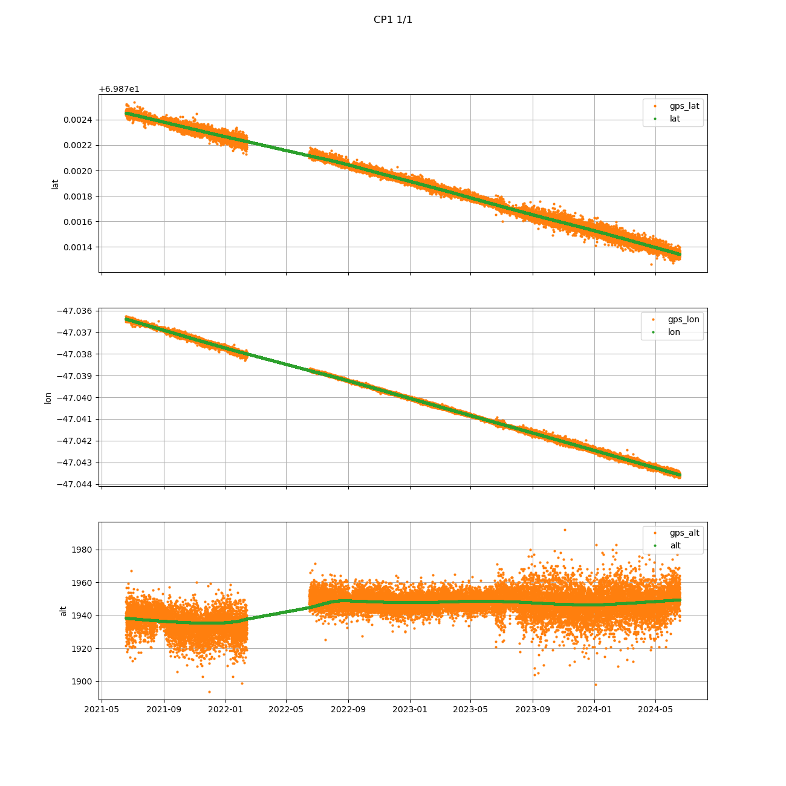
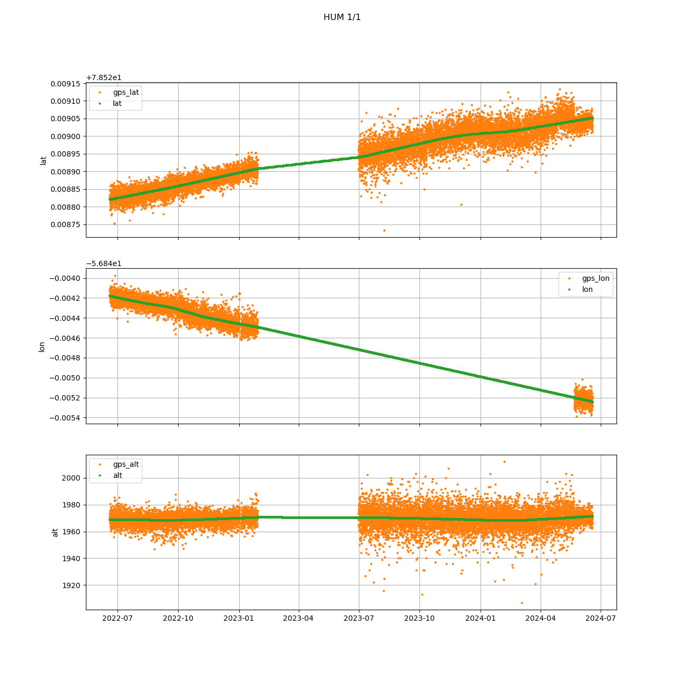
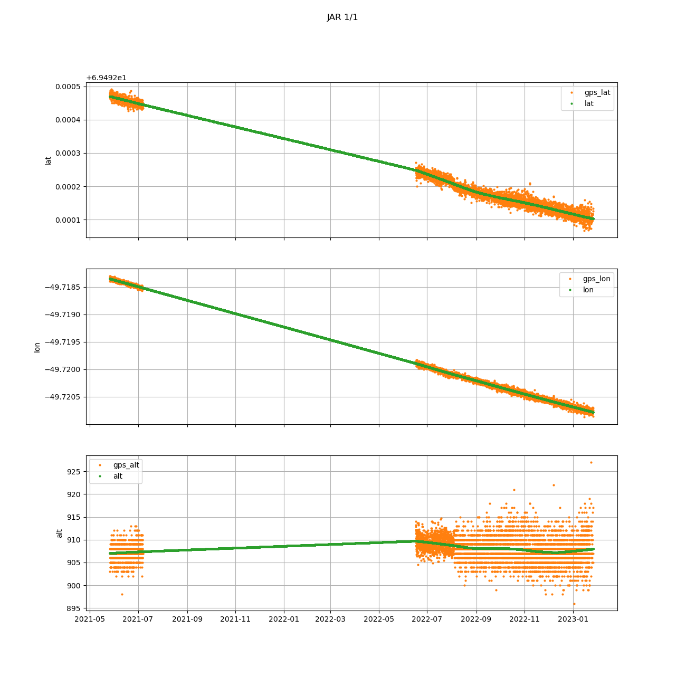
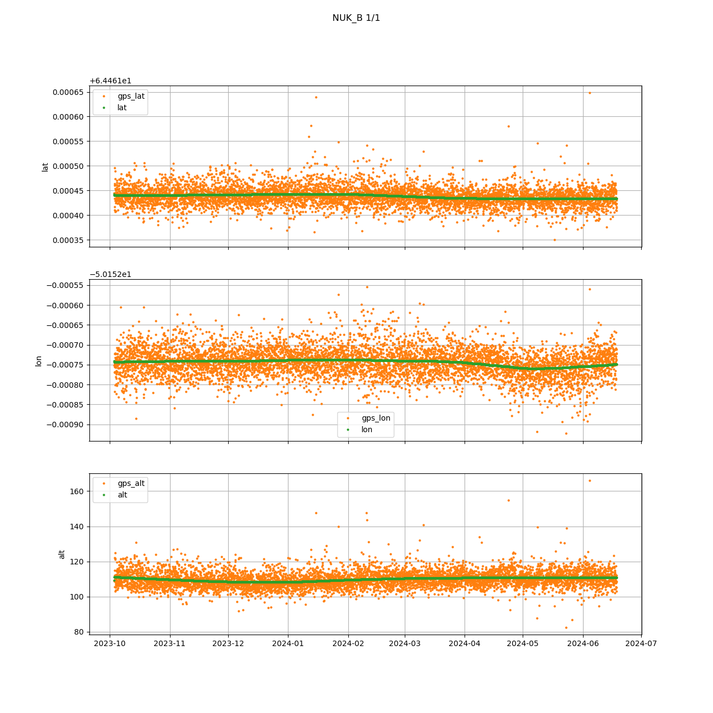
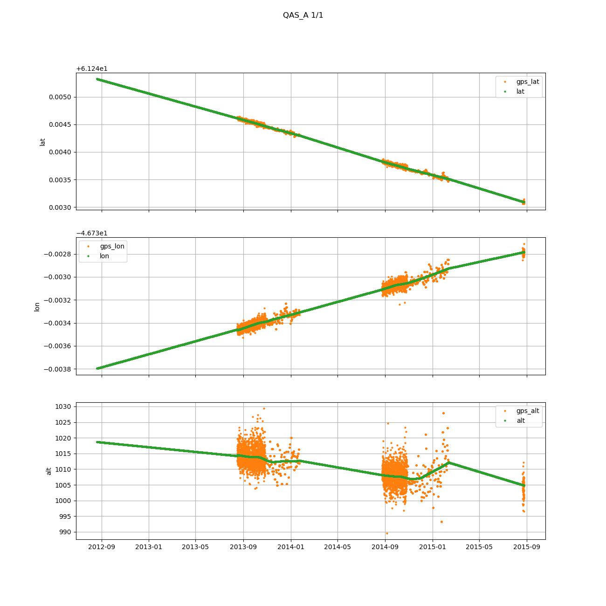
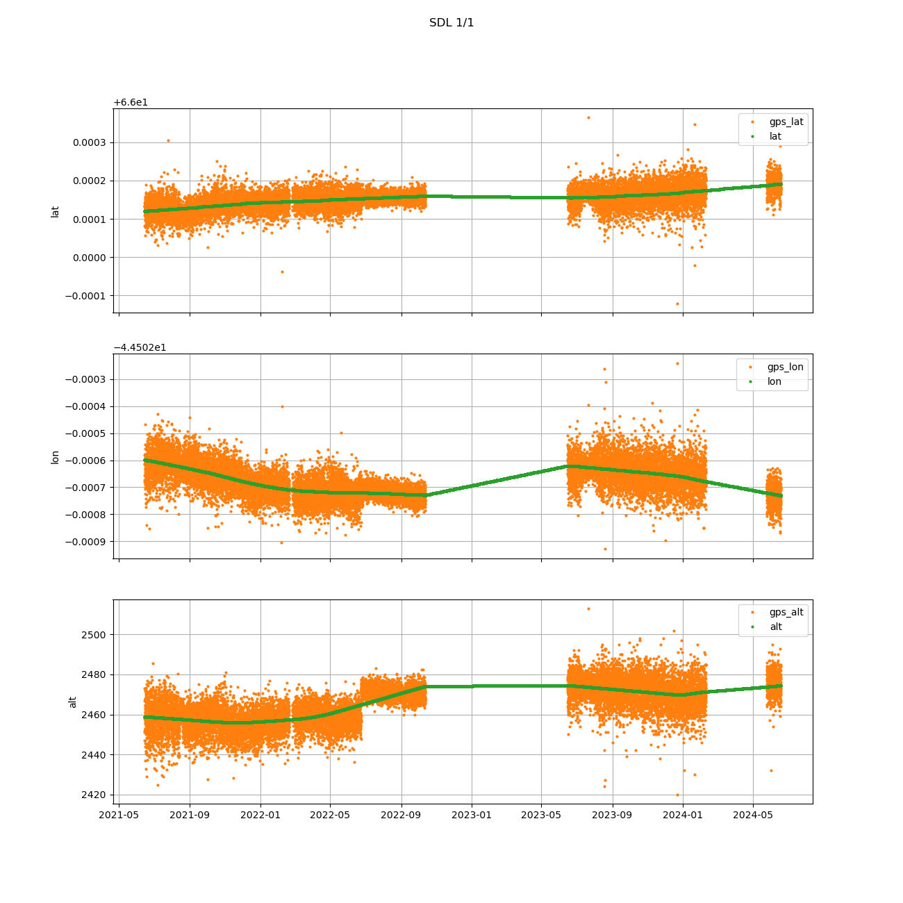

## CEN

 
## CP1

 
## DY2

 
## EGP

 
## FRE

 
## HUM

 
## JAR

 
## KAN_B

 
## KAN_L

 
## KAN_M

 
## KAN_U

 
## KPC_L

 
## KPC_U

 
## LYN_L

 
## LYN_T

 
## MIT

 
## NAE

 
## NAU

 
## NEM

 
## NSE

 
## NUK_B

 
## NUK_K

 
## NUK_L

 
## NUK_N

 
## NUK_U

 
## QAS_A

 
## QAS_L

 
## QAS_M

 
## QAS_U

 
## Roof_GEUS

 
## Roof_PROMICE

 
## SCO_L

 
## SCO_U

 
## SDL

 
## SDM

 
## SWC

 
## TAS_A
