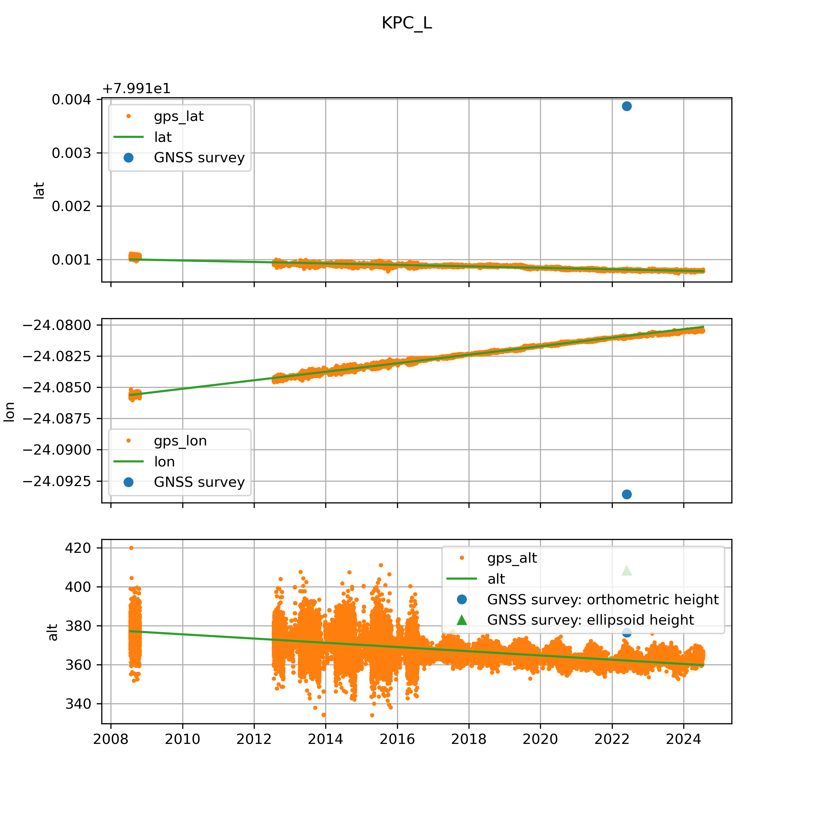
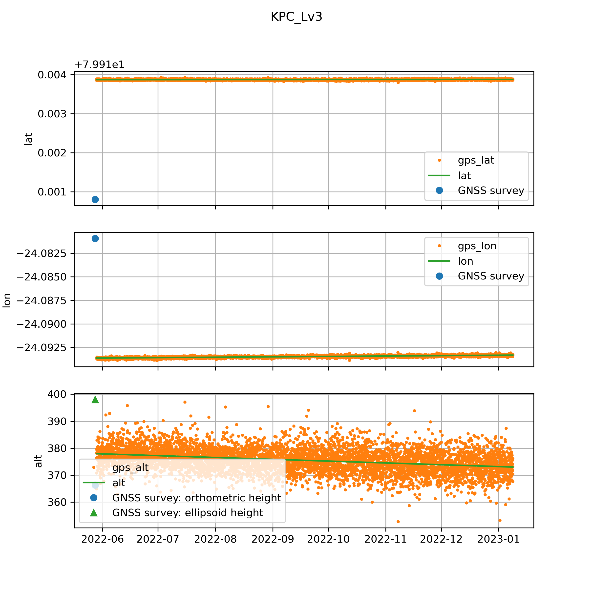
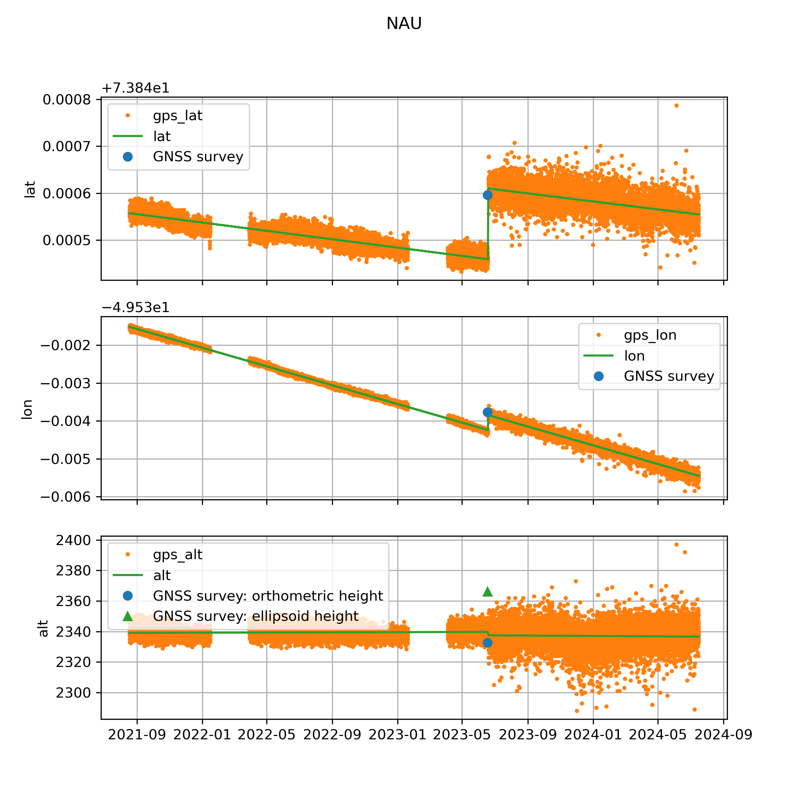
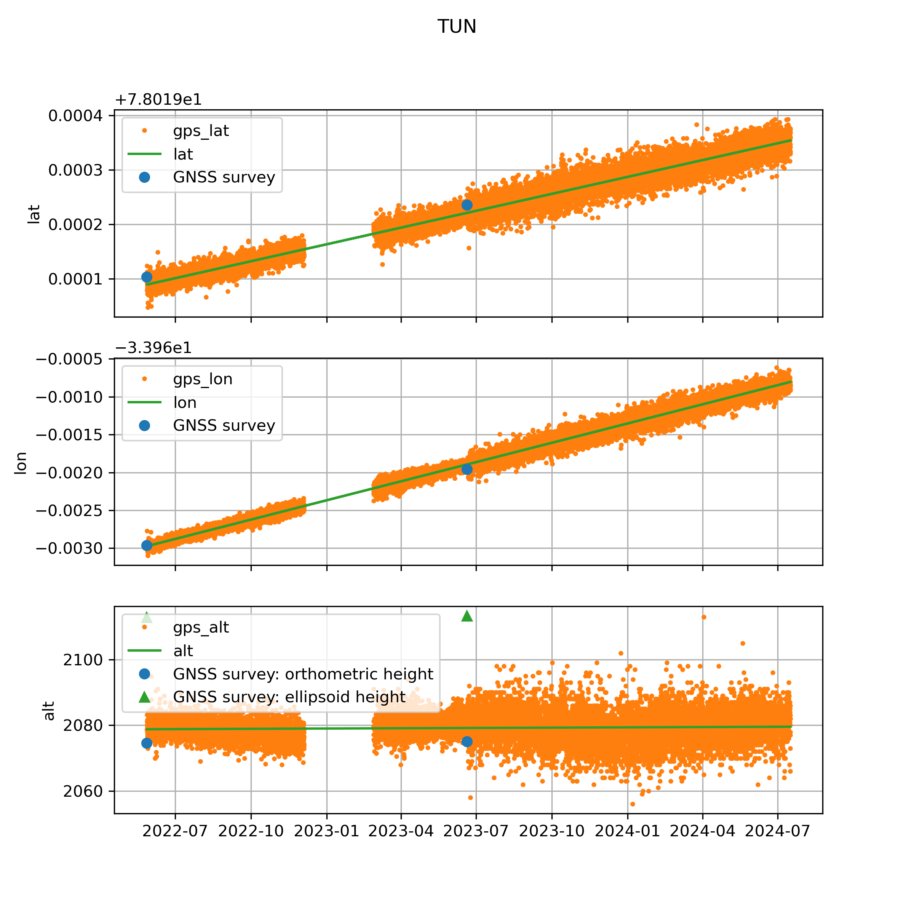

  * [CEN2](#s0-1)
  * [CP1](#s0-2)
  * [DY2](#s0-3)
  * [EGP](#s0-4)
  * [HUM](#s0-5)
  * [KAN_U](#s0-6)
  * [KPC_L](#s0-7)
  * [KPC_Lv3](#s0-8)
  * [KPC_U](#s0-9)
  * [KPC_Uv3](#s0-10)
  * [NAE](#s0-11)
  * [NASA-E](#s0-12)
  * [NAU](#s0-13)
  * [NEM](#s0-14)
  * [NSE](#s0-15)
  * [SDL](#s0-16)
  * [SDM](#s0-17)
  * [TUN](#s0-18)
  * [Tunu-N](#s0-19)
## <a id='s0-1' />CEN2

 
## <a id='s0-2' />CP1

 
## <a id='s0-3' />DY2

 
## <a id='s0-4' />EGP

 
## <a id='s0-5' />HUM

 
## <a id='s0-6' />KAN_U

 
## <a id='s0-7' />KPC_L

 
## <a id='s0-8' />KPC_Lv3

 
## <a id='s0-9' />KPC_U

 
## <a id='s0-10' />KPC_Uv3

 
## <a id='s0-11' />NAE

 
## <a id='s0-12' />NASA-E
## <a id='s0-13' />NAU

 
## <a id='s0-14' />NEM

 
## <a id='s0-15' />NSE

 
## <a id='s0-16' />SDL

 
## <a id='s0-17' />SDM

 
## <a id='s0-18' />TUN

 
## <a id='s0-19' />Tunu-N
