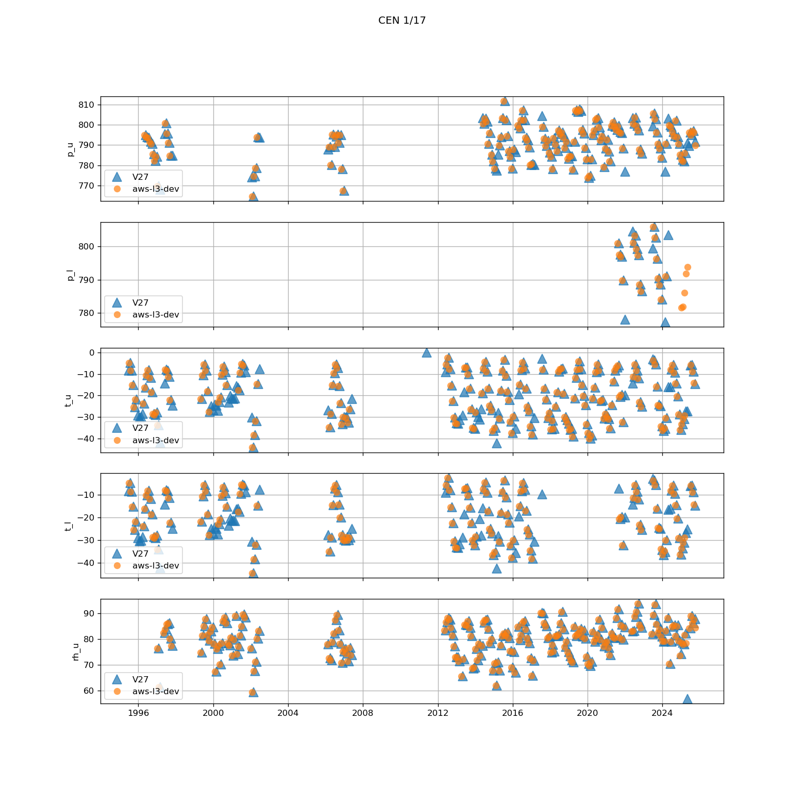
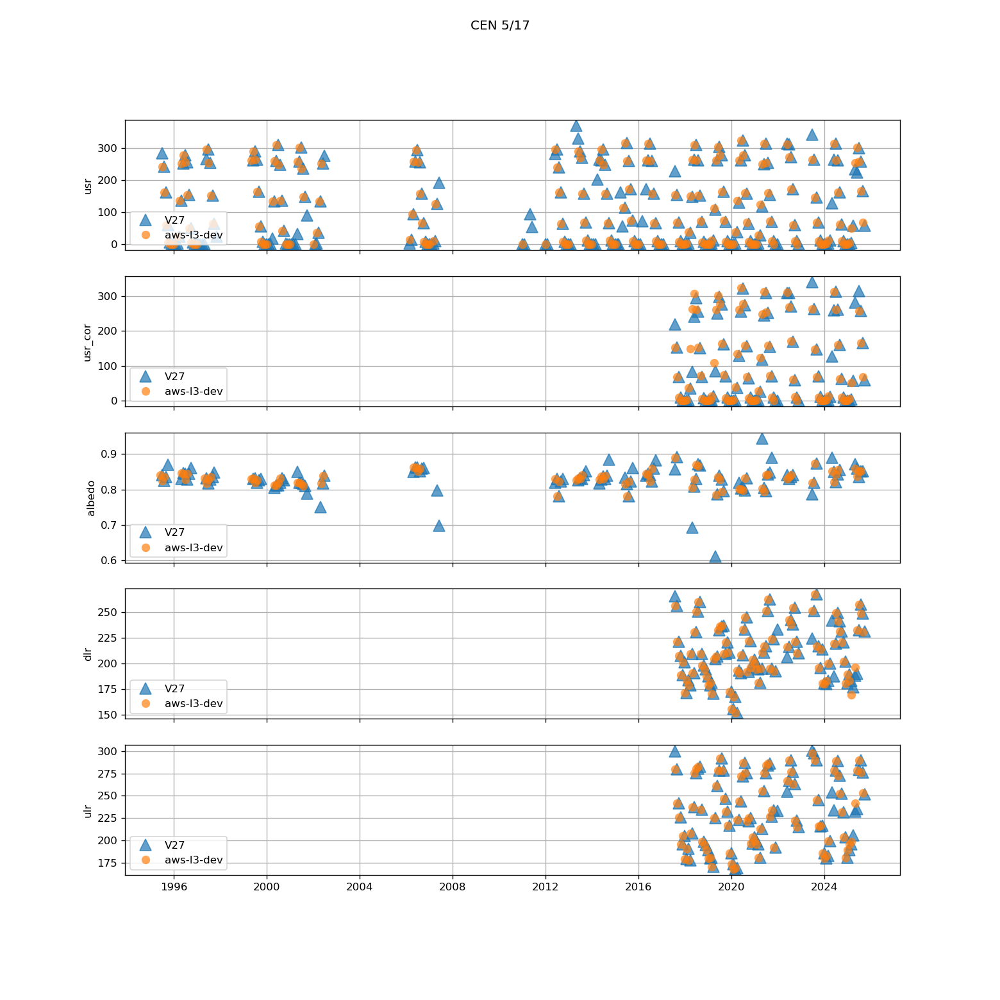
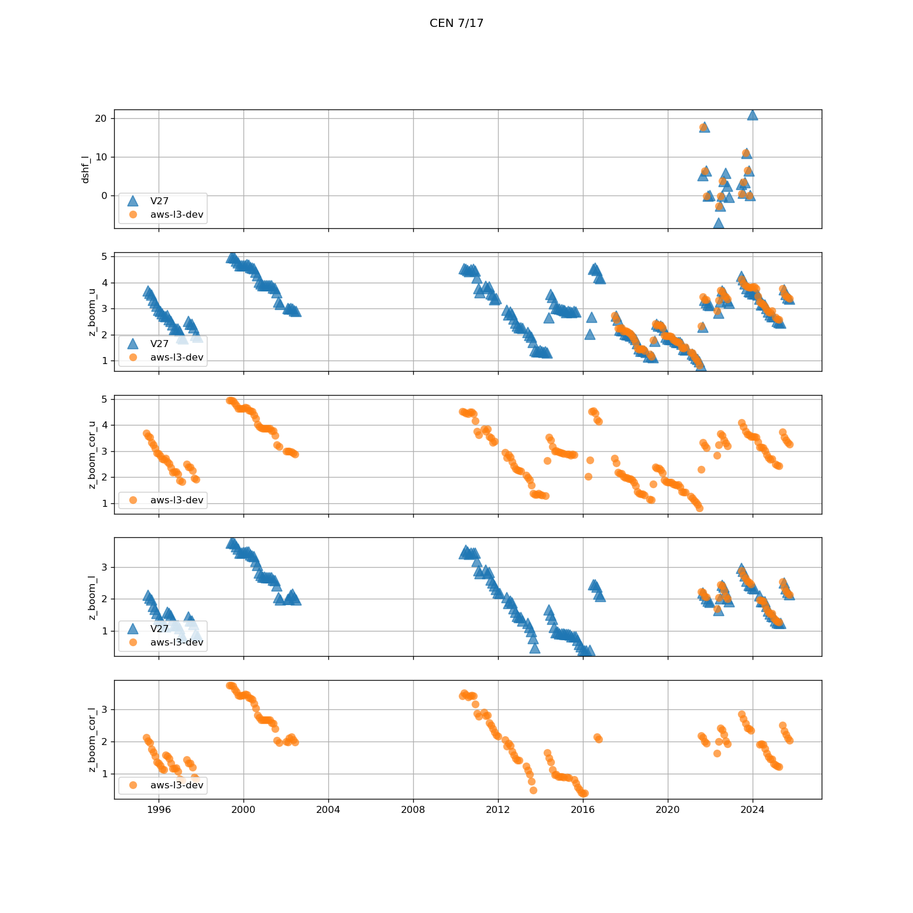
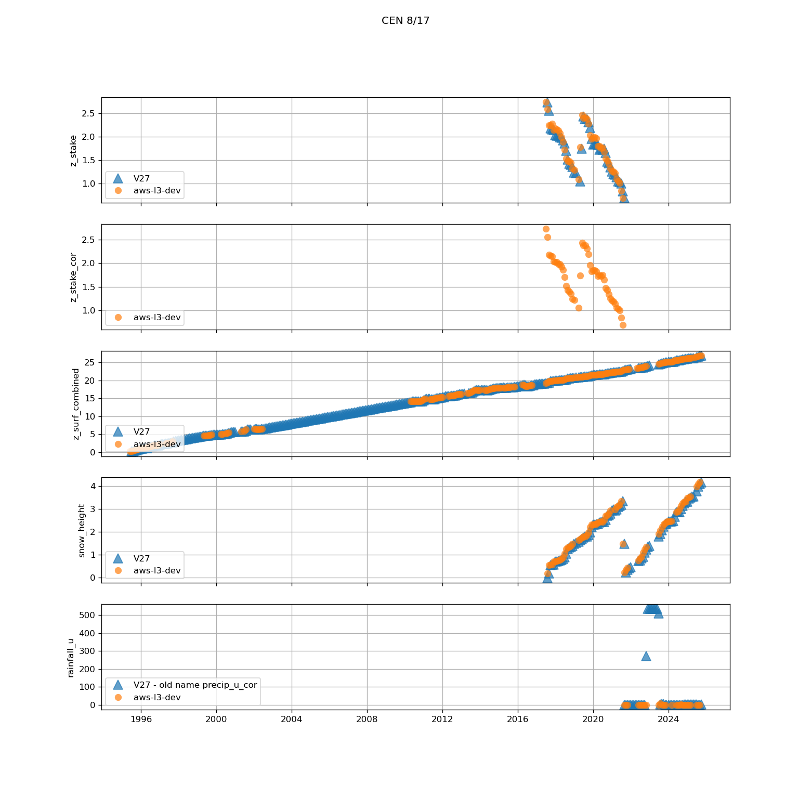
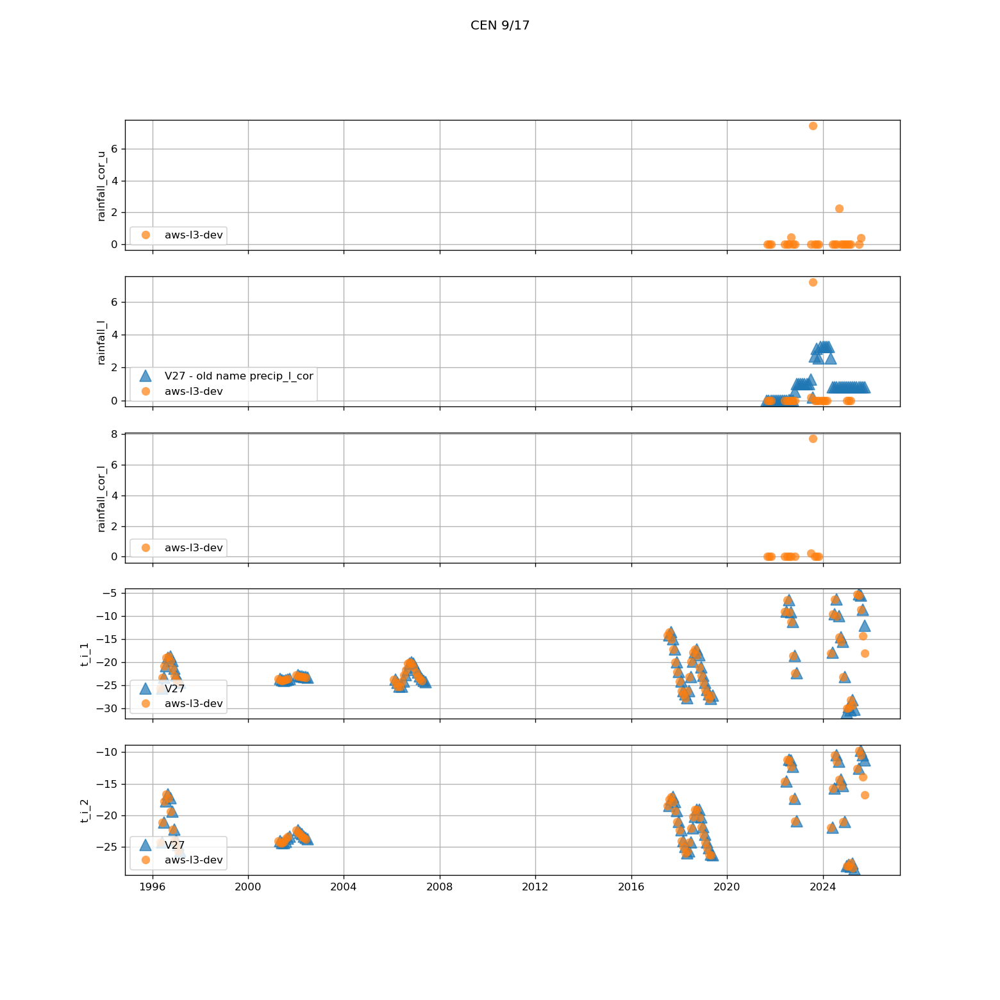
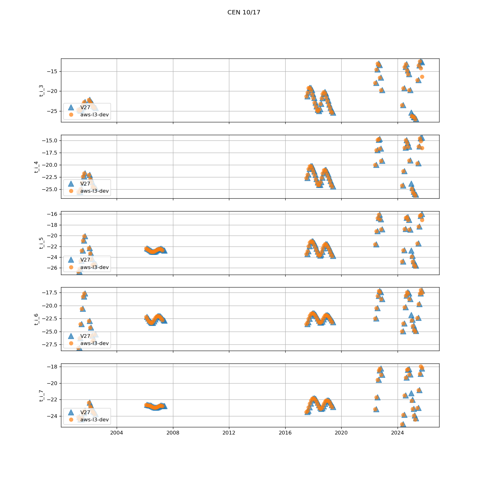
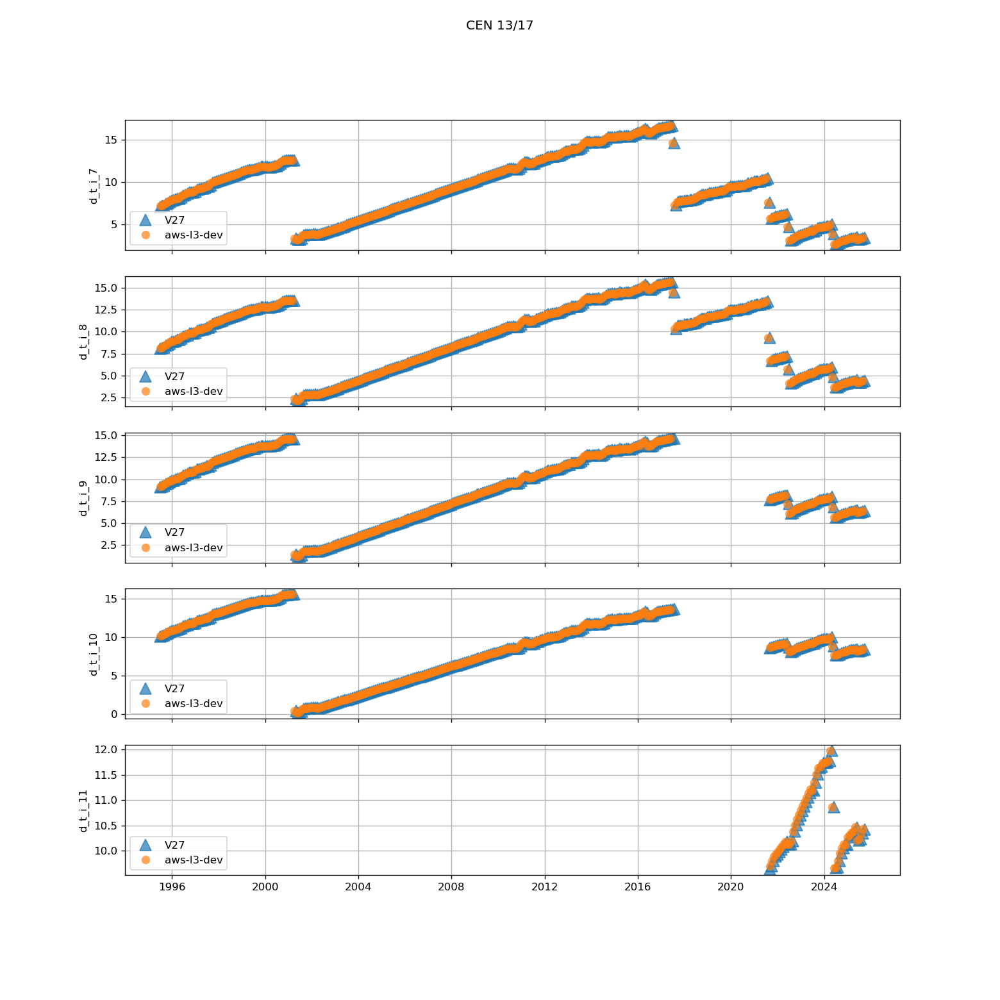
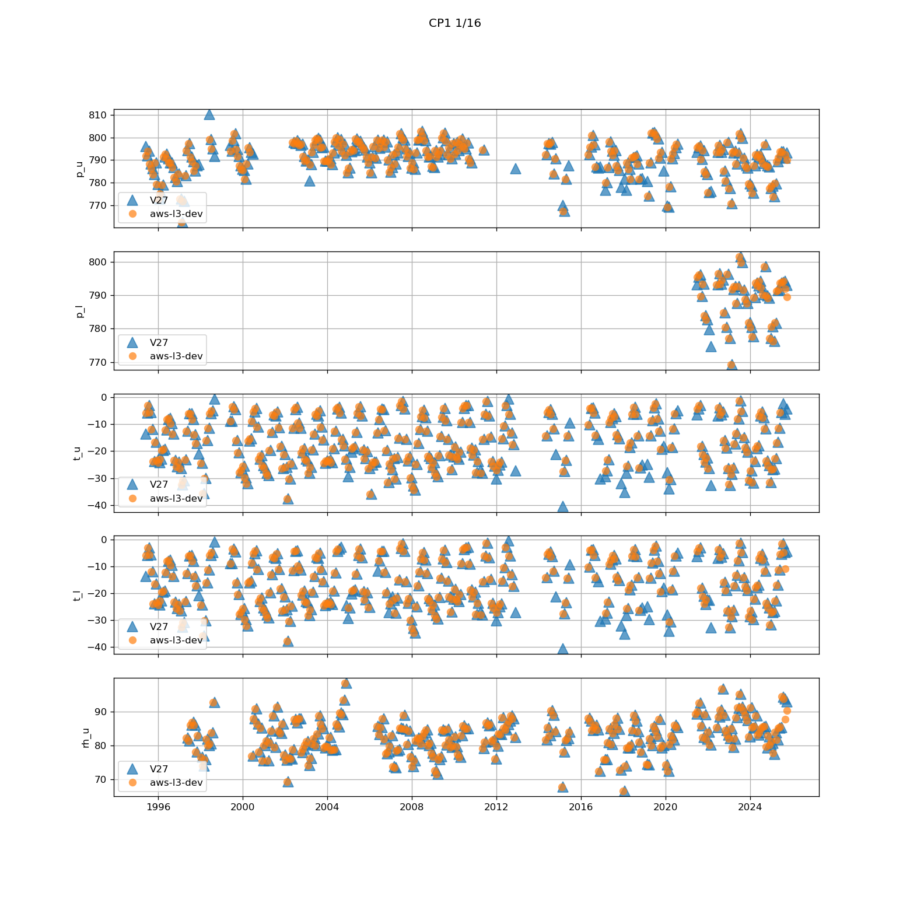

# Comparison of data aws-l3-dev to V27 (old).
## CEN
Variables in new file:
p_u, p_l, t_u, t_l, rh_u, rh_u_wrt_ice_or_water, qh_u, rh_l, rh_l_wrt_ice_or_water, qh_l, wspd_u, wspd_l, wdir_u, wdir_l, wspd_x_u, wspd_y_u, wspd_x_l, wspd_y_l, dsr, dsr_cor, usr, usr_cor, dlr, ulr, cc, t_surf, dlhf_u, dlhf_l, dshf_u, dshf_l, z_boom_u, z_boom_cor_u, z_boom_l, z_boom_cor_l, z_stake, z_stake_cor, z_surf_combined, snow_height, rainfall_u, rainfall_cor_u, rainfall_l, rainfall_cor_l, t_i_1, t_i_2, t_i_3, t_i_4, t_i_5, t_i_6, t_i_7, t_i_8, t_i_9, t_i_10, t_i_11, d_t_i_1, d_t_i_2, d_t_i_3, d_t_i_4, d_t_i_5, d_t_i_6, d_t_i_7, d_t_i_8, d_t_i_9, d_t_i_10, d_t_i_11, t_i_10m, tilt_x, tilt_y, rot, gps_lat, gps_lon, gps_alt, lat, lon, alt, batt_v, t_rad, t_i, rh_i_wrt_ice_or_water, wdir_i, wspd_y_i

New variables not in old files:
z_boom_cor_u, z_boom_cor_l, z_stake_cor, rainfall_u, rainfall_cor_u, rainfall_l, rainfall_cor_l

Old variables removed from new files:
albedo, precip_u, precip_u_cor, precip_u_rate, precip_l, precip_l_cor, precip_l_rate
 

 
## CP1
Variables in new file:
p_u, p_l, t_u, t_l, rh_u, rh_u_wrt_ice_or_water, qh_u, rh_l, rh_l_wrt_ice_or_water, qh_l, wspd_u, wspd_l, wdir_u, wdir_l, wspd_x_u, wspd_y_u, wspd_x_l, wspd_y_l, dsr, dsr_cor, usr, usr_cor, dlr, ulr, cc, t_surf, dlhf_u, dlhf_l, dshf_u, dshf_l, z_boom_u, z_boom_cor_u, z_boom_l, z_boom_cor_l, z_surf_combined, snow_height, rainfall_u, rainfall_cor_u, rainfall_l, rainfall_cor_l, t_i_1, t_i_2, t_i_3, t_i_4, t_i_5, t_i_6, t_i_7, t_i_8, t_i_9, t_i_10, t_i_11, d_t_i_1, d_t_i_2, d_t_i_3, d_t_i_4, d_t_i_5, d_t_i_6, d_t_i_7, d_t_i_8, d_t_i_9, d_t_i_10, d_t_i_11, t_i_10m, tilt_x, tilt_y, rot, gps_lat, gps_lon, gps_alt, lat, lon, alt, batt_v, t_rad, t_i, rh_i_wrt_ice_or_water, wdir_i, wspd_y_i

New variables not in old files:
z_boom_cor_u, z_boom_cor_l, rainfall_u, rainfall_cor_u, rainfall_l, rainfall_cor_l

Old variables removed from new files:
albedo, precip_u, precip_u_cor, precip_u_rate, precip_l, precip_l_cor, precip_l_rate
 

