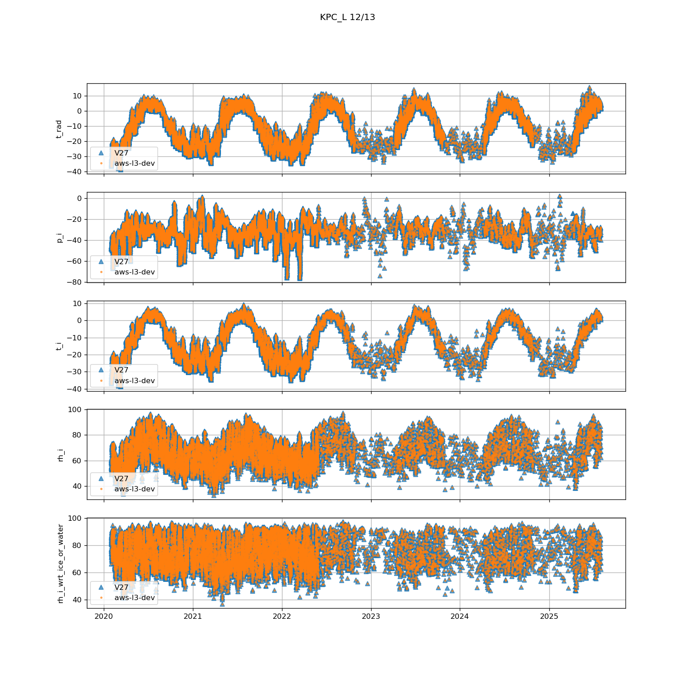
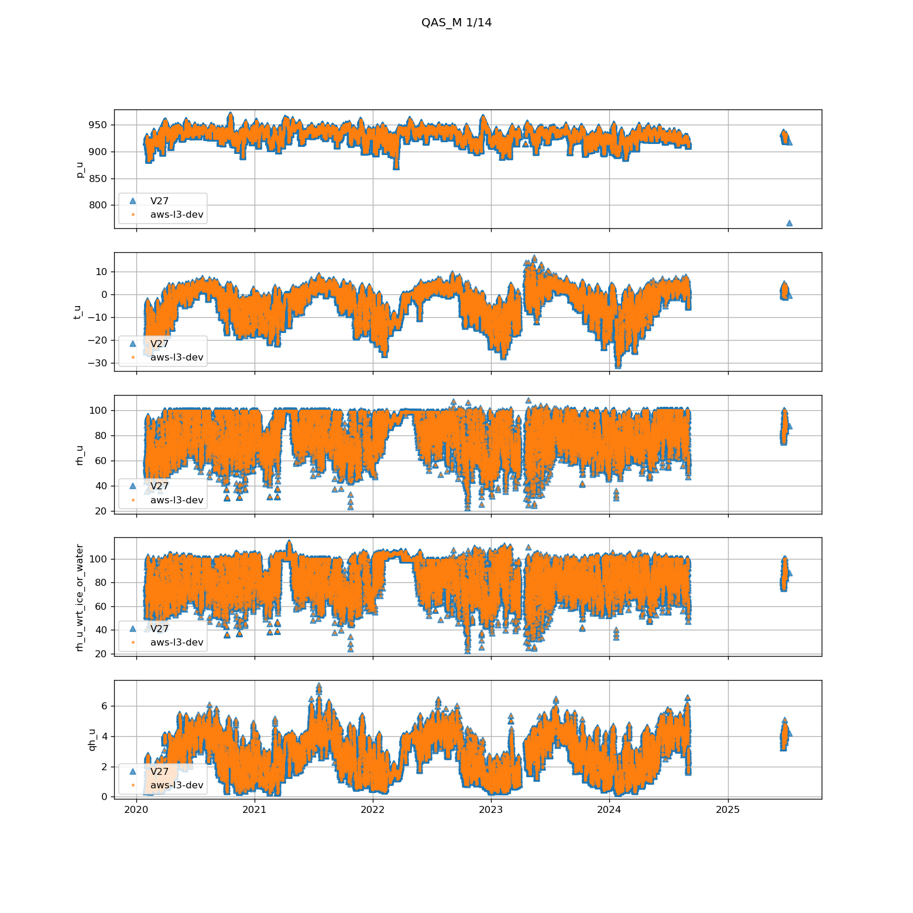
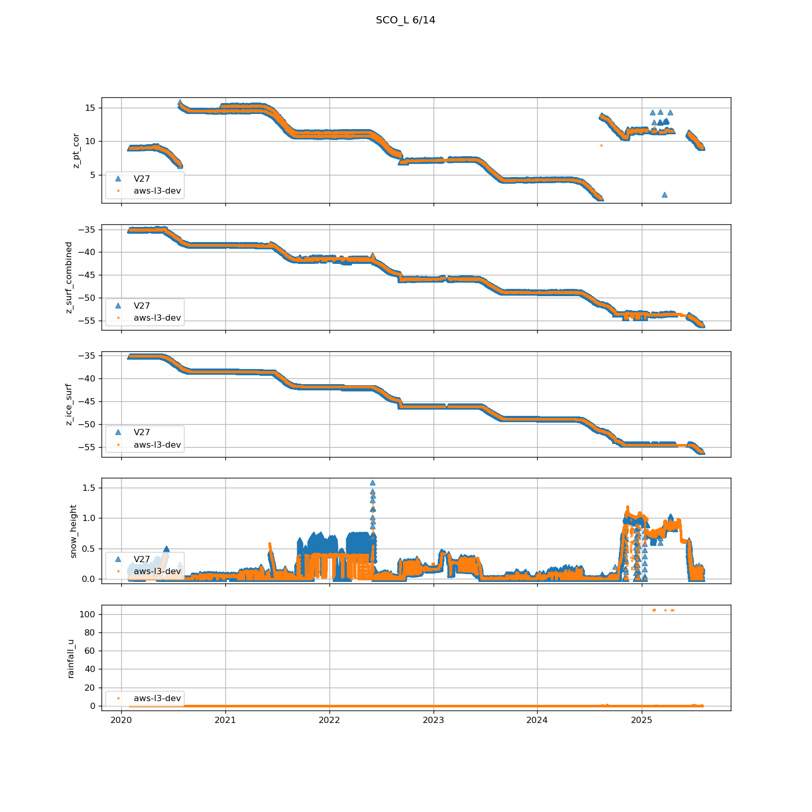
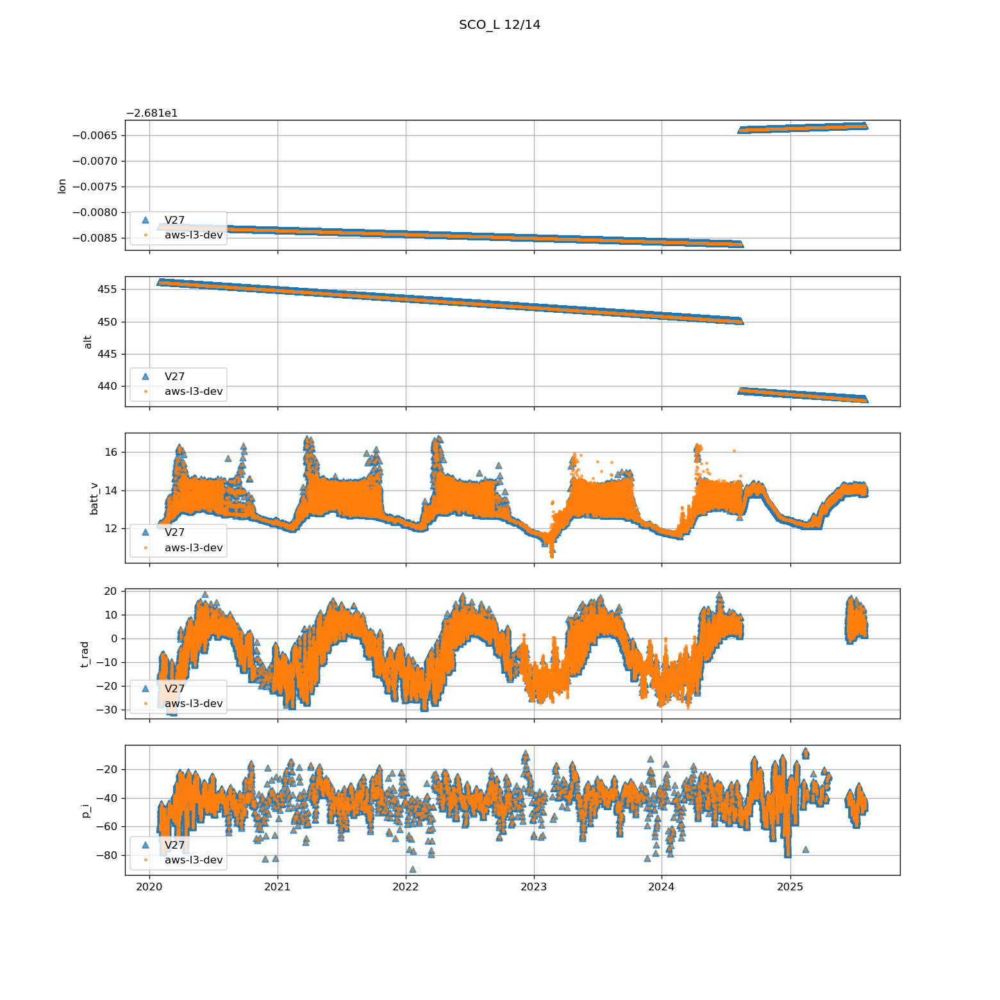
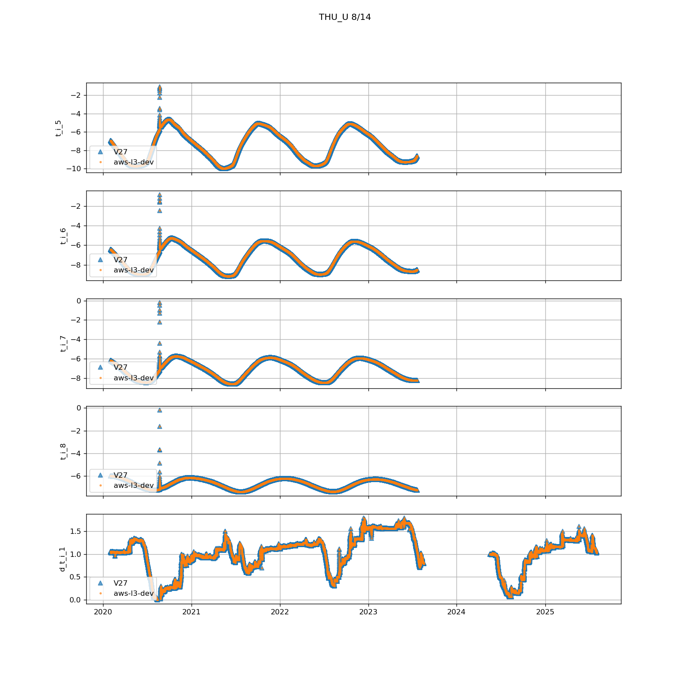
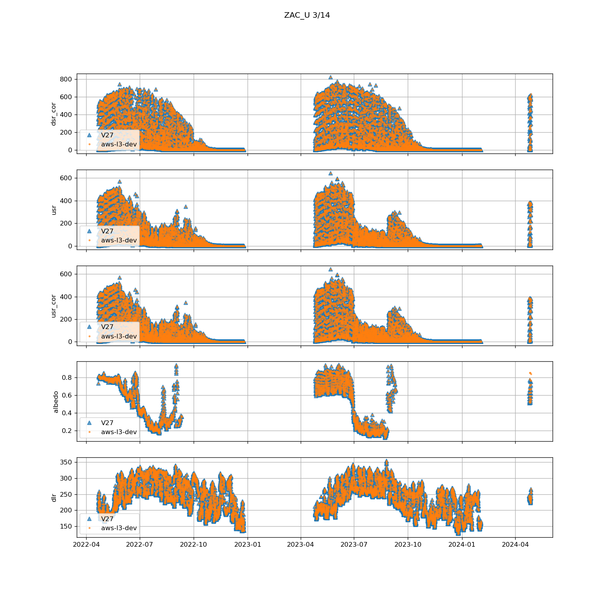

* [Comparison of data aws-l3-dev to V27 (old).](#s1)
  * [CEN](#s1-1)
  * [CP1](#s1-2)
  * [DY2](#s1-3)
  * [EGP](#s1-4)
  * [FRE](#s1-5)
  * [HUM](#s1-6)
  * [JAR](#s1-7)
  * [KAN_B](#s1-8)
  * [KAN_L](#s1-9)
  * [KAN_M](#s1-10)
  * [KAN_T](#s1-11)
  * [KAN_U](#s1-12)
  * [KPC_L](#s1-13)
  * [KPC_U](#s1-14)
  * [LYN_L](#s1-15)
  * [LYN_T](#s1-16)
  * [MIT](#s1-17)
  * [NAE](#s1-18)
  * [NAU](#s1-19)
  * [NEM](#s1-20)
  * [NSE](#s1-21)
  * [NUK_B](#s1-22)
  * [NUK_K](#s1-23)
  * [NUK_L](#s1-24)
  * [NUK_N](#s1-25)
  * [NUK_P](#s1-26)
  * [NUK_U](#s1-27)
  * [ORO](#s1-28)
  * [QAS_A](#s1-29)
  * [QAS_L](#s1-30)
  * [QAS_M](#s1-31)
  * [QAS_U](#s1-32)
  * [RED_L](#s1-33)
  * [SCO_L](#s1-34)
  * [SCO_U](#s1-35)
  * [SDL](#s1-36)
  * [SDM](#s1-37)
  * [SER_B](#s1-38)
  * [SWC](#s1-39)
  * [TAS_A](#s1-40)
  * [TAS_L](#s1-41)
  * [TAS_U](#s1-42)
  * [THU_L](#s1-43)
  * [THU_L2](#s1-44)
  * [THU_U](#s1-45)
  * [TUN](#s1-46)
  * [UPE_L](#s1-47)
  * [UPE_U](#s1-48)
  * [UWN](#s1-49)
  * [WEG_B](#s1-50)
  * [WEG_L](#s1-51)
  * [ZAC_A](#s1-52)
  * [ZAC_L](#s1-53)
  * [ZAC_U](#s1-54)
# <a id='s1' />Comparison of data aws-l3-dev to V27 (old).
## <a id='s1-1' />CEN
Variables in new file:
p_u, p_l, t_u, t_l, rh_u, rh_u_wrt_ice_or_water, qh_u, rh_l, rh_l_wrt_ice_or_water, qh_l, wspd_u, wspd_l, wdir_u, wdir_l, wspd_x_u, wspd_y_u, wspd_x_l, wspd_y_l, dsr, dsr_cor, usr, usr_cor, albedo, dlr, ulr, cc, t_surf, dlhf_u, dlhf_l, dshf_u, dshf_l, z_boom_u, z_boom_cor_u, z_boom_l, z_boom_cor_l, z_stake, z_stake_cor, z_surf_combined, snow_height, rainfall_u, rainfall_cor_u, rainfall_l, rainfall_cor_l, t_i_1, t_i_2, t_i_3, t_i_4, t_i_5, t_i_6, t_i_7, t_i_8, t_i_9, t_i_10, t_i_11, d_t_i_1, d_t_i_2, d_t_i_3, d_t_i_4, d_t_i_5, d_t_i_6, d_t_i_7, d_t_i_8, d_t_i_9, d_t_i_10, d_t_i_11, t_i_10m, tilt_x, tilt_y, rot, gps_lat, gps_lon, gps_alt, lat, lon, alt, batt_v, t_rad, p_i, t_i, rh_i, rh_i_wrt_ice_or_water, wspd_i, wdir_i, wspd_x_i, wspd_y_i

New variables not in old files:
z_boom_cor_u, z_boom_cor_l, z_stake_cor, rainfall_u, rainfall_cor_u, rainfall_l, rainfall_cor_l

Old variables removed from new files:
precip_u, precip_u_cor, precip_u_rate, precip_l, precip_l_cor, precip_l_rate
 

 
## <a id='s1-2' />CP1
Variables in new file:
p_u, p_l, t_u, t_l, rh_u, rh_u_wrt_ice_or_water, qh_u, rh_l, rh_l_wrt_ice_or_water, qh_l, wspd_u, wspd_l, wdir_u, wdir_l, wspd_x_u, wspd_y_u, wspd_x_l, wspd_y_l, dsr, dsr_cor, usr, usr_cor, albedo, dlr, ulr, cc, t_surf, dlhf_u, dlhf_l, dshf_u, dshf_l, z_boom_u, z_boom_cor_u, z_boom_l, z_boom_cor_l, z_surf_combined, snow_height, rainfall_u, rainfall_cor_u, rainfall_l, rainfall_cor_l, t_i_1, t_i_2, t_i_3, t_i_4, t_i_5, t_i_6, t_i_7, t_i_8, t_i_9, t_i_10, t_i_11, d_t_i_1, d_t_i_2, d_t_i_3, d_t_i_4, d_t_i_5, d_t_i_6, d_t_i_7, d_t_i_8, d_t_i_9, d_t_i_10, d_t_i_11, t_i_10m, tilt_x, tilt_y, rot, gps_lat, gps_lon, gps_alt, lat, lon, alt, batt_v, t_rad, p_i, t_i, rh_i, rh_i_wrt_ice_or_water, wspd_i, wdir_i, wspd_x_i, wspd_y_i

New variables not in old files:
z_boom_cor_u, z_boom_cor_l, rainfall_u, rainfall_cor_u, rainfall_l, rainfall_cor_l

Old variables removed from new files:
precip_u, precip_u_cor, precip_u_rate, precip_l, precip_l_cor, precip_l_rate
 

 
## <a id='s1-3' />DY2
Variables in new file:
p_u, p_l, t_u, t_l, rh_u, rh_u_wrt_ice_or_water, qh_u, rh_l, rh_l_wrt_ice_or_water, qh_l, wspd_u, wspd_l, wdir_u, wdir_l, wspd_x_u, wspd_y_u, wspd_x_l, wspd_y_l, dsr, dsr_cor, usr, usr_cor, albedo, dlr, ulr, cc, t_surf, dlhf_u, dlhf_l, dshf_u, dshf_l, z_boom_u, z_boom_cor_u, z_boom_l, z_boom_cor_l, z_surf_combined, snow_height, rainfall_u, rainfall_cor_u, rainfall_l, rainfall_cor_l, t_i_1, t_i_2, t_i_3, t_i_4, t_i_5, t_i_6, t_i_7, t_i_8, t_i_9, t_i_10, t_i_11, d_t_i_1, d_t_i_2, d_t_i_3, d_t_i_4, d_t_i_5, d_t_i_6, d_t_i_7, d_t_i_8, d_t_i_9, d_t_i_10, d_t_i_11, t_i_10m, tilt_x, tilt_y, rot, gps_lat, gps_lon, gps_alt, lat, lon, alt, batt_v, t_rad, p_i, t_i, rh_i, rh_i_wrt_ice_or_water, wspd_i, wdir_i, wspd_x_i, wspd_y_i

New variables not in old files:
z_boom_cor_u, z_boom_cor_l, rainfall_u, rainfall_cor_u, rainfall_l, rainfall_cor_l

Old variables removed from new files:
precip_u, precip_u_cor, precip_u_rate, precip_l, precip_l_cor, precip_l_rate
 

 
## <a id='s1-4' />EGP
Variables in new file:
p_u, p_l, t_u, t_l, rh_u, rh_u_wrt_ice_or_water, qh_u, rh_l, rh_l_wrt_ice_or_water, qh_l, wspd_u, wspd_l, wdir_u, wdir_l, wspd_x_u, wspd_y_u, wspd_x_l, wspd_y_l, dsr, dsr_cor, usr, usr_cor, albedo, dlr, ulr, cc, t_surf, dlhf_u, dshf_u, z_boom_u, z_boom_cor_u, z_boom_l, z_boom_cor_l, z_stake, z_stake_cor, z_surf_combined, snow_height, rainfall_u, rainfall_cor_u, rainfall_l, rainfall_cor_l, t_i_1, t_i_2, t_i_3, t_i_4, t_i_5, t_i_6, t_i_7, t_i_8, t_i_9, t_i_10, t_i_11, d_t_i_1, d_t_i_2, d_t_i_3, d_t_i_4, d_t_i_5, d_t_i_6, d_t_i_7, d_t_i_8, d_t_i_9, d_t_i_10, d_t_i_11, t_i_10m, tilt_x, tilt_y, rot, gps_lat, gps_lon, gps_alt, lat, lon, alt, batt_v, t_rad, p_i, t_i, rh_i, rh_i_wrt_ice_or_water, wspd_i, wdir_i, wspd_x_i, wspd_y_i

New variables not in old files:
p_l, z_boom_cor_u, z_boom_cor_l, z_stake_cor, rainfall_u, rainfall_cor_u, rainfall_l, rainfall_cor_l

Old variables removed from new files:
precip_u, precip_u_cor, precip_u_rate
 

 
## <a id='s1-5' />FRE
Variables in new file:
p_u, t_u, rh_u, rh_u_wrt_ice_or_water, qh_u, wspd_u, wdir_u, wspd_x_u, wspd_y_u, dsr, dsr_cor, usr, usr_cor, albedo, dlr, ulr, cc, t_surf, dlhf_u, dshf_u, z_boom_u, z_boom_cor_u, z_stake, z_stake_cor, z_pt, z_pt_cor, z_surf_combined, z_ice_surf, snow_height, t_i_1, t_i_2, t_i_3, t_i_4, t_i_5, t_i_6, t_i_7, t_i_8, d_t_i_1, d_t_i_2, d_t_i_3, d_t_i_4, d_t_i_5, d_t_i_6, d_t_i_7, d_t_i_8, t_i_10m, tilt_x, tilt_y, gps_lat, gps_lon, gps_alt, lat, lon, alt, batt_v, t_rad, p_i, t_i, rh_i, rh_i_wrt_ice_or_water, wspd_i, wdir_i, wspd_x_i, wspd_y_i

New variables not in old files:
z_boom_cor_u, z_stake_cor

Old variables removed from new files:

 

 
## <a id='s1-6' />HUM
Variables in new file:
p_u, p_l, t_u, t_l, rh_u, rh_u_wrt_ice_or_water, qh_u, rh_l, rh_l_wrt_ice_or_water, qh_l, wspd_u, wspd_l, wdir_u, wdir_l, wspd_x_u, wspd_y_u, wspd_x_l, wspd_y_l, dsr, dsr_cor, usr, usr_cor, albedo, dlr, ulr, cc, t_surf, dlhf_u, dlhf_l, dshf_u, dshf_l, z_boom_u, z_boom_cor_u, z_boom_l, z_boom_cor_l, z_surf_combined, snow_height, rainfall_u, rainfall_cor_u, rainfall_l, rainfall_cor_l, t_i_1, t_i_2, t_i_3, t_i_4, t_i_5, t_i_6, t_i_7, t_i_8, t_i_9, t_i_10, t_i_11, d_t_i_1, d_t_i_2, d_t_i_3, d_t_i_4, d_t_i_5, d_t_i_6, d_t_i_7, d_t_i_8, d_t_i_9, d_t_i_10, d_t_i_11, t_i_10m, tilt_x, tilt_y, rot, gps_lat, gps_lon, gps_alt, lat, lon, alt, batt_v, t_rad, p_i, t_i, rh_i, rh_i_wrt_ice_or_water, wspd_i, wdir_i, wspd_x_i, wspd_y_i

New variables not in old files:
z_boom_cor_u, z_boom_cor_l, rainfall_u, rainfall_cor_u, rainfall_l, rainfall_cor_l

Old variables removed from new files:
precip_u, precip_u_cor, precip_u_rate, precip_l, precip_l_cor, precip_l_rate
 

 
## <a id='s1-7' />JAR
Variables in new file:
p_u, t_u, t_l, rh_u, rh_u_wrt_ice_or_water, qh_u, rh_l, rh_l_wrt_ice_or_water, qh_l, wspd_u, wspd_l, wdir_u, wdir_l, wspd_x_u, wspd_y_u, wspd_x_l, wspd_y_l, dsr, dsr_cor, usr, usr_cor, albedo, dlr, ulr, cc, t_surf, dlhf_u, dshf_u, z_boom_u, z_boom_cor_u, z_boom_l, z_stake, z_stake_cor, z_pt, z_pt_cor, z_surf_combined, z_ice_surf, snow_height, rainfall_u, rainfall_cor_u, t_i_1, t_i_2, t_i_3, t_i_4, t_i_5, t_i_6, t_i_7, t_i_8, t_i_9, t_i_10, d_t_i_1, d_t_i_2, d_t_i_3, d_t_i_4, d_t_i_5, d_t_i_6, d_t_i_7, d_t_i_8, d_t_i_9, d_t_i_10, t_i_10m, tilt_x, tilt_y, rot, gps_lat, gps_lon, gps_alt, lat, lon, alt, batt_v, t_rad, p_i, t_i, rh_i, rh_i_wrt_ice_or_water, wspd_i, wdir_i, wspd_x_i, wspd_y_i

New variables not in old files:
z_boom_cor_u, z_stake_cor, rainfall_u, rainfall_cor_u

Old variables removed from new files:
precip_u, precip_u_cor, precip_u_rate
 

 
## <a id='s1-8' />KAN_B
Variables in new file:
p_u, t_u, rh_u, rh_u_wrt_ice_or_water, qh_u, wspd_u, wdir_u, wspd_x_u, wspd_y_u, dsr, usr, albedo, dlr, ulr, t_surf, z_boom_u, z_boom_cor_u, z_stake_cor, z_surf_combined, snow_height, t_i_2, t_i_4, t_i_6, t_i_8, tilt_x, rot, gps_lon, lat, lon, alt, batt_v, t_rad, p_i, t_i, rh_i, rh_i_wrt_ice_or_water, wspd_i, wdir_i, wspd_x_i, wspd_y_i

New variables not in old files:
z_boom_cor_u, z_stake_cor, t_i_2, t_i_4, t_i_6, t_i_8, rot, gps_lon

Old variables removed from new files:
dsr_cor, usr_cor, cc, z_stake, precip_u, t_i_1, t_i_3, t_i_5, t_i_7, tilt_y, gps_lat, gps_alt
 

 
## <a id='s1-9' />KAN_L
Variables in new file:
p_u, t_u, rh_u, rh_u_wrt_ice_or_water, qh_u, wspd_u, wdir_u, wspd_x_u, wspd_y_u, dsr, dsr_cor, usr, usr_cor, albedo, dlr, ulr, cc, t_surf, dlhf_u, dshf_u, z_boom_u, z_boom_cor_u, z_stake, z_stake_cor, z_pt, z_pt_cor, z_surf_combined, z_ice_surf, snow_height, rainfall_u, rainfall_cor_u, t_i_1, t_i_2, t_i_3, t_i_4, t_i_5, t_i_6, t_i_7, t_i_8, d_t_i_1, d_t_i_2, d_t_i_3, d_t_i_4, d_t_i_5, d_t_i_6, d_t_i_7, d_t_i_8, t_i_10m, tilt_x, tilt_y, rot, gps_lat, gps_lon, gps_alt, lat, lon, alt, batt_v, t_rad, p_i, t_i, rh_i, rh_i_wrt_ice_or_water, wspd_i, wdir_i, wspd_x_i, wspd_y_i

New variables not in old files:
z_boom_cor_u, z_stake_cor, rainfall_u, rainfall_cor_u

Old variables removed from new files:
precip_u, precip_u_cor, precip_u_rate
 

 
## <a id='s1-10' />KAN_M
Variables in new file:
p_u, t_u, rh_u, rh_u_wrt_ice_or_water, qh_u, wspd_u, wdir_u, wspd_x_u, wspd_y_u, dsr, dsr_cor, usr, usr_cor, albedo, dlr, ulr, cc, t_surf, dlhf_u, dshf_u, z_boom_u, z_boom_cor_u, z_stake, z_stake_cor, z_pt, z_pt_cor, z_surf_combined, z_ice_surf, snow_height, t_i_1, t_i_2, t_i_3, t_i_4, t_i_5, t_i_6, t_i_7, t_i_8, d_t_i_1, d_t_i_2, d_t_i_3, d_t_i_4, d_t_i_5, d_t_i_6, d_t_i_7, d_t_i_8, t_i_10m, tilt_x, tilt_y, gps_lat, gps_lon, gps_alt, lat, lon, alt, batt_v, t_rad, p_i, t_i, rh_i, rh_i_wrt_ice_or_water, wspd_i, wdir_i, wspd_x_i, wspd_y_i

New variables not in old files:
z_boom_cor_u, z_stake_cor

Old variables removed from new files:

 

 
## <a id='s1-11' />KAN_T
Variables in new file:
p_u, t_u, rh_u, rh_u_wrt_ice_or_water, qh_u, wspd_u, wdir_u, wspd_x_u, wspd_y_u, dsr, dsr_cor, usr, usr_cor, albedo, dlr, ulr, cc, t_surf, dlhf_u, dshf_u, z_boom_u, z_boom_cor_u, z_stake, z_stake_cor, z_pt, z_pt_cor, z_surf_combined, z_ice_surf, snow_height, rainfall_u, rainfall_cor_u, t_i_1, t_i_2, t_i_3, t_i_4, t_i_5, t_i_6, t_i_7, t_i_8, d_t_i_1, d_t_i_2, d_t_i_3, d_t_i_4, d_t_i_5, d_t_i_6, d_t_i_7, d_t_i_8, t_i_10m, tilt_x, tilt_y, rot, gps_lat, gps_lon, gps_alt, lat, lon, alt, batt_v, t_rad, p_i, t_i, rh_i, rh_i_wrt_ice_or_water, wspd_i, wdir_i, wspd_x_i, wspd_y_i

New variables not in old files:
z_boom_cor_u, z_stake_cor, rainfall_u, rainfall_cor_u

Old variables removed from new files:
precip_u, precip_u_cor, precip_u_rate
 

 
## <a id='s1-12' />KAN_U
Variables in new file:
p_u, p_l, t_u, t_l, rh_u, rh_u_wrt_ice_or_water, qh_u, rh_l, rh_l_wrt_ice_or_water, qh_l, wspd_u, wspd_l, wdir_u, wdir_l, wspd_x_u, wspd_y_u, wspd_x_l, wspd_y_l, dsr, dsr_cor, usr, usr_cor, albedo, dlr, ulr, cc, t_surf, dlhf_u, dlhf_l, dshf_u, dshf_l, z_boom_u, z_boom_cor_u, z_boom_l, z_boom_cor_l, z_stake, z_stake_cor, z_surf_combined, snow_height, rainfall_u, rainfall_cor_u, rainfall_l, rainfall_cor_l, t_i_1, t_i_2, t_i_3, t_i_4, t_i_5, t_i_6, t_i_7, t_i_8, t_i_9, t_i_10, t_i_11, d_t_i_1, d_t_i_2, d_t_i_3, d_t_i_4, d_t_i_5, d_t_i_6, d_t_i_7, d_t_i_8, d_t_i_9, d_t_i_10, d_t_i_11, t_i_10m, tilt_x, tilt_y, rot, gps_lat, gps_lon, gps_alt, lat, lon, alt, batt_v, t_rad, p_i, t_i, rh_i, rh_i_wrt_ice_or_water, wspd_i, wdir_i, wspd_x_i, wspd_y_i

New variables not in old files:
qh_l, dlhf_l, dshf_l, z_boom_cor_u, z_boom_cor_l, z_stake_cor, rainfall_u, rainfall_cor_u, rainfall_l, rainfall_cor_l

Old variables removed from new files:
precip_u, precip_u_cor, precip_u_rate, precip_l, precip_l_cor, precip_l_rate
 

 
## <a id='s1-13' />KPC_L
Variables in new file:
p_u, t_u, rh_u, rh_u_wrt_ice_or_water, qh_u, wspd_u, wdir_u, wspd_x_u, wspd_y_u, dsr, dsr_cor, usr, usr_cor, albedo, dlr, ulr, cc, t_surf, dlhf_u, dshf_u, z_boom_u, z_boom_cor_u, z_stake, z_stake_cor, z_pt, z_pt_cor, z_surf_combined, z_ice_surf, snow_height, t_i_1, t_i_2, t_i_3, t_i_4, t_i_5, t_i_6, t_i_7, t_i_8, d_t_i_1, d_t_i_2, d_t_i_3, d_t_i_4, d_t_i_5, d_t_i_6, d_t_i_7, d_t_i_8, t_i_10m, tilt_x, tilt_y, gps_lat, gps_lon, gps_alt, lat, lon, alt, batt_v, t_rad, p_i, t_i, rh_i, rh_i_wrt_ice_or_water, wspd_i, wdir_i, wspd_x_i, wspd_y_i

New variables not in old files:
z_boom_cor_u, z_stake_cor

Old variables removed from new files:

 

 
## <a id='s1-14' />KPC_U
Variables in new file:
p_u, t_u, rh_u, rh_u_wrt_ice_or_water, qh_u, wspd_u, wdir_u, wspd_x_u, wspd_y_u, dsr, dsr_cor, usr, usr_cor, albedo, dlr, ulr, cc, t_surf, dlhf_u, dshf_u, z_boom_u, z_boom_cor_u, z_stake, z_stake_cor, z_pt, z_surf_combined, z_ice_surf, snow_height, t_i_1, t_i_2, t_i_3, t_i_4, t_i_5, t_i_6, t_i_7, t_i_8, d_t_i_1, d_t_i_2, d_t_i_3, d_t_i_4, d_t_i_5, d_t_i_6, d_t_i_7, d_t_i_8, t_i_10m, tilt_x, tilt_y, gps_lat, gps_lon, gps_alt, lat, lon, alt, batt_v, t_rad, p_i, t_i, rh_i, rh_i_wrt_ice_or_water, wspd_i, wdir_i, wspd_x_i, wspd_y_i

New variables not in old files:
z_boom_cor_u, z_stake_cor

Old variables removed from new files:

 

 
## <a id='s1-15' />LYN_L
Variables in new file:
p_u, t_u, rh_u, rh_u_wrt_ice_or_water, qh_u, wspd_u, wdir_u, wspd_x_u, wspd_y_u, dsr, dsr_cor, usr, usr_cor, albedo, dlr, ulr, cc, t_surf, dlhf_u, dshf_u, z_boom_u, z_boom_cor_u, z_stake, z_stake_cor, z_pt, z_pt_cor, z_surf_combined, z_ice_surf, snow_height, t_i_1, t_i_2, t_i_3, t_i_4, t_i_5, t_i_6, t_i_7, d_t_i_1, d_t_i_2, d_t_i_3, d_t_i_4, d_t_i_5, d_t_i_6, d_t_i_7, d_t_i_8, t_i_10m, tilt_x, tilt_y, gps_lat, gps_lon, gps_alt, lat, lon, alt, batt_v, t_rad, p_i, t_i, rh_i, rh_i_wrt_ice_or_water, wspd_i, wdir_i, wspd_x_i, wspd_y_i

New variables not in old files:
z_boom_cor_u, z_stake_cor

Old variables removed from new files:

 

 
## <a id='s1-16' />LYN_T
Variables in new file:
p_u, t_u, rh_u, rh_u_wrt_ice_or_water, qh_u, wspd_u, wdir_u, wspd_x_u, wspd_y_u, dsr, dsr_cor, usr, usr_cor, albedo, dlr, ulr, cc, t_surf, dlhf_u, dshf_u, z_boom_u, z_boom_cor_u, z_stake, z_stake_cor, z_surf_combined, z_ice_surf, snow_height, t_i_1, t_i_2, t_i_3, t_i_4, t_i_5, t_i_6, t_i_7, d_t_i_1, d_t_i_2, d_t_i_3, d_t_i_4, d_t_i_5, d_t_i_6, d_t_i_7, d_t_i_8, t_i_10m, tilt_x, tilt_y, gps_lat, gps_lon, gps_alt, lat, lon, alt, batt_v, t_rad, p_i, t_i, rh_i, rh_i_wrt_ice_or_water, wspd_i, wdir_i, wspd_x_i, wspd_y_i

New variables not in old files:
z_boom_cor_u, z_stake_cor

Old variables removed from new files:

 

 
## <a id='s1-17' />MIT
Variables in new file:
p_u, t_u, rh_u, rh_u_wrt_ice_or_water, qh_u, wspd_u, wdir_u, wspd_x_u, wspd_y_u, dsr, dsr_cor, usr, usr_cor, albedo, dlr, ulr, cc, t_surf, dlhf_u, dshf_u, z_boom_u, z_boom_cor_u, z_stake, z_stake_cor, z_pt, z_pt_cor, z_surf_combined, z_ice_surf, snow_height, t_i_1, t_i_2, t_i_3, t_i_4, t_i_5, t_i_6, t_i_7, t_i_8, d_t_i_1, d_t_i_2, d_t_i_3, d_t_i_4, d_t_i_5, d_t_i_6, d_t_i_7, d_t_i_8, t_i_10m, tilt_x, tilt_y, gps_lat, gps_lon, gps_alt, lat, lon, alt, batt_v, t_rad, p_i, t_i, rh_i, rh_i_wrt_ice_or_water, wspd_i, wdir_i, wspd_x_i, wspd_y_i

New variables not in old files:
z_boom_cor_u, z_stake_cor

Old variables removed from new files:

 

 
## <a id='s1-18' />NAE
Variables in new file:
p_u, p_l, t_u, t_l, rh_u, rh_u_wrt_ice_or_water, qh_u, rh_l, rh_l_wrt_ice_or_water, qh_l, wspd_u, wspd_l, wdir_u, wdir_l, wspd_x_u, wspd_y_u, wspd_x_l, wspd_y_l, dsr, dsr_cor, usr, usr_cor, albedo, dlr, ulr, cc, t_surf, dlhf_u, dlhf_l, dshf_u, dshf_l, z_boom_u, z_boom_cor_u, z_boom_l, z_boom_cor_l, z_surf_combined, snow_height, rainfall_u, rainfall_cor_u, rainfall_l, rainfall_cor_l, t_i_1, t_i_2, t_i_3, t_i_4, t_i_5, t_i_6, t_i_7, t_i_8, t_i_9, t_i_10, t_i_11, d_t_i_1, d_t_i_2, d_t_i_3, d_t_i_4, d_t_i_5, d_t_i_6, d_t_i_7, d_t_i_8, d_t_i_9, d_t_i_10, d_t_i_11, t_i_10m, tilt_x, tilt_y, rot, gps_lat, gps_lon, gps_alt, lat, lon, alt, batt_v, t_rad, p_i, t_i, rh_i, rh_i_wrt_ice_or_water, wspd_i, wdir_i, wspd_x_i, wspd_y_i

New variables not in old files:
z_boom_cor_u, z_boom_cor_l, rainfall_u, rainfall_cor_u, rainfall_l, rainfall_cor_l

Old variables removed from new files:
precip_u, precip_u_cor, precip_u_rate, precip_l, precip_l_cor, precip_l_rate
 

 
## <a id='s1-19' />NAU
Variables in new file:
p_u, p_l, t_u, t_l, rh_u, rh_u_wrt_ice_or_water, qh_u, rh_l, rh_l_wrt_ice_or_water, qh_l, wspd_u, wspd_l, wdir_u, wdir_l, wspd_x_u, wspd_y_u, wspd_x_l, wspd_y_l, dsr, dsr_cor, usr, usr_cor, albedo, dlr, ulr, cc, t_surf, dlhf_u, dlhf_l, dshf_u, dshf_l, z_boom_u, z_boom_cor_u, z_boom_l, z_boom_cor_l, z_surf_combined, snow_height, rainfall_u, rainfall_cor_u, rainfall_l, rainfall_cor_l, t_i_1, t_i_2, t_i_3, t_i_4, t_i_5, t_i_6, t_i_7, t_i_8, t_i_9, t_i_10, t_i_11, d_t_i_1, d_t_i_2, d_t_i_3, d_t_i_4, d_t_i_5, d_t_i_6, d_t_i_7, d_t_i_8, d_t_i_9, d_t_i_10, d_t_i_11, t_i_10m, tilt_x, tilt_y, rot, gps_lat, gps_lon, gps_alt, lat, lon, alt, batt_v, t_rad, p_i, t_i, rh_i, rh_i_wrt_ice_or_water, wspd_i, wdir_i, wspd_x_i, wspd_y_i

New variables not in old files:
z_boom_cor_u, z_boom_cor_l, rainfall_u, rainfall_cor_u, rainfall_l, rainfall_cor_l

Old variables removed from new files:
precip_u, precip_u_cor, precip_u_rate, precip_l, precip_l_cor, precip_l_rate
 

 
## <a id='s1-20' />NEM
Variables in new file:
p_u, p_l, t_u, t_l, rh_u, rh_u_wrt_ice_or_water, qh_u, rh_l, rh_l_wrt_ice_or_water, qh_l, wspd_u, wspd_l, wdir_u, wdir_l, wspd_x_u, wspd_y_u, wspd_x_l, wspd_y_l, dsr, dsr_cor, usr, usr_cor, albedo, dlr, ulr, cc, t_surf, dlhf_u, dlhf_l, dshf_u, dshf_l, z_boom_u, z_boom_cor_u, z_boom_l, z_boom_cor_l, z_surf_combined, snow_height, rainfall_u, rainfall_cor_u, rainfall_l, rainfall_cor_l, t_i_1, t_i_2, t_i_3, t_i_4, t_i_5, t_i_6, t_i_7, t_i_8, t_i_9, t_i_10, t_i_11, d_t_i_1, d_t_i_2, d_t_i_3, d_t_i_4, d_t_i_5, d_t_i_6, d_t_i_7, d_t_i_8, d_t_i_9, d_t_i_10, d_t_i_11, t_i_10m, tilt_x, tilt_y, rot, gps_lat, gps_lon, gps_alt, lat, lon, alt, batt_v, t_rad, p_i, t_i, rh_i, rh_i_wrt_ice_or_water, wspd_i, wdir_i, wspd_x_i, wspd_y_i

New variables not in old files:
z_boom_cor_u, z_boom_cor_l, rainfall_u, rainfall_cor_u, rainfall_l, rainfall_cor_l

Old variables removed from new files:
precip_u, precip_u_cor, precip_u_rate, precip_l, precip_l_cor, precip_l_rate
 

 
## <a id='s1-21' />NSE
Variables in new file:
p_u, p_l, t_u, t_l, rh_u, rh_u_wrt_ice_or_water, qh_u, rh_l, rh_l_wrt_ice_or_water, qh_l, wspd_u, wspd_l, wdir_u, wdir_l, wspd_x_u, wspd_y_u, wspd_x_l, wspd_y_l, dsr, dsr_cor, usr, usr_cor, albedo, dlr, ulr, cc, t_surf, dlhf_u, dlhf_l, dshf_u, dshf_l, z_boom_u, z_boom_cor_u, z_boom_l, z_boom_cor_l, z_surf_combined, snow_height, rainfall_u, rainfall_cor_u, rainfall_l, rainfall_cor_l, t_i_1, t_i_2, t_i_3, t_i_4, t_i_5, t_i_6, t_i_7, t_i_8, t_i_9, t_i_10, t_i_11, d_t_i_1, d_t_i_2, d_t_i_3, d_t_i_4, d_t_i_5, d_t_i_6, d_t_i_7, d_t_i_8, d_t_i_9, d_t_i_10, d_t_i_11, t_i_10m, tilt_x, tilt_y, rot, gps_lat, gps_lon, gps_alt, lat, lon, alt, batt_v, t_rad, p_i, t_i, rh_i, rh_i_wrt_ice_or_water, wspd_i, wdir_i, wspd_x_i, wspd_y_i

New variables not in old files:
z_boom_cor_u, z_boom_cor_l, rainfall_u, rainfall_cor_u, rainfall_l, rainfall_cor_l

Old variables removed from new files:
precip_u, precip_u_cor, precip_u_rate, precip_l, precip_l_cor, precip_l_rate
 

 
## <a id='s1-22' />NUK_B
Variables in new file:
p_u, t_u, rh_u, rh_u_wrt_ice_or_water, qh_u, wspd_u, wdir_u, wspd_x_u, wspd_y_u, dsr, usr, albedo, dlr, ulr, t_surf, z_boom_u, z_boom_cor_u, z_stake_cor, z_surf_combined, snow_height, rainfall_u, rainfall_cor_u, t_i_2, t_i_4, t_i_6, t_i_8, tilt_x, tilt_y, rot, gps_lat, gps_lon, gps_alt, lat, lon, alt, batt_v, t_rad, p_i, t_i, rh_i, rh_i_wrt_ice_or_water, wspd_i, wdir_i, wspd_x_i, wspd_y_i

New variables not in old files:
z_boom_cor_u, z_stake_cor, rainfall_u, rainfall_cor_u, t_i_2, t_i_4, t_i_6, t_i_8

Old variables removed from new files:
z_stake, precip_u, precip_u_cor, precip_u_rate, t_i_1, t_i_3, t_i_5, t_i_7
 

 
## <a id='s1-23' />NUK_K
Variables in new file:
p_u, t_u, rh_u, rh_u_wrt_ice_or_water, qh_u, wspd_u, wdir_u, wspd_x_u, wspd_y_u, dsr, dsr_cor, usr, usr_cor, albedo, dlr, ulr, cc, t_surf, dlhf_u, dshf_u, z_boom_u, z_boom_cor_u, z_stake, z_stake_cor, z_pt, z_pt_cor, z_surf_combined, z_ice_surf, snow_height, rainfall_u, rainfall_cor_u, t_i_1, t_i_2, t_i_3, t_i_4, t_i_5, t_i_6, t_i_7, t_i_8, d_t_i_1, d_t_i_2, d_t_i_3, d_t_i_4, d_t_i_5, d_t_i_6, d_t_i_7, d_t_i_8, t_i_10m, tilt_x, tilt_y, rot, gps_lat, gps_lon, gps_alt, lat, lon, alt, batt_v, t_rad, p_i, t_i, rh_i, rh_i_wrt_ice_or_water, wspd_i, wdir_i, wspd_x_i, wspd_y_i

New variables not in old files:
z_boom_cor_u, z_stake_cor, rainfall_u, rainfall_cor_u

Old variables removed from new files:
precip_u, precip_u_cor, precip_u_rate
 

 
## <a id='s1-24' />NUK_L
Variables in new file:
p_u, t_u, rh_u, rh_u_wrt_ice_or_water, qh_u, wspd_u, wdir_u, wspd_x_u, wspd_y_u, dsr, dsr_cor, usr, usr_cor, albedo, dlr, ulr, cc, t_surf, dlhf_u, dshf_u, z_boom_u, z_boom_cor_u, z_stake, z_stake_cor, z_pt, z_pt_cor, z_surf_combined, z_ice_surf, snow_height, rainfall_u, rainfall_cor_u, t_i_1, t_i_2, t_i_3, t_i_4, t_i_5, t_i_6, t_i_7, t_i_8, d_t_i_1, d_t_i_2, d_t_i_3, d_t_i_4, d_t_i_5, d_t_i_6, d_t_i_7, d_t_i_8, t_i_10m, tilt_x, tilt_y, rot, gps_lat, gps_lon, gps_alt, lat, lon, alt, batt_v, t_rad, p_i, t_i, rh_i, rh_i_wrt_ice_or_water, wspd_i, wdir_i, wspd_x_i, wspd_y_i

New variables not in old files:
z_boom_cor_u, z_stake_cor, rainfall_u, rainfall_cor_u

Old variables removed from new files:
precip_u, precip_u_cor, precip_u_rate
 

 
## <a id='s1-25' />NUK_N
Variables in new file:
p_u, t_u, rh_u, rh_u_wrt_ice_or_water, qh_u, wspd_u, wdir_u, wspd_x_u, wspd_y_u, dsr, dsr_cor, usr, usr_cor, albedo, dlr, ulr, cc, t_surf, dlhf_u, dshf_u, z_boom_u, z_boom_cor_u, z_stake, z_stake_cor, z_pt, z_pt_cor, z_surf_combined, z_ice_surf, snow_height, t_i_1, t_i_2, t_i_3, t_i_4, t_i_5, t_i_6, t_i_7, t_i_8, d_t_i_1, d_t_i_2, d_t_i_3, d_t_i_4, d_t_i_5, d_t_i_6, d_t_i_7, d_t_i_8, t_i_10m, tilt_x, tilt_y, gps_lat, gps_lon, gps_alt, lat, lon, alt, batt_v, t_rad, p_i, t_i, rh_i, rh_i_wrt_ice_or_water, wspd_i, wdir_i, wspd_x_i, wspd_y_i

New variables not in old files:
z_boom_cor_u, z_stake_cor

Old variables removed from new files:

 

 
## <a id='s1-26' />NUK_P
## <a id='s1-27' />NUK_U
Variables in new file:
p_u, t_u, rh_u, rh_u_wrt_ice_or_water, qh_u, wspd_u, wdir_u, wspd_x_u, wspd_y_u, dsr, dsr_cor, usr, usr_cor, albedo, dlr, ulr, cc, t_surf, dlhf_u, dshf_u, z_boom_u, z_boom_cor_u, z_stake, z_stake_cor, z_pt, z_pt_cor, z_surf_combined, z_ice_surf, snow_height, rainfall_u, rainfall_cor_u, t_i_1, t_i_2, t_i_3, t_i_4, t_i_5, t_i_6, t_i_7, t_i_8, d_t_i_1, d_t_i_2, d_t_i_3, d_t_i_4, d_t_i_5, d_t_i_6, d_t_i_7, d_t_i_8, t_i_10m, tilt_x, tilt_y, rot, gps_lat, gps_lon, gps_alt, lat, lon, alt, batt_v, t_rad, p_i, t_i, rh_i, rh_i_wrt_ice_or_water, wspd_i, wdir_i, wspd_x_i, wspd_y_i

New variables not in old files:
z_boom_cor_u, z_stake_cor, rainfall_u, rainfall_cor_u

Old variables removed from new files:
precip_u, precip_u_cor, precip_u_rate
 

 
## <a id='s1-28' />ORO
## <a id='s1-29' />QAS_A
Variables in new file:
p_u, t_u, rh_u, rh_u_wrt_ice_or_water, qh_u, wspd_u, wdir_u, wspd_x_u, wspd_y_u, dsr, dsr_cor, usr, usr_cor, albedo, dlr, ulr, cc, t_surf, dlhf_u, dshf_u, z_boom_u, z_boom_cor_u, z_stake, z_stake_cor, z_pt_cor, z_surf_combined, z_ice_surf, snow_height, t_i_1, t_i_2, t_i_3, t_i_4, t_i_5, t_i_6, t_i_7, t_i_8, d_t_i_1, d_t_i_2, d_t_i_3, d_t_i_4, d_t_i_5, d_t_i_6, d_t_i_7, d_t_i_8, t_i_10m, tilt_x, tilt_y, gps_lat, gps_lon, gps_alt, lat, lon, alt, batt_v, t_rad, p_i, t_i, rh_i, rh_i_wrt_ice_or_water, wspd_i, wdir_i, wspd_x_i, wspd_y_i

New variables not in old files:
z_boom_cor_u, z_stake_cor

Old variables removed from new files:

 

 
## <a id='s1-30' />QAS_L
Variables in new file:
p_u, t_u, rh_u, rh_u_wrt_ice_or_water, qh_u, wspd_u, wdir_u, wspd_x_u, wspd_y_u, dsr, dsr_cor, usr, usr_cor, albedo, dlr, ulr, cc, t_surf, dlhf_u, dshf_u, z_boom_u, z_boom_cor_u, z_stake, z_stake_cor, z_pt, z_pt_cor, z_surf_combined, z_ice_surf, snow_height, rainfall_u, rainfall_cor_u, t_i_1, t_i_2, t_i_3, t_i_4, t_i_5, t_i_6, t_i_7, t_i_8, d_t_i_1, d_t_i_2, d_t_i_3, d_t_i_4, d_t_i_5, d_t_i_6, d_t_i_7, d_t_i_8, t_i_10m, tilt_x, tilt_y, rot, gps_lat, gps_lon, gps_alt, lat, lon, alt, batt_v, t_rad, p_i, t_i, rh_i, rh_i_wrt_ice_or_water, wspd_i, wdir_i, wspd_x_i, wspd_y_i

New variables not in old files:
z_boom_cor_u, z_stake_cor, rainfall_u, rainfall_cor_u

Old variables removed from new files:
precip_u, precip_u_cor, precip_u_rate
 

 
## <a id='s1-31' />QAS_M
Variables in new file:
p_u, t_u, rh_u, rh_u_wrt_ice_or_water, qh_u, wspd_u, wdir_u, wspd_x_u, wspd_y_u, dsr, dsr_cor, usr, usr_cor, albedo, dlr, ulr, cc, t_surf, dlhf_u, dshf_u, z_boom_u, z_boom_cor_u, z_stake, z_stake_cor, z_pt, z_pt_cor, z_surf_combined, z_ice_surf, snow_height, rainfall_u, rainfall_cor_u, t_i_1, t_i_2, t_i_3, t_i_4, t_i_5, t_i_6, t_i_7, t_i_8, d_t_i_1, d_t_i_2, d_t_i_3, d_t_i_4, d_t_i_5, d_t_i_6, d_t_i_7, d_t_i_8, t_i_10m, tilt_x, tilt_y, rot, gps_lat, gps_lon, gps_alt, lat, lon, alt, batt_v, t_rad, p_i, t_i, rh_i, rh_i_wrt_ice_or_water, wspd_i, wdir_i, wspd_x_i, wspd_y_i

New variables not in old files:
z_boom_cor_u, z_stake_cor, rainfall_u, rainfall_cor_u

Old variables removed from new files:
precip_u, precip_u_cor, precip_u_rate
 

 
## <a id='s1-32' />QAS_U
Variables in new file:
p_u, t_u, rh_u, rh_u_wrt_ice_or_water, qh_u, wspd_u, wdir_u, wspd_x_u, wspd_y_u, dsr, dsr_cor, usr, usr_cor, albedo, dlr, ulr, cc, t_surf, dlhf_u, dshf_u, z_boom_u, z_boom_cor_u, z_stake, z_stake_cor, z_pt, z_pt_cor, z_surf_combined, z_ice_surf, snow_height, rainfall_u, rainfall_cor_u, t_i_1, t_i_2, t_i_3, t_i_4, t_i_5, t_i_6, t_i_7, t_i_8, d_t_i_1, d_t_i_2, d_t_i_3, d_t_i_4, d_t_i_5, d_t_i_6, d_t_i_7, d_t_i_8, t_i_10m, tilt_x, tilt_y, rot, gps_lat, gps_lon, gps_alt, lat, lon, alt, batt_v, t_rad, p_i, t_i, rh_i, rh_i_wrt_ice_or_water, wspd_i, wdir_i, wspd_x_i, wspd_y_i

New variables not in old files:
z_boom_cor_u, z_stake_cor, rainfall_u, rainfall_cor_u

Old variables removed from new files:
precip_u, precip_u_cor, precip_u_rate
 

 
## <a id='s1-33' />RED_L
Variables in new file:
p_u, t_u, rh_u, rh_u_wrt_ice_or_water, qh_u, wspd_u, wdir_u, wspd_x_u, wspd_y_u, dsr, dsr_cor, usr, usr_cor, albedo, dlr, ulr, cc, t_surf, dlhf_u, dshf_u, z_boom_u, z_boom_cor_u, z_stake, z_stake_cor, z_pt, z_surf_combined, z_ice_surf, snow_height, rainfall_u, rainfall_cor_u, t_i_1, t_i_2, t_i_3, t_i_4, t_i_5, t_i_6, t_i_7, t_i_8, d_t_i_1, d_t_i_2, d_t_i_3, d_t_i_4, d_t_i_5, d_t_i_6, d_t_i_7, d_t_i_8, t_i_10m, tilt_x, tilt_y, rot, gps_lat, gps_lon, gps_alt, lat, lon, alt, batt_v, t_rad, p_i, t_i, rh_i, rh_i_wrt_ice_or_water, wspd_i, wdir_i, wspd_x_i, wspd_y_i

New variables not in old files:
z_boom_cor_u, z_stake_cor, rainfall_u, rainfall_cor_u

Old variables removed from new files:
precip_u, precip_u_cor, precip_u_rate
 

 
## <a id='s1-34' />SCO_L
Variables in new file:
p_u, t_u, rh_u, rh_u_wrt_ice_or_water, qh_u, wspd_u, wdir_u, wspd_x_u, wspd_y_u, dsr, dsr_cor, usr, usr_cor, albedo, dlr, ulr, cc, t_surf, dlhf_u, dshf_u, z_boom_u, z_boom_cor_u, z_stake, z_stake_cor, z_pt, z_pt_cor, z_surf_combined, z_ice_surf, snow_height, rainfall_u, rainfall_cor_u, t_i_1, t_i_2, t_i_3, t_i_4, t_i_5, t_i_6, t_i_7, t_i_8, d_t_i_1, d_t_i_2, d_t_i_3, d_t_i_4, d_t_i_5, d_t_i_6, d_t_i_7, d_t_i_8, t_i_10m, tilt_x, tilt_y, rot, gps_lat, gps_lon, gps_alt, lat, lon, alt, batt_v, t_rad, p_i, t_i, rh_i, rh_i_wrt_ice_or_water, wspd_i, wdir_i, wspd_x_i, wspd_y_i

New variables not in old files:
z_boom_cor_u, z_stake_cor, rainfall_u, rainfall_cor_u

Old variables removed from new files:
precip_u, precip_u_cor, precip_u_rate
 

 
## <a id='s1-35' />SCO_U
Variables in new file:
p_u, t_u, rh_u, rh_u_wrt_ice_or_water, qh_u, wspd_u, wdir_u, wspd_x_u, wspd_y_u, dsr, dsr_cor, usr, usr_cor, albedo, dlr, ulr, cc, t_surf, dlhf_u, dshf_u, z_boom_u, z_boom_cor_u, z_stake, z_stake_cor, z_pt, z_pt_cor, z_surf_combined, z_ice_surf, snow_height, rainfall_u, rainfall_cor_u, t_i_1, t_i_2, t_i_3, t_i_4, t_i_5, t_i_6, t_i_7, t_i_8, d_t_i_1, d_t_i_2, d_t_i_3, d_t_i_4, d_t_i_5, d_t_i_6, d_t_i_7, d_t_i_8, t_i_10m, tilt_x, tilt_y, rot, gps_lat, gps_lon, gps_alt, lat, lon, alt, batt_v, t_rad, p_i, t_i, rh_i, rh_i_wrt_ice_or_water, wspd_i, wdir_i, wspd_x_i, wspd_y_i

New variables not in old files:
z_boom_cor_u, z_stake_cor, rainfall_u, rainfall_cor_u

Old variables removed from new files:
precip_u, precip_u_cor, precip_u_rate
 

 
## <a id='s1-36' />SDL
Variables in new file:
p_u, p_l, t_u, t_l, rh_u, rh_u_wrt_ice_or_water, qh_u, rh_l, rh_l_wrt_ice_or_water, qh_l, wspd_u, wspd_l, wdir_u, wdir_l, wspd_x_u, wspd_y_u, wspd_x_l, wspd_y_l, dsr, dsr_cor, usr, usr_cor, albedo, dlr, ulr, cc, t_surf, dlhf_u, dlhf_l, dshf_u, dshf_l, z_boom_u, z_boom_cor_u, z_boom_l, z_boom_cor_l, z_surf_combined, snow_height, rainfall_u, rainfall_cor_u, rainfall_l, rainfall_cor_l, t_i_1, t_i_2, t_i_3, t_i_4, t_i_5, t_i_6, t_i_7, t_i_8, t_i_9, t_i_10, t_i_11, d_t_i_1, d_t_i_2, d_t_i_3, d_t_i_4, d_t_i_5, d_t_i_6, d_t_i_7, d_t_i_8, d_t_i_9, d_t_i_10, d_t_i_11, t_i_10m, tilt_x, tilt_y, rot, gps_lat, gps_lon, gps_alt, lat, lon, alt, batt_v, t_rad, p_i, t_i, rh_i, rh_i_wrt_ice_or_water, wspd_i, wdir_i, wspd_x_i, wspd_y_i

New variables not in old files:
z_boom_cor_u, z_boom_cor_l, rainfall_u, rainfall_cor_u, rainfall_l, rainfall_cor_l

Old variables removed from new files:
precip_u, precip_u_cor, precip_u_rate, precip_l, precip_l_cor, precip_l_rate
 

 
## <a id='s1-37' />SDM
Variables in new file:
p_u, p_l, t_u, t_l, rh_u, rh_u_wrt_ice_or_water, qh_u, rh_l, rh_l_wrt_ice_or_water, qh_l, wspd_u, wspd_l, wdir_u, wdir_l, wspd_x_u, wspd_y_u, wspd_x_l, wspd_y_l, dsr, dsr_cor, usr, usr_cor, albedo, dlr, ulr, cc, t_surf, dlhf_u, dlhf_l, dshf_u, dshf_l, z_boom_u, z_boom_cor_u, z_boom_l, z_boom_cor_l, z_surf_combined, snow_height, rainfall_u, rainfall_cor_u, rainfall_l, rainfall_cor_l, t_i_1, t_i_2, t_i_3, t_i_4, t_i_5, t_i_6, t_i_7, t_i_8, t_i_9, t_i_10, t_i_11, d_t_i_1, d_t_i_2, d_t_i_3, d_t_i_4, d_t_i_5, d_t_i_6, d_t_i_7, d_t_i_8, d_t_i_9, d_t_i_10, d_t_i_11, t_i_10m, tilt_x, tilt_y, rot, gps_lat, gps_lon, gps_alt, lat, lon, alt, batt_v, t_rad, p_i, t_i, rh_i, rh_i_wrt_ice_or_water, wspd_i, wdir_i, wspd_x_i, wspd_y_i

New variables not in old files:
z_boom_cor_u, z_boom_cor_l, rainfall_u, rainfall_cor_u, rainfall_l, rainfall_cor_l

Old variables removed from new files:
precip_u, precip_u_cor, precip_u_rate, precip_l, precip_l_cor, precip_l_rate
 

 
## <a id='s1-38' />SER_B
Variables in new file:
p_u, t_u, rh_u, rh_u_wrt_ice_or_water, qh_u, wspd_u, wdir_u, wspd_x_u, wspd_y_u, dsr, usr, albedo, dlr, ulr, t_surf, z_boom_u, z_boom_cor_u, z_stake_cor, z_surf_combined, snow_height, rainfall_u, rainfall_cor_u, t_i_2, t_i_4, t_i_6, t_i_8, tilt_x, tilt_y, rot, gps_lat, gps_lon, gps_alt, lat, lon, alt, batt_v, t_rad, p_i, t_i, rh_i, rh_i_wrt_ice_or_water, wspd_i, wdir_i, wspd_x_i, wspd_y_i

New variables not in old files:
z_boom_cor_u, z_stake_cor, rainfall_u, rainfall_cor_u, t_i_2, t_i_4, t_i_6, t_i_8

Old variables removed from new files:
z_stake, precip_u, precip_u_cor, precip_u_rate, t_i_1, t_i_3, t_i_5, t_i_7
 

 
## <a id='s1-39' />SWC
Variables in new file:
p_u, t_u, t_l, rh_u, rh_u_wrt_ice_or_water, qh_u, rh_l, rh_l_wrt_ice_or_water, qh_l, wspd_u, wspd_l, wdir_u, wdir_l, wspd_x_u, wspd_y_u, wspd_x_l, wspd_y_l, dsr, dsr_cor, usr, usr_cor, albedo, dlr, ulr, cc, t_surf, dlhf_u, dshf_u, z_boom_u, z_boom_cor_u, z_boom_l, z_stake, z_stake_cor, z_pt, z_pt_cor, z_surf_combined, z_ice_surf, snow_height, rainfall_u, rainfall_cor_u, t_i_1, t_i_2, t_i_3, t_i_4, t_i_5, t_i_6, t_i_7, t_i_8, t_i_9, t_i_10, d_t_i_1, d_t_i_2, d_t_i_3, d_t_i_4, d_t_i_5, d_t_i_6, d_t_i_7, d_t_i_8, d_t_i_9, d_t_i_10, t_i_10m, tilt_x, tilt_y, rot, gps_lat, gps_lon, gps_alt, lat, lon, alt, batt_v, t_rad, p_i, t_i, rh_i, rh_i_wrt_ice_or_water, wspd_i, wdir_i, wspd_x_i, wspd_y_i

New variables not in old files:
z_boom_cor_u, z_stake_cor, rainfall_u, rainfall_cor_u

Old variables removed from new files:
precip_u, precip_u_cor, precip_u_rate
 

 
## <a id='s1-40' />TAS_A
Variables in new file:
p_u, t_u, rh_u, rh_u_wrt_ice_or_water, qh_u, wspd_u, wdir_u, wspd_x_u, wspd_y_u, dsr, dsr_cor, usr, usr_cor, albedo, dlr, ulr, cc, t_surf, dlhf_u, dshf_u, z_boom_u, z_boom_cor_u, z_stake, z_stake_cor, z_pt, z_pt_cor, z_surf_combined, z_ice_surf, snow_height, rainfall_u, rainfall_cor_u, t_i_1, t_i_2, t_i_3, t_i_4, t_i_5, t_i_6, t_i_7, t_i_8, d_t_i_1, d_t_i_2, d_t_i_3, d_t_i_4, d_t_i_5, d_t_i_6, d_t_i_7, d_t_i_8, t_i_10m, tilt_x, tilt_y, rot, gps_lat, gps_lon, gps_alt, lat, lon, alt, batt_v, t_rad, p_i, t_i, rh_i, rh_i_wrt_ice_or_water, wspd_i, wdir_i, wspd_x_i, wspd_y_i

New variables not in old files:
z_boom_cor_u, z_stake_cor, rainfall_u, rainfall_cor_u

Old variables removed from new files:
precip_u, precip_u_cor, precip_u_rate
 

 
## <a id='s1-41' />TAS_L
Variables in new file:
p_u, t_u, rh_u, rh_u_wrt_ice_or_water, qh_u, wspd_u, wdir_u, wspd_x_u, wspd_y_u, dsr, dsr_cor, usr, usr_cor, albedo, dlr, ulr, cc, t_surf, dlhf_u, dshf_u, z_boom_u, z_boom_cor_u, z_stake, z_stake_cor, z_pt, z_pt_cor, z_surf_combined, z_ice_surf, snow_height, t_i_1, t_i_2, t_i_3, t_i_4, t_i_5, t_i_6, t_i_7, t_i_8, d_t_i_1, d_t_i_2, d_t_i_3, d_t_i_4, d_t_i_5, d_t_i_6, d_t_i_7, d_t_i_8, t_i_10m, tilt_x, tilt_y, gps_lat, gps_lon, gps_alt, lat, lon, alt, batt_v, t_rad, p_i, t_i, rh_i, rh_i_wrt_ice_or_water, wspd_i, wdir_i, wspd_x_i, wspd_y_i

New variables not in old files:
z_boom_cor_u, z_stake_cor

Old variables removed from new files:

 

 
## <a id='s1-42' />TAS_U
Variables in new file:
p_u, t_u, rh_u, rh_u_wrt_ice_or_water, qh_u, wspd_u, wdir_u, wspd_x_u, wspd_y_u, dsr, dsr_cor, usr, usr_cor, albedo, dlr, ulr, cc, t_surf, dlhf_u, dshf_u, z_boom_u, z_boom_cor_u, z_stake, z_stake_cor, z_pt, z_pt_cor, z_surf_combined, z_ice_surf, snow_height, t_i_1, t_i_2, t_i_3, t_i_4, t_i_5, t_i_6, t_i_7, t_i_8, d_t_i_1, d_t_i_2, d_t_i_3, d_t_i_4, d_t_i_5, d_t_i_6, d_t_i_7, d_t_i_8, t_i_10m, tilt_x, tilt_y, gps_lat, gps_lon, gps_alt, lat, lon, alt, batt_v, t_rad, p_i, t_i, rh_i, rh_i_wrt_ice_or_water, wspd_i, wdir_i, wspd_x_i, wspd_y_i

New variables not in old files:
z_boom_cor_u, z_stake_cor

Old variables removed from new files:

 

 
## <a id='s1-43' />THU_L
Variables in new file:
p_u, t_u, rh_u, rh_u_wrt_ice_or_water, qh_u, wspd_u, wdir_u, wspd_x_u, wspd_y_u, dsr, dsr_cor, usr, usr_cor, albedo, dlr, ulr, cc, t_surf, dlhf_u, dshf_u, z_boom_u, z_boom_cor_u, z_stake, z_stake_cor, z_pt, z_pt_cor, z_surf_combined, z_ice_surf, snow_height, t_i_1, t_i_2, t_i_3, t_i_4, t_i_5, t_i_6, t_i_7, t_i_8, d_t_i_1, d_t_i_2, d_t_i_3, d_t_i_4, d_t_i_5, d_t_i_6, d_t_i_7, d_t_i_8, t_i_10m, tilt_x, tilt_y, gps_lat, gps_lon, gps_alt, lat, lon, alt, batt_v, t_rad, p_i, t_i, rh_i, rh_i_wrt_ice_or_water, wspd_i, wdir_i, wspd_x_i, wspd_y_i

New variables not in old files:
z_boom_cor_u, z_stake_cor

Old variables removed from new files:

 

 
## <a id='s1-44' />THU_L2
Variables in new file:
p_u, t_u, rh_u, rh_u_wrt_ice_or_water, qh_u, wspd_u, wdir_u, wspd_x_u, wspd_y_u, dsr, dsr_cor, usr, usr_cor, albedo, dlr, ulr, cc, t_surf, dlhf_u, dshf_u, z_boom_u, z_boom_cor_u, z_stake, z_stake_cor, z_pt, z_pt_cor, z_surf_combined, z_ice_surf, snow_height, t_i_1, t_i_2, t_i_3, t_i_4, t_i_5, t_i_6, t_i_7, t_i_8, d_t_i_1, d_t_i_2, d_t_i_3, d_t_i_4, d_t_i_5, d_t_i_6, d_t_i_7, d_t_i_8, t_i_10m, tilt_x, tilt_y, gps_lat, gps_lon, gps_alt, lat, lon, alt, batt_v, t_rad, p_i, t_i, rh_i, rh_i_wrt_ice_or_water, wspd_i, wdir_i, wspd_x_i, wspd_y_i

New variables not in old files:
z_boom_cor_u, z_stake_cor

Old variables removed from new files:

 

 
## <a id='s1-45' />THU_U
Variables in new file:
p_u, t_u, rh_u, rh_u_wrt_ice_or_water, qh_u, wspd_u, wdir_u, wspd_x_u, wspd_y_u, dsr, dsr_cor, usr, usr_cor, albedo, dlr, ulr, cc, t_surf, dlhf_u, dshf_u, z_boom_u, z_boom_cor_u, z_stake, z_stake_cor, z_pt, z_pt_cor, z_surf_combined, z_ice_surf, snow_height, rainfall_u, rainfall_cor_u, t_i_1, t_i_2, t_i_3, t_i_4, t_i_5, t_i_6, t_i_7, t_i_8, d_t_i_1, d_t_i_2, d_t_i_3, d_t_i_4, d_t_i_5, d_t_i_6, d_t_i_7, d_t_i_8, t_i_10m, tilt_x, tilt_y, rot, gps_lat, gps_lon, gps_alt, lat, lon, alt, batt_v, t_rad, p_i, t_i, rh_i, rh_i_wrt_ice_or_water, wspd_i, wdir_i, wspd_x_i, wspd_y_i

New variables not in old files:
z_boom_cor_u, z_stake_cor, rainfall_u, rainfall_cor_u

Old variables removed from new files:
precip_u, precip_u_cor, precip_u_rate
 

 
## <a id='s1-46' />TUN
Variables in new file:
p_u, p_l, t_u, t_l, rh_u, rh_u_wrt_ice_or_water, qh_u, rh_l, rh_l_wrt_ice_or_water, qh_l, wspd_u, wspd_l, wdir_u, wdir_l, wspd_x_u, wspd_y_u, wspd_x_l, wspd_y_l, dsr, dsr_cor, usr, usr_cor, albedo, dlr, ulr, cc, t_surf, dlhf_u, dlhf_l, dshf_u, dshf_l, z_boom_u, z_boom_cor_u, z_boom_l, z_boom_cor_l, z_surf_combined, snow_height, rainfall_u, rainfall_cor_u, rainfall_l, rainfall_cor_l, t_i_1, t_i_2, t_i_3, t_i_4, t_i_5, t_i_6, t_i_7, t_i_8, t_i_9, t_i_10, t_i_11, d_t_i_1, d_t_i_2, d_t_i_3, d_t_i_4, d_t_i_5, d_t_i_6, d_t_i_7, d_t_i_8, d_t_i_9, d_t_i_10, d_t_i_11, t_i_10m, tilt_x, tilt_y, rot, gps_lat, gps_lon, gps_alt, lat, lon, alt, batt_v, t_rad, p_i, t_i, rh_i, rh_i_wrt_ice_or_water, wspd_i, wdir_i, wspd_x_i, wspd_y_i

New variables not in old files:
z_boom_cor_u, z_boom_cor_l, rainfall_u, rainfall_cor_u, rainfall_l, rainfall_cor_l

Old variables removed from new files:
precip_u, precip_u_cor, precip_u_rate, precip_l, precip_l_cor, precip_l_rate
 

 
## <a id='s1-47' />UPE_L
Variables in new file:
p_u, t_u, rh_u, rh_u_wrt_ice_or_water, qh_u, wspd_u, wdir_u, wspd_x_u, wspd_y_u, dsr, dsr_cor, usr, usr_cor, albedo, dlr, ulr, cc, t_surf, dlhf_u, dshf_u, z_boom_u, z_boom_cor_u, z_stake, z_stake_cor, z_pt, z_pt_cor, z_surf_combined, z_ice_surf, snow_height, t_i_1, t_i_2, t_i_3, t_i_4, t_i_5, t_i_6, t_i_7, t_i_8, d_t_i_1, d_t_i_2, d_t_i_3, d_t_i_4, d_t_i_5, d_t_i_6, d_t_i_7, d_t_i_8, t_i_10m, tilt_x, tilt_y, gps_lat, gps_lon, gps_alt, lat, lon, alt, batt_v, t_rad, p_i, t_i, rh_i, rh_i_wrt_ice_or_water, wspd_i, wdir_i, wspd_x_i, wspd_y_i

New variables not in old files:
z_boom_cor_u, z_stake_cor

Old variables removed from new files:

 

 
## <a id='s1-48' />UPE_U
Variables in new file:
p_u, t_u, rh_u, rh_u_wrt_ice_or_water, qh_u, wspd_u, wdir_u, wspd_x_u, wspd_y_u, dsr, dsr_cor, usr, usr_cor, albedo, dlr, ulr, cc, t_surf, dlhf_u, dshf_u, z_boom_u, z_boom_cor_u, z_stake, z_stake_cor, z_pt, z_pt_cor, z_surf_combined, z_ice_surf, snow_height, t_i_1, t_i_2, t_i_3, t_i_4, t_i_5, t_i_6, t_i_7, t_i_8, d_t_i_1, d_t_i_2, d_t_i_3, d_t_i_4, d_t_i_5, d_t_i_6, d_t_i_7, d_t_i_8, t_i_10m, tilt_x, tilt_y, gps_lat, gps_lon, gps_alt, lat, lon, alt, batt_v, t_rad, p_i, t_i, rh_i, rh_i_wrt_ice_or_water, wspd_i, wdir_i, wspd_x_i, wspd_y_i

New variables not in old files:
z_boom_cor_u, z_stake_cor

Old variables removed from new files:

 

 
## <a id='s1-49' />UWN
## <a id='s1-50' />WEG_B
Variables in new file:
p_u, t_u, rh_u, rh_u_wrt_ice_or_water, qh_u, wspd_u, wdir_u, wspd_x_u, wspd_y_u, dsr, usr, albedo, dlr, ulr, t_surf, z_boom_u, z_boom_cor_u, z_stake_cor, z_surf_combined, snow_height, rainfall_u, rainfall_cor_u, t_i_2, t_i_3, t_i_4, t_i_5, t_i_6, t_i_7, t_i_8, tilt_x, tilt_y, rot, gps_lat, gps_lon, gps_alt, lat, lon, alt, batt_v, t_rad, p_i, t_i, rh_i, rh_i_wrt_ice_or_water, wspd_i, wdir_i, wspd_x_i, wspd_y_i

New variables not in old files:
z_boom_cor_u, z_stake_cor, rainfall_u, rainfall_cor_u, t_i_2, t_i_4, t_i_6, t_i_8

Old variables removed from new files:
z_stake, precip_u, precip_u_cor, precip_u_rate, t_i_1
 

 
## <a id='s1-51' />WEG_L
Variables in new file:
p_u, t_u, rh_u, rh_u_wrt_ice_or_water, qh_u, wspd_u, wdir_u, wspd_x_u, wspd_y_u, dsr, dsr_cor, usr, usr_cor, albedo, dlr, ulr, cc, t_surf, dlhf_u, dshf_u, z_boom_u, z_boom_cor_u, z_stake, z_stake_cor, z_pt, z_pt_cor, z_surf_combined, z_ice_surf, snow_height, rainfall_u, rainfall_cor_u, t_i_1, t_i_2, t_i_3, t_i_4, t_i_5, t_i_6, t_i_7, t_i_8, d_t_i_1, d_t_i_2, d_t_i_3, d_t_i_4, d_t_i_5, d_t_i_6, d_t_i_7, d_t_i_8, t_i_10m, tilt_x, tilt_y, rot, gps_lat, gps_lon, gps_alt, lat, lon, alt, batt_v, t_rad, p_i, t_i, rh_i, rh_i_wrt_ice_or_water, wspd_i, wdir_i, wspd_x_i, wspd_y_i

New variables not in old files:
z_boom_cor_u, z_stake_cor, rainfall_u, rainfall_cor_u

Old variables removed from new files:
precip_u, precip_u_cor, precip_u_rate
 

 
## <a id='s1-52' />ZAC_A
Variables in new file:
p_u, p_l, t_u, t_l, rh_u, rh_u_wrt_ice_or_water, qh_u, rh_l, rh_l_wrt_ice_or_water, qh_l, wspd_u, wspd_l, wdir_u, wdir_l, wspd_x_u, wspd_y_u, wspd_x_l, wspd_y_l, dsr, dsr_cor, usr, usr_cor, albedo, dlr, ulr, cc, t_surf, dlhf_u, dlhf_l, dshf_u, dshf_l, z_boom_u, z_boom_cor_u, z_boom_l, z_boom_cor_l, z_surf_combined, snow_height, rainfall_u, rainfall_cor_u, rainfall_l, rainfall_cor_l, t_i_1, t_i_2, t_i_3, t_i_4, t_i_5, t_i_6, t_i_7, t_i_8, t_i_9, t_i_10, t_i_11, d_t_i_1, d_t_i_2, d_t_i_3, d_t_i_4, d_t_i_5, d_t_i_6, d_t_i_7, d_t_i_8, d_t_i_9, d_t_i_10, d_t_i_11, t_i_10m, tilt_x, tilt_y, rot, gps_lat, gps_lon, gps_alt, lat, lon, alt, batt_v, t_rad, p_i, t_i, rh_i, rh_i_wrt_ice_or_water, wspd_i, wdir_i, wspd_x_i, wspd_y_i

New variables not in old files:
z_boom_cor_u, z_boom_cor_l, rainfall_u, rainfall_cor_u, rainfall_l, rainfall_cor_l

Old variables removed from new files:
precip_u, precip_u_cor, precip_u_rate, precip_l, precip_l_cor, precip_l_rate
 

 
## <a id='s1-53' />ZAC_L
Variables in new file:
p_u, t_u, rh_u, rh_u_wrt_ice_or_water, qh_u, wspd_u, wdir_u, wspd_x_u, wspd_y_u, dsr, dsr_cor, usr, usr_cor, albedo, dlr, ulr, cc, t_surf, dlhf_u, dshf_u, z_boom_u, z_boom_cor_u, z_stake, z_stake_cor, z_pt, z_pt_cor, z_surf_combined, z_ice_surf, snow_height, rainfall_u, rainfall_cor_u, t_i_1, t_i_2, t_i_3, t_i_4, t_i_5, t_i_6, t_i_7, t_i_8, d_t_i_1, d_t_i_2, d_t_i_3, d_t_i_4, d_t_i_5, d_t_i_6, d_t_i_7, d_t_i_8, t_i_10m, tilt_x, tilt_y, rot, gps_lat, gps_lon, gps_alt, lat, lon, alt, batt_v, t_rad, p_i, t_i, rh_i, rh_i_wrt_ice_or_water, wspd_i, wdir_i, wspd_x_i, wspd_y_i

New variables not in old files:
z_boom_cor_u, z_stake_cor, rainfall_u, rainfall_cor_u

Old variables removed from new files:
precip_u, precip_u_cor, precip_u_rate
 

 
## <a id='s1-54' />ZAC_U
Variables in new file:
p_u, t_u, rh_u, rh_u_wrt_ice_or_water, qh_u, wspd_u, wdir_u, wspd_x_u, wspd_y_u, dsr, dsr_cor, usr, usr_cor, albedo, dlr, ulr, cc, t_surf, dlhf_u, dshf_u, z_boom_u, z_boom_cor_u, z_stake, z_stake_cor, z_pt, z_pt_cor, z_surf_combined, z_ice_surf, snow_height, rainfall_u, rainfall_cor_u, t_i_1, t_i_2, t_i_3, t_i_4, t_i_5, t_i_6, t_i_7, t_i_8, d_t_i_1, d_t_i_2, d_t_i_3, d_t_i_4, d_t_i_5, d_t_i_6, d_t_i_7, d_t_i_8, t_i_10m, tilt_x, tilt_y, rot, gps_lat, gps_lon, gps_alt, lat, lon, alt, batt_v, t_rad, p_i, t_i, rh_i, rh_i_wrt_ice_or_water, wspd_i, wdir_i, wspd_x_i, wspd_y_i

New variables not in old files:
z_boom_cor_u, z_stake_cor, rainfall_u, rainfall_cor_u

Old variables removed from new files:
precip_u, precip_u_cor, precip_u_rate
 

 
