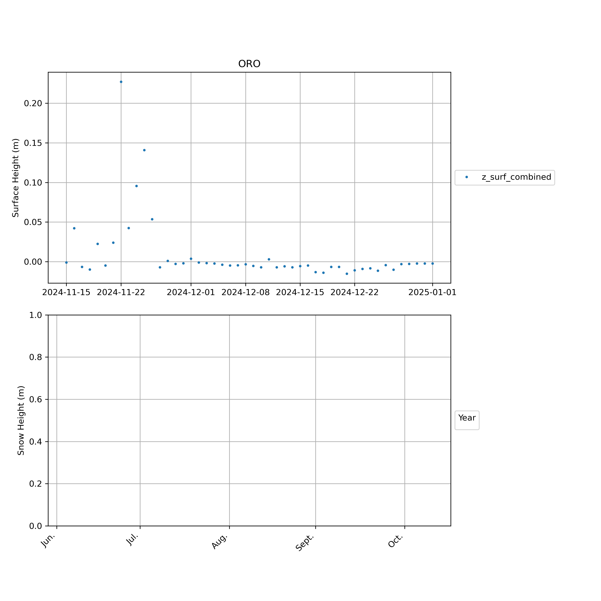

## CEN
accumulation site
## CP1
accumulation site
## DY2
accumulation site
## EGP
accumulation site
## FRE

 
## HUM
accumulation site
## JAR

 
## KAN_B
accumulation site
## KAN_L

 
## KAN_M

 
## KAN_T

 
## KAN_U
accumulation site
## KPC_L

 
## KPC_U

 
## LYN_L

 
## LYN_T
accumulation site
## MIT

 
## NAE
accumulation site
## NAU
accumulation site
## NEM
accumulation site
## NSE
accumulation site
## NUK_B
accumulation site
## NUK_K

 
## NUK_L

 
## NUK_N

 
## NUK_P
accumulation site
## NUK_U

 
## ORO

 
## QAS_A

 
## QAS_L

 
## QAS_M

 
## QAS_U

 
## RED_L
accumulation site
## SCO_L

 
## SCO_U

 
## SDL
accumulation site
## SDM
accumulation site
## SER_B

 
## SWC

 
## TAS_A

 
## TAS_L

 
## TAS_U

 
## THU_L
