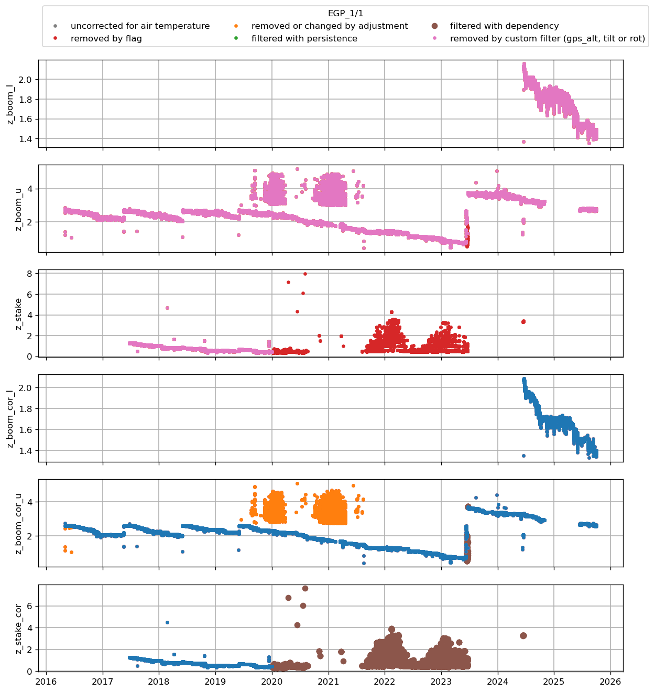
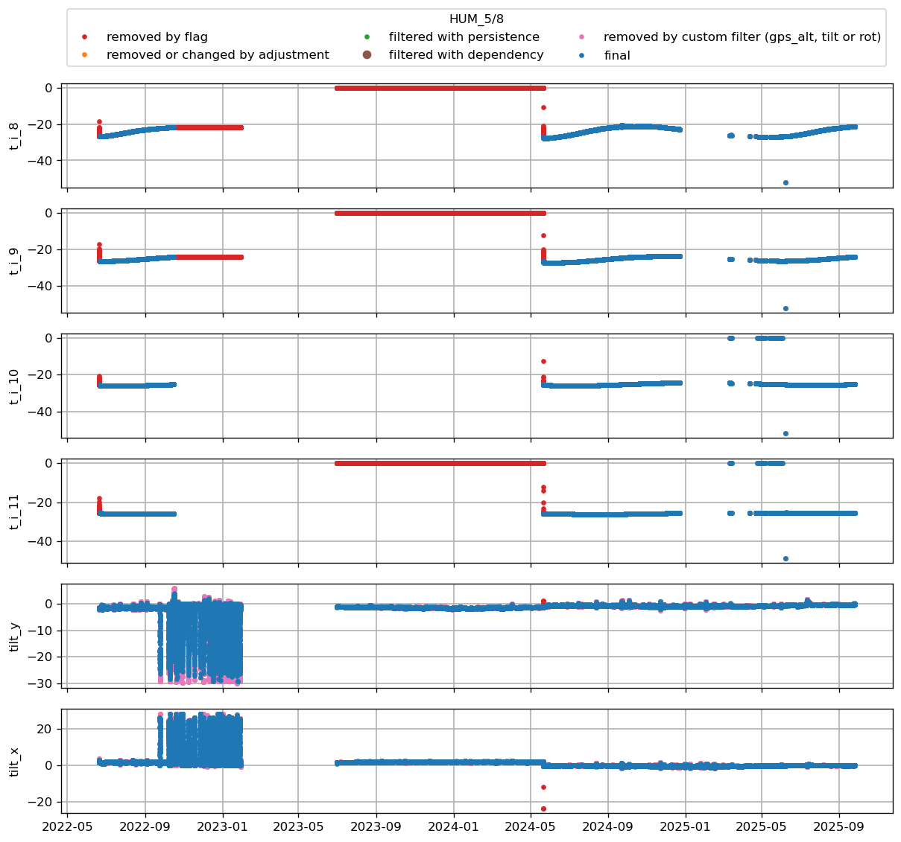
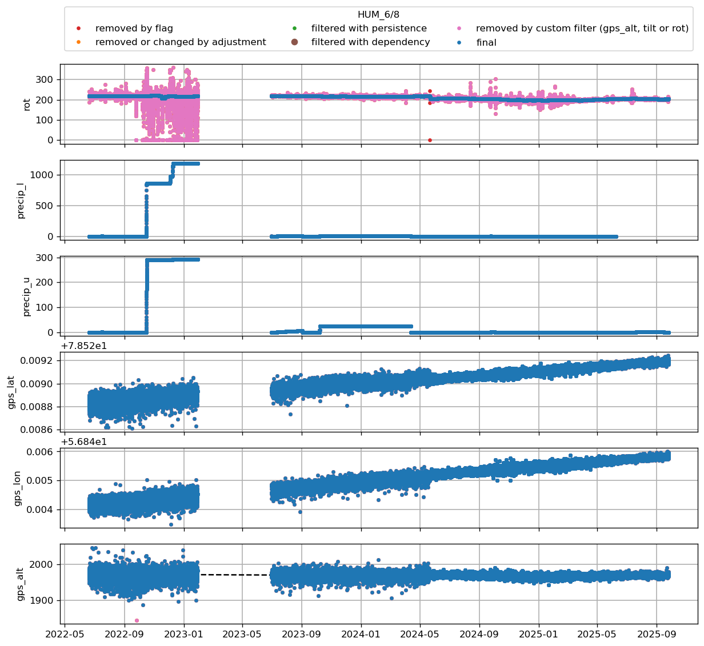
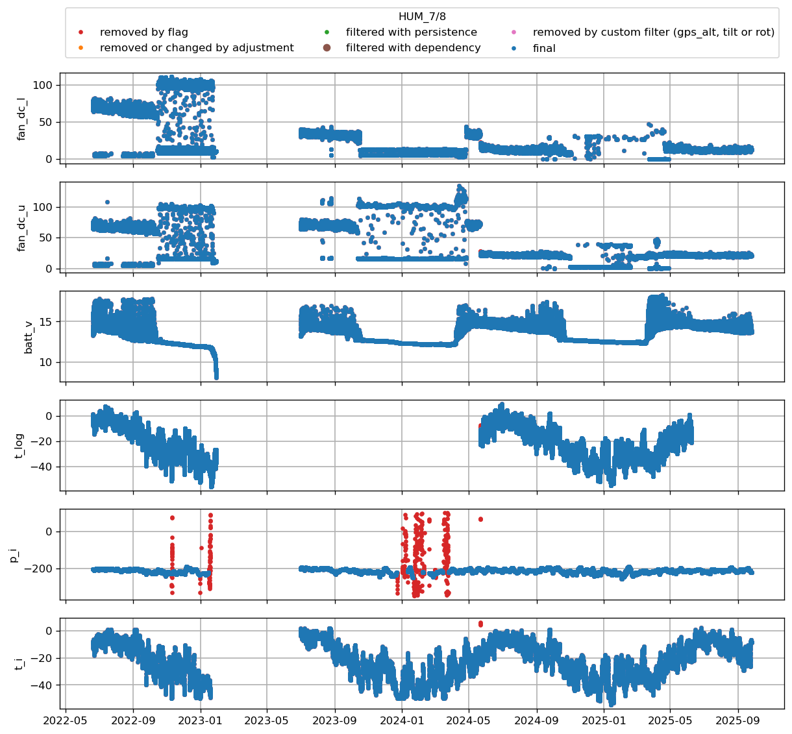
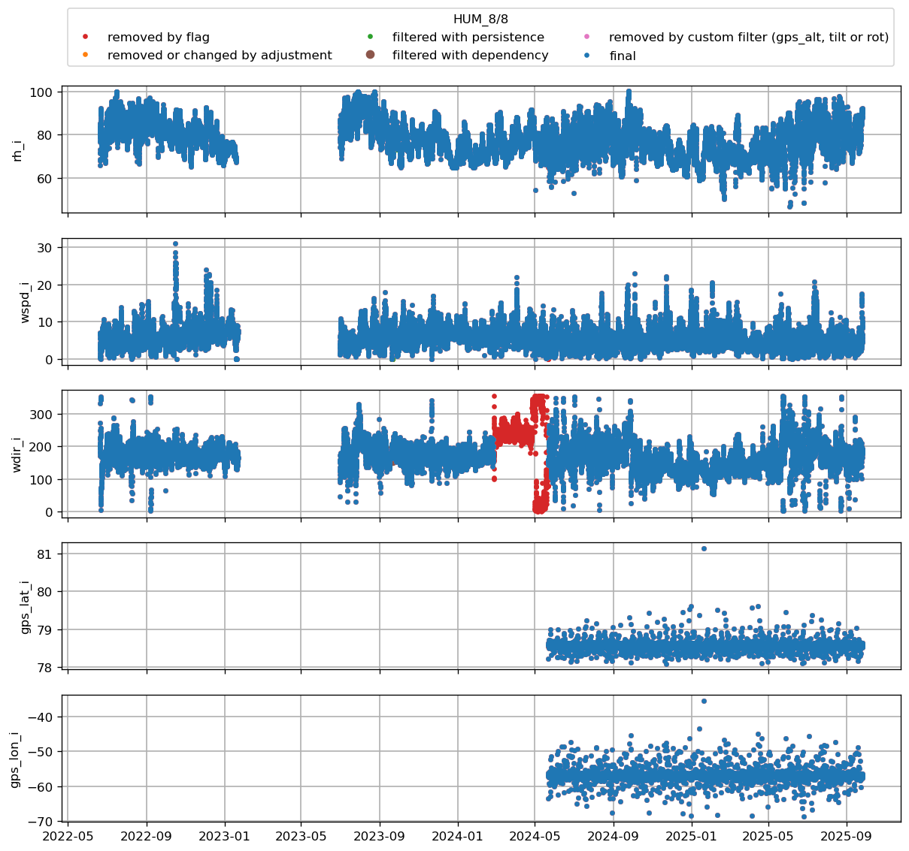
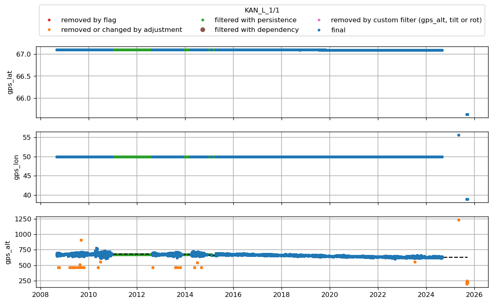
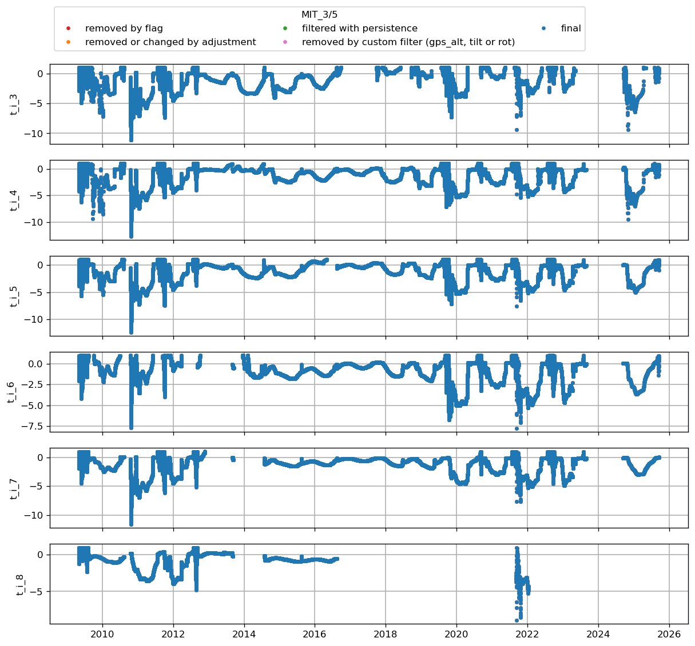
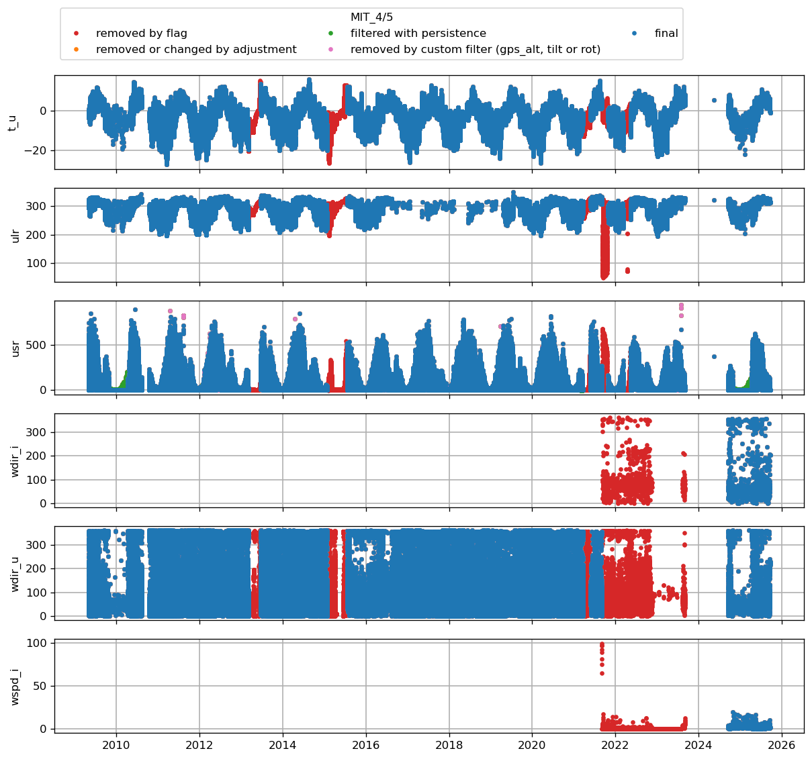
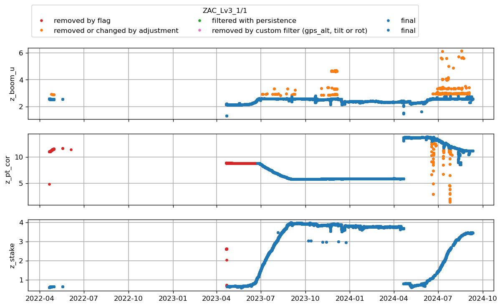

z_surf_1 not in variables
z_surf_2 not in variables
# CEN1

 
z_surf_1 not in variables
z_surf_2 not in variables
# CEN2

 
 not in variables
z_pt not in variables
z_stake not in variables
z_surf_1 not in variables
z_surf_2 not in variables
# CP1

 
z_surf_1 not in variables
z_surf_2 not in variables
# DY2

 
dsr_cor not in variables
usr_cor not in variables
z_surf_1 not in variables
z_surf_2 not in variables
# EGP

 
z_surf_1 not in variables
z_surf_2 not in variables
# FRE

 
# HUM

 
z_surf_1 not in variables
z_surf_2 not in variables
# JAR

 
z_surf_1 not in variables
z_surf_2 not in variables
# JAR_O

 
# KAN_B

 
z_ice_surf not in variables
z_surf_2 not in variables
# KAN_L

 
z_surf_2 not in variables
# KAN_Lv3

 
z_ice_surf not in variables
z_surf_2 not in variables
# KAN_M

 
# KAN_Tv3

 
 not in variables
z_surf_1 not in variables
z_surf_2 not in variables
# KAN_U

 
z_ice_surf not in variables
z_surf_2 not in variables
# KPC_L

 
z_ice_surf not in variables
# KPC_Lv3

 
z_surf_1 not in variables
z_surf_2 not in variables
# KPC_U

 
z_surf_2 not in variables
# KPC_Uv3

 
# LYN_L

 
# LYN_T

 
z_ice_surf not in variables
z_surf_2 not in variables
# MIT

 
# NAE

 
z_surf_1 not in variables
z_surf_2 not in variables
# NAU

 
z_surf_1 not in variables
z_surf_2 not in variables
# NEM

 
z_surf_1 not in variables
z_surf_2 not in variables
# NSE

 
# NUK_B

 
z_ice_surf not in variables
z_surf_1 not in variables
z_surf_2 not in variables
# NUK_K

 
z_ice_surf not in variables
z_surf_2 not in variables
# NUK_L

 
z_ice_surf not in variables
z_surf_2 not in variables
# NUK_N

 
t_surf not in variables
z_ice_surf not in variables
z_surf_2 not in variables
# NUK_U

 
z_ice_surf not in variables
# NUK_Uv3

 
# QAS_A

 
z_ice_surf not in variables
z_surf_1 not in variables
z_surf_2 not in variables
# QAS_L

 
z_surf_2 not in variables
# QAS_Lv3

 
z_ice_surf not in variables
z_surf_2 not in variables
# QAS_M

 
z_surf_2 not in variables
# QAS_Mv3

 
z_ice_surf not in variables
z_surf_2 not in variables
# QAS_U

 
dsr_cor not in variables
usr_cor not in variables
z_surf_1 not in variables
z_surf_2 not in variables
# QAS_Uv3

 
# Roof_GEUS

 
z_ice_surf not in variables
z_surf_2 not in variables
# SCO_L

 
z_ice_surf not in variables
z_surf_2 not in variables
# SCO_U

 
z_surf_1 not in variables
z_surf_2 not in variables
# SDL

 
z_surf_1 not in variables
z_surf_2 not in variables
# SDM

 
# SWC

 
z_ice_surf not in variables
z_surf_2 not in variables
# SWC_O

 
z_ice_surf not in variables
z_surf_2 not in variables
# TAS_A

 
z_ice_surf not in variables
z_surf_2 not in variables
# TAS_L

 
z_ice_surf not in variables
z_surf_1 not in variables
z_surf_2 not in variables
# TAS_U

 
z_ice_surf not in variables
z_surf_2 not in variables
# THU_L

 
z_ice_surf not in variables
z_surf_1 not in variables
z_surf_2 not in variables
# THU_L2

 
z_ice_surf not in variables
z_surf_2 not in variables
# THU_U

 
z_surf_2 not in variables
# THU_U2

 
# TUN

 
z_ice_surf not in variables
z_surf_1 not in variables
z_surf_2 not in variables
# UPE_L

 
z_ice_surf not in variables
z_surf_2 not in variables
# UPE_U

 
# UWN

 
z_surf_2 not in variables
# WEG_L

 
z_ice_surf not in variables
z_surf_2 not in variables
# ZAC_Lv3

 
z_surf_2 not in variables
# ZAC_Uv3

 
