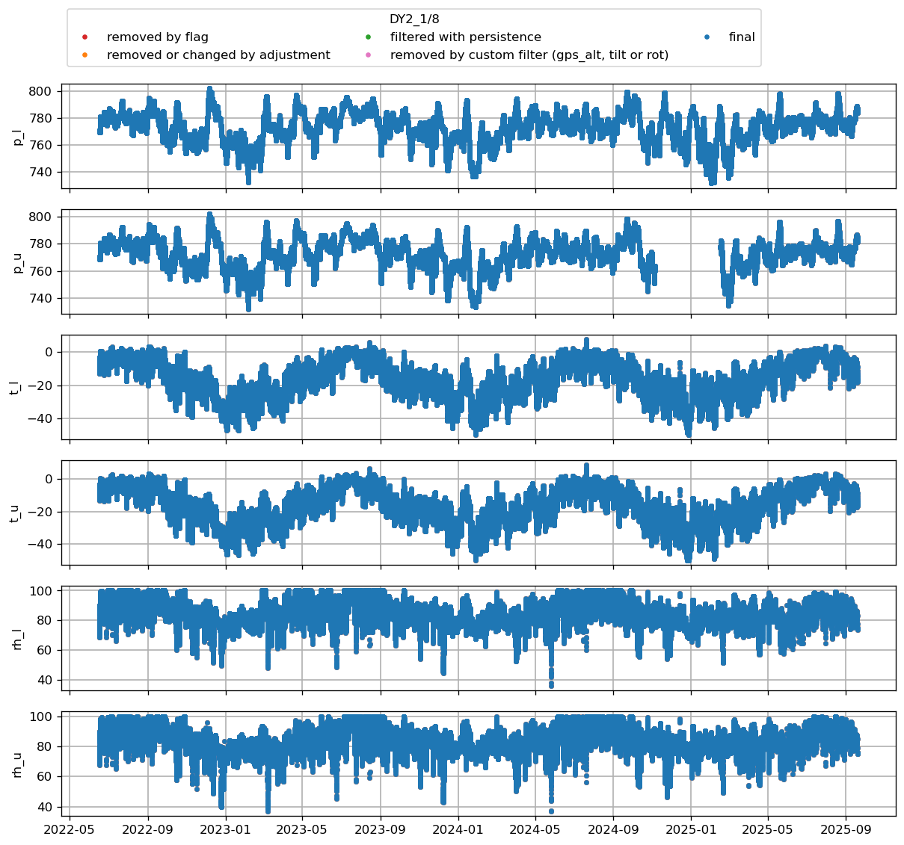

z_surf_1 not in variables
z_surf_2 not in variables
# CEN1

 
z_surf_1 not in variables
z_surf_2 not in variables
# CEN2

 
 not in variables
z_pt not in variables
z_stake not in variables
z_surf_1 not in variables
z_surf_2 not in variables
# CP1

 
z_surf_1 not in variables
z_surf_2 not in variables
# DY2

 
dsr_cor not in variables
usr_cor not in variables
z_surf_1 not in variables
z_surf_2 not in variables
# EGP
