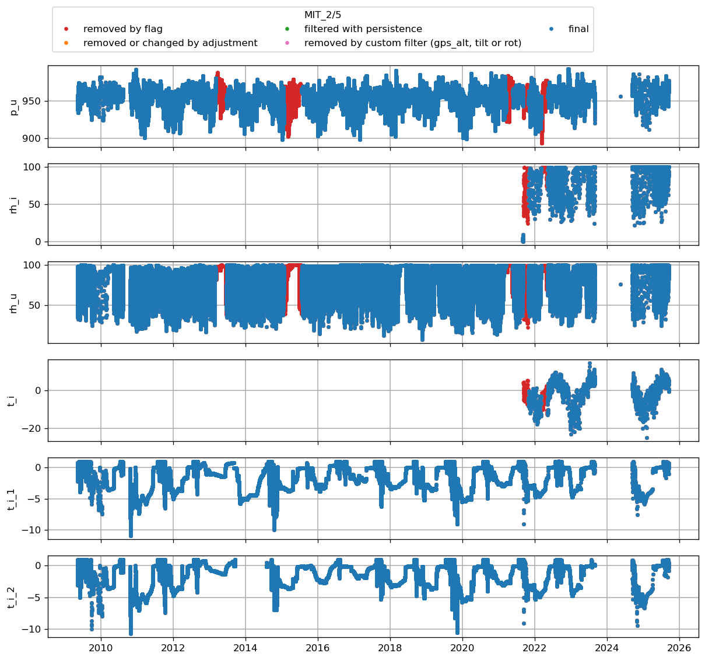
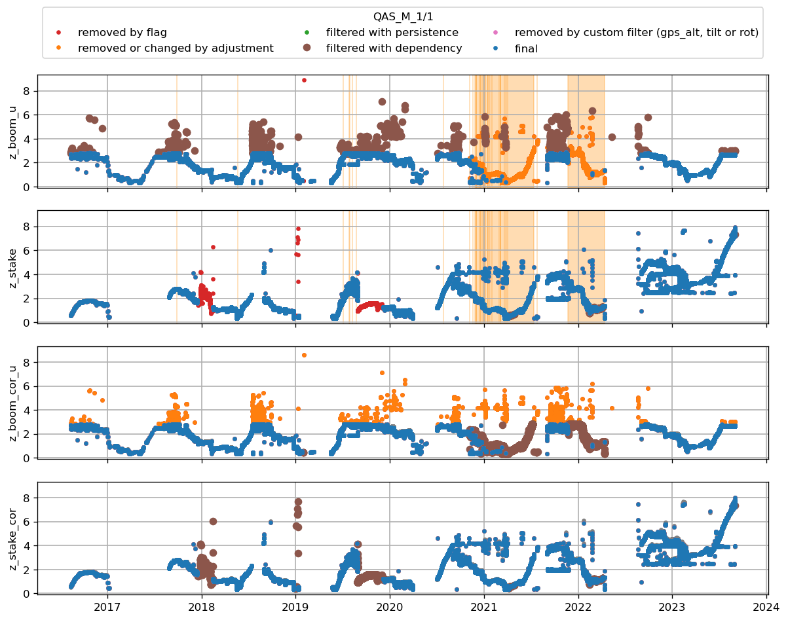

# CEN1
| t0                        | t1                        | variable                                        |   flag | comment                                  |   URL_graphic | adj_func   | adjust_function   |   adjust_value |
|:--------------------------|:--------------------------|:------------------------------------------------|-------:|:-----------------------------------------|--------------:|:-----------|:------------------|---------------:|
| 2021-07-01T00:00:00+00:00 | nan                       | t_i_1 t_i_2 t_i_3 t_i_4 t_i_5 t_i_6 t_i_7 t_i_8 |    nan | thermistors removed after 2021 (bav)     |           nan | flag       | nan               |         nan    |
| nan                       | 2017-07-27T00:00:00+00:00 | t_i_1 t_i_2 t_i_3 t_i_4 t_i_5 t_i_6 t_i_7 t_i_8 |    nan | unrealistic values (bav)                 |           nan | flag       | nan               |         nan    |
| nan                       | nan                       | t_i_1 t_i_2 t_i_3 t_i_4 t_i_5 t_i_6 t_i_7 t_i_8 |    nan | maximum height of the boom on tripod AWS |           nan | nan        | max_filter        |           2.8  |
| 2019-10-24T14:00:00+00:00 | 2020-03-28T14:00:00+00:00 | t_i_1 t_i_2 t_i_3 t_i_4 t_i_5 t_i_6 t_i_7 t_i_8 |    nan | manually adjusted by bav                 |           nan | nan        | min_filter        |           1.7  |
| 2019-10-24T14:00:00+00:00 | 2020-03-28T14:00:00+00:00 | z_stake                                         |    nan | manually adjusted by bav                 |           nan | nan        | min_filter        |           1.81 |
| 2017-07-01T00:00:00+00:00 | 2017-08-15T00:00:00+00:00 | z_stake                                         |    nan | manually adjusted by bav                 |           nan | nan        | min_filter        |           2.56 |
| nan                       | nan                       | z_stake                                         |    nan | manually adjusted by bav                 |           nan | nan        | max_filter        |           3    |
 

 
# CEN2
| t0                        | t1                        | variable                                                                                                                                                                                                                                                                                                                                                                                                                                                                                                                                                                                 | flag      | comment                                                   | URL_graphic                                                                      | adj_func   | adjust_function   |   adjust_value |
|:--------------------------|:--------------------------|:-----------------------------------------------------------------------------------------------------------------------------------------------------------------------------------------------------------------------------------------------------------------------------------------------------------------------------------------------------------------------------------------------------------------------------------------------------------------------------------------------------------------------------------------------------------------------------------------|:----------|:----------------------------------------------------------|:---------------------------------------------------------------------------------|:-----------|:------------------|---------------:|
| nan                       | 2021-08-12T20:00:00+00:00 | rec p_l p_u t_l rh_l wspd_l wdir_l t_u rh_u wspd_u wdir_u dsr usr dlr ulr t_rad z_boom_l z_boom_u t_i_1 t_i_2 t_i_3 t_i_4 t_i_5 t_i_6 t_i_7 t_i_8 t_i_9 t_i_10 t_i_11 tilt_y tilt_x rot precip_l precip_u gps_time gps_lat gps_lon gps_alt gps_geoid gps_geounit gps_q gps_numsat gps_hdop fan_dc_l fan_dc_u batt_v t_log rh_u_cor qh_u rh_l_cor qh_l wspd_x_u wspd_y_u wspd_x_l wspd_y_l dsr_cor usr_cor albedo cc t_surf dlhf_u dlhf_l dshf_u dshf_l precip_u_cor precip_u_rate precip_l_cor precip_l_rate msg_lat msg_lon p_i t_i rh_i wspd_i wdir_i msg_i rh_i_cor wspd_x_i wspd_y_i | NAN       | flagged by bav                                            | logger file contains two rows that are test                                      | flag       | nan               |          nan   |
| nan                       | 2022-06-19T00:00:00+00:00 | t_i_1 t_i_2 t_i_3 t_i_4 t_i_5 t_i_6 t_i_7 t_i_8 t_i_9 t_i_10 t_i_11                                                                                                                                                                                                                                                                                                                                                                                                                                                                                                                      | CONFIRMED | thermistor string not drilled in in 2021 but done in 2022 | nan                                                                              | flag       | nan               |          nan   |
| 2023-06-01T00:00:00+00:00 | nan                       | t_i_1 t_i_2 t_i_3 t_i_4 t_i_5 t_i_6 t_i_7 t_i_8 t_i_9 t_i_10 t_i_11                                                                                                                                                                                                                                                                                                                                                                                                                                                                                                                      | CONFIRMED | give 0degC                                                | https://github.com/GEUS-Glaciology-and-Climate/PROMICE-AWS-data-issues/issues/69 | flag       | nan               |          nan   |
| 2022-10-14T18:00:00+00:00 | 2023-01-01T18:00:00+00:00 | rec p_l p_u t_l rh_l wspd_l wdir_l t_u rh_u wspd_u wdir_u dsr usr dlr ulr t_rad z_boom_l z_boom_u t_i_1 t_i_2 t_i_3 t_i_4 t_i_5 t_i_6 t_i_7 t_i_8 t_i_9 t_i_10 t_i_11 tilt_y tilt_x rot precip_l precip_u gps_time gps_lat gps_lon gps_alt gps_geoid gps_geounit gps_q gps_numsat gps_hdop fan_dc_l fan_dc_u batt_v t_log rh_u_cor qh_u rh_l_cor qh_l wspd_x_u wspd_y_u wspd_x_l wspd_y_l dsr_cor usr_cor albedo cc t_surf dlhf_u dlhf_l dshf_u dshf_l precip_u_cor precip_u_rate precip_l_cor precip_l_rate msg_lat msg_lon p_i t_i rh_i wspd_i wdir_i msg_i rh_i_cor wspd_x_i wspd_y_i | nan       | manually adjusted by bav                                  | nan                                                                              | nan        | min_filter        |            1.8 |
| nan                       | nan                       | t_i_1 t_i_2 t_i_3 t_i_4 t_i_5 t_i_6 t_i_7 t_i_8 t_i_9 t_i_10 t_i_11                                                                                                                                                                                                                                                                                                                                                                                                                                                                                                                      | nan       | manually adjusted by bav                                  | nan                                                                              | nan        | min_filter        |            2   |
| nan                       | nan                       | t_i_1 t_i_2 t_i_3 t_i_4 t_i_5 t_i_6 t_i_7 t_i_8 t_i_9 t_i_10 t_i_11                                                                                                                                                                                                                                                                                                                                                                                                                                                                                                                      | nan       | manually adjusted by bav                                  | nan                                                                              | nan        | max_filter        |            4.3 |
| nan                       | nan                       | z_boom_l                                                                                                                                                                                                                                                                                                                                                                                                                                                                                                                                                                                 | nan       | manually adjusted by bav                                  | nan                                                                              | nan        | min_filter        |            1.5 |
| nan                       | nan                       | z_boom_l                                                                                                                                                                                                                                                                                                                                                                                                                                                                                                                                                                                 | nan       | manually adjusted by bav                                  | nan                                                                              | nan        | max_filter        |            3   |
 

 
# CP1
| t0                        | t1                        | variable                                                                                                                                                                                                                                                                                                                                                                                                                                                                                                                                                                                 | flag      | comment                                                  | URL_graphic                                                                      | adj_func   | adjust_function   |   adjust_value |
|:--------------------------|:--------------------------|:-----------------------------------------------------------------------------------------------------------------------------------------------------------------------------------------------------------------------------------------------------------------------------------------------------------------------------------------------------------------------------------------------------------------------------------------------------------------------------------------------------------------------------------------------------------------------------------------|:----------|:---------------------------------------------------------|:---------------------------------------------------------------------------------|:-----------|:------------------|---------------:|
| 2023-01-02T14:00:00+00:00 | 2023-01-05T00:00:00+00:00 | p_u p_i p_l                                                                                                                                                                                                                                                                                                                                                                                                                                                                                                                                                                              | NAN       | flagged by bav                                           | https://github.com/GEUS-Glaciology-and-Climate/PROMICE-AWS-data-issues/issues/20 | flag       | nan               |          nan   |
| 2023-01-18T00:00:00+00:00 | 2023-01-22T19:00:00+00:00 | p_u                                                                                                                                                                                                                                                                                                                                                                                                                                                                                                                                                                                      | NAN       | flagged by bav                                           | https://github.com/GEUS-Glaciology-and-Climate/PROMICE-AWS-data-issues/issues/20 | flag       | nan               |          nan   |
| 2023-01-19T19:00:00+00:00 | 2023-01-22T19:00:00+00:00 | p_l                                                                                                                                                                                                                                                                                                                                                                                                                                                                                                                                                                                      | NAN       | flagged by bav                                           | https://github.com/GEUS-Glaciology-and-Climate/PROMICE-AWS-data-issues/issues/20 | flag       | nan               |          nan   |
| 2023-01-20T00:00:00+00:00 | 2023-01-22T19:00:00+00:00 | p_i                                                                                                                                                                                                                                                                                                                                                                                                                                                                                                                                                                                      | NAN       | flagged by bav                                           | https://github.com/GEUS-Glaciology-and-Climate/PROMICE-AWS-data-issues/issues/20 | flag       | nan               |          nan   |
| 2022-02-15T00:00:00+00:00 | 2022-06-15T14:00:00+00:00 | rec p_l p_u t_l rh_l wspd_l wdir_l t_u rh_u wspd_u wdir_u dsr usr dlr ulr t_rad z_boom_l z_boom_u t_i_1 t_i_2 t_i_3 t_i_4 t_i_5 t_i_6 t_i_7 t_i_8 t_i_9 t_i_10 t_i_11 tilt_y tilt_x rot precip_l precip_u gps_time gps_lat gps_lon gps_alt gps_geoid gps_geounit gps_q gps_numsat gps_hdop fan_dc_l fan_dc_u batt_v t_log rh_u_cor qh_u rh_l_cor qh_l wspd_x_u wspd_y_u wspd_x_l wspd_y_l dsr_cor usr_cor albedo cc t_surf dlhf_u dlhf_l dshf_u dshf_l precip_u_cor precip_u_rate precip_l_cor precip_l_rate msg_lat msg_lon p_i t_i rh_i wspd_i wdir_i msg_i rh_i_cor wspd_x_i wspd_y_i | CONFIRMED | batteries were drained punctual obs are suspicious (bav) | nan                                                                              | flag       | nan               |          nan   |
| 2022-12-03T00:00:00+00:00 | 2023-06-20T00:00:00+00:00 | t_i_1 t_i_2 t_i_3 t_i_4 t_i_5 t_i_6 t_i_7 t_i_8 t_i_9 t_i_10 t_i_11                                                                                                                                                                                                                                                                                                                                                                                                                                                                                                                      | CONFIRMED | all thermistors give 0degC during that period            | nan                                                                              | flag       | nan               |          nan   |
| 2023-09-14T03:00:00+00:00 | nan                       | t_i_1 t_i_2 t_i_3 t_i_4 t_i_5 t_i_6 t_i_7 t_i_8 t_i_9 t_i_10 t_i_11                                                                                                                                                                                                                                                                                                                                                                                                                                                                                                                      | CONFIRMED | give constant values                                     | https://github.com/GEUS-Glaciology-and-Climate/PROMICE-AWS-data-issues/issues/71 | flag       | nan               |          nan   |
| nan                       | 2021-06-17T18:00:00+00:00 | z_boom_u z_boom_l                                                                                                                                                                                                                                                                                                                                                                                                                                                                                                                                                                        | CONFIRMED | unlikely value during installation                       | nan                                                                              | flag       | nan               |          nan   |
| nan                       | 2023-04-21T00:00:00+00:00 | z_boom_u                                                                                                                                                                                                                                                                                                                                                                                                                                                                                                                                                                                 | nan       | manually adjusted by bav                                 | nan                                                                              | nan        | min_filter        |            2.3 |
| nan                       | nan                       | z_boom_u                                                                                                                                                                                                                                                                                                                                                                                                                                                                                                                                                                                 | nan       | manually adjusted by bav                                 | nan                                                                              | nan        | max_filter        |            4.3 |
| nan                       | 2023-04-21T00:00:00+00:00 | z_boom_l                                                                                                                                                                                                                                                                                                                                                                                                                                                                                                                                                                                 | nan       | manually adjusted by bav                                 | nan                                                                              | nan        | min_filter        |            1.3 |
| nan                       | nan                       | z_boom_l                                                                                                                                                                                                                                                                                                                                                                                                                                                                                                                                                                                 | nan       | manually adjusted by bav                                 | nan                                                                              | nan        | max_filter        |            3   |
 

 
# EGP
| t0                        | t1                        | variable                                        |   flag | comment                                                                    |   URL_graphic | adj_func   | adjust_function   |   adjust_value |
|:--------------------------|:--------------------------|:------------------------------------------------|-------:|:---------------------------------------------------------------------------|--------------:|:-----------|:------------------|---------------:|
| 2016-05-05T00:00:00+00:00 | 2016-05-21T00:00:00+00:00 | t_i_1 t_i_2 t_i_3 t_i_4 t_i_5 t_i_6 t_i_7 t_i_8 |    nan | string only drilled in on 21st May (bav)                                   |           nan | flag       | nan               |         nan    |
| 2020-01-01T00:00:00+00:00 | nan                       | z_stake                                         |    nan | manually flagged by bav                                                    |           nan | flag       | nan               |         nan    |
| nan                       | 2023-06-21T00:00:00+00:00 | t_i_1 t_i_2 t_i_3 t_i_4 t_i_5 t_i_6 t_i_7 t_i_8 |    nan | maximum height of the boom on tripod AWS (changed for a mast-type in 2023) |           nan | nan        | max_filter        |           2.8  |
| 2019-08-04T00:00:00+00:00 | 2019-11-13T00:00:00+00:00 | z_boom_u                                        |    nan | manually adjusted by bav                                                   |           nan | nan        | max_filter        |           2.6  |
| 2019-11-13T00:00:00+00:00 | 2020-09-01T00:00:00+00:00 | z_boom_u                                        |    nan | manually adjusted by bav                                                   |           nan | nan        | max_filter        |           2.33 |
| 2020-09-01T00:00:00+00:00 | 2021-03-06T00:00:00+00:00 | z_boom_u                                        |    nan | manually adjusted by bav                                                   |           nan | nan        | max_filter        |           1.93 |
| 2021-03-06T00:00:00+00:00 | 2021-04-26T00:00:00+00:00 | z_boom_u                                        |    nan | manually adjusted by bav                                                   |           nan | nan        | max_filter        |           1.7  |
 

 
# JAR
|   t0 |   adj_func |   t1 | variable   | adjust_function   |   adjust_value | comment                                  |   URL_graphic |
|-----:|-----------:|-----:|:-----------|:------------------|---------------:|:-----------------------------------------|--------------:|
|  nan |        nan |  nan | z_boom_u   | max_filter        |            2.8 | maximum height of the boom on tripod AWS |           nan |
 

 
# JAR_O
| t0                        | t1                        | variable   | flag      | comment                                  |   URL_graphic | adj_func   | adjust_function   |   adjust_value |
|:--------------------------|:--------------------------|:-----------|:----------|:-----------------------------------------|--------------:|:-----------|:------------------|---------------:|
| 2022-01-01T00:00:00+00:00 | 2023-07-07T00:00:00+00:00 | z_pt_cor   | CONFIRMED | very unlikely values (bav)               |           nan | flag       | nan               |          nan   |
| nan                       | nan                       | z_boom_u   | nan       | maximum height of the boom on tripod AWS |           nan | nan        | max_filter        |            2.8 |
 

 
# KAN_L
| t0                        | t1                        | variable   | flag    | comment                                           |   URL_graphic | adj_func   | adjust_function   |   adjust_value |
|:--------------------------|:--------------------------|:-----------|:--------|:--------------------------------------------------|--------------:|:-----------|:------------------|---------------:|
| 2009-08-27T00:00:00+00:00 | 2010-06-01T00:00:00+00:00 | z_stake    | CHECKME | manually flagged by bav                           |           nan | flag       | nan               |         nan    |
| 2011-11-01T00:00:00+00:00 | 2012-05-20T00:00:00+00:00 | z_stake    | CHECKME | manually flagged by bav                           |           nan | flag       | nan               |         nan    |
| 2014-06-25T00:00:00+00:00 | 2014-08-15T00:00:00+00:00 | z_stake    | CHECKME | manually flagged by bav                           |           nan | flag       | nan               |         nan    |
| 2015-10-20T00:00:00+00:00 | 2016-07-16T17:00:00+00:00 | z_stake    | CHECKME | manually flagged by bav                           |           nan | flag       | nan               |         nan    |
| 2009-09-17T00:00:00+00:00 | 2009-10-07T00:00:00+00:00 | z_pt_cor   | CHECKME | manually flagged by bav                           |           nan | flag       | nan               |         nan    |
| 2010-10-02T00:00:00+00:00 | 2010-10-12T00:00:00+00:00 | z_pt_cor   | CHECKME | manually flagged by bav                           |           nan | flag       | nan               |         nan    |
| 2012-10-06T00:00:00+00:00 | 2012-10-26T00:00:00+00:00 | z_pt_cor   | CHECKME | manually flagged by bav                           |           nan | flag       | nan               |         nan    |
| 2014-10-08T00:00:00+00:00 | 2014-11-16T00:00:00+00:00 | z_pt_cor   | CHECKME | manually flagged by bav                           |           nan | flag       | nan               |         nan    |
| 2019-10-07T00:00:00+00:00 | 2019-10-27T00:00:00+00:00 | z_pt_cor   | CHECKME | manually flagged by bav                           |           nan | flag       | nan               |         nan    |
| 2021-09-18T00:00:00+00:00 | 2022-06-01T00:00:00+00:00 | z_pt_cor   | CHECKME | manually flagged by bav                           |           nan | flag       | nan               |         nan    |
| 2022-10-01T00:00:00+00:00 | 2022-11-01T00:00:00+00:00 | z_pt_cor   | CHECKME | manually flagged by bav                           |           nan | flag       | nan               |         nan    |
| nan                       | nan                       | z_boom_u   | nan     | maximum height of the boom on tripod AWS          |           nan | nan        | max_filter        |           2.8  |
| nan                       | nan                       | z_boom_u   | nan     | never seen more than 80 cm of snow at KAN_L (bav) |           nan | nan        | min_filter        |           2    |
| 2010-10-07T00:00:00+00:00 | nan                       | z_pt_cor   | nan     | manually adjusted by bav                          |           nan | nan        | add               |          -0.1  |
| 2011-06-04T00:00:00+00:00 | nan                       | z_pt_cor   | nan     | manually adjusted by bav                          |           nan | nan        | add               |          -4    |
| 2012-08-21T00:00:00+00:00 | nan                       | z_pt_cor   | nan     | manually adjusted by bav                          |           nan | nan        | add               |         -11.7  |
| 2014-05-13T00:00:00+00:00 | nan                       | z_pt_cor   | nan     | manually adjusted by bav                          |           nan | nan        | add               |           0.07 |
| 2015-04-29T00:00:00+00:00 | nan                       | z_pt_cor   | nan     | manually adjusted by bav                          |           nan | nan        | add               |          -7.08 |
| 2015-07-07T00:00:00+00:00 | nan                       | z_pt_cor   | nan     | manually adjusted by bav                          |           nan | nan        | add               |          -0.4  |
| 2016-07-16T00:00:00+00:00 | nan                       | z_pt_cor   | nan     | manually adjusted by bav                          |           nan | nan        | add               |          -1.6  |
| 2017-09-01T00:00:00+00:00 | nan                       | z_pt_cor   | nan     | manually adjusted by bav                          |           nan | nan        | add               |          -3.5  |
| 2018-08-29T00:00:00+00:00 | nan                       | z_pt_cor   | nan     | manually adjusted by bav                          |           nan | nan        | add               |         -11.3  |
| 2021-08-17T00:00:00+00:00 | nan                       | z_pt_cor   | nan     | manually adjusted by bav                          |           nan | nan        | add               |         -13    |
| 2022-05-15T13:00:00+00:00 | nan                       | z_pt_cor   | nan     | manually adjusted by bav                          |           nan | nan        | add               |           2.9  |
 

 
# KAN_M
| t0                        | t1                        | variable                                        | flag      | comment                                                                                   |   URL_graphic | adj_func   | adjust_function   |   adjust_value |
|:--------------------------|:--------------------------|:------------------------------------------------|:----------|:------------------------------------------------------------------------------------------|--------------:|:-----------|:------------------|---------------:|
| 2010-08-18T00:00:00+00:00 | 2011-04-21T00:00:00+00:00 | z_stake                                         | NAN       | manually flagged by bav                                                                   |           nan | flag       | nan               |          nan   |
| 2013-10-28T21:00:00+00:00 | 2013-10-01T00:00:00+00:00 | z_stake                                         | CHECKME   | Manually flagged by bav                                                                   |           nan | flag       | nan               |          nan   |
| 2011-11-13T21:00:00+00:00 | 2012-05-03T22:00:00+00:00 | t_i_1 t_i_2 t_i_3 t_i_4 t_i_5 t_i_6 t_i_7 t_i_8 | CHECKME   | Manually flagged by bav                                                                   |           nan | flag       | nan               |          nan   |
| 2014-09-14T00:00:00+00:00 | 2015-06-19T00:00:00+00:00 | z_stake                                         | NAN       | manually flagged by bav                                                                   |           nan | flag       | nan               |          nan   |
| 2017-02-10T00:00:00+00:00 | 2017-02-16T00:00:00+00:00 | z_stake                                         | CHECKME   | Manually flagged by bav                                                                   |           nan | flag       | nan               |          nan   |
| 2016-07-16T00:00:00+00:00 | 2018-06-01T00:00:00+00:00 | z_stake                                         | NAN       | manually flagged by bav                                                                   |           nan | flag       | nan               |          nan   |
| 2014-12-06T20:00:00+00:00 | 2014-12-23T00:00:00+00:00 | z_boom_u                                        | CHECKME   | Manually flagged by bav                                                                   |           nan | flag       | nan               |          nan   |
| 2018-06-05T00:00:00+00:00 | 2018-06-09T20:00:00+00:00 | z_boom_u                                        | CHECKME   | Only fragmented observations available while SR50 on stake shows clear accumulation (bav) |           nan | flag       | nan               |          nan   |
| 2014-09-17T00:00:00+00:00 | 2015-07-19T00:00:00+00:00 | z_pt_cor                                        | NAN       | showing height decrease at strange month or height increase (bav)                         |           nan | flag       | nan               |          nan   |
| nan                       | 2010-05-21T00:00:00+00:00 | t_i_1 t_i_2 t_i_3 t_i_4 t_i_5 t_i_6 t_i_7 t_i_8 | CONFIRMED | no thermistor installed until 2010 (bav)                                                  |           nan | flag       | nan               |          nan   |
| 2018-08-29T00:00:00+00:00 | 2022-08-21T00:00:00+00:00 | t_i_1 t_i_2 t_i_3 t_i_4 t_i_5 t_i_6 t_i_7 t_i_8 | NAN       | manually flagged by bav                                                                   |           nan | flag       | nan               |          nan   |
| nan                       | nan                       | z_boom_u                                        | nan       | maximum height of the boom on tripod AWS                                                  |           nan | nan        | max_filter        |            2.8 |
| nan                       | nan                       | z_boom_u                                        | nan       | never seen more than 1.80 cm of snow at KAN_L (bav)                                       |           nan | nan        | min_filter        |            1   |
| nan                       | nan                       | t_i_1 t_i_2 t_i_3 t_i_4 t_i_5 t_i_6 t_i_7 t_i_8 | nan       | nan                                                                                       |           nan | nan        | min_filter        |          -25   |
 

 
# KAN_U
| t0                        | t1                        | variable                |   flag | comment                                                               | URL_graphic                                                                      | adj_func   | adjust_function   |   adjust_value |
|:--------------------------|:--------------------------|:------------------------|-------:|:----------------------------------------------------------------------|:---------------------------------------------------------------------------------|:-----------|:------------------|---------------:|
| 2021-12-20T00:00:00+00:00 | 2023-06-09T04:00:00+00:00 | gps_lon gps_lat gps_alt |    nan | manually flagged by bav                                               | https://github.com/GEUS-Glaciology-and-Climate/PROMICE-AWS-data-issues/issues/50 | flag       | nan               |          nan   |
| 2011-05-26T00:00:00+00:00 | 2012-05-03T00:00:00+00:00 | gps_lon gps_lat gps_alt |    nan | manually flagged by bav                                               | https://github.com/GEUS-Glaciology-and-Climate/PROMICE-AWS-data-issues/issues/50 | flag       | nan               |          nan   |
| 2015-10-27T00:00:00+00:00 | 2016-04-09T00:00:00+00:00 | gps_lon gps_lat gps_alt |    nan | manually flagged by bav                                               | https://github.com/GEUS-Glaciology-and-Climate/PROMICE-AWS-data-issues/issues/50 | flag       | nan               |          nan   |
| nan                       | 2023-06-08T12:00:00+00:00 | z_boom_u                |    nan | maximum height of the boom on tripod AWS (changed for a mast in 2023) | nan                                                                              | nan        | max_filter        |            2.8 |
 

 
# KPC_L
| t0                        | t1                        | variable   | flag    | comment                                  |   URL_graphic | adj_func   | adjust_function   |   adjust_value |
|:--------------------------|:--------------------------|:-----------|:--------|:-----------------------------------------|--------------:|:-----------|:------------------|---------------:|
| 2012-07-19T00:00:00+00:00 | 2012-07-30T00:00:00+00:00 | z_boom_u   | CHECKME | manually flagged by bav                  |           nan | flag       | nan               |        nan     |
| 2012-07-19T00:00:00+00:00 | 2012-07-19T16:00:00+00:00 | z_pt_cor   | CHECKME | manually flagged by bav                  |           nan | flag       | nan               |        nan     |
| 2019-08-25T12:00:00+00:00 | 2019-08-27T00:00:00+00:00 | z_pt_cor   | CHECKME | manually flagged by bav                  |           nan | flag       | nan               |        nan     |
| 2019-09-07T00:00:00+00:00 | 2019-09-11T00:00:00+00:00 | z_pt_cor   | CHECKME | manually flagged by bav                  |           nan | flag       | nan               |        nan     |
| 2019-09-15T00:00:00+00:00 | 2020-01-01T00:00:00+00:00 | z_pt_cor   | CHECKME | manually flagged by bav                  |           nan | flag       | nan               |        nan     |
| 2020-04-01T00:00:00+00:00 | 2020-06-01T00:00:00+00:00 | z_pt_cor   | CHECKME | manually flagged by bav                  |           nan | flag       | nan               |        nan     |
| 2021-04-01T00:00:00+00:00 | 2021-06-04T00:00:00+00:00 | z_pt_cor   | CHECKME | manually flagged by bav                  |           nan | flag       | nan               |        nan     |
| 2022-04-01T00:00:00+00:00 | 2022-06-04T00:00:00+00:00 | z_pt_cor   | CHECKME | manually flagged by bav                  |           nan | flag       | nan               |        nan     |
| 2009-08-20T00:00:00+00:00 | 2010-01-31T00:00:00+00:00 | z_stake    | CHECKME | manually flagged by bav                  |           nan | flag       | nan               |        nan     |
| 2013-08-27T00:00:00+00:00 | 2016-06-28T00:00:00+00:00 | z_stake    | CHECKME | manually flagged by bav                  |           nan | flag       | nan               |        nan     |
| 2014-07-20T00:00:00+00:00 | 2015-02-28T00:00:00+00:00 | z_stake    | CHECKME | manually flagged by bav                  |           nan | flag       | nan               |        nan     |
| 2020-04-02T15:00:00+00:00 | nan                       | z_stake    | CHECKME | manually flagged by bav                  |           nan | flag       | nan               |        nan     |
| nan                       | nan                       | z_boom_u   | nan     | maximum height of the boom on tripod AWS |           nan | nan        | max_filter        |          2.8   |
| 2012-01-01T00:00:00+00:00 | nan                       | z_pt_cor   | nan     | manually adjusted by bav                 |           nan | nan        | add               |         -6     |
| 2016-07-27T00:00:00+00:00 | nan                       | z_pt_cor   | nan     | manually adjusted by bav                 |           nan | nan        | add               |         -6.297 |
| 2016-07-29T00:00:00+00:00 | nan                       | z_pt_cor   | nan     | manually adjusted by bav                 |           nan | nan        | add               |         -0.1   |
| 2019-07-12T13:00:00+00:00 | nan                       | z_pt_cor   | nan     | manually adjusted by bav                 |           nan | nan        | add               |         -4.478 |
 

 
# KPC_U
| t0                        |   t1 | variable                                        | flag    | comment                                  |   URL_graphic | adj_func   | adjust_function   |   adjust_value |
|:--------------------------|-----:|:------------------------------------------------|:--------|:-----------------------------------------|--------------:|:-----------|:------------------|---------------:|
| 2006-07-10T00:00:00+00:00 |  nan | z_pt_cor                                        | CHECKME | manually flagged by bav                  |           nan | flag       | nan               |          nan   |
| 2019-06-28T00:00:00+00:00 |  nan | t_i_1 t_i_2 t_i_3 t_i_4 t_i_5 t_i_6 t_i_7 t_i_8 | CHECKME | manually flagged by bav                  |           nan | flag       | nan               |          nan   |
| nan                       |  nan | z_boom_u                                        | nan     | maximum height of the boom on tripod AWS |           nan | nan        | max_filter        |            2.8 |
| nan                       |  nan | t_i_1 t_i_2 t_i_3 t_i_4 t_i_5 t_i_6 t_i_7 t_i_8 | nan     | nan                                      |           nan | nan        | min_filter        |          -30   |
 

 
# KPC_Uv3
| t0                        | t1                        | variable                                                                                                                                                                                                                                                                                                                                                                                                                       | flag    | comment                  | URL_graphic                                                                      | adj_func   | adjust_function   |   adjust_value |
|:--------------------------|:--------------------------|:-------------------------------------------------------------------------------------------------------------------------------------------------------------------------------------------------------------------------------------------------------------------------------------------------------------------------------------------------------------------------------------------------------------------------------|:--------|:-------------------------|:---------------------------------------------------------------------------------|:-----------|:------------------|---------------:|
| 2021-07-10T00:00:00+00:00 | 2023-06-10T00:00:00+00:00 | rec p_u t_u rh_u wspd_u wdir_u dsr usr dlr ulr t_rad z_pt t_i_1 t_i_2 t_i_3 t_i_4 t_i_5 t_i_6 t_i_7 t_i_8 tilt_x tilt_y rot rh_u_cor qh_u wspd_x_u wspd_y_u dsr_cor usr_cor albedo cc t_surf dlhf_u dshf_u z_pt_cor z_boom_u z_stake precip_u gps_time gps_lat gps_lon gps_alt gps_hdop fan_dc_u batt_v p_i t_i rh_i wspd_i wdir_i msg_i msg_lat msg_lon precip_u_cor precip_u_rate gps_geoid t_log rh_i_cor wspd_x_i wspd_y_i | CHECKME | manually flagged by bav  | nan                                                                              | flag       | nan               |          nan   |
| 2056-01-01T00:00:00+00:00 | nan                       | rec p_u t_u rh_u wspd_u wdir_u dsr usr dlr ulr t_rad z_pt t_i_1 t_i_2 t_i_3 t_i_4 t_i_5 t_i_6 t_i_7 t_i_8 tilt_x tilt_y rot rh_u_cor qh_u wspd_x_u wspd_y_u dsr_cor usr_cor albedo cc t_surf dlhf_u dshf_u z_pt_cor z_boom_u z_stake precip_u gps_time gps_lat gps_lon gps_alt gps_hdop fan_dc_u batt_v p_i t_i rh_i wspd_i wdir_i msg_i msg_lat msg_lon precip_u_cor precip_u_rate gps_geoid t_log rh_i_cor wspd_x_i wspd_y_i | nan     | manually adjusted by bav | https://github.com/GEUS-Glaciology-and-Climate/PROMICE-AWS-data-issues/issues/22 | nan        | time_shift        |       -12361.5 |
 

 
# MIT
| t0                        | t1                        | variable                                                                       | flag    | comment                                  | URL_graphic                                                                      | adj_func   | adjust_function   |   adjust_value |
|:--------------------------|:--------------------------|:-------------------------------------------------------------------------------|:--------|:-----------------------------------------|:---------------------------------------------------------------------------------|:-----------|:------------------|---------------:|
| 2013-03-07T00:00:00+00:00 | 2013-06-21T00:00:00+00:00 | rh_u t_u wspd_u wdir_u p_u rh_i t_i wspd_i wdir_i p_i dsr usr dlr ulr z_boom_u | CHECKME | Manually flagged by bav                  | nan                                                                              | flag       | nan               |         nan    |
| 2015-01-25T11:00:00+00:00 | 2015-07-21T00:00:00+00:00 | rh_u t_u wspd_u wdir_u p_u rh_i t_i wspd_i wdir_i p_i dsr usr dlr ulr z_boom_u | CHECKME | Manually flagged by bav                  | nan                                                                              | flag       | nan               |         nan    |
| 2019-04-01T00:00:00+00:00 | 2019-07-31T00:00:00+00:00 | dlr                                                                            | CHECKME | Manually flagged by bav                  | nan                                                                              | flag       | nan               |         nan    |
| 2008-06-01T00:00:00+00:00 | 2010-01-01T00:00:00+00:00 | z_boom_u                                                                       | CHECKME | Manually flagged by bav                  | nan                                                                              | flag       | nan               |         nan    |
| 2010-12-14T00:00:00+00:00 | 2011-08-12T00:00:00+00:00 | z_stake                                                                        | CHECKME | Manually flagged by bav                  | nan                                                                              | flag       | nan               |         nan    |
| 2012-02-03T00:00:00+00:00 | 2012-06-03T00:00:00+00:00 | z_stake                                                                        | CHECKME | Manually flagged by bav                  | nan                                                                              | flag       | nan               |         nan    |
| 2013-01-01T00:00:00+00:00 | 2013-09-09T00:00:00+00:00 | z_stake                                                                        | CHECKME | Manually flagged by bav                  | nan                                                                              | flag       | nan               |         nan    |
| 2014-09-20T00:00:00+00:00 | 2015-08-14T00:00:00+00:00 | z_stake                                                                        | CHECKME | Manually flagged by bav                  | nan                                                                              | flag       | nan               |         nan    |
| 2015-09-15T00:00:00+00:00 | 2015-12-14T00:00:00+00:00 | z_stake                                                                        | CHECKME | Manually flagged by bav                  | nan                                                                              | flag       | nan               |         nan    |
| 2016-06-15T00:00:00+00:00 | 2016-07-14T00:00:00+00:00 | z_stake                                                                        | CHECKME | Manually flagged by bav                  | nan                                                                              | flag       | nan               |         nan    |
| 2008-06-01T00:00:00+00:00 | 2009-08-12T00:00:00+00:00 | z_pt_cor                                                                       | CHECKME | manually flagged by bav                  | nan                                                                              | flag       | nan               |         nan    |
| 2015-12-31T00:00:00+00:00 | 2016-05-29T00:00:00+00:00 | z_pt_cor                                                                       | CHECKME | manually flagged by bav                  | nan                                                                              | flag       | nan               |         nan    |
| 2016-01-02T00:00:00+00:00 | 2017-07-01T00:00:00+00:00 | z_pt_cor                                                                       | CHECKME | manually flagged by bav                  | nan                                                                              | flag       | nan               |         nan    |
| 2017-10-01T00:00:00+00:00 | 2018-07-01T00:00:00+00:00 | z_pt_cor                                                                       | CHECKME | manually flagged by bav                  | nan                                                                              | flag       | nan               |         nan    |
| 2018-10-01T00:00:00+00:00 | 2018-11-01T00:00:00+00:00 | t_i_1 t_i_2 t_i_3 t_i_4 t_i_5 t_i_6 t_i_7 t_i_8                                | CHECKME | manually flagged by bav                  | nan                                                                              | flag       | nan               |         nan    |
| 2019-01-02T00:00:00+00:00 | 2019-07-01T00:00:00+00:00 | z_pt_cor                                                                       | CHECKME | manually flagged by bav                  | nan                                                                              | flag       | nan               |         nan    |
| 2019-09-10T00:00:00+00:00 | 2020-05-01T00:00:00+00:00 | z_pt_cor                                                                       | CHECKME | manually flagged by bav                  | nan                                                                              | flag       | nan               |         nan    |
| 2020-09-10T00:00:00+00:00 | 2021-05-01T00:00:00+00:00 | z_pt_cor                                                                       | CHECKME | manually flagged by bav                  | nan                                                                              | flag       | nan               |         nan    |
| 2021-09-01T00:00:00+00:00 | nan                       | wspd_i wspd_u                                                                  | NAN     | manually flagged by bav                  | https://github.com/GEUS-Glaciology-and-Climate/PROMICE-AWS-data-issues/issues/54 | flag       | nan               |         nan    |
| 2023-08-01T00:00:00+00:00 | nan                       | t_i rh_i                                                                       | NAN     | manually flagged by bav                  | https://github.com/GEUS-Glaciology-and-Climate/PROMICE-AWS-data-issues/issues/54 | flag       | nan               |         nan    |
| nan                       | nan                       | z_boom_u                                                                       | nan     | maximum height of the boom on tripod AWS | nan                                                                              | nan        | max_filter        |           2.8  |
| 2009-08-12T00:00:00+00:00 | nan                       | z_pt_cor                                                                       | nan     | manually adjusted by bav                 | nan                                                                              | nan        | add               |         -12    |
| 2010-09-01T00:00:00+00:00 | nan                       | z_pt_cor                                                                       | nan     | manually adjusted by bav                 | nan                                                                              | nan        | add               |           2    |
| 2011-08-11T00:00:00+00:00 | nan                       | z_pt_cor                                                                       | nan     | manually adjusted by bav                 | nan                                                                              | nan        | add               |          -0.08 |
| 2012-09-06T00:00:00+00:00 | nan                       | z_pt_cor                                                                       | nan     | manually adjusted by bav                 | nan                                                                              | nan        | add               |         -13.7  |
| 2018-07-01T00:00:00+00:00 | nan                       | z_pt_cor                                                                       | nan     | manually adjusted by bav                 | nan                                                                              | nan        | add               |          -2    |
| 2019-01-12T00:00:00+00:00 | nan                       | z_pt_cor                                                                       | nan     | manually adjusted by bav                 | nan                                                                              | nan        | add               |          -2    |
| 2009-08-11T16:00:00+00:00 | nan                       | z_surf_2                                                                       | nan     | manually adjusted by bav                 | nan                                                                              | nan        | add               |          -3.2  |
| 2010-08-08T00:00:00+00:00 | nan                       | z_surf_2                                                                       | nan     | manually adjusted by bav                 | nan                                                                              | nan        | add               |          -3    |
| 2011-08-06T00:00:00+00:00 | nan                       | z_surf_2                                                                       | nan     | manually adjusted by bav                 | nan                                                                              | nan        | add               |          -3    |
| 2012-06-01T00:00:00+00:00 | nan                       | z_surf_2                                                                       | nan     | manually adjusted by bav                 | nan                                                                              | nan        | add               |           1.4  |
| 2012-09-06T00:00:00+00:00 | nan                       | z_surf_2                                                                       | nan     | manually adjusted by bav                 | nan                                                                              | nan        | add               |          -2.3  |
| 2014-07-31T15:00:00+00:00 | nan                       | z_surf_2                                                                       | nan     | manually adjusted by bav                 | nan                                                                              | nan        | add               |          -0.8  |
| 2015-07-31T15:00:00+00:00 | nan                       | z_surf_2                                                                       | nan     | manually adjusted by bav                 | nan                                                                              | nan        | add               |          -1.8  |
| nan                       | nan                       | t_i_1 t_i_2 t_i_3 t_i_4 t_i_5 t_i_6 t_i_7 t_i_8                                | nan     | nan                                      | nan                                                                              | nan        | min_filter        |         -20    |
 

 
# NAU
| t0                        | t1                        | variable                                                            | flag      | comment                                        | URL_graphic                                                                      | adj_func   | adjust_function   |   adjust_value |
|:--------------------------|:--------------------------|:--------------------------------------------------------------------|:----------|:-----------------------------------------------|:---------------------------------------------------------------------------------|:-----------|:------------------|---------------:|
| 2022-12-23T00:00:00+00:00 | 2022-12-28T00:00:00+00:00 | p_u p_i p_l                                                         | NAN       | flagged by bav                                 | https://github.com/GEUS-Glaciology-and-Climate/PROMICE-AWS-data-issues/issues/21 | flag       | nan               |          nan   |
| 2022-12-30T20:00:00+00:00 | 2023-04-04T00:00:00+00:00 | p_u p_i p_l                                                         | NAN       | flagged by bav                                 | https://github.com/GEUS-Glaciology-and-Climate/PROMICE-AWS-data-issues/issues/21 | flag       | nan               |          nan   |
| 2021-12-08T00:00:00+00:00 | 2021-12-21T00:00:00+00:00 | t_i_11                                                              | NAN       | flagged by bav                                 | nan                                                                              | flag       | nan               |          nan   |
| 2023-10-04T00:00:00+00:00 | nan                       | t_i_1 t_i_2 t_i_3 t_i_4 t_i_5 t_i_6 t_i_7 t_i_8 t_i_9 t_i_10 t_i_11 | CONFIRMED | constant ice temperature after that date (bav) | https://github.com/GEUS-Glaciology-and-Climate/PROMICE-AWS-data-issues/issues/86 | flag       | nan               |          nan   |
| nan                       | 2023-04-01T00:00:00+00:00 | z_boom_u                                                            | nan       | manually adjusted by bav                       | nan                                                                              | nan        | min_filter        |            2.3 |
| nan                       | 2023-04-01T00:00:00+00:00 | z_boom_u                                                            | nan       | manually adjusted by bav                       | nan                                                                              | nan        | max_filter        |            4.3 |
| nan                       | 2023-04-01T00:00:00+00:00 | z_boom_l                                                            | nan       | manually adjusted by bav                       | nan                                                                              | nan        | min_filter        |            1   |
| nan                       | 2023-04-01T00:00:00+00:00 | t_i_1 t_i_2 t_i_3 t_i_4 t_i_5 t_i_6 t_i_7 t_i_8 t_i_9 t_i_10 t_i_11 | nan       | manually adjusted by bav                       | nan                                                                              | nan        | max_filter        |            3   |
 

 
# NEM
| t0                        | t1                        | variable                                                            | flag      | comment                                        | URL_graphic                                                                      | adj_func   | adjust_function   |   adjust_value |
|:--------------------------|:--------------------------|:--------------------------------------------------------------------|:----------|:-----------------------------------------------|:---------------------------------------------------------------------------------|:-----------|:------------------|---------------:|
| 2022-10-31T06:00:00+00:00 | 2022-11-26T03:00:00+00:00 | wspd_u wspd_l wspd_i                                                | NAN       | flagged by bav                                 | https://github.com/GEUS-Glaciology-and-Climate/PROMICE-AWS-data-issues/issues/51 | flag       | nan               |            nan |
| 2023-04-29T06:00:00+00:00 | nan                       | wdir_l wdir_i                                                       | NAN       | flagged by bav                                 | https://github.com/GEUS-Glaciology-and-Climate/PROMICE-AWS-data-issues/issues/51 | flag       | nan               |            nan |
| 2023-07-01T14:00:00+00:00 | nan                       | t_i_1 t_i_2 t_i_3 t_i_4 t_i_5 t_i_6 t_i_7 t_i_8 t_i_9 t_i_10 t_i_11 | CONFIRMED | constant ice temperature after that date (bav) | https://github.com/GEUS-Glaciology-and-Climate/PROMICE-AWS-data-issues/issues/88 | flag       | nan               |            nan |
| 2023-06-01T11:00:00+00:00 | 2023-06-28T05:00:00+00:00 | t_i_6                                                               | CONFIRMED | suspicious values (bav)                        | https://github.com/GEUS-Glaciology-and-Climate/PROMICE-AWS-data-issues/issues/88 | flag       | nan               |            nan |
| nan                       | 2023-11-01T00:00:00+00:00 | z_boom_u                                                            | nan       | manually adjusted by bav                       | nan                                                                              | nan        | min_filter        |              3 |
| nan                       | 2023-11-01T00:00:00+00:00 | z_boom_u                                                            | nan       | manually adjusted by bav                       | nan                                                                              | nan        | max_filter        |              4 |
 

 
# NUK_K
| t0                        | t1                        | variable                                        | flag    | comment                                  | URL_graphic                                                                      | adj_func   | adjust_function   |   adjust_value |
|:--------------------------|:--------------------------|:------------------------------------------------|:--------|:-----------------------------------------|:---------------------------------------------------------------------------------|:-----------|:------------------|---------------:|
| 2015-04-01T00:00:00+00:00 | 2015-06-20T00:00:00+00:00 | dsr usr dlr ulr                                 | NAN     | Manually flagged by bav                  | nan                                                                              | flag       | nan               |         nan    |
| 2015-10-17T00:00:00+00:00 | 2016-01-16T00:00:00+00:00 | wspd_u wdir_u                                   | NAN     | Manually flagged by bav                  | https://github.com/GEUS-Glaciology-and-Climate/PROMICE-AWS-data-issues/issues/19 | flag       | nan               |         nan    |
| 2017-04-01T16:00:00+00:00 | 2017-05-10T00:00:00+00:00 | dsr usr dlr ulr                                 | CHECKME | Manually flagged by bav                  | nan                                                                              | flag       | nan               |         nan    |
| 2020-09-01T00:00:00+00:00 | 2021-07-01T00:00:00+00:00 | z_pt_cor                                        | CHECKME | manually flagged by bav                  | nan                                                                              | flag       | nan               |         nan    |
| nan                       | nan                       | z_boom_u                                        | nan     | maximum height of the boom on tripod AWS | nan                                                                              | nan        | max_filter        |           2.8  |
| 2014-08-12T00:00:00+00:00 | nan                       | z_pt_cor                                        | nan     | manually adjusted by bav                 | nan                                                                              | nan        | add               |           1.25 |
| 2014-08-28T00:00:00+00:00 | nan                       | z_pt_cor                                        | nan     | manually adjusted by bav                 | nan                                                                              | nan        | add               |          -1.25 |
| 2018-06-26T00:00:00+00:00 | nan                       | z_pt_cor                                        | nan     | manually adjusted by bav                 | nan                                                                              | nan        | add               |           0.07 |
| 2019-08-17T00:00:00+00:00 | nan                       | z_pt_cor                                        | nan     | manually adjusted by bav                 | nan                                                                              | nan        | add               |           1    |
| 2019-09-12T00:00:00+00:00 | nan                       | z_pt_cor                                        | nan     | manually adjusted by bav                 | nan                                                                              | nan        | add               |          -1    |
| nan                       | nan                       | t_i_1 t_i_2 t_i_3 t_i_4 t_i_5 t_i_6 t_i_7 t_i_8 | nan     | nan                                      | nan                                                                              | nan        | min_filter        |         -20    |
 

 
# NUK_L
| t0                        | t1                        | variable                                                                       | flag                      | comment                                                                          | URL_graphic                                                                      | adj_func   | adjust_function   |   adjust_value |
|:--------------------------|:--------------------------|:-------------------------------------------------------------------------------|:--------------------------|:---------------------------------------------------------------------------------|:---------------------------------------------------------------------------------|:-----------|:------------------|---------------:|
| 2010-07-25T00:00:00+00:00 | 2011-08-25T17:00:00+00:00 | rh_u t_u wspd_u wdir_u p_u rh_i t_i wspd_i wdir_i p_i dsr usr dlr ulr z_boom_u | NAN                       | station fallen (bav confirmed with field notes)                                  | https://github.com/GEUS-Glaciology-and-Climate/PROMICE-AWS-data-issues/issues/43 | flag       | nan               |         nan    |
| 2013-01-23T10:00:00+00:00 | 2013-07-23T19:00:00+00:00 | rh_u t_u wspd_u wdir_u p_u rh_i t_i wspd_i wdir_i p_i dsr usr dlr ulr z_boom_u | NAN                       | station fallen (bav confirmed with field notes)                                  | https://github.com/GEUS-Glaciology-and-Climate/PROMICE-AWS-data-issues/issues/43 | flag       | nan               |         nan    |
| 2021-09-01T00:00:00+00:00 | nan                       | rh_u rh_i                                                                      | suspiciously low rh (bav) | https://github.com/GEUS-Glaciology-and-Climate/PROMICE-AWS-data-issues/issues/53 | nan                                                                              | flag       | nan               |         nan    |
| 2010-09-22T00:00:00+00:00 | 2010-10-18T00:00:00+00:00 | z_pt_cor                                                                       | CHECKME                   | manually flagged by bav                                                          | nan                                                                              | flag       | nan               |         nan    |
| 2018-02-10T00:00:00+00:00 | 2018-07-16T00:00:00+00:00 | z_pt_cor                                                                       | CHECKME                   | manually flagged by bav                                                          | nan                                                                              | flag       | nan               |         nan    |
| nan                       | 2011-08-27T00:00:00+00:00 | z_boom_u                                                                       | CHECKME                   | manually flagged by bav                                                          | nan                                                                              | flag       | nan               |         nan    |
| 2013-01-24T00:00:00+00:00 | 2014-07-31T00:00:00+00:00 | z_boom_u                                                                       | CHECKME                   | manually flagged by bav                                                          | nan                                                                              | flag       | nan               |         nan    |
| 2018-07-16T00:00:00+00:00 | 2019-12-31T00:00:00+00:00 | z_boom_u                                                                       | CHECKME                   | manually flagged by bav                                                          | nan                                                                              | flag       | nan               |         nan    |
| 2010-07-24T00:00:00+00:00 | 2011-08-30T00:00:00+00:00 | z_boom_u                                                                       | CHECKME                   | manually flagged by bav                                                          | nan                                                                              | flag       | nan               |         nan    |
| 2008-06-16T00:00:00+00:00 | 2008-07-31T00:00:00+00:00 | z_stake                                                                        | CHECKME                   | manually flagged by bav                                                          | nan                                                                              | flag       | nan               |         nan    |
| 2010-07-19T00:00:00+00:00 | 2012-08-21T00:00:00+00:00 | z_stake                                                                        | CHECKME                   | manually flagged by bav                                                          | nan                                                                              | flag       | nan               |         nan    |
| 2013-11-03T00:00:00+00:00 | 2014-07-25T00:00:00+00:00 | z_stake                                                                        | CHECKME                   | manually flagged by bav                                                          | nan                                                                              | flag       | nan               |         nan    |
| 2015-06-15T00:00:00+00:00 | 2015-07-23T00:00:00+00:00 | z_stake                                                                        | CHECKME                   | manually flagged by bav                                                          | nan                                                                              | flag       | nan               |         nan    |
| 2016-08-01T00:00:00+00:00 | 2017-04-26T00:00:00+00:00 | z_stake                                                                        | CHECKME                   | noisy and SR50 on station has better quality (bav)                               | nan                                                                              | flag       | nan               |         nan    |
| 2017-11-24T00:00:00+00:00 | 2018-05-16T00:00:00+00:00 | z_stake                                                                        | CHECKME                   | manually flagged by bav                                                          | nan                                                                              | flag       | nan               |         nan    |
| 2019-07-01T00:00:00+00:00 | 2019-09-18T00:00:00+00:00 | z_stake                                                                        | CHECKME                   | manually flagged by bav                                                          | nan                                                                              | flag       | nan               |         nan    |
| 2018-01-26T02:00:00+00:00 | 2018-01-28T21:00:00+00:00 | ulr                                                                            | CHECKME                   | manually flagged by bav                                                          | nan                                                                              | flag       | nan               |         nan    |
| 2018-02-01T08:00:00+00:00 | 2018-02-02T20:00:00+00:00 | ulr                                                                            | CHECKME                   | manually flagged by bav                                                          | nan                                                                              | flag       | nan               |         nan    |
| 2018-02-03T14:00:00+00:00 | 2018-02-06T00:00:00+00:00 | ulr                                                                            | CHECKME                   | manually flagged by bav                                                          | nan                                                                              | flag       | nan               |         nan    |
| nan                       | nan                       | z_boom_u                                                                       | nan                       | maximum height of the boom on tripod AWS                                         | nan                                                                              | nan        | max_filter        |           2.8  |
| 2008-07-30T00:00:00+00:00 | nan                       | z_pt_cor                                                                       | nan                       | manually adjusted by bav                                                         | NUK_L_dpt_1.png                                                                  | nan        | add               |          -7.1  |
| 2008-07-29T00:00:00+00:00 | nan                       | z_pt_cor                                                                       | nan                       | manually adjusted by bav                                                         | NUK_L_dpt_1.png                                                                  | nan        | add               |          -5    |
| 2009-08-24T00:00:00+00:00 | nan                       | z_pt_cor                                                                       | nan                       | manually adjusted by bav                                                         | NUK_L_dpt_1.png                                                                  | nan        | add               |          -0.5  |
| 2010-07-25T00:00:00+00:00 | nan                       | z_pt_cor                                                                       | nan                       | manually adjusted by bav                                                         | NUK_L_dpt_1.png                                                                  | nan        | add               |         -11.1  |
| 2010-11-21T12:00:00+00:00 | nan                       | z_pt_cor                                                                       | nan                       | manually adjusted by bav                                                         | NUK_L_dpt_1.png                                                                  | nan        | add               |           2.6  |
| 2011-07-28T00:00:00+00:00 | nan                       | z_pt_cor                                                                       | nan                       | manually adjusted by bav                                                         | NUK_L_dpt_1.png                                                                  | nan        | add               |          -1.15 |
| 2011-08-26T00:00:00+00:00 | nan                       | z_pt_cor                                                                       | nan                       | manually adjusted by bav                                                         | NUK_L_dpt_1.png                                                                  | nan        | add               |          -1.2  |
| 2011-08-29T00:00:00+00:00 | nan                       | z_pt_cor                                                                       | nan                       | manually adjusted by bav                                                         | NUK_L_dpt_1.png                                                                  | nan        | add               |           1    |
| 2012-08-28T00:00:00+00:00 | nan                       | z_pt_cor                                                                       | nan                       | manually adjusted by bav                                                         | NUK_L_dpt_1.png                                                                  | nan        | add               |         -12    |
| 2013-01-24T00:00:00+00:00 | nan                       | z_pt_cor                                                                       | nan                       | manually adjusted by bav                                                         | NUK_L_dpt_1.png                                                                  | nan        | add               |           2.6  |
| 2013-07-23T00:00:00+00:00 | nan                       | z_pt_cor                                                                       | nan                       | manually adjusted by bav                                                         | NUK_L_dpt_1.png                                                                  | nan        | add               |          -5.25 |
| 2014-07-25T00:00:00+00:00 | nan                       | z_pt_cor                                                                       | nan                       | manually adjusted by bav                                                         | NUK_L_dpt_1.png                                                                  | nan        | add               |          -2.5  |
| 2014-07-26T00:00:00+00:00 | nan                       | z_pt_cor                                                                       | nan                       | manually adjusted by bav                                                         | NUK_L_dpt_1.png                                                                  | nan        | add               |          -3.35 |
| 2017-04-27T00:00:00+00:00 | nan                       | z_pt_cor                                                                       | nan                       | manually adjusted by bav                                                         | NUK_L_dpt_1.png                                                                  | nan        | add               |         -14.92 |
| 2017-05-22T00:00:00+00:00 | nan                       | z_pt_cor                                                                       | nan                       | manually adjusted by bav                                                         | NUK_L_dpt_1.png                                                                  | nan        | add               |          -0.5  |
| 2018-07-30T11:00:00+00:00 | nan                       | z_pt_cor                                                                       | nan                       | manually adjusted by bav                                                         | NUK_L_dpt_1.png                                                                  | nan        | add               |          -7    |
| 2021-06-18T11:00:00+00:00 | nan                       | z_pt_cor                                                                       | nan                       | manually adjusted by bav                                                         | NUK_L_dpt_1.png                                                                  | nan        | add               |         -14    |
 

 
# NUK_N
| t0                        | t1                        | variable                                        | flag    | comment                                  |   URL_graphic | adj_func   | adjust_function   |   adjust_value |
|:--------------------------|:--------------------------|:------------------------------------------------|:--------|:-----------------------------------------|--------------:|:-----------|:------------------|---------------:|
| nan                       | 2011-08-01T00:00:00+00:00 | z_stake                                         | CHECKME | manually flagged by bav                  |           nan | flag       | nan               |          nan   |
| nan                       | 2011-04-01T00:00:00+00:00 | z_pt_cor                                        | CHECKME | manually flagged by bav                  |           nan | flag       | nan               |          nan   |
| 2011-10-01T00:00:00+00:00 | 2011-12-01T00:00:00+00:00 | z_pt_cor                                        | CHECKME | manually flagged by bav                  |           nan | flag       | nan               |          nan   |
| 2012-08-29T00:00:00+00:00 | 2013-07-21T15:00:00+00:00 | t_i_1 t_i_2 t_i_3 t_i_4 t_i_5 t_i_6 t_i_7 t_i_8 | CHECKME | manually flagged by bav                  |           nan | flag       | nan               |          nan   |
| 2011-06-18T00:00:00+00:00 | 2012-08-31T00:00:00+00:00 | t_i_1 t_i_2 t_i_3 t_i_4 t_i_5 t_i_6 t_i_7 t_i_8 | CHECKME | manually flagged by bav                  |           nan | flag       | nan               |          nan   |
| nan                       | nan                       | z_boom_u                                        | nan     | maximum height of the boom on tripod AWS |           nan | nan        | max_filter        |            2.8 |
| 2013-01-01T00:00:00+00:00 | nan                       | z_pt_cor                                        | nan     | manually adjusted by bav                 |           nan | nan        | add               |           -8.5 |
| 2013-10-11T12:00:00+00:00 | nan                       | z_pt_cor                                        | nan     | manually adjusted by bav                 |           nan | nan        | add               |            1   |
| nan                       | nan                       | t_i_1 t_i_2 t_i_3 t_i_4 t_i_5 t_i_6 t_i_7 t_i_8 | nan     | nan                                      |           nan | nan        | min_filter        |          -30   |
 

 
# NUK_U
| t0                        | t1                        | variable                                        | flag    | comment                                                                  |   URL_graphic | adj_func   | adjust_function   |   adjust_value |
|:--------------------------|:--------------------------|:------------------------------------------------|:--------|:-------------------------------------------------------------------------|--------------:|:-----------|:------------------|---------------:|
| 2010-06-22T00:00:00+00:00 | 2010-07-31T00:00:00+00:00 | z_pt_cor                                        | CHECKME | PT increasing height while sonice ranger indicate pursued ablation (bav) |           nan | flag       | nan               |          nan   |
| 2011-10-02T00:00:00+00:00 | 2011-10-27T00:00:00+00:00 | z_pt_cor                                        | CHECKME | manually flagged by bav                                                  |           nan | flag       | nan               |          nan   |
| 2014-02-09T00:00:00+00:00 | 2014-04-10T00:00:00+00:00 | z_pt_cor                                        | CHECKME | manually flagged by bav                                                  |           nan | flag       | nan               |          nan   |
| 2016-09-21T00:00:00+00:00 | 2016-10-26T00:00:00+00:00 | z_pt_cor                                        | CHECKME | manually flagged by bav                                                  |           nan | flag       | nan               |          nan   |
| 2012-10-22T00:00:00+00:00 | 2012-10-27T00:00:00+00:00 | z_pt_cor                                        | CHECKME | manually flagged by bav                                                  |           nan | flag       | nan               |          nan   |
| 2011-05-01T00:00:00+00:00 | 2011-06-11T00:00:00+00:00 | z_boom_u                                        | CHECKME | manually flagged by bav                                                  |           nan | flag       | nan               |          nan   |
| 2011-06-15T00:00:00+00:00 | 2011-08-24T00:00:00+00:00 | z_stake                                         | CHECKME | noisy while PT shows clear ablation (bav)                                |           nan | flag       | nan               |          nan   |
| 2014-12-05T00:00:00+00:00 | 2015-04-06T00:00:00+00:00 | z_stake                                         | CHECKME | noisy while SR50 on station has good quality (bav)                       |           nan | flag       | nan               |          nan   |
| 2020-11-03T00:00:00+00:00 | 2021-09-11T00:00:00+00:00 | t_i_1 t_i_2 t_i_3 t_i_4 t_i_5 t_i_6 t_i_7 t_i_8 | CHECKME | noisy while SR50 on station has good quality (bav)                       |           nan | flag       | nan               |          nan   |
| 2008-08-01T00:00:00+00:00 | 2009-01-01T00:00:00+00:00 | t_i_1 t_i_2 t_i_3 t_i_4 t_i_5 t_i_6 t_i_7 t_i_8 | NAN     | manually flagged (bav)                                                   |           nan | flag       | nan               |          nan   |
| 2012-08-01T00:00:00+00:00 | 2013-08-01T00:00:00+00:00 | t_i_7                                           | NAN     | positive ice temperature (bav)                                           |           nan | flag       | nan               |          nan   |
| nan                       | nan                       | z_boom_u                                        | nan     | maximum height of the boom on tripod AWS                                 |           nan | nan        | max_filter        |            2.8 |
| 2010-07-23T00:00:00+00:00 | nan                       | z_pt_cor                                        | nan     | manually adjusted by bav                                                 |           nan | nan        | add               |           -2.6 |
| 2010-07-24T00:00:00+00:00 | nan                       | z_pt_cor                                        | nan     | manually adjusted by bav                                                 |           nan | nan        | add               |           -7.8 |
| 2011-04-01T00:00:00+00:00 | nan                       | z_pt_cor                                        | nan     | manually adjusted by bav                                                 |           nan | nan        | add               |            1.6 |
| 2011-08-24T00:00:00+00:00 | nan                       | z_pt_cor                                        | nan     | manually adjusted by bav                                                 |           nan | nan        | add               |           -2   |
| 2013-07-21T00:00:00+00:00 | nan                       | z_pt_cor                                        | nan     | manually adjusted by bav                                                 |           nan | nan        | add               |           -2   |
| 2013-07-22T00:00:00+00:00 | nan                       | z_pt_cor                                        | nan     | manually adjusted by bav                                                 |           nan | nan        | add               |           -5.8 |
| 2018-07-31T00:00:00+00:00 | nan                       | z_pt_cor                                        | nan     | manually adjusted by bav                                                 |           nan | nan        | add               |           -8.7 |
| nan                       | nan                       | t_i_1 t_i_2 t_i_3 t_i_4 t_i_5 t_i_6 t_i_7 t_i_8 | nan     | nan                                                                      |           nan | nan        | min_filter        |          -20   |
 

 
# NUK_Uv3
| t0                        | t1                        | variable                                        | flag      | comment                                        | URL_graphic                                                                      | adj_func   | adjust_function   |   adjust_value |
|:--------------------------|:--------------------------|:------------------------------------------------|:----------|:-----------------------------------------------|:---------------------------------------------------------------------------------|:-----------|:------------------|---------------:|
| 2021-09-22T00:00:00+00:00 | 2021-11-01T00:00:00+00:00 | z_pt_cor                                        | CONFIRMED | unlikely peak (bav)                            | nan                                                                              | flag       | nan               |          nan   |
| nan                       | 2023-08-20T00:00:00+00:00 | t_i_1 t_i_2 t_i_3 t_i_4 t_i_5 t_i_6 t_i_7 t_i_8 | CONFIRMED | constant ice temperature after that date (bav) | https://github.com/GEUS-Glaciology-and-Climate/PROMICE-AWS-data-issues/issues/97 | flag       | nan               |          nan   |
| nan                       | nan                       | z_boom_u                                        | nan       | maximum height of the boom on tripod AWS       | nan                                                                              | nan        | max_filter        |            2.8 |
| 2022-08-19T12:00:00+00:00 | nan                       | t_i_1 t_i_2 t_i_3 t_i_4 t_i_5 t_i_6 t_i_7 t_i_8 | nan       | manually adjusted by bav                       | nan                                                                              | nan        | add               |           -0.5 |
 

 
# QAS_A
| t0                        | t1                        | variable                                                                       |   flag | comment                                  | URL_graphic                                                                      | adj_func   | adjust_function   |   adjust_value |
|:--------------------------|:--------------------------|:-------------------------------------------------------------------------------|-------:|:-----------------------------------------|:---------------------------------------------------------------------------------|:-----------|:------------------|---------------:|
| 2015-01-26T00:00:00+00:00 | 2015-08-15T12:00:00+00:00 | rh_u t_u wspd_u wdir_u p_u rh_i t_i wspd_i wdir_i p_i dsr usr dlr ulr z_boom_u |    nan | station buried (visible from z_boom)     | https://github.com/GEUS-Glaciology-and-Climate/PROMICE-AWS-data-issues/issues/42 | flag       | nan               |          nan   |
| nan                       | nan                       | z_boom_u                                                                       |    nan | maximum height of the boom on tripod AWS | nan                                                                              | nan        | max_filter        |            2.8 |
| nan                       | nan                       | t_i_1 t_i_2 t_i_3 t_i_4 t_i_5 t_i_6 t_i_7 t_i_8                                |    nan | nan                                      | nan                                                                              | nan        | min_filter        |           -2   |
| nan                       | nan                       | z_stake                                                                        |    nan | nan                                      | nan                                                                              | nan        | max_filter        |            3.6 |
| 2013-12-01                | 2013-12-31                | t_i_7                                                                          |    nan | nan                                      | nan                                                                              | nan        | min_filter        |           -1   |
| 2013-12-01                | 2013-12-31                | t_i_8                                                                          |    nan | nan                                      | nan                                                                              | nan        | min_filter        |           -1   |
| 2014-03-15                | 2014-05-15                | z_boom_u                                                                       |    nan | nan                                      | nan                                                                              | nan        | max_filter        |            0.6 |
| 2014-01-01                | 2014-04-15                | z_stake                                                                        |    nan | nan                                      | nan                                                                              | nan        | max_filter        |            3.4 |
 

 
# QAS_M
| t0                        | t1                        | variable                                        | flag    | comment                                         |   URL_graphic | adj_func   | adjust_function   |   adjust_value |
|:--------------------------|:--------------------------|:------------------------------------------------|:--------|:------------------------------------------------|--------------:|:-----------|:------------------|---------------:|
| 2017-07-15T00:00:00+00:00 | 2017-08-08T00:00:00+00:00 | z_pt_cor                                        | CHECKME | manually flagged by bav                         |           nan | flag       | nan               |          nan   |
| 2017-11-11T00:00:00+00:00 | 2017-12-06T00:00:00+00:00 | z_pt_cor                                        | CHECKME | manually flagged by bav                         |           nan | flag       | nan               |          nan   |
| 2018-08-30T00:00:00+00:00 | 2018-08-31T23:00:00+00:00 | z_pt_cor                                        | CHECKME | manually flagged by bav                         |           nan | flag       | nan               |          nan   |
| 2017-12-15T00:00:00+00:00 | 2018-02-15T00:00:00+00:00 | z_stake                                         | CHECKME | manually flagged by bav                         |           nan | flag       | nan               |          nan   |
| 2018-12-30T00:00:00+00:00 | 2019-01-10T00:00:00+00:00 | z_stake                                         | CHECKME | manually flagged by bav                         |           nan | flag       | nan               |          nan   |
| 2019-08-29T00:00:00+00:00 | 2019-12-06T00:00:00+00:00 | t_i_1 t_i_2 t_i_3 t_i_4 t_i_5 t_i_6 t_i_7 t_i_8 | CHECKME | manually flagged by bav                         |           nan | flag       | nan               |          nan   |
| 2019-01-29T00:00:00+00:00 | 2019-02-15T00:00:00+00:00 | z_boom_u                                        | CHECKME | manually flagged by bav                         |           nan | flag       | nan               |          nan   |
| 2017-05-18T00:00:00+00:00 | 2017-08-27T00:00:00+00:00 | t_i_1 t_i_2 t_i_3 t_i_4 t_i_5 t_i_6 t_i_7 t_i_8 | CHECKME | manually flagged by bav                         |           nan | flag       | nan               |          nan   |
| 2017-10-01T00:00:00+00:00 | 2018-09-18T00:00:00+00:00 | t_i_7                                           | CHECKME | erroneous positive temperatures in winter (bav) |           nan | flag       | nan               |          nan   |
| nan                       | nan                       | z_boom_u                                        | nan     | maximum height of the boom on tripod AWS        |           nan | nan        | max_filter        |            2.8 |
| 2018-08-31T14:00:00+00:00 | nan                       | z_pt_cor                                        | nan     | manually adjusted by bav                        |           nan | nan        | add               |           -5.3 |
| 2019-08-29T16:00:00+00:00 | nan                       | z_pt_cor                                        | nan     | manually adjusted by bav                        |           nan | nan        | add               |           -1.4 |
| 2021-08-31T15:00:00+00:00 | nan                       | z_pt_cor                                        | nan     | manually adjusted by bav                        |           nan | nan        | add               |          -18.7 |
| 2022-09-01T15:00:00+00:00 | nan                       | z_pt_cor                                        | nan     | manually adjusted by bav                        |           nan | nan        | add               |            5   |
| nan                       | nan                       | t_i_1 t_i_2 t_i_3 t_i_4 t_i_5 t_i_6 t_i_7 t_i_8 | nan     | nan                                             |           nan | nan        | min_filter        |          -10   |
 

 
