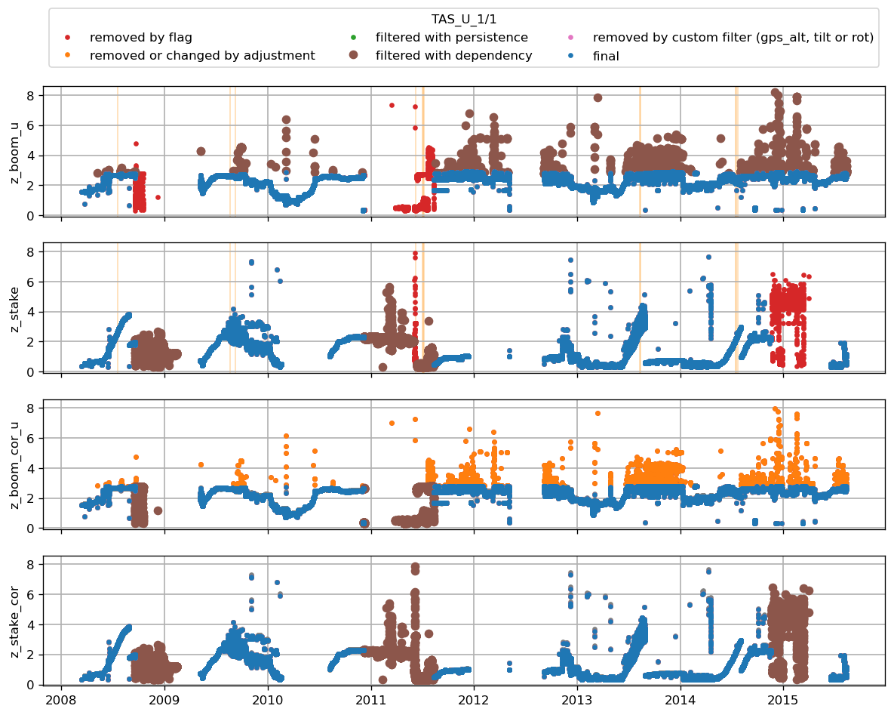
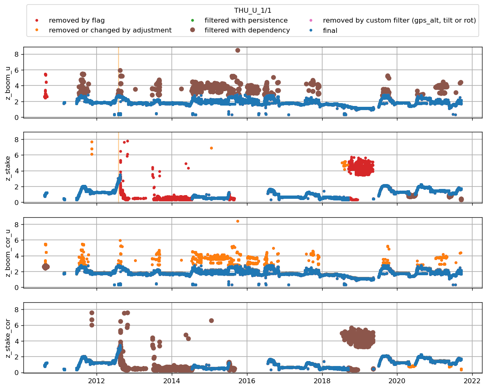

# CEN1
| t0                        | t1                        | variable                                        | what was done   | comment                                  |   URL_graphic |
|:--------------------------|:--------------------------|:------------------------------------------------|:----------------|:-----------------------------------------|--------------:|
| 2021-07-01T00:00:00+00:00 | nan                       | t_i_1 t_i_2 t_i_3 t_i_4 t_i_5 t_i_6 t_i_7 t_i_8 | flag            | thermistors removed after 2021 (bav)     |           nan |
| nan                       | 2017-07-27T00:00:00+00:00 | t_i_1 t_i_2 t_i_3 t_i_4 t_i_5 t_i_6 t_i_7 t_i_8 | flag            | unrealistic values (bav)                 |           nan |
| nan                       | nan                       | z_boom_u                                        | max_filter 2.8  | maximum height of the boom on tripod AWS |           nan |
| 2019-10-24T14:00:00+00:00 | 2020-03-28T14:00:00+00:00 | z_boom_u                                        | min_filter 1.7  | manually adjusted by bav                 |           nan |
| 2019-10-24T14:00:00+00:00 | 2020-03-28T14:00:00+00:00 | z_stake                                         | min_filter 1.81 | manually adjusted by bav                 |           nan |
| 2017-07-01T00:00:00+00:00 | 2017-08-15T00:00:00+00:00 | z_stake                                         | min_filter 2.56 | manually adjusted by bav                 |           nan |
| nan                       | nan                       | z_stake                                         | max_filter 3.0  | manually adjusted by bav                 |           nan |
 

 
# CEN2
| t0                        | t1                        | variable                                                            | what was done   | comment                                                   | URL_graphic                                                                      |
|:--------------------------|:--------------------------|:--------------------------------------------------------------------|:----------------|:----------------------------------------------------------|:---------------------------------------------------------------------------------|
| nan                       | 2022-06-19T00:00:00+00:00 | t_i_1 t_i_2 t_i_3 t_i_4 t_i_5 t_i_6 t_i_7 t_i_8 t_i_9 t_i_10 t_i_11 | flag            | thermistor string not drilled in in 2021 but done in 2022 | nan                                                                              |
| 2023-06-01T00:00:00+00:00 | nan                       | t_i_1 t_i_2 t_i_3 t_i_4 t_i_5 t_i_6 t_i_7 t_i_8 t_i_9 t_i_10 t_i_11 | flag            | give 0degC                                                | https://github.com/GEUS-Glaciology-and-Climate/PROMICE-AWS-data-issues/issues/69 |
| 2022-10-14T18:00:00+00:00 | 2023-01-01T18:00:00+00:00 | z_boom_l                                                            | min_filter 1.8  | manually adjusted by bav                                  | nan                                                                              |
| nan                       | nan                       | z_boom_u                                                            | min_filter 2.0  | manually adjusted by bav                                  | nan                                                                              |
| nan                       | nan                       | z_boom_u                                                            | max_filter 4.3  | manually adjusted by bav                                  | nan                                                                              |
| nan                       | nan                       | z_boom_l                                                            | min_filter 1.5  | manually adjusted by bav                                  | nan                                                                              |
| nan                       | nan                       | z_boom_l                                                            | max_filter 3.0  | manually adjusted by bav                                  | nan                                                                              |
 

 
# CP1
| t0                        | t1                        | variable                                                                                                                                                                                                                                                                                                                                                                                                                                                                                                                                                                                                       | what was done   | comment                                                  | URL_graphic                                                                      |
|:--------------------------|:--------------------------|:---------------------------------------------------------------------------------------------------------------------------------------------------------------------------------------------------------------------------------------------------------------------------------------------------------------------------------------------------------------------------------------------------------------------------------------------------------------------------------------------------------------------------------------------------------------------------------------------------------------|:----------------|:---------------------------------------------------------|:---------------------------------------------------------------------------------|
| 2023-01-02T14:00:00+00:00 | 2023-01-05T00:00:00+00:00 | p_u p_i p_l                                                                                                                                                                                                                                                                                                                                                                                                                                                                                                                                                                                                    | flag            | flagged by bav                                           | https://github.com/GEUS-Glaciology-and-Climate/PROMICE-AWS-data-issues/issues/20 |
| 2023-01-18T00:00:00+00:00 | 2023-01-22T19:00:00+00:00 | p_u                                                                                                                                                                                                                                                                                                                                                                                                                                                                                                                                                                                                            | flag            | flagged by bav                                           | https://github.com/GEUS-Glaciology-and-Climate/PROMICE-AWS-data-issues/issues/20 |
| 2023-01-19T19:00:00+00:00 | 2023-01-22T19:00:00+00:00 | p_l                                                                                                                                                                                                                                                                                                                                                                                                                                                                                                                                                                                                            | flag            | flagged by bav                                           | https://github.com/GEUS-Glaciology-and-Climate/PROMICE-AWS-data-issues/issues/20 |
| 2023-01-20T00:00:00+00:00 | 2023-01-22T19:00:00+00:00 | p_i                                                                                                                                                                                                                                                                                                                                                                                                                                                                                                                                                                                                            | flag            | flagged by bav                                           | https://github.com/GEUS-Glaciology-and-Climate/PROMICE-AWS-data-issues/issues/20 |
| 2022-02-15T00:00:00+00:00 | 2022-06-15T14:00:00+00:00 | rec p_l p_u t_l rh_l wspd_l wdir_l t_u rh_u wspd_u wdir_u dsr usr dlr ulr t_rad z_boom_l z_boom_u t_i_1 t_i_2 t_i_3 t_i_4 t_i_5 t_i_6 t_i_7 t_i_8 t_i_9 t_i_10 t_i_11 tilt_y tilt_x rot precip_l precip_u gps_time gps_lat gps_lon gps_alt gps_geoid gps_geounit gps_q gps_numsat gps_hdop fan_dc_l fan_dc_u batt_v t_log rh_u_cor qh_u rh_l_cor qh_l wspd_x_u wspd_y_u wspd_x_l wspd_y_l dsr_cor usr_cor albedo cc t_surf dlhf_u dlhf_l dshf_u dshf_l precip_u_cor precip_u_rate precip_l_cor precip_l_rate msg_lat msg_lon t_u_interp t_l_interp p_i t_i rh_i wspd_i wdir_i msg_i rh_i_cor wspd_x_i wspd_y_i | flag            | batteries were drained punctual obs are suspicious (bav) | nan                                                                              |
| 2022-12-03T00:00:00+00:00 | 2023-06-20T00:00:00+00:00 | t_i_1 t_i_2 t_i_3 t_i_4 t_i_5 t_i_6 t_i_7 t_i_8 t_i_9 t_i_10 t_i_11                                                                                                                                                                                                                                                                                                                                                                                                                                                                                                                                            | flag            | all thermistors give 0degC during that period            | nan                                                                              |
| 2023-09-14T03:00:00+00:00 | nan                       | t_i_1 t_i_2 t_i_3 t_i_4 t_i_5 t_i_6 t_i_7 t_i_8 t_i_9 t_i_10 t_i_11                                                                                                                                                                                                                                                                                                                                                                                                                                                                                                                                            | flag            | give constant values                                     | https://github.com/GEUS-Glaciology-and-Climate/PROMICE-AWS-data-issues/issues/71 |
| nan                       | 2021-06-17T18:00:00+00:00 | z_boom_u z_boom_l                                                                                                                                                                                                                                                                                                                                                                                                                                                                                                                                                                                              | flag            | unlikely value during installation                       | nan                                                                              |
| nan                       | 2023-04-21T00:00:00+00:00 | z_boom_u                                                                                                                                                                                                                                                                                                                                                                                                                                                                                                                                                                                                       | min_filter 2.3  | manually adjusted by bav                                 | nan                                                                              |
| nan                       | nan                       | z_boom_u                                                                                                                                                                                                                                                                                                                                                                                                                                                                                                                                                                                                       | max_filter 4.3  | manually adjusted by bav                                 | nan                                                                              |
| nan                       | 2023-04-21T00:00:00+00:00 | z_boom_l                                                                                                                                                                                                                                                                                                                                                                                                                                                                                                                                                                                                       | min_filter 1.3  | manually adjusted by bav                                 | nan                                                                              |
| nan                       | nan                       | z_boom_l                                                                                                                                                                                                                                                                                                                                                                                                                                                                                                                                                                                                       | max_filter 3.0  | manually adjusted by bav                                 | nan                                                                              |
 

 
# EGP
| t0                        | t1                        | variable                                        | what was done   | comment                                                                    |   URL_graphic |
|:--------------------------|:--------------------------|:------------------------------------------------|:----------------|:---------------------------------------------------------------------------|--------------:|
| 2016-05-05T00:00:00+00:00 | 2016-05-21T00:00:00+00:00 | t_i_1 t_i_2 t_i_3 t_i_4 t_i_5 t_i_6 t_i_7 t_i_8 | flag            | string only drilled in on 21st May (bav)                                   |           nan |
| 2020-01-01T00:00:00+00:00 | nan                       | z_stake                                         | flag            | manually flagged by bav                                                    |           nan |
| nan                       | 2023-06-21T00:00:00+00:00 | z_boom_u                                        | max_filter 2.8  | maximum height of the boom on tripod AWS (changed for a mast-type in 2023) |           nan |
| 2019-08-04T00:00:00+00:00 | 2019-11-13T00:00:00+00:00 | z_boom_u                                        | max_filter 2.6  | manually adjusted by bav                                                   |           nan |
| 2019-11-13T00:00:00+00:00 | 2020-09-01T00:00:00+00:00 | z_boom_u                                        | max_filter 2.33 | manually adjusted by bav                                                   |           nan |
| 2020-09-01T00:00:00+00:00 | 2021-03-06T00:00:00+00:00 | z_boom_u                                        | max_filter 1.93 | manually adjusted by bav                                                   |           nan |
| 2021-03-06T00:00:00+00:00 | 2021-04-26T00:00:00+00:00 | z_boom_u                                        | max_filter 1.7  | manually adjusted by bav                                                   |           nan |
 

 
# FRE
|   t0 |   t1 | variable   | what was done   | comment                                  |   URL_graphic |
|-----:|-----:|:-----------|:----------------|:-----------------------------------------|--------------:|
|  nan |  nan | z_boom_u   | max_filter 3.3  | maximum height of the boom on tripod AWS |           nan |
 

 
# HUM
| t0                        |   t1 | variable                                                            | what was done   | comment                                        | URL_graphic                                                                      |
|:--------------------------|-----:|:--------------------------------------------------------------------|:----------------|:-----------------------------------------------|:---------------------------------------------------------------------------------|
| 2022-10-15T19:00:00+00:00 |  nan | t_i_1 t_i_2 t_i_3 t_i_4 t_i_5 t_i_6 t_i_7 t_i_8 t_i_9 t_i_10 t_i_11 | flag            | constant ice temperature after that date (bav) | https://github.com/GEUS-Glaciology-and-Climate/PROMICE-AWS-data-issues/issues/73 |
 

 
# JAR
|   t0 |   t1 | variable   | what was done   | comment                                  |   URL_graphic |
|-----:|-----:|:-----------|:----------------|:-----------------------------------------|--------------:|
|  nan |  nan | z_boom_u   | max_filter 2.8  | maximum height of the boom on tripod AWS |           nan |
 

 
# JAR_O
| t0                        | t1                        | variable   | what was done   | comment                                  |   URL_graphic |
|:--------------------------|:--------------------------|:-----------|:----------------|:-----------------------------------------|--------------:|
| 2022-01-01T00:00:00+00:00 | 2023-07-07T00:00:00+00:00 | z_pt_cor   | flag            | very unlikely values (bav)               |           nan |
| nan                       | nan                       | z_boom_u   | max_filter 2.8  | maximum height of the boom on tripod AWS |           nan |
 

 
# KAN_B
|   t0 |   t1 | variable   | what was done   | comment                                  |   URL_graphic |
|-----:|-----:|:-----------|:----------------|:-----------------------------------------|--------------:|
|  nan |  nan | z_boom_u   | max_filter 2.8  | maximum height of the boom on tripod AWS |           nan |
 

 
# KAN_L
| t0                        | t1                        | variable   | what was done   | comment                                           | URL_graphic                                                                      |
|:--------------------------|:--------------------------|:-----------|:----------------|:--------------------------------------------------|:---------------------------------------------------------------------------------|
| 2009-08-27T00:00:00+00:00 | 2010-06-01T00:00:00+00:00 | z_stake    | flag            | manually flagged by bav                           | nan                                                                              |
| 2011-11-01T00:00:00+00:00 | 2012-05-20T00:00:00+00:00 | z_stake    | flag            | manually flagged by bav                           | nan                                                                              |
| 2014-06-25T00:00:00+00:00 | 2014-08-15T00:00:00+00:00 | z_stake    | flag            | manually flagged by bav                           | nan                                                                              |
| 2015-10-20T00:00:00+00:00 | 2016-07-16T17:00:00+00:00 | z_stake    | flag            | manually flagged by bav                           | nan                                                                              |
| 2009-09-17T00:00:00+00:00 | 2009-10-07T00:00:00+00:00 | z_pt_cor   | flag            | manually flagged by bav                           | nan                                                                              |
| 2010-10-02T00:00:00+00:00 | 2010-10-12T00:00:00+00:00 | z_pt_cor   | flag            | manually flagged by bav                           | nan                                                                              |
| 2012-10-06T00:00:00+00:00 | 2012-10-26T00:00:00+00:00 | z_pt_cor   | flag            | manually flagged by bav                           | nan                                                                              |
| 2014-10-08T00:00:00+00:00 | 2014-11-16T00:00:00+00:00 | z_pt_cor   | flag            | manually flagged by bav                           | nan                                                                              |
| 2019-10-07T00:00:00+00:00 | 2019-10-27T00:00:00+00:00 | z_pt_cor   | flag            | manually flagged by bav                           | nan                                                                              |
| 2021-09-18T00:00:00+00:00 | 2022-06-01T00:00:00+00:00 | z_pt_cor   | flag            | manually flagged by bav                           | nan                                                                              |
| 2022-10-01T00:00:00+00:00 | 2022-11-01T00:00:00+00:00 | z_pt_cor   | flag            | manually flagged by bav                           | nan                                                                              |
| 2020-09-01T00:00:00+00:00 | 2022-09-01T00:00:00+00:00 | rh_u       | flag            | manually flagged by bav                           | https://github.com/GEUS-Glaciology-and-Climate/PROMICE-AWS-data-issues/issues/63 |
| nan                       | nan                       | z_boom_u   | max_filter 2.8  | maximum height of the boom on tripod AWS          | nan                                                                              |
| nan                       | nan                       | z_boom_u   | min_filter 2.0  | never seen more than 80 cm of snow at KAN_L (bav) | nan                                                                              |
| 2010-10-07T00:00:00+00:00 | nan                       | z_pt_cor   | add -0.1        | manually adjusted by bav                          | nan                                                                              |
| 2011-06-04T00:00:00+00:00 | nan                       | z_pt_cor   | add -4.0        | manually adjusted by bav                          | nan                                                                              |
| 2012-08-21T00:00:00+00:00 | nan                       | z_pt_cor   | add -11.7       | manually adjusted by bav                          | nan                                                                              |
| 2014-05-13T00:00:00+00:00 | nan                       | z_pt_cor   | add 0.07        | manually adjusted by bav                          | nan                                                                              |
| 2015-04-29T00:00:00+00:00 | nan                       | z_pt_cor   | add -7.08       | manually adjusted by bav                          | nan                                                                              |
| 2015-07-07T00:00:00+00:00 | nan                       | z_pt_cor   | add -0.4        | manually adjusted by bav                          | nan                                                                              |
| 2016-07-16T00:00:00+00:00 | nan                       | z_pt_cor   | add -1.6        | manually adjusted by bav                          | nan                                                                              |
| 2017-09-01T00:00:00+00:00 | nan                       | z_pt_cor   | add -3.5        | manually adjusted by bav                          | nan                                                                              |
| 2018-08-29T00:00:00+00:00 | nan                       | z_pt_cor   | add -11.3       | manually adjusted by bav                          | nan                                                                              |
| 2021-08-17T00:00:00+00:00 | nan                       | z_pt_cor   | add -13.0       | manually adjusted by bav                          | nan                                                                              |
| 2022-05-15T13:00:00+00:00 | nan                       | z_pt_cor   | add 2.9         | manually adjusted by bav                          | nan                                                                              |
 

 
# KAN_Lv3
|   t0 |   t1 | variable   | what was done   | comment                                  |   URL_graphic |
|-----:|-----:|:-----------|:----------------|:-----------------------------------------|--------------:|
|  nan |  nan | z_boom_u   | max_filter 2.8  | maximum height of the boom on tripod AWS |           nan |
 

 
# KAN_M
| t0                        | t1                        | variable                                        | what was done    | comment                                                                                   | URL_graphic                                                                       |
|:--------------------------|:--------------------------|:------------------------------------------------|:-----------------|:------------------------------------------------------------------------------------------|:----------------------------------------------------------------------------------|
| 2010-08-18T00:00:00+00:00 | 2011-04-21T00:00:00+00:00 | z_stake                                         | flag             | manually flagged by bav                                                                   | nan                                                                               |
| 2013-10-28T21:00:00+00:00 | 2013-10-01T00:00:00+00:00 | z_stake                                         | flag             | Manually flagged by bav                                                                   | nan                                                                               |
| 2011-11-13T21:00:00+00:00 | 2012-05-03T22:00:00+00:00 | z_stake                                         | flag             | Manually flagged by bav                                                                   | nan                                                                               |
| 2014-09-14T00:00:00+00:00 | 2015-06-19T00:00:00+00:00 | z_stake                                         | flag             | manually flagged by bav                                                                   | nan                                                                               |
| 2017-02-10T00:00:00+00:00 | 2017-02-16T00:00:00+00:00 | z_stake                                         | flag             | Manually flagged by bav                                                                   | nan                                                                               |
| 2016-07-16T00:00:00+00:00 | 2018-06-01T00:00:00+00:00 | z_stake                                         | flag             | manually flagged by bav                                                                   | nan                                                                               |
| 2014-12-06T20:00:00+00:00 | 2014-12-23T00:00:00+00:00 | z_boom_u                                        | flag             | Manually flagged by bav                                                                   | nan                                                                               |
| 2018-06-05T00:00:00+00:00 | 2018-06-09T20:00:00+00:00 | z_boom_u                                        | flag             | Only fragmented observations available while SR50 on stake shows clear accumulation (bav) | nan                                                                               |
| 2014-09-17T00:00:00+00:00 | 2015-07-19T00:00:00+00:00 | z_pt_cor                                        | flag             | showing height decrease at strange month or height increase (bav)                         | nan                                                                               |
| nan                       | 2010-05-21T00:00:00+00:00 | t_i_1 t_i_2 t_i_3 t_i_4 t_i_5 t_i_6 t_i_7 t_i_8 | flag             | no thermistor installed until 2010 (bav)                                                  | nan                                                                               |
| 2018-08-29T00:00:00+00:00 | 2022-08-21T00:00:00+00:00 | t_i_1 t_i_2 t_i_3 t_i_4 t_i_5 t_i_6 t_i_7 t_i_8 | flag             | manually flagged by bav                                                                   | nan                                                                               |
| nan                       | nan                       | z_boom_u                                        | max_filter 2.8   | maximum height of the boom on tripod AWS                                                  | nan                                                                               |
| nan                       | nan                       | z_boom_u                                        | min_filter 1.0   | never seen more than 1.80 cm of snow at KAN_L (bav)                                       | nan                                                                               |
| 2012-01-01T00:00:00+00:00 | 2016-01-01T00:00:00+00:00 | rh_u                                            | min_filter 40.0  | nan                                                                                       | https://github.com/GEUS-Glaciology-and-Climate/PROMICE-AWS-data-issues/issues/133 |
| nan                       | nan                       | t_i_1 t_i_2 t_i_3 t_i_4 t_i_5 t_i_6 t_i_7 t_i_8 | min_filter -25.0 | nan                                                                                       | nan                                                                               |
 

 
# KAN_U
| t0                        | t1                        | variable                | what was done   | comment                                                               | URL_graphic                                                                      |
|:--------------------------|:--------------------------|:------------------------|:----------------|:----------------------------------------------------------------------|:---------------------------------------------------------------------------------|
| 2021-12-20T00:00:00+00:00 | 2023-06-09T04:00:00+00:00 | gps_lon gps_lat gps_alt | flag            | manually flagged by bav                                               | https://github.com/GEUS-Glaciology-and-Climate/PROMICE-AWS-data-issues/issues/50 |
| 2011-05-26T00:00:00+00:00 | 2012-05-03T00:00:00+00:00 | gps_lon gps_lat gps_alt | flag            | manually flagged by bav                                               | https://github.com/GEUS-Glaciology-and-Climate/PROMICE-AWS-data-issues/issues/50 |
| 2015-10-27T00:00:00+00:00 | 2016-04-09T00:00:00+00:00 | gps_lon gps_lat gps_alt | flag            | manually flagged by bav                                               | https://github.com/GEUS-Glaciology-and-Climate/PROMICE-AWS-data-issues/issues/50 |
| nan                       | 2023-06-08T12:00:00+00:00 | z_boom_u                | max_filter 2.8  | maximum height of the boom on tripod AWS (changed for a mast in 2023) | nan                                                                              |
 

 
# KPC_L
| t0                        | t1                        | variable   | what was done   | comment                                  |   URL_graphic |
|:--------------------------|:--------------------------|:-----------|:----------------|:-----------------------------------------|--------------:|
| 2012-07-19T00:00:00+00:00 | 2012-07-30T00:00:00+00:00 | z_boom_u   | flag            | manually flagged by bav                  |           nan |
| 2012-07-19T00:00:00+00:00 | 2012-07-19T16:00:00+00:00 | z_pt_cor   | flag            | manually flagged by bav                  |           nan |
| 2019-08-25T12:00:00+00:00 | 2019-08-27T00:00:00+00:00 | z_pt_cor   | flag            | manually flagged by bav                  |           nan |
| 2019-09-07T00:00:00+00:00 | 2019-09-11T00:00:00+00:00 | z_pt_cor   | flag            | manually flagged by bav                  |           nan |
| 2019-09-15T00:00:00+00:00 | 2020-01-01T00:00:00+00:00 | z_pt_cor   | flag            | manually flagged by bav                  |           nan |
| 2020-04-01T00:00:00+00:00 | 2020-06-01T00:00:00+00:00 | z_pt_cor   | flag            | manually flagged by bav                  |           nan |
| 2021-04-01T00:00:00+00:00 | 2021-06-04T00:00:00+00:00 | z_pt_cor   | flag            | manually flagged by bav                  |           nan |
| 2022-04-01T00:00:00+00:00 | 2022-06-04T00:00:00+00:00 | z_pt_cor   | flag            | manually flagged by bav                  |           nan |
| 2009-08-20T00:00:00+00:00 | 2010-01-31T00:00:00+00:00 | z_stake    | flag            | manually flagged by bav                  |           nan |
| 2013-08-27T00:00:00+00:00 | 2016-06-28T00:00:00+00:00 | z_stake    | flag            | manually flagged by bav                  |           nan |
| 2014-07-20T00:00:00+00:00 | 2015-02-28T00:00:00+00:00 | z_stake    | flag            | manually flagged by bav                  |           nan |
| 2020-04-02T15:00:00+00:00 | nan                       | z_stake    | flag            | manually flagged by bav                  |           nan |
| nan                       | nan                       | z_boom_u   | max_filter 2.8  | maximum height of the boom on tripod AWS |           nan |
| 2012-01-01T00:00:00+00:00 | nan                       | z_pt_cor   | add -6.0        | manually adjusted by bav                 |           nan |
| 2016-07-27T00:00:00+00:00 | nan                       | z_pt_cor   | add -6.297      | manually adjusted by bav                 |           nan |
| 2016-07-29T00:00:00+00:00 | nan                       | z_pt_cor   | add -0.1        | manually adjusted by bav                 |           nan |
| 2019-07-12T13:00:00+00:00 | nan                       | z_pt_cor   | add -4.478      | manually adjusted by bav                 |           nan |
 

 
# KPC_Lv3
|   t0 |   t1 | variable   | what was done   | comment                                  |   URL_graphic |
|-----:|-----:|:-----------|:----------------|:-----------------------------------------|--------------:|
|  nan |  nan | z_boom_u   | max_filter 2.8  | maximum height of the boom on tripod AWS |           nan |
 

 
# KPC_U
| t0                        |   t1 | variable                                        | what was done    | comment                                  |   URL_graphic |
|:--------------------------|-----:|:------------------------------------------------|:-----------------|:-----------------------------------------|--------------:|
| 2006-07-10T00:00:00+00:00 |  nan | z_pt_cor                                        | flag             | manually flagged by bav                  |           nan |
| 2019-06-28T00:00:00+00:00 |  nan | t_i_1 t_i_2 t_i_3 t_i_4 t_i_5 t_i_6 t_i_7 t_i_8 | flag             | manually flagged by bav                  |           nan |
| nan                       |  nan | z_boom_u                                        | max_filter 2.8   | maximum height of the boom on tripod AWS |           nan |
| nan                       |  nan | t_i_1 t_i_2 t_i_3 t_i_4 t_i_5 t_i_6 t_i_7 t_i_8 | min_filter -30.0 | nan                                      |           nan |
 

 
# KPC_Uv3
| t0                        | t1                        | variable                                                                                                                                                                                                                                                                                                                                                                                                                                  | what was done                  | comment                  | URL_graphic                                                                      |
|:--------------------------|:--------------------------|:------------------------------------------------------------------------------------------------------------------------------------------------------------------------------------------------------------------------------------------------------------------------------------------------------------------------------------------------------------------------------------------------------------------------------------------|:-------------------------------|:-------------------------|:---------------------------------------------------------------------------------|
| 2021-07-10T00:00:00+00:00 | 2023-06-10T00:00:00+00:00 | z_pt_cor                                                                                                                                                                                                                                                                                                                                                                                                                                  | flag                           | manually flagged by bav  | nan                                                                              |
| 2056-01-01T00:00:00+00:00 | nan                       | rec p_u t_u rh_u wspd_u wdir_u dsr usr dlr ulr t_rad z_pt t_i_1 t_i_2 t_i_3 t_i_4 t_i_5 t_i_6 t_i_7 t_i_8 tilt_x tilt_y rot rh_u_cor qh_u wspd_x_u wspd_y_u dsr_cor usr_cor albedo cc t_surf dlhf_u dshf_u z_pt_cor z_boom_u z_stake precip_u gps_time gps_lat gps_lon gps_alt gps_hdop fan_dc_u batt_v p_i t_i rh_i wspd_i wdir_i msg_i msg_lat msg_lon precip_u_cor precip_u_rate gps_geoid t_log rh_i_cor wspd_x_i wspd_y_i t_u_interp | time_shift -12361.479166666666 | manually adjusted by bav | https://github.com/GEUS-Glaciology-and-Climate/PROMICE-AWS-data-issues/issues/22 |
 

 
# LYN_L
|   t0 |   t1 | variable   | what was done   | comment                                  |   URL_graphic |
|-----:|-----:|:-----------|:----------------|:-----------------------------------------|--------------:|
|  nan |  nan | z_boom_u   | max_filter 2.8  | maximum height of the boom on tripod AWS |           nan |
 

 
# LYN_T
| t0                        | t1                        | variable                                                                       | what was done   | comment                                  | URL_graphic                                                                      |
|:--------------------------|:--------------------------|:-------------------------------------------------------------------------------|:----------------|:-----------------------------------------|:---------------------------------------------------------------------------------|
| 2023-05-27T00:00:00+00:00 | 2023-07-12T00:00:00+00:00 | rh_u t_u wspd_u wdir_u p_u rh_i t_i wspd_i wdir_i p_i dsr usr dlr ulr z_boom_u | flag            | station fallen (bav)                     | https://github.com/GEUS-Glaciology-and-Climate/PROMICE-AWS-data-issues/issues/49 |
| nan                       | nan                       | z_boom_u                                                                       | max_filter 2.8  | maximum height of the boom on tripod AWS | nan                                                                              |
 

 
# MIT
| t0                        | t1                        | variable                                                                       | what was done    | comment                                  | URL_graphic                                                                      |
|:--------------------------|:--------------------------|:-------------------------------------------------------------------------------|:-----------------|:-----------------------------------------|:---------------------------------------------------------------------------------|
| 2013-03-07T00:00:00+00:00 | 2013-06-21T00:00:00+00:00 | rh_u t_u wspd_u wdir_u p_u rh_i t_i wspd_i wdir_i p_i dsr usr dlr ulr z_boom_u | flag             | Manually flagged by bav                  | nan                                                                              |
| 2015-01-25T11:00:00+00:00 | 2015-07-21T00:00:00+00:00 | rh_u t_u wspd_u wdir_u p_u rh_i t_i wspd_i wdir_i p_i dsr usr dlr ulr z_boom_u | flag             | Manually flagged by bav                  | nan                                                                              |
| 2019-04-01T00:00:00+00:00 | 2019-07-31T00:00:00+00:00 | dlr                                                                            | flag             | Manually flagged by bav                  | nan                                                                              |
| 2008-06-01T00:00:00+00:00 | 2010-01-01T00:00:00+00:00 | z_boom_u                                                                       | flag             | Manually flagged by bav                  | nan                                                                              |
| 2010-12-14T00:00:00+00:00 | 2011-08-12T00:00:00+00:00 | z_stake                                                                        | flag             | Manually flagged by bav                  | nan                                                                              |
| 2012-02-03T00:00:00+00:00 | 2012-06-03T00:00:00+00:00 | z_stake                                                                        | flag             | Manually flagged by bav                  | nan                                                                              |
| 2013-01-01T00:00:00+00:00 | 2013-09-09T00:00:00+00:00 | z_stake                                                                        | flag             | Manually flagged by bav                  | nan                                                                              |
| 2014-09-20T00:00:00+00:00 | 2015-08-14T00:00:00+00:00 | z_stake                                                                        | flag             | Manually flagged by bav                  | nan                                                                              |
| 2015-09-15T00:00:00+00:00 | 2015-12-14T00:00:00+00:00 | z_stake                                                                        | flag             | Manually flagged by bav                  | nan                                                                              |
| 2016-06-15T00:00:00+00:00 | 2016-07-14T00:00:00+00:00 | z_stake                                                                        | flag             | Manually flagged by bav                  | nan                                                                              |
| 2008-06-01T00:00:00+00:00 | 2009-08-12T00:00:00+00:00 | z_pt_cor                                                                       | flag             | manually flagged by bav                  | nan                                                                              |
| 2015-12-31T00:00:00+00:00 | 2016-05-29T00:00:00+00:00 | z_pt_cor                                                                       | flag             | manually flagged by bav                  | nan                                                                              |
| 2016-01-02T00:00:00+00:00 | 2017-07-01T00:00:00+00:00 | z_pt_cor                                                                       | flag             | manually flagged by bav                  | nan                                                                              |
| 2017-10-01T00:00:00+00:00 | 2018-07-01T00:00:00+00:00 | z_pt_cor                                                                       | flag             | manually flagged by bav                  | nan                                                                              |
| 2018-10-01T00:00:00+00:00 | 2018-11-01T00:00:00+00:00 | z_pt_cor                                                                       | flag             | manually flagged by bav                  | nan                                                                              |
| 2019-01-02T00:00:00+00:00 | 2019-07-01T00:00:00+00:00 | z_pt_cor                                                                       | flag             | manually flagged by bav                  | nan                                                                              |
| 2019-09-10T00:00:00+00:00 | 2020-05-01T00:00:00+00:00 | z_pt_cor                                                                       | flag             | manually flagged by bav                  | nan                                                                              |
| 2020-09-10T00:00:00+00:00 | 2021-05-01T00:00:00+00:00 | z_pt_cor                                                                       | flag             | manually flagged by bav                  | nan                                                                              |
| 2021-09-01T00:00:00+00:00 | nan                       | wspd_i wspd_u                                                                  | flag             | manually flagged by bav                  | https://github.com/GEUS-Glaciology-and-Climate/PROMICE-AWS-data-issues/issues/54 |
| 2023-08-01T00:00:00+00:00 | nan                       | t_i rh_i                                                                       | flag             | manually flagged by bav                  | https://github.com/GEUS-Glaciology-and-Climate/PROMICE-AWS-data-issues/issues/54 |
| nan                       | nan                       | z_boom_u                                                                       | max_filter 2.8   | maximum height of the boom on tripod AWS | nan                                                                              |
| 2009-08-12T00:00:00+00:00 | nan                       | z_pt_cor                                                                       | add -12.0        | manually adjusted by bav                 | nan                                                                              |
| 2010-09-01T00:00:00+00:00 | nan                       | z_pt_cor                                                                       | add 2.0          | manually adjusted by bav                 | nan                                                                              |
| 2011-08-11T00:00:00+00:00 | nan                       | z_pt_cor                                                                       | add -0.08        | manually adjusted by bav                 | nan                                                                              |
| 2012-09-06T00:00:00+00:00 | nan                       | z_pt_cor                                                                       | add -13.7        | manually adjusted by bav                 | nan                                                                              |
| 2018-07-01T00:00:00+00:00 | nan                       | z_pt_cor                                                                       | add -2.0         | manually adjusted by bav                 | nan                                                                              |
| 2019-01-12T00:00:00+00:00 | nan                       | z_pt_cor                                                                       | add -2.0         | manually adjusted by bav                 | nan                                                                              |
| nan                       | nan                       | t_i_1 t_i_2 t_i_3 t_i_4 t_i_5 t_i_6 t_i_7 t_i_8                                | min_filter -20.0 | nan                                      | nan                                                                              |
 

 
# NAE
| t0                        |   t1 | variable                                                            | what was done   | comment                                        | URL_graphic                                                                      |
|:--------------------------|-----:|:--------------------------------------------------------------------|:----------------|:-----------------------------------------------|:---------------------------------------------------------------------------------|
| 2023-06-01T00:00:00+00:00 |  nan | t_i_1 t_i_2 t_i_3 t_i_4 t_i_5 t_i_6 t_i_7 t_i_8 t_i_9 t_i_10 t_i_11 | flag            | constant ice temperature after that date (bav) | https://github.com/GEUS-Glaciology-and-Climate/PROMICE-AWS-data-issues/issues/85 |
 

 
# NAU
| t0                        | t1                        | variable                                                            | what was done   | comment                                        | URL_graphic                                                                      |
|:--------------------------|:--------------------------|:--------------------------------------------------------------------|:----------------|:-----------------------------------------------|:---------------------------------------------------------------------------------|
| 2022-12-23T00:00:00+00:00 | 2022-12-28T00:00:00+00:00 | p_u p_i p_l                                                         | flag            | flagged by bav                                 | https://github.com/GEUS-Glaciology-and-Climate/PROMICE-AWS-data-issues/issues/21 |
| 2022-12-30T20:00:00+00:00 | 2023-04-04T00:00:00+00:00 | p_u p_i p_l                                                         | flag            | flagged by bav                                 | https://github.com/GEUS-Glaciology-and-Climate/PROMICE-AWS-data-issues/issues/21 |
| 2021-12-08T00:00:00+00:00 | 2021-12-21T00:00:00+00:00 | t_i_11                                                              | flag            | flagged by bav                                 | nan                                                                              |
| 2023-10-04T00:00:00+00:00 | nan                       | t_i_1 t_i_2 t_i_3 t_i_4 t_i_5 t_i_6 t_i_7 t_i_8 t_i_9 t_i_10 t_i_11 | flag            | constant ice temperature after that date (bav) | https://github.com/GEUS-Glaciology-and-Climate/PROMICE-AWS-data-issues/issues/86 |
| nan                       | 2023-04-01T00:00:00+00:00 | z_boom_u                                                            | min_filter 2.3  | manually adjusted by bav                       | nan                                                                              |
| nan                       | 2023-04-01T00:00:00+00:00 | z_boom_u                                                            | max_filter 4.3  | manually adjusted by bav                       | nan                                                                              |
| nan                       | 2023-04-01T00:00:00+00:00 | z_boom_l                                                            | min_filter 1.0  | manually adjusted by bav                       | nan                                                                              |
| nan                       | 2023-04-01T00:00:00+00:00 | z_boom_l                                                            | max_filter 3.0  | manually adjusted by bav                       | nan                                                                              |
 

 
# NEM
| t0                        | t1                        | variable                                                            | what was done   | comment                                        | URL_graphic                                                                      |
|:--------------------------|:--------------------------|:--------------------------------------------------------------------|:----------------|:-----------------------------------------------|:---------------------------------------------------------------------------------|
| 2022-10-31T06:00:00+00:00 | 2022-11-26T03:00:00+00:00 | wspd_u wspd_l wspd_i                                                | flag            | flagged by bav                                 | https://github.com/GEUS-Glaciology-and-Climate/PROMICE-AWS-data-issues/issues/51 |
| 2023-04-29T06:00:00+00:00 | nan                       | wdir_l wdir_i                                                       | flag            | flagged by bav                                 | https://github.com/GEUS-Glaciology-and-Climate/PROMICE-AWS-data-issues/issues/51 |
| 2023-07-01T14:00:00+00:00 | nan                       | t_i_1 t_i_2 t_i_3 t_i_4 t_i_5 t_i_6 t_i_7 t_i_8 t_i_9 t_i_10 t_i_11 | flag            | constant ice temperature after that date (bav) | https://github.com/GEUS-Glaciology-and-Climate/PROMICE-AWS-data-issues/issues/88 |
| 2023-06-01T11:00:00+00:00 | 2023-06-28T05:00:00+00:00 | t_i_6                                                               | flag            | suspicious values (bav)                        | https://github.com/GEUS-Glaciology-and-Climate/PROMICE-AWS-data-issues/issues/88 |
| nan                       | 2023-11-01T00:00:00+00:00 | z_boom_u                                                            | min_filter 3    | manually adjusted by bav                       | nan                                                                              |
| nan                       | 2023-11-01T00:00:00+00:00 | z_boom_u                                                            | max_filter 4    | manually adjusted by bav                       | nan                                                                              |
 

 
# NSE
| t0                        | t1                        | variable   | what was done   | comment        | URL_graphic                                                                      |
|:--------------------------|:--------------------------|:-----------|:----------------|:---------------|:---------------------------------------------------------------------------------|
| 2022-03-26T06:00:00+00:00 | 2022-10-20T03:00:00+00:00 | p_u        | flag            | flagged by bav | https://github.com/GEUS-Glaciology-and-Climate/PROMICE-AWS-data-issues/issues/24 |
| 2023-01-03T06:00:00+00:00 | 2023-01-13T22:00:00+00:00 | p_u        | flag            | flagged by bav | https://github.com/GEUS-Glaciology-and-Climate/PROMICE-AWS-data-issues/issues/24 |
| 2023-01-18T01:00:00+00:00 | 2023-01-22T13:00:00+00:00 | p_u        | flag            | flagged by bav | https://github.com/GEUS-Glaciology-and-Climate/PROMICE-AWS-data-issues/issues/24 |
| 2022-03-26T06:00:00+00:00 | 2022-10-20T03:00:00+00:00 | rh_u       | flag            | flagged by bav | https://github.com/GEUS-Glaciology-and-Climate/PROMICE-AWS-data-issues/issues/24 |
 

 
# NUK_B
|   t0 |   t1 | variable   | what was done   | comment                                  |   URL_graphic |
|-----:|-----:|:-----------|:----------------|:-----------------------------------------|--------------:|
|  nan |  nan | z_boom_u   | max_filter 2.8  | maximum height of the boom on tripod AWS |           nan |
 

 
# NUK_K
| t0                        | t1                        | variable                                        | what was done    | comment                                  | URL_graphic                                                                      |
|:--------------------------|:--------------------------|:------------------------------------------------|:-----------------|:-----------------------------------------|:---------------------------------------------------------------------------------|
| 2015-04-01T00:00:00+00:00 | 2015-06-20T00:00:00+00:00 | dsr usr dlr ulr                                 | flag             | Manually flagged by bav                  | nan                                                                              |
| 2015-10-17T00:00:00+00:00 | 2016-01-16T00:00:00+00:00 | wspd_u wdir_u                                   | flag             | Manually flagged by bav                  | https://github.com/GEUS-Glaciology-and-Climate/PROMICE-AWS-data-issues/issues/19 |
| 2017-04-01T16:00:00+00:00 | 2017-05-10T00:00:00+00:00 | dsr usr dlr ulr                                 | flag             | Manually flagged by bav                  | nan                                                                              |
| 2020-09-01T00:00:00+00:00 | 2021-07-01T00:00:00+00:00 | z_pt_cor                                        | flag             | manually flagged by bav                  | nan                                                                              |
| nan                       | nan                       | z_boom_u                                        | max_filter 2.8   | maximum height of the boom on tripod AWS | nan                                                                              |
| 2014-08-12T00:00:00+00:00 | nan                       | z_pt_cor                                        | add 1.25         | manually adjusted by bav                 | nan                                                                              |
| 2014-08-28T00:00:00+00:00 | nan                       | z_pt_cor                                        | add -1.25        | manually adjusted by bav                 | nan                                                                              |
| 2018-06-26T00:00:00+00:00 | nan                       | z_pt_cor                                        | add 0.07         | manually adjusted by bav                 | nan                                                                              |
| 2019-08-17T00:00:00+00:00 | nan                       | z_pt_cor                                        | add 1.0          | manually adjusted by bav                 | nan                                                                              |
| 2019-09-12T00:00:00+00:00 | nan                       | z_pt_cor                                        | add -1.0         | manually adjusted by bav                 | nan                                                                              |
| nan                       | nan                       | t_i_1 t_i_2 t_i_3 t_i_4 t_i_5 t_i_6 t_i_7 t_i_8 | min_filter -20.0 | nan                                      | nan                                                                              |
 

 
# NUK_L
| t0                        | t1                        | variable                                                                       | what was done   | comment                                                                          | URL_graphic                                                                      |
|:--------------------------|:--------------------------|:-------------------------------------------------------------------------------|:----------------|:---------------------------------------------------------------------------------|:---------------------------------------------------------------------------------|
| 2010-07-25T00:00:00+00:00 | 2011-08-25T17:00:00+00:00 | rh_u t_u wspd_u wdir_u p_u rh_i t_i wspd_i wdir_i p_i dsr usr dlr ulr z_boom_u | flag            | station fallen (bav confirmed with field notes)                                  | https://github.com/GEUS-Glaciology-and-Climate/PROMICE-AWS-data-issues/issues/43 |
| 2013-01-23T10:00:00+00:00 | 2013-07-23T19:00:00+00:00 | rh_u t_u wspd_u wdir_u p_u rh_i t_i wspd_i wdir_i p_i dsr usr dlr ulr z_boom_u | flag            | station fallen (bav confirmed with field notes)                                  | https://github.com/GEUS-Glaciology-and-Climate/PROMICE-AWS-data-issues/issues/43 |
| 2021-09-01T00:00:00+00:00 | 2023-09-18T16:00:00+00:00 | rh_u rh_i                                                                      | flag            | https://github.com/GEUS-Glaciology-and-Climate/PROMICE-AWS-data-issues/issues/53 | nan                                                                              |
| 2010-09-22T00:00:00+00:00 | 2010-10-18T00:00:00+00:00 | z_pt_cor                                                                       | flag            | manually flagged by bav                                                          | nan                                                                              |
| 2018-02-10T00:00:00+00:00 | 2018-07-16T00:00:00+00:00 | z_pt_cor                                                                       | flag            | manually flagged by bav                                                          | nan                                                                              |
| nan                       | 2011-08-27T00:00:00+00:00 | z_boom_u                                                                       | flag            | manually flagged by bav                                                          | nan                                                                              |
| 2013-01-24T00:00:00+00:00 | 2014-07-31T00:00:00+00:00 | z_boom_u                                                                       | flag            | manually flagged by bav                                                          | nan                                                                              |
| 2018-07-16T00:00:00+00:00 | 2019-12-31T00:00:00+00:00 | z_boom_u                                                                       | flag            | manually flagged by bav                                                          | nan                                                                              |
| 2010-07-24T00:00:00+00:00 | 2011-08-30T00:00:00+00:00 | z_boom_u                                                                       | flag            | manually flagged by bav                                                          | nan                                                                              |
| 2008-06-16T00:00:00+00:00 | 2008-07-31T00:00:00+00:00 | z_stake                                                                        | flag            | manually flagged by bav                                                          | nan                                                                              |
| 2010-07-19T00:00:00+00:00 | 2012-08-21T00:00:00+00:00 | z_stake                                                                        | flag            | manually flagged by bav                                                          | nan                                                                              |
| 2013-11-03T00:00:00+00:00 | 2014-07-25T00:00:00+00:00 | z_stake                                                                        | flag            | manually flagged by bav                                                          | nan                                                                              |
| 2015-06-15T00:00:00+00:00 | 2015-07-23T00:00:00+00:00 | z_stake                                                                        | flag            | manually flagged by bav                                                          | nan                                                                              |
| 2016-08-01T00:00:00+00:00 | 2017-04-26T00:00:00+00:00 | z_stake                                                                        | flag            | noisy and SR50 on station has better quality (bav)                               | nan                                                                              |
| 2017-11-24T00:00:00+00:00 | 2018-05-16T00:00:00+00:00 | z_stake                                                                        | flag            | manually flagged by bav                                                          | nan                                                                              |
| 2019-07-01T00:00:00+00:00 | 2019-09-18T00:00:00+00:00 | z_stake                                                                        | flag            | manually flagged by bav                                                          | nan                                                                              |
| 2018-01-26T02:00:00+00:00 | 2018-01-28T21:00:00+00:00 | ulr                                                                            | flag            | manually flagged by bav                                                          | nan                                                                              |
| 2018-02-01T08:00:00+00:00 | 2018-02-02T20:00:00+00:00 | ulr                                                                            | flag            | manually flagged by bav                                                          | nan                                                                              |
| 2018-02-03T14:00:00+00:00 | 2018-02-06T00:00:00+00:00 | ulr                                                                            | flag            | manually flagged by bav                                                          | nan                                                                              |
| nan                       | nan                       | z_boom_u                                                                       | max_filter 2.8  | maximum height of the boom on tripod AWS                                         | nan                                                                              |
| 2008-07-30T00:00:00+00:00 | nan                       | z_pt_cor                                                                       | add -7.1        | manually adjusted by bav                                                         | NUK_L_dpt_1.png                                                                  |
| 2008-07-29T00:00:00+00:00 | nan                       | z_pt_cor                                                                       | add -5.0        | manually adjusted by bav                                                         | NUK_L_dpt_1.png                                                                  |
| 2009-08-24T00:00:00+00:00 | nan                       | z_pt_cor                                                                       | add -0.5        | manually adjusted by bav                                                         | NUK_L_dpt_1.png                                                                  |
| 2010-07-25T00:00:00+00:00 | nan                       | z_pt_cor                                                                       | add -11.1       | manually adjusted by bav                                                         | NUK_L_dpt_1.png                                                                  |
| 2010-11-21T12:00:00+00:00 | nan                       | z_pt_cor                                                                       | add 2.6         | manually adjusted by bav                                                         | NUK_L_dpt_1.png                                                                  |
| 2011-07-28T00:00:00+00:00 | nan                       | z_pt_cor                                                                       | add -1.15       | manually adjusted by bav                                                         | NUK_L_dpt_1.png                                                                  |
| 2011-08-26T00:00:00+00:00 | nan                       | z_pt_cor                                                                       | add -1.2        | manually adjusted by bav                                                         | NUK_L_dpt_1.png                                                                  |
| 2011-08-29T00:00:00+00:00 | nan                       | z_pt_cor                                                                       | add 1.0         | manually adjusted by bav                                                         | NUK_L_dpt_1.png                                                                  |
| 2012-08-28T00:00:00+00:00 | nan                       | z_pt_cor                                                                       | add -12.0       | manually adjusted by bav                                                         | NUK_L_dpt_1.png                                                                  |
| 2013-01-24T00:00:00+00:00 | nan                       | z_pt_cor                                                                       | add 2.6         | manually adjusted by bav                                                         | NUK_L_dpt_1.png                                                                  |
| 2013-07-23T00:00:00+00:00 | nan                       | z_pt_cor                                                                       | add -5.25       | manually adjusted by bav                                                         | NUK_L_dpt_1.png                                                                  |
| 2014-07-25T00:00:00+00:00 | nan                       | z_pt_cor                                                                       | add -2.5        | manually adjusted by bav                                                         | NUK_L_dpt_1.png                                                                  |
| 2014-07-26T00:00:00+00:00 | nan                       | z_pt_cor                                                                       | add -3.35       | manually adjusted by bav                                                         | NUK_L_dpt_1.png                                                                  |
| 2017-04-27T00:00:00+00:00 | nan                       | z_pt_cor                                                                       | add -14.92      | manually adjusted by bav                                                         | NUK_L_dpt_1.png                                                                  |
| 2017-05-22T00:00:00+00:00 | nan                       | z_pt_cor                                                                       | add -0.5        | manually adjusted by bav                                                         | NUK_L_dpt_1.png                                                                  |
| 2018-07-30T11:00:00+00:00 | nan                       | z_pt_cor                                                                       | add -7.0        | manually adjusted by bav                                                         | NUK_L_dpt_1.png                                                                  |
| 2021-06-18T11:00:00+00:00 | nan                       | z_pt_cor                                                                       | add -14.0       | manually adjusted by bav                                                         | NUK_L_dpt_1.png                                                                  |
 

 
# NUK_N
| t0                        | t1                        | variable                                        | what was done    | comment                                  |   URL_graphic |
|:--------------------------|:--------------------------|:------------------------------------------------|:-----------------|:-----------------------------------------|--------------:|
| nan                       | 2011-08-01T00:00:00+00:00 | z_stake                                         | flag             | manually flagged by bav                  |           nan |
| nan                       | 2011-04-01T00:00:00+00:00 | z_pt_cor                                        | flag             | manually flagged by bav                  |           nan |
| 2011-10-01T00:00:00+00:00 | 2011-12-01T00:00:00+00:00 | z_pt_cor                                        | flag             | manually flagged by bav                  |           nan |
| 2012-08-29T00:00:00+00:00 | 2013-07-21T15:00:00+00:00 | z_pt_cor                                        | flag             | manually flagged by bav                  |           nan |
| 2011-06-18T00:00:00+00:00 | 2012-08-31T00:00:00+00:00 | t_i_1 t_i_2 t_i_3 t_i_4 t_i_5 t_i_6 t_i_7 t_i_8 | flag             | manually flagged by bav                  |           nan |
| nan                       | nan                       | z_boom_u                                        | max_filter 2.8   | maximum height of the boom on tripod AWS |           nan |
| 2013-01-01T00:00:00+00:00 | nan                       | z_pt_cor                                        | add -8.5         | manually adjusted by bav                 |           nan |
| 2013-10-11T12:00:00+00:00 | nan                       | z_pt_cor                                        | add 1.0          | manually adjusted by bav                 |           nan |
| nan                       | nan                       | t_i_1 t_i_2 t_i_3 t_i_4 t_i_5 t_i_6 t_i_7 t_i_8 | min_filter -30.0 | nan                                      |           nan |
 

 
# NUK_U
| t0                        | t1                        | variable                                        | what was done    | comment                                                                  |   URL_graphic |
|:--------------------------|:--------------------------|:------------------------------------------------|:-----------------|:-------------------------------------------------------------------------|--------------:|
| 2010-06-22T00:00:00+00:00 | 2010-07-31T00:00:00+00:00 | z_pt_cor                                        | flag             | PT increasing height while sonice ranger indicate pursued ablation (bav) |           nan |
| 2011-10-02T00:00:00+00:00 | 2011-10-27T00:00:00+00:00 | z_pt_cor                                        | flag             | manually flagged by bav                                                  |           nan |
| 2014-02-09T00:00:00+00:00 | 2014-04-10T00:00:00+00:00 | z_pt_cor                                        | flag             | manually flagged by bav                                                  |           nan |
| 2016-09-21T00:00:00+00:00 | 2016-10-26T00:00:00+00:00 | z_pt_cor                                        | flag             | manually flagged by bav                                                  |           nan |
| 2012-10-22T00:00:00+00:00 | 2012-10-27T00:00:00+00:00 | z_pt_cor                                        | flag             | manually flagged by bav                                                  |           nan |
| 2011-05-01T00:00:00+00:00 | 2011-06-11T00:00:00+00:00 | z_boom_u                                        | flag             | manually flagged by bav                                                  |           nan |
| 2011-06-15T00:00:00+00:00 | 2011-08-24T00:00:00+00:00 | z_stake                                         | flag             | noisy while PT shows clear ablation (bav)                                |           nan |
| 2014-12-05T00:00:00+00:00 | 2015-04-06T00:00:00+00:00 | z_stake                                         | flag             | noisy while SR50 on station has good quality (bav)                       |           nan |
| 2020-11-03T00:00:00+00:00 | 2021-09-11T00:00:00+00:00 | z_stake                                         | flag             | noisy while SR50 on station has good quality (bav)                       |           nan |
| 2008-08-01T00:00:00+00:00 | 2009-01-01T00:00:00+00:00 | t_i_1 t_i_2 t_i_3 t_i_4 t_i_5 t_i_6 t_i_7 t_i_8 | flag             | manually flagged (bav)                                                   |           nan |
| 2012-08-01T00:00:00+00:00 | 2013-08-01T00:00:00+00:00 | t_i_7                                           | flag             | positive ice temperature (bav)                                           |           nan |
| nan                       | nan                       | z_boom_u                                        | max_filter 2.8   | maximum height of the boom on tripod AWS                                 |           nan |
| 2010-07-23T00:00:00+00:00 | nan                       | z_pt_cor                                        | add -2.6         | manually adjusted by bav                                                 |           nan |
| 2010-07-24T00:00:00+00:00 | nan                       | z_pt_cor                                        | add -7.8         | manually adjusted by bav                                                 |           nan |
| 2011-04-01T00:00:00+00:00 | nan                       | z_pt_cor                                        | add 1.6          | manually adjusted by bav                                                 |           nan |
| 2011-08-24T00:00:00+00:00 | nan                       | z_pt_cor                                        | add -2.0         | manually adjusted by bav                                                 |           nan |
| 2013-07-21T00:00:00+00:00 | nan                       | z_pt_cor                                        | add -2.0         | manually adjusted by bav                                                 |           nan |
| 2013-07-22T00:00:00+00:00 | nan                       | z_pt_cor                                        | add -5.8         | manually adjusted by bav                                                 |           nan |
| 2018-07-31T00:00:00+00:00 | nan                       | z_pt_cor                                        | add -8.7         | manually adjusted by bav                                                 |           nan |
| nan                       | nan                       | t_i_1 t_i_2 t_i_3 t_i_4 t_i_5 t_i_6 t_i_7 t_i_8 | min_filter -20.0 | nan                                                                      |           nan |
 

 
# NUK_Uv3
| t0                        | t1                        | variable                                        | what was done   | comment                                        | URL_graphic                                                                      |
|:--------------------------|:--------------------------|:------------------------------------------------|:----------------|:-----------------------------------------------|:---------------------------------------------------------------------------------|
| 2021-09-22T00:00:00+00:00 | 2021-11-01T00:00:00+00:00 | z_pt_cor                                        | flag            | unlikely peak (bav)                            | nan                                                                              |
| nan                       | 2023-08-20T00:00:00+00:00 | t_i_1 t_i_2 t_i_3 t_i_4 t_i_5 t_i_6 t_i_7 t_i_8 | flag            | constant ice temperature after that date (bav) | https://github.com/GEUS-Glaciology-and-Climate/PROMICE-AWS-data-issues/issues/97 |
| nan                       | nan                       | z_boom_u                                        | max_filter 2.8  | maximum height of the boom on tripod AWS       | nan                                                                              |
| 2022-08-19T12:00:00+00:00 | nan                       | z_pt_cor                                        | add -0.5        | manually adjusted by bav                       | nan                                                                              |
 

 
# QAS_A
| t0                        | t1                        | variable                                            | what was done   | comment                                  | URL_graphic                                                                      |
|:--------------------------|:--------------------------|:----------------------------------------------------|:----------------|:-----------------------------------------|:---------------------------------------------------------------------------------|
| 2015-01-26T00:00:00+00:00 | 2015-08-15T12:00:00+00:00 | rh_u t_u wspd_u wdir_u p_u dsr usr dlr ulr z_boom_u | flag            | station buried (visible from z_boom)     | https://github.com/GEUS-Glaciology-and-Climate/PROMICE-AWS-data-issues/issues/42 |
| nan                       | nan                       | z_boom_u                                            | max_filter 2.8  | maximum height of the boom on tripod AWS | nan                                                                              |
| nan                       | nan                       | t_i_1 t_i_2 t_i_3 t_i_4 t_i_5 t_i_6 t_i_7 t_i_8     | min_filter -2.0 | nan                                      | nan                                                                              |
| nan                       | nan                       | z_stake                                             | max_filter 3.6  | nan                                      | nan                                                                              |
| 2013-12-01                | 2013-12-31                | t_i_7                                               | min_filter -1.0 | nan                                      | nan                                                                              |
| 2013-12-01                | 2013-12-31                | t_i_8                                               | min_filter -1.0 | nan                                      | nan                                                                              |
| 2014-03-15                | 2014-05-15                | z_boom_u                                            | max_filter 0.6  | nan                                      | nan                                                                              |
| 2014-01-01                | 2014-04-15                | z_stake                                             | max_filter 3.4  | nan                                      | nan                                                                              |
 

 
# QAS_L
| t0                        | t1                        | variable                                        | what was done   | comment                 | URL_graphic                                                                       |
|:--------------------------|:--------------------------|:------------------------------------------------|:----------------|:------------------------|:----------------------------------------------------------------------------------|
| 2013-06-09T00:00:00+00:00 | 2013-07-01T00:00:00+00:00 | z_pt_cor                                        | flag            | manually flagged by bav | nan                                                                               |
| 2019-05-20T00:00:00+00:00 | 2019-06-24T00:00:00+00:00 | z_pt_cor                                        | flag            | manually flagged by bav | nan                                                                               |
| 2021-05-12T00:00:00+00:00 | 2021-06-16T00:00:00+00:00 | z_pt_cor                                        | flag            | manually flagged by bav | nan                                                                               |
| 2018-08-24T00:00:00+00:00 | 2019-08-28T00:00:00+00:00 | t_i_1 t_i_2 t_i_3 t_i_4 t_i_5 t_i_6 t_i_7 t_i_8 | flag            | manually flagged by bav | nan                                                                               |
| 2017-10-27T00:00:00+00:00 | 2018-01-08T00:00:00+00:00 | z_stake                                         | flag            | manually flagged by bav | nan                                                                               |
| 2010-12-15T00:00:00+00:00 | 2011-08-11T00:00:00+00:00 | z_stake                                         | flag            | manually flagged by bav | nan                                                                               |
| 2007-11-06T00:00:00+00:00 | 2008-08-01T00:00:00+00:00 | z_stake                                         | flag            | manually flagged by bav | nan                                                                               |
| 2010-11-01T00:00:00+00:00 | 2011-04-22T00:00:00+00:00 | z_stake                                         | flag            | manually flagged by bav | nan                                                                               |
| nan                       | 2009-08-31T00:00:00+00:00 | wspd_u                                          | flag            | manually flagged by bav | https://github.com/GEUS-Glaciology-and-Climate/PROMICE-AWS-data-issues/issues/100 |
| 2022-09-01T00:00:00+00:00 | nan                       | t_i_8                                           | flag            | manually flagged (bav)  | nan                                                                               |
 

 
# QAS_Lv3
|   t0 |   t1 | variable                                        | what was done   | comment                                       |   URL_graphic |
|-----:|-----:|:------------------------------------------------|:----------------|:----------------------------------------------|--------------:|
|  nan |  nan | t_i_1 t_i_2 t_i_3 t_i_4 t_i_5 t_i_6 t_i_7 t_i_8 | flag            | positive ice temperature from begininng (bav) |           nan |
|  nan |  nan | z_boom_u                                        | max_filter 2.8  | maximum height of the boom on tripod AWS      |           nan |
 

 
# QAS_M
| t0                        | t1                        | variable                                        | what was done    | comment                                         |   URL_graphic |
|:--------------------------|:--------------------------|:------------------------------------------------|:-----------------|:------------------------------------------------|--------------:|
| 2017-07-15T00:00:00+00:00 | 2017-08-08T00:00:00+00:00 | z_pt_cor                                        | flag             | manually flagged by bav                         |           nan |
| 2017-11-11T00:00:00+00:00 | 2017-12-06T00:00:00+00:00 | z_pt_cor                                        | flag             | manually flagged by bav                         |           nan |
| 2018-08-30T00:00:00+00:00 | 2018-08-31T23:00:00+00:00 | z_pt_cor                                        | flag             | manually flagged by bav                         |           nan |
| 2017-12-15T00:00:00+00:00 | 2018-02-15T00:00:00+00:00 | z_stake                                         | flag             | manually flagged by bav                         |           nan |
| 2018-12-30T00:00:00+00:00 | 2019-01-10T00:00:00+00:00 | z_stake                                         | flag             | manually flagged by bav                         |           nan |
| 2019-08-29T00:00:00+00:00 | 2019-12-06T00:00:00+00:00 | z_stake                                         | flag             | manually flagged by bav                         |           nan |
| 2019-01-29T00:00:00+00:00 | 2019-02-15T00:00:00+00:00 | z_boom_u                                        | flag             | manually flagged by bav                         |           nan |
| 2017-05-18T00:00:00+00:00 | 2017-08-27T00:00:00+00:00 | t_i_1 t_i_2 t_i_3 t_i_4 t_i_5 t_i_6 t_i_7 t_i_8 | flag             | manually flagged by bav                         |           nan |
| 2017-10-01T00:00:00+00:00 | 2018-09-18T00:00:00+00:00 | t_i_7                                           | flag             | erroneous positive temperatures in winter (bav) |           nan |
| nan                       | nan                       | z_boom_u                                        | max_filter 2.8   | maximum height of the boom on tripod AWS        |           nan |
| 2018-08-31T14:00:00+00:00 | nan                       | z_pt_cor                                        | add -5.3         | manually adjusted by bav                        |           nan |
| 2019-08-29T16:00:00+00:00 | nan                       | z_pt_cor                                        | add -1.4         | manually adjusted by bav                        |           nan |
| 2021-08-31T15:00:00+00:00 | nan                       | z_pt_cor                                        | add -18.7        | manually adjusted by bav                        |           nan |
| 2022-09-01T15:00:00+00:00 | nan                       | z_pt_cor                                        | add 5.0          | manually adjusted by bav                        |           nan |
| nan                       | nan                       | t_i_1 t_i_2 t_i_3 t_i_4 t_i_5 t_i_6 t_i_7 t_i_8 | min_filter -10.0 | nan                                             |           nan |
 

 
# QAS_Mv3
|   t0 |   t1 | variable   | what was done   | comment                                  |   URL_graphic |
|-----:|-----:|:-----------|:----------------|:-----------------------------------------|--------------:|
|  nan |  nan | z_boom_u   | max_filter 2.8  | maximum height of the boom on tripod AWS |           nan |
 

 
# QAS_U
| t0                        | t1                        | variable                                                                       | what was done                   | comment                                         | URL_graphic                                                                      |
|:--------------------------|:--------------------------|:-------------------------------------------------------------------------------|:--------------------------------|:------------------------------------------------|:---------------------------------------------------------------------------------|
| 2008-10-15T00:00:00+00:00 | 2009-02-18T00:00:00+00:00 | z_pt_cor                                                                       | flag                            | increasing noisy values manually flagged by bav | nan                                                                              |
| 2010-10-19T00:00:00+00:00 | 2010-10-22T00:00:00+00:00 | z_pt_cor                                                                       | flag                            | noisy values manually flagged by bav            | nan                                                                              |
| 2016-08-10T00:00:00+00:00 | 2017-05-20T00:00:00+00:00 | z_pt_cor                                                                       | flag                            | noisy values manually flagged by bav            | nan                                                                              |
| 2020-08-29T12:00:00+00:00 | 2021-10-01T00:00:00+00:00 | z_pt_cor                                                                       | flag                            | noisy values manually flagged by bav            | nan                                                                              |
| 2020-11-03T06:00:00+00:00 | 2021-04-01T00:00:00+00:00 | z_stake                                                                        | flag                            | noisy values manually flagged by bav            | nan                                                                              |
| 2015-02-04T00:00:00+00:00 | 2015-08-23T12:00:00+00:00 | rh_u t_u wspd_u wdir_u p_u rh_i t_i wspd_i wdir_i p_i dsr usr dlr ulr z_boom_u | flag                            | station fallen (bav confirmed with field notes) | https://github.com/GEUS-Glaciology-and-Climate/PROMICE-AWS-data-issues/issues/44 |
| nan                       | nan                       | z_boom_u                                                                       | max_filter 2.8                  | maximum height of the boom on tripod AWS        | nan                                                                              |
| 2018-09-02T00:00:00+00:00 | nan                       | z_pt_cor                                                                       | add -0.3                        | manually adjusted by bav                        | nan                                                                              |
| 2021-01-01T00:00:00+00:00 | nan                       | z_pt_cor                                                                       | add -6.0                        | manually adjusted by bav                        | nan                                                                              |
| 2022-08-31T19:00:00+00:00 | nan                       | z_pt_cor                                                                       | add -0.5                        | manually adjusted by bav                        | nan                                                                              |
| 2021-09-02T00:00:00+00:00 | nan                       | z_pt_cor                                                                       | add -3.0                        | manually adjusted by bav                        | nan                                                                              |
| 2021-09-02T00:00:00+00:00 | 2022-10-24T00:00:00+00:00 | z_boom_u                                                                       | biweekly_upper_range_filter 0.5 | manually adjusted by bav                        | nan                                                                              |
| 2021-09-02T00:00:00+00:00 | 2023-02-24T00:00:00+00:00 | z_stake                                                                        | biweekly_upper_range_filter 0.5 | manually adjusted by bav                        | nan                                                                              |
| 2020-11-01T00:00:00+00:00 | 2021-07-01T00:00:00+00:00 | z_stake                                                                        | max_filter 2.0                  | manually filtered by bav                        | nan                                                                              |
| 2020-07-01T00:00:00+00:00 | 2020-08-12T00:00:00+00:00 | z_pt_cor                                                                       | min_filter 6.85                 | manually adjusted by bav                        | nan                                                                              |
| 2020-08-12T00:00:00+00:00 | 2020-08-17T00:00:00+00:00 | z_pt_cor                                                                       | min_filter 6.78                 | manually adjusted by bav                        | nan                                                                              |
| nan                       | nan                       | t_i_1 t_i_2 t_i_3 t_i_4 t_i_5 t_i_6 t_i_7 t_i_8                                | min_filter -10.0                | nan                                             | nan                                                                              |
 

 
# QAS_Uv3
| t0                        | t1                        | variable                                                                       | what was done   | comment                                  | URL_graphic                                                                       |
|:--------------------------|:--------------------------|:-------------------------------------------------------------------------------|:----------------|:-----------------------------------------|:----------------------------------------------------------------------------------|
| nan                       | nan                       | z_pt_cor                                                                       | flag            | instrument not working(bav)              | nan                                                                               |
| nan                       | nan                       | t_i_1 t_i_2 t_i_3 t_i_4 t_i_5 t_i_6 t_i_7 t_i_8                                | flag            | instrument not working (bav)             | nan                                                                               |
| 2021-01-01T00:00:00+00:00 | 2021-05-01T00:00:00+00:00 | rh_u t_u wspd_u wdir_u p_u rh_i t_i wspd_i wdir_i p_i dsr usr dlr ulr z_boom_u | flag            | station buried                           | https://github.com/GEUS-Glaciology-and-Climate/PROMICE-AWS-data-issues/issues/105 |
| nan                       | nan                       | z_boom_u                                                                       | max_filter 2.8  | maximum height of the boom on tripod AWS | nan                                                                               |
 

 
# Roof_GEUS
| t0                        | t1                        | variable      | what was done   | comment        | URL_graphic                                                                      |
|:--------------------------|:--------------------------|:--------------|:----------------|:---------------|:---------------------------------------------------------------------------------|
| 2022-11-09T12:00:00+00:00 | 2022-11-10T07:00:00+00:00 | wdir_l wspd_l | flag            | flagged by bav | https://github.com/GEUS-Glaciology-and-Climate/PROMICE-AWS-data-issues/issues/13 |
 

 
# SCO_L
| t0                        | t1                        | variable                                        | what was done    | comment                                  | URL_graphic                                                                       |
|:--------------------------|:--------------------------|:------------------------------------------------|:-----------------|:-----------------------------------------|:----------------------------------------------------------------------------------|
| nan                       | 2010-07-26T14:00:00+00:00 | wspd_u                                          | flag             | manually flagged by bav                  | https://github.com/GEUS-Glaciology-and-Climate/PROMICE-AWS-data-issues/issues/106 |
| nan                       | nan                       | z_boom_u                                        | max_filter 2.8   | maximum height of the boom on tripod AWS | nan                                                                               |
| 2014-08-10T00:00:00+00:00 | nan                       | z_pt_cor                                        | add -14.79       | manually adjusted by bav                 | nan                                                                               |
| 2017-08-07T00:00:00+00:00 | nan                       | z_pt_cor                                        | add -9.88        | manually adjusted by bav                 | nan                                                                               |
| 2020-07-26T10:00:00+00:00 | nan                       | z_pt_cor                                        | add -9.0         | manually adjusted by bav                 | nan                                                                               |
| nan                       | nan                       | t_i_1 t_i_2 t_i_3 t_i_4 t_i_5 t_i_6 t_i_7 t_i_8 | min_filter -30.0 | nan                                      | nan                                                                               |
| 2022-10-06T00:00:00+00:00 | nan                       | t_i_8                                           | min_filter -9.0  | nan                                      | nan                                                                               |
 

 
z_surf_2 not in variables
# SCO_U
| t0                        | t1                        | variable                                        | what was done    | comment                                  |   URL_graphic |
|:--------------------------|:--------------------------|:------------------------------------------------|:-----------------|:-----------------------------------------|--------------:|
| 2009-10-27T00:00:00+00:00 | 2009-11-26T00:00:00+00:00 | z_pt_cor                                        | flag             | manually flagged by bav                  |           nan |
| 2011-09-07T00:00:00+00:00 | 2011-09-27T00:00:00+00:00 | z_pt_cor                                        | flag             | manually flagged by bav                  |           nan |
| 2020-10-24T00:00:00+00:00 | 2021-04-17T00:00:00+00:00 | z_pt_cor                                        | flag             | manually flagged by bav                  |           nan |
| 2021-09-03T00:00:00+00:00 | 2022-06-05T00:00:00+00:00 | z_pt_cor                                        | flag             | manually flagged by bav                  |           nan |
| 2008-06-07T00:00:00+00:00 | 2008-09-11T00:00:00+00:00 | z_boom_u                                        | flag             | manually flagged by bav                  |           nan |
| 2011-08-25T00:00:00+00:00 | 2012-08-29T00:00:00+00:00 | z_stake                                         | flag             | manually flagged by bav                  |           nan |
| 2014-06-29T00:00:00+00:00 | 2014-10-29T00:00:00+00:00 | z_stake                                         | flag             | manually flagged by bav                  |           nan |
| 2014-06-29T00:00:00+00:00 | 2014-10-29T00:00:00+00:00 | z_stake                                         | flag             | manually flagged by bav                  |           nan |
| nan                       | nan                       | z_boom_u                                        | max_filter 2.8   | maximum height of the boom on tripod AWS |           nan |
| 2012-08-29T00:00:00+00:00 | nan                       | z_pt_cor                                        | add -1.47        | manually adjusted by bav                 |           nan |
| 2017-08-05T00:00:00+00:00 | nan                       | z_pt_cor                                        | add -12.08       | manually adjusted by bav                 |           nan |
| 2020-07-26T12:00:00+00:00 | nan                       | z_pt_cor                                        | add -5.8         | manually adjusted by bav                 |           nan |
| 2021-01-01T00:00:00+00:00 | nan                       | z_pt_cor                                        | add 3.0          | manually adjusted by bav                 |           nan |
| 2022-01-01T00:00:00+00:00 | nan                       | z_pt_cor                                        | add -4.6         | manually adjusted by bav                 |           nan |
| 2022-09-07T00:00:00+00:00 | nan                       | z_pt_cor                                        | add -1.0         | manually adjusted by bav                 |           nan |
| 2009-08-13T00:00:00+00:00 | nan                       | z_surf_2                                        | add -2.0         | manually adjusted by bav                 |           nan |
| 2011-07-01T00:00:00+00:00 | 2012-06-01T00:00:00+00:00 | z_stake                                         | max_filter 2.02  | manually adjusted by bav                 |           nan |
| 2011-10-01T00:00:00+00:00 | 2012-06-01T00:00:00+00:00 | z_stake                                         | min_filter 1.91  | manually adjusted by bav                 |           nan |
| nan                       | nan                       | t_i_1 t_i_2 t_i_3 t_i_4 t_i_5 t_i_6 t_i_7 t_i_8 | min_filter -30.0 | nan                                      |           nan |
 

 
# SDL
| t0                        |   t1 | variable   | what was done   | comment          | URL_graphic                                                                      |
|:--------------------------|-----:|:-----------|:----------------|:-----------------|:---------------------------------------------------------------------------------|
| 2023-06-24T10:00:00+00:00 |  nan | p_l rh_l   | flag            | flagged by rabni | https://github.com/GEUS-Glaciology-and-Climate/PROMICE-AWS-data-issues/issues/52 |
 

 
# SDM
| t0                        | t1                        | variable                    | what was done   | comment                      | URL_graphic                                                                       |
|:--------------------------|:--------------------------|:----------------------------|:----------------|:-----------------------------|:----------------------------------------------------------------------------------|
| 2023-02-27T00:00:00+00:00 | 2023-06-11T16:00:00+00:00 | rh_l t_l p_l rh_i t_i p_i   | flag            | lower level buired (bav)     | https://github.com/GEUS-Glaciology-and-Climate/PROMICE-AWS-data-issues/issues/48  |
| 2022-11-07T00:00:00+00:00 | 2023-06-11T16:00:00+00:00 | wspd_l wdir_l wspd_i wdir_i | flag            | lower level buired (bav)     | https://github.com/GEUS-Glaciology-and-Climate/PROMICE-AWS-data-issues/issues/48  |
| 2021-12-07T00:00:00+00:00 | 2022-04-13T12:00:00+00:00 | wspd_l wdir_l wspd_i wdir_i | flag            | lower level buired (bav)     | https://github.com/GEUS-Glaciology-and-Climate/PROMICE-AWS-data-issues/issues/110 |
| 2022-03-14T06:00:00+00:00 | 2022-06-22T07:00:00+00:00 | rh_u t_u p_u                | flag            | upper luft not working (bav) | https://github.com/GEUS-Glaciology-and-Climate/PROMICE-AWS-data-issues/issues/48  |
| 2022-10-14T06:00:00+00:00 | 2023-06-11T16:00:00+00:00 | rh_u t_u p_u                | flag            | upper luft not working (bav) | https://github.com/GEUS-Glaciology-and-Climate/PROMICE-AWS-data-issues/issues/48  |
| 2023-11-01T06:00:00+00:00 | nan                       | p_i p_l rh_i rh_l           | flag            | lower luft not working (bav) | https://github.com/GEUS-Glaciology-and-Climate/PROMICE-AWS-data-issues/issues/134 |
 

 
# SWC
|   t0 | t1                  | variable   | what was done   | comment                                  | URL_graphic                                                                      |
|-----:|:--------------------|:-----------|:----------------|:-----------------------------------------|:---------------------------------------------------------------------------------|
|  nan | nan                 | z_boom_u   | max_filter 2.8  | maximum height of the boom on tripod AWS | nan                                                                              |
|  nan | 2022-08-02T23:00:00 | wdir_u     | rotate -150.0   | nan                                      | https://github.com/GEUS-Glaciology-and-Climate/PROMICE-AWS-data-issues/issues/17 |
 

 
# SWC_O
| t0                        | t1                        | variable                                        | what was done   | comment                                  |   URL_graphic |
|:--------------------------|:--------------------------|:------------------------------------------------|:----------------|:-----------------------------------------|--------------:|
| nan                       | 2022-08-05T00:00:00+00:00 | t_i_1 t_i_2 t_i_3 t_i_4 t_i_5 t_i_6 t_i_7 t_i_8 | flag            | manually flagged by bav                  |           nan |
| 2022-12-03T00:00:00+00:00 | nan                       | t_i_1 t_i_2 t_i_3 t_i_4 t_i_5 t_i_6 t_i_7 t_i_8 | flag            | manually flagged by bav                  |           nan |
| nan                       | nan                       | z_boom_u                                        | max_filter 2.8  | maximum height of the boom on tripod AWS |           nan |
 

 
# TAS_A
| t0                        | t1                        | variable                                                                       | what was done    | comment                                  | URL_graphic                                                                      |
|:--------------------------|:--------------------------|:-------------------------------------------------------------------------------|:-----------------|:-----------------------------------------|:---------------------------------------------------------------------------------|
| 2017-08-11T00:00:00+00:00 | 2018-09-01T00:00:00+00:00 | rh_u t_u wspd_u wdir_u p_u rh_i t_i wspd_i wdir_i p_i dsr usr dlr ulr z_boom_u | flag             | station fallen (bav)                     | https://github.com/GEUS-Glaciology-and-Climate/PROMICE-AWS-data-issues/issues/30 |
| 2022-01-23T00:00:00+00:00 | 2022-09-03T00:00:00+00:00 | t_u t_i rh_u rh_i p_u p_i dsr usr dlr ulr wspd_u wspd_i wdir_u wdir_i z_boom_u | flag             | flagged by bav                           | https://github.com/GEUS-Glaciology-and-Climate/PROMICE-AWS-data-issues/issues/30 |
| 2014-01-01T00:00:00+00:00 | 2014-05-07T00:00:00+00:00 | z_stake                                                                        | flag             | manually flagged by bav                  | nan                                                                              |
| 2016-08-10T00:00:00+00:00 | 2016-08-14T00:00:00+00:00 | z_stake                                                                        | flag             | manually flagged by bav                  | nan                                                                              |
| 2018-04-10T00:00:00+00:00 | 2018-06-05T00:00:00+00:00 | z_stake                                                                        | flag             | manually flagged by bav                  | nan                                                                              |
| 2018-12-14T00:00:00+00:00 | 2019-02-11T00:00:00+00:00 | z_stake                                                                        | flag             | manually flagged by bav                  | nan                                                                              |
| 2017-10-07T00:00:00+00:00 | 2017-11-26T00:00:00+00:00 | z_pt_cor                                                                       | flag             | manually flagged by bav                  | nan                                                                              |
| 2017-11-24T00:00:00+00:00 | 2018-10-14T00:00:00+00:00 | z_pt_cor                                                                       | flag             | manually flagged by bav                  | nan                                                                              |
| 2021-09-17T00:00:00+00:00 | 2022-02-01T00:00:00+00:00 | z_pt_cor                                                                       | flag             | flagged by bav                           | nan                                                                              |
| 2022-09-01T00:00:00+00:00 | 2023-05-01T00:00:00+00:00 | z_pt_cor                                                                       | flag             | flagged by bav                           | nan                                                                              |
| 2018-06-02T00:00:00+00:00 | 2018-09-08T00:00:00+00:00 | t_i_1 t_i_2 t_i_3 t_i_4 t_i_5 t_i_6 t_i_7 t_i_8                                | flag             | manually flagged by bav                  | nan                                                                              |
| 2020-01-01T00:00:00+00:00 | 2022-09-03T00:00:00+00:00 | t_i_1 t_i_2 t_i_3 t_i_4 t_i_5 t_i_6 t_i_7 t_i_8                                | flag             | manually flagged by bav                  | nan                                                                              |
| 2019-12-28T00:00:00+00:00 | 2020-08-18T00:00:00+00:00 | wspd_u wdir_u                                                                  | flag             | manually flagged by bav                  | nan                                                                              |
| nan                       | nan                       | z_boom_u                                                                       | max_filter 2.8   | maximum height of the boom on tripod AWS | nan                                                                              |
| 2017-11-26T00:00:00+00:00 | nan                       | z_pt_cor                                                                       | add -2.0         | manually adjusted by bav                 | nan                                                                              |
| 2019-05-05T00:00:00+00:00 | nan                       | z_pt_cor                                                                       | add -0.28        | manually adjusted by bav                 | nan                                                                              |
| 2022-01-01T00:00:00+00:00 | nan                       | z_pt_cor                                                                       | add 0.6          | manually adjusted by bav                 | nan                                                                              |
| nan                       | nan                       | t_i_1 t_i_2 t_i_3 t_i_4 t_i_5 t_i_6 t_i_7 t_i_8                                | min_filter -20.0 | nan                                      | nan                                                                              |
 

 
# TAS_L
| t0                        | t1                        | variable                                                                       | what was done    | comment                                  | URL_graphic                                                                       |
|:--------------------------|:--------------------------|:-------------------------------------------------------------------------------|:-----------------|:-----------------------------------------|:----------------------------------------------------------------------------------|
| 2007-01-30T00:00:00+00:00 | 2012-03-20T00:00:00+00:00 | z_pt_cor                                                                       | flag             | manually flagged by bav                  | nan                                                                               |
| 2012-01-30T00:00:00+00:00 | 2012-03-10T00:00:00+00:00 | z_pt_cor                                                                       | flag             | manually flagged by bav                  | nan                                                                               |
| 2012-09-05T00:00:00+00:00 | 2013-05-08T00:00:00+00:00 | z_pt_cor                                                                       | flag             | manually flagged by bav                  | nan                                                                               |
| 2013-09-15T00:00:00+00:00 | 2014-08-06T00:00:00+00:00 | z_pt_cor                                                                       | flag             | manually flagged by bav                  | nan                                                                               |
| 2016-10-31T00:00:00+00:00 | 2017-07-28T00:00:00+00:00 | z_pt_cor                                                                       | flag             | manually flagged by bav                  | nan                                                                               |
| 2015-10-15T00:00:00+00:00 | 2016-06-15T00:00:00+00:00 | z_pt_cor                                                                       | flag             | manually flagged by bav                  | nan                                                                               |
| 2016-05-01T00:00:00+00:00 | 2016-08-14T00:00:00+00:00 | z_pt_cor                                                                       | flag             | manually flagged by bav                  | nan                                                                               |
| 2008-09-15T00:00:00+00:00 | 2008-12-01T00:00:00+00:00 | z_stake                                                                        | flag             | manually flagged by bav                  | nan                                                                               |
| 2009-07-11T00:00:00+00:00 | 2009-10-10T00:00:00+00:00 | z_stake                                                                        | flag             | manually flagged by bav                  | nan                                                                               |
| 2012-08-01T00:00:00+00:00 | 2012-10-03T00:00:00+00:00 | z_stake                                                                        | flag             | manually flagged by bav                  | nan                                                                               |
| 2009-05-01T00:00:00+00:00 | 2009-09-01T00:00:00+00:00 | z_boom_u                                                                       | flag             | manually flagged by bav                  | nan                                                                               |
| 2008-09-17T10:00:00+00:00 | 2009-05-06T23:00:00+00:00 | t_u t_i rh_u rh_i p_u p_i dsr usr dlr ulr wspd_u wspd_i wdir_u wdir_i z_boom_u | flag             | flagged by bav                           | https://github.com/GEUS-Glaciology-and-Climate/PROMICE-AWS-data-issues/issues/40  |
| 2008-09-17T10:00:00+00:00 | 2010-06-01T23:00:00+00:00 | wspd_u                                                                         | flag             | flagged by bav                           | https://github.com/GEUS-Glaciology-and-Climate/PROMICE-AWS-data-issues/issues/115 |
| 2015-01-01T10:00:00+00:00 | 2017-01-01T23:00:00+00:00 | wspd_u                                                                         | flag             | flagged by bav                           | https://github.com/GEUS-Glaciology-and-Climate/PROMICE-AWS-data-issues/issues/115 |
| 2018-12-14T00:00:00+00:00 | 2019-04-30T14:00:00+00:00 | t_u t_i rh_u rh_i p_u p_i dsr usr dlr ulr wspd_u wspd_i wdir_u wdir_i z_boom_u | flag             | flagged by bav                           | https://github.com/GEUS-Glaciology-and-Climate/PROMICE-AWS-data-issues/issues/40  |
| nan                       | nan                       | z_boom_u                                                                       | max_filter 2.8   | maximum height of the boom on tripod AWS | nan                                                                               |
| 2014-08-03T00:00:00+00:00 | nan                       | z_pt_cor                                                                       | add -5.0         | manually adjusted by bav                 | nan                                                                               |
| 2015-07-03T00:00:00+00:00 | nan                       | z_pt_cor                                                                       | add -3.0         | manually adjusted by bav                 | nan                                                                               |
| 2016-01-03T00:00:00+00:00 | nan                       | z_pt_cor                                                                       | add -3.0         | manually adjusted by bav                 | nan                                                                               |
| 2017-07-28T00:00:00+00:00 | nan                       | z_pt_cor                                                                       | add -3.36        | manually adjusted by bav                 | nan                                                                               |
| 2018-09-28T18:00:00+00:00 | nan                       | z_pt_cor                                                                       | add 1.29         | manually adjusted by bav                 | nan                                                                               |
| 2019-05-01T00:00:00+00:00 | nan                       | z_pt_cor                                                                       | add -1.135       | manually adjusted by bav                 | nan                                                                               |
| 2020-08-19T12:00:00+00:00 | nan                       | z_pt_cor                                                                       | add -5.0         | manually adjusted by bav                 | nan                                                                               |
| 2020-12-02T12:00:00+00:00 | nan                       | z_pt_cor                                                                       | add 0.7          | manually adjusted by bav                 | nan                                                                               |
| 2021-09-08T12:00:00+00:00 | nan                       | z_pt_cor                                                                       | add -10.1        | manually adjusted by bav                 | nan                                                                               |
| nan                       | nan                       | t_i_1 t_i_2 t_i_3 t_i_4 t_i_5 t_i_6 t_i_7 t_i_8                                | min_filter -20.0 | nan                                      | nan                                                                               |
 

 
p_i not in variables
rh_i not in variables
t_i not in variables
wdir_i not in variables
wspd_i not in variables
# TAS_U
| t0                        | t1                        | variable                                                                       | what was done    | comment                                  | URL_graphic                                                                       |
|:--------------------------|:--------------------------|:-------------------------------------------------------------------------------|:-----------------|:-----------------------------------------|:----------------------------------------------------------------------------------|
| 2008-09-17T10:00:00+00:00 | 2009-05-06T12:00:00+00:00 | wspd_u wdir_u dsr usr dlr ulr t_u rh_u z_boom_u p_u p_i t_i rh_i wspd_i wdir_i | flag             | flagged by bav                           | https://github.com/GEUS-Glaciology-and-Climate/PROMICE-AWS-data-issues/issues/117 |
| 2008-09-17T10:00:00+00:00 | 2010-08-06T21:00:00+00:00 | wspd_u                                                                         | flag             | flagged by bav                           | https://github.com/GEUS-Glaciology-and-Climate/PROMICE-AWS-data-issues/issues/117 |
| 2010-12-07T10:00:00+00:00 | 2011-08-12T00:00:00+00:00 | wspd_u wdir_u dsr usr dlr ulr t_u rh_u z_boom_u t_i rh_i wspd_i wdir_i         | flag             | flagged by bav                           | https://github.com/GEUS-Glaciology-and-Climate/PROMICE-AWS-data-issues/issues/117 |
| nan                       | nan                       | z_boom_u                                                                       | max_filter 2.8   | maximum height of the boom on tripod AWS | nan                                                                               |
| 2010-08-07T00:00:00+00:00 | nan                       | z_pt_cor                                                                       | add -8.07        | manually adjusted by bav                 | nan                                                                               |
| 2011-07-22T00:00:00+00:00 | nan                       | z_pt_cor                                                                       | add -1.558       | manually adjusted by bav                 | nan                                                                               |
| 2014-08-04T00:00:00+00:00 | nan                       | z_pt_cor                                                                       | add -1.29        | manually adjusted by bav                 | nan                                                                               |
| 2014-05-18T00:00:00+00:00 | nan                       | z_pt_cor                                                                       | add 1.27         | manually adjusted by bav                 | nan                                                                               |
| nan                       | nan                       | t_i_1 t_i_2 t_i_3 t_i_4 t_i_5 t_i_6 t_i_7 t_i_8                                | min_filter -30.0 | nan                                      | nan                                                                               |
 

 
# THU_L
| t0                        | t1                        | variable                                        | what was done    | comment                                  |   URL_graphic |
|:--------------------------|:--------------------------|:------------------------------------------------|:-----------------|:-----------------------------------------|--------------:|
| 2012-05-12T00:00:00+00:00 | 2012-05-20T00:00:00+00:00 | z_stake                                         | flag             | flagged by bav                           |           nan |
| 2016-06-01T00:00:00+00:00 | 2016-07-23T00:00:00+00:00 | z_stake                                         | flag             | flagged by bav                           |           nan |
| nan                       | nan                       | z_boom_u                                        | max_filter 2.8   | maximum height of the boom on tripod AWS |           nan |
| 2014-09-13T00:00:00+00:00 | nan                       | z_pt_cor                                        | add -3.1         | manually adjusted by bav                 |           nan |
| 2015-07-01T00:00:00+00:00 | nan                       | z_pt_cor                                        | add -0.4         | manually adjusted by bav                 |           nan |
| 2021-09-05T00:00:00+00:00 | nan                       | z_pt_cor                                        | add -16.0        | manually adjusted by bav                 |           nan |
| 2022-01-13T00:00:00+00:00 | nan                       | z_pt_cor                                        | add -1.7         | manually adjusted by bav                 |           nan |
| nan                       | nan                       | t_i_1 t_i_2 t_i_3 t_i_4 t_i_5 t_i_6 t_i_7 t_i_8 | min_filter -30.0 | nan                                      |           nan |
 

 
# THU_L2
| t0                        |   t1 | variable   | what was done   | comment                                  |   URL_graphic |
|:--------------------------|-----:|:-----------|:----------------|:-----------------------------------------|--------------:|
| nan                       |  nan | z_boom_u   | max_filter 2.8  | maximum height of the boom on tripod AWS |           nan |
| 2022-01-01T00:00:00+00:00 |  nan | z_pt_cor   | add 2.2         | manually adjusted by bav                 |           nan |
 

 
# THU_U
| t0                        | t1                        | variable                                        | what was done    | comment                                  |   URL_graphic |
|:--------------------------|:--------------------------|:------------------------------------------------|:-----------------|:-----------------------------------------|--------------:|
| 2010-01-30T00:00:00+00:00 | 2010-09-05T00:00:00+00:00 | z_boom_u                                        | flag             | manually flagged by bav                  |           nan |
| 2012-08-16T00:00:00+00:00 | 2014-07-14T00:00:00+00:00 | z_stake                                         | flag             | manually flagged by bav                  |           nan |
| 2018-09-13T00:00:00+00:00 | 2019-05-13T00:00:00+00:00 | z_stake                                         | flag             | manually flagged by bav                  |           nan |
| nan                       | nan                       | z_boom_u                                        | max_filter 2.8   | maximum height of the boom on tripod AWS |           nan |
| 2014-09-15T12:00:00+00:00 | nan                       | z_pt_cor                                        | add 0.9          | manually adjusted by bav                 |           nan |
| 2016-07-21T12:00:00+00:00 | nan                       | z_pt_cor                                        | add 2.5          | manually adjusted by bav                 |           nan |
| 2022-01-01T12:00:00+00:00 | nan                       | z_pt_cor                                        | add -6.8         | manually adjusted by bav                 |           nan |
| nan                       | nan                       | t_i_1 t_i_2 t_i_3 t_i_4 t_i_5 t_i_6 t_i_7 t_i_8 | min_filter -30.0 | nan                                      |           nan |
 

 
# THU_U2
| t0                        | t1                        | variable                                        | what was done    | comment                                        | URL_graphic                                                                       |
|:--------------------------|:--------------------------|:------------------------------------------------|:-----------------|:-----------------------------------------------|:----------------------------------------------------------------------------------|
| 2018-01-01T00:00:00+00:00 | 2023-05-01T00:00:00+00:00 | z_pt_cor                                        | flag             | very unlikely values (bav)                     | nan                                                                               |
| 2023-07-21T18:00:00+00:00 | nan                       | t_i_1 t_i_2 t_i_3 t_i_4 t_i_5 t_i_6 t_i_7 t_i_8 | flag             | constant ice temperature after that date (bav) | https://github.com/GEUS-Glaciology-and-Climate/PROMICE-AWS-data-issues/issues/121 |
| nan                       | nan                       | z_boom_u                                        | max_filter 2.8   | maximum height of the boom on tripod AWS       | nan                                                                               |
| nan                       | nan                       | t_i_1 t_i_2 t_i_3 t_i_4 t_i_5 t_i_6 t_i_7 t_i_8 | min_filter -30.0 | nan                                            | nan                                                                               |
 

 
# UPE_L
| t0                        | t1                        | variable                                        | what was done    | comment                                  |   URL_graphic |
|:--------------------------|:--------------------------|:------------------------------------------------|:-----------------|:-----------------------------------------|--------------:|
| 2008-07-15T00:00:00+00:00 | 2008-07-18T00:00:00+00:00 | z_pt_cor                                        | flag             | manually flagged by bav                  |           nan |
| 2011-09-17T00:00:00+00:00 | 2011-11-16T00:00:00+00:00 | z_pt_cor                                        | flag             | manually flagged by bav                  |           nan |
| 2012-08-12T10:00:00+00:00 | 2013-08-03T01:00:00+00:00 | z_pt_cor                                        | flag             | manually flagged by bav                  |           nan |
| 2015-09-07T00:00:00+00:00 | 2015-09-19T00:00:00+00:00 | z_pt_cor                                        | flag             | manually flagged by bav                  |           nan |
| 2021-09-01T00:00:00+00:00 | 2021-11-19T00:00:00+00:00 | z_pt_cor                                        | flag             | manually flagged by bav                  |           nan |
| 2012-08-12T10:00:00+00:00 | 2013-08-03T01:00:00+00:00 | z_boom_u                                        | flag             | manually flagged by bav                  |           nan |
| 2012-08-12T10:00:00+00:00 | 2013-08-03T01:00:00+00:00 | z_stake                                         | flag             | manually flagged by bav                  |           nan |
| 2012-08-09T13:00:00+00:00 | 2013-01-01T00:00:00+00:00 | z_stake                                         | flag             | manually flagged by bav                  |           nan |
| 2016-09-07T00:00:00+00:00 | 2017-01-17T00:00:00+00:00 | z_stake                                         | flag             | manually flagged by bav                  |           nan |
| nan                       | nan                       | z_boom_u                                        | max_filter 2.8   | maximum height of the boom on tripod AWS |           nan |
| 2013-08-02T00:00:00+00:00 | nan                       | z_pt_cor                                        | add -15.3        | manually adjusted by bav                 |           nan |
| 2015-08-02T00:00:00+00:00 | nan                       | z_pt_cor                                        | add -0.32        | manually adjusted by bav                 |           nan |
| 2020-08-10T00:00:00+00:00 | nan                       | z_pt_cor                                        | add -8.7         | manually adjusted by bav                 |           nan |
| nan                       | nan                       | t_i_1 t_i_2 t_i_3 t_i_4 t_i_5 t_i_6 t_i_7 t_i_8 | min_filter -30.0 | nan                                      |           nan |
 

 
# UPE_U
| t0                        | t1                        | variable   | what was done   | comment                                  | URL_graphic                                                                     |
|:--------------------------|:--------------------------|:-----------|:----------------|:-----------------------------------------|:--------------------------------------------------------------------------------|
| 2011-06-02T00:00:00+00:00 | 2011-07-29T00:00:00+00:00 | z_stake    | flag            | manually flagged by bav                  | nan                                                                             |
| 2015-06-30T00:00:00+00:00 | 2015-08-13T00:00:00+00:00 | z_stake    | flag            | manually flagged by bav                  | nan                                                                             |
| 2011-09-02T00:00:00+00:00 | 2011-09-12T00:00:00+00:00 | z_pt_cor   | flag            | manually flagged by bav                  | nan                                                                             |
| 2012-08-27T00:00:00+00:00 | 2012-11-06T00:00:00+00:00 | z_pt_cor   | flag            | manually flagged by bav                  | nan                                                                             |
| 2019-09-07T00:00:00+00:00 | 2019-09-17T00:00:00+00:00 | z_pt_cor   | flag            | manually flagged by bav                  | nan                                                                             |
| 2021-09-03T00:00:00+00:00 | 2021-09-12T00:00:00+00:00 | z_pt_cor   | flag            | manually flagged by bav                  | nan                                                                             |
| nan                       | nan                       | z_boom_u   | max_filter 2.8  | maximum height of the boom on tripod AWS | nan                                                                             |
| 2012-08-11T00:00:00       | 2015-08-03T13:00:00       | wdir_u     | rotate 180.0    | nan                                      | https://github.com/GEUS-Glaciology-and-Climate/PROMICE-AWS-data-issues/issues/1 |
 

 
# ZAK_Lv3
|   t0 |   t1 | variable   | what was done   | comment                                  |   URL_graphic |
|-----:|-----:|:-----------|:----------------|:-----------------------------------------|--------------:|
|  nan |  nan | z_boom_u   | max_filter 2.8  | maximum height of the boom on tripod AWS |           nan |
 

 
# ZAK_Uv3
|   t0 |   t1 | variable   | what was done   | comment                                  |   URL_graphic |
|-----:|-----:|:-----------|:----------------|:-----------------------------------------|--------------:|
|  nan |  nan | z_boom_u   | max_filter 2.8  | maximum height of the boom on tripod AWS |           nan |
 

 
