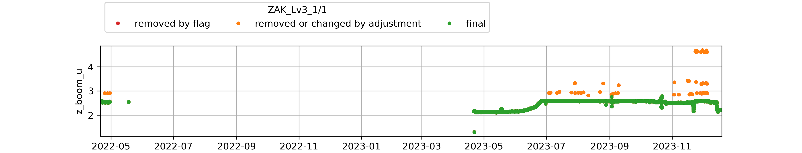

* [CEN1](#s1)
* [CEN2](#s2)
* [CP1](#s3)
* [EGP](#s4)
* [FRE](#s5)
* [HUM](#s6)
* [JAR](#s7)
* [JAR_O](#s8)
* [KAN_B](#s9)
* [KAN_L](#s10)
* [KAN_Lv3](#s11)
* [KAN_M](#s12)
* [KAN_U](#s13)
* [KPC_L](#s14)
* [KPC_Lv3](#s15)
* [KPC_U](#s16)
* [KPC_Uv3](#s17)
* [LYN_L](#s18)
* [LYN_T](#s19)
* [MIT](#s20)
* [NAE](#s21)
* [NAU](#s22)
* [NEM](#s23)
* [NSE](#s24)
* [NUK_B](#s25)
* [NUK_K](#s26)
* [NUK_L](#s27)
* [NUK_N](#s28)
* [NUK_U](#s29)
* [NUK_Uv3](#s30)
* [QAS_A](#s31)
* [QAS_L](#s32)
* [QAS_Lv3](#s33)
* [QAS_M](#s34)
* [QAS_Mv3](#s35)
* [QAS_U](#s36)
* [QAS_Uv3](#s37)
* [Roof_GEUS](#s38)
* [SCO_L](#s39)
* [SCO_U](#s40)
* [SDL](#s41)
* [SDM](#s42)
* [SWC](#s43)
* [SWC_O](#s44)
* [TAS_A](#s45)
* [TAS_L](#s46)
* [TAS_U](#s47)
* [THU_L](#s48)
* [THU_L2](#s49)
* [THU_U](#s50)
* [THU_U2](#s51)
* [UPE_L](#s52)
* [UPE_U](#s53)
* [ZAK_Lv3](#s54)
* [ZAK_Uv3](#s55)
# <a id='s1' />CEN1
| t0                        | t1                        | variable                                        |   flag | comment                                  |   URL_graphic | adj_func   | adjust_function   |   adjust_value |
|:--------------------------|:--------------------------|:------------------------------------------------|-------:|:-----------------------------------------|--------------:|:-----------|:------------------|---------------:|
| 2021-07-01T00:00:00+00:00 | nan                       | t_i_1 t_i_2 t_i_3 t_i_4 t_i_5 t_i_6 t_i_7 t_i_8 |    nan | thermistors removed after 2021 (bav)     |           nan | flag       | nan               |         nan    |
| nan                       | 2017-07-27T00:00:00+00:00 | t_i_1 t_i_2 t_i_3 t_i_4 t_i_5 t_i_6 t_i_7 t_i_8 |    nan | unrealistic values (bav)                 |           nan | flag       | nan               |         nan    |
| nan                       | nan                       | t_i_1 t_i_2 t_i_3 t_i_4 t_i_5 t_i_6 t_i_7 t_i_8 |    nan | maximum height of the boom on tripod AWS |           nan | nan        | max_filter        |           2.8  |
| 2019-10-24T14:00:00+00:00 | 2020-03-28T14:00:00+00:00 | t_i_1 t_i_2 t_i_3 t_i_4 t_i_5 t_i_6 t_i_7 t_i_8 |    nan | manually adjusted by bav                 |           nan | nan        | min_filter        |           1.7  |
| 2019-10-24T14:00:00+00:00 | 2020-03-28T14:00:00+00:00 | z_stake                                         |    nan | manually adjusted by bav                 |           nan | nan        | min_filter        |           1.81 |
| 2017-07-01T00:00:00+00:00 | 2017-08-15T00:00:00+00:00 | z_stake                                         |    nan | manually adjusted by bav                 |           nan | nan        | min_filter        |           2.56 |
| nan                       | nan                       | z_stake                                         |    nan | manually adjusted by bav                 |           nan | nan        | max_filter        |           3    |
 

 
# <a id='s2' />CEN2
| t0                        | t1                        | variable                                                                                                                                                                                                                                                                                                                                                                                                                                                                                                                                                                                                       | flag      | comment                                                   | URL_graphic                                                                      | adj_func   | adjust_function   |   adjust_value |
|:--------------------------|:--------------------------|:---------------------------------------------------------------------------------------------------------------------------------------------------------------------------------------------------------------------------------------------------------------------------------------------------------------------------------------------------------------------------------------------------------------------------------------------------------------------------------------------------------------------------------------------------------------------------------------------------------------|:----------|:----------------------------------------------------------|:---------------------------------------------------------------------------------|:-----------|:------------------|---------------:|
| nan                       | 2021-08-12T20:00:00+00:00 | rec p_l p_u t_l rh_l wspd_l wdir_l t_u rh_u wspd_u wdir_u dsr usr dlr ulr t_rad z_boom_l z_boom_u t_i_1 t_i_2 t_i_3 t_i_4 t_i_5 t_i_6 t_i_7 t_i_8 t_i_9 t_i_10 t_i_11 tilt_y tilt_x rot precip_l precip_u gps_time gps_lat gps_lon gps_alt gps_geoid gps_geounit gps_q gps_numsat gps_hdop fan_dc_l fan_dc_u batt_v t_log rh_u_cor qh_u rh_l_cor qh_l wspd_x_u wspd_y_u wspd_x_l wspd_y_l dsr_cor usr_cor albedo cc t_surf dlhf_u dlhf_l dshf_u dshf_l precip_u_cor precip_u_rate precip_l_cor precip_l_rate msg_lat msg_lon t_u_interp t_l_interp p_i t_i rh_i wspd_i wdir_i msg_i rh_i_cor wspd_x_i wspd_y_i | NAN       | flagged by bav                                            | logger file contains two rows that are test                                      | flag       | nan               |          nan   |
| nan                       | 2022-06-19T00:00:00+00:00 | t_i_1 t_i_2 t_i_3 t_i_4 t_i_5 t_i_6 t_i_7 t_i_8 t_i_9 t_i_10 t_i_11                                                                                                                                                                                                                                                                                                                                                                                                                                                                                                                                            | CONFIRMED | thermistor string not drilled in in 2021 but done in 2022 | nan                                                                              | flag       | nan               |          nan   |
| 2023-06-01T00:00:00+00:00 | nan                       | t_i_1 t_i_2 t_i_3 t_i_4 t_i_5 t_i_6 t_i_7 t_i_8 t_i_9 t_i_10 t_i_11                                                                                                                                                                                                                                                                                                                                                                                                                                                                                                                                            | CONFIRMED | give 0degC                                                | https://github.com/GEUS-Glaciology-and-Climate/PROMICE-AWS-data-issues/issues/69 | flag       | nan               |          nan   |
| 2022-10-14T18:00:00+00:00 | 2023-01-01T18:00:00+00:00 | rec p_l p_u t_l rh_l wspd_l wdir_l t_u rh_u wspd_u wdir_u dsr usr dlr ulr t_rad z_boom_l z_boom_u t_i_1 t_i_2 t_i_3 t_i_4 t_i_5 t_i_6 t_i_7 t_i_8 t_i_9 t_i_10 t_i_11 tilt_y tilt_x rot precip_l precip_u gps_time gps_lat gps_lon gps_alt gps_geoid gps_geounit gps_q gps_numsat gps_hdop fan_dc_l fan_dc_u batt_v t_log rh_u_cor qh_u rh_l_cor qh_l wspd_x_u wspd_y_u wspd_x_l wspd_y_l dsr_cor usr_cor albedo cc t_surf dlhf_u dlhf_l dshf_u dshf_l precip_u_cor precip_u_rate precip_l_cor precip_l_rate msg_lat msg_lon t_u_interp t_l_interp p_i t_i rh_i wspd_i wdir_i msg_i rh_i_cor wspd_x_i wspd_y_i | nan       | manually adjusted by bav                                  | nan                                                                              | nan        | min_filter        |            1.8 |
| nan                       | nan                       | t_i_1 t_i_2 t_i_3 t_i_4 t_i_5 t_i_6 t_i_7 t_i_8 t_i_9 t_i_10 t_i_11                                                                                                                                                                                                                                                                                                                                                                                                                                                                                                                                            | nan       | manually adjusted by bav                                  | nan                                                                              | nan        | min_filter        |            2   |
| nan                       | nan                       | t_i_1 t_i_2 t_i_3 t_i_4 t_i_5 t_i_6 t_i_7 t_i_8 t_i_9 t_i_10 t_i_11                                                                                                                                                                                                                                                                                                                                                                                                                                                                                                                                            | nan       | manually adjusted by bav                                  | nan                                                                              | nan        | max_filter        |            4.3 |
| nan                       | nan                       | z_boom_l                                                                                                                                                                                                                                                                                                                                                                                                                                                                                                                                                                                                       | nan       | manually adjusted by bav                                  | nan                                                                              | nan        | min_filter        |            1.5 |
| nan                       | nan                       | z_boom_l                                                                                                                                                                                                                                                                                                                                                                                                                                                                                                                                                                                                       | nan       | manually adjusted by bav                                  | nan                                                                              | nan        | max_filter        |            3   |
 

 
# <a id='s3' />CP1
| t0                        | t1                        | variable                                                                                                                                                                                                                                                                                                                                                                                                                                                                                                                                                                                                       | flag      | comment                                                  | URL_graphic                                                                      | adj_func   | adjust_function   |   adjust_value |
|:--------------------------|:--------------------------|:---------------------------------------------------------------------------------------------------------------------------------------------------------------------------------------------------------------------------------------------------------------------------------------------------------------------------------------------------------------------------------------------------------------------------------------------------------------------------------------------------------------------------------------------------------------------------------------------------------------|:----------|:---------------------------------------------------------|:---------------------------------------------------------------------------------|:-----------|:------------------|---------------:|
| 2023-01-02T14:00:00+00:00 | 2023-01-05T00:00:00+00:00 | p_u p_i p_l                                                                                                                                                                                                                                                                                                                                                                                                                                                                                                                                                                                                    | NAN       | flagged by bav                                           | https://github.com/GEUS-Glaciology-and-Climate/PROMICE-AWS-data-issues/issues/20 | flag       | nan               |          nan   |
| 2023-01-18T00:00:00+00:00 | 2023-01-22T19:00:00+00:00 | p_u                                                                                                                                                                                                                                                                                                                                                                                                                                                                                                                                                                                                            | NAN       | flagged by bav                                           | https://github.com/GEUS-Glaciology-and-Climate/PROMICE-AWS-data-issues/issues/20 | flag       | nan               |          nan   |
| 2023-01-19T19:00:00+00:00 | 2023-01-22T19:00:00+00:00 | p_l                                                                                                                                                                                                                                                                                                                                                                                                                                                                                                                                                                                                            | NAN       | flagged by bav                                           | https://github.com/GEUS-Glaciology-and-Climate/PROMICE-AWS-data-issues/issues/20 | flag       | nan               |          nan   |
| 2023-01-20T00:00:00+00:00 | 2023-01-22T19:00:00+00:00 | p_i                                                                                                                                                                                                                                                                                                                                                                                                                                                                                                                                                                                                            | NAN       | flagged by bav                                           | https://github.com/GEUS-Glaciology-and-Climate/PROMICE-AWS-data-issues/issues/20 | flag       | nan               |          nan   |
| 2022-02-15T00:00:00+00:00 | 2022-06-15T14:00:00+00:00 | rec p_l p_u t_l rh_l wspd_l wdir_l t_u rh_u wspd_u wdir_u dsr usr dlr ulr t_rad z_boom_l z_boom_u t_i_1 t_i_2 t_i_3 t_i_4 t_i_5 t_i_6 t_i_7 t_i_8 t_i_9 t_i_10 t_i_11 tilt_y tilt_x rot precip_l precip_u gps_time gps_lat gps_lon gps_alt gps_geoid gps_geounit gps_q gps_numsat gps_hdop fan_dc_l fan_dc_u batt_v t_log rh_u_cor qh_u rh_l_cor qh_l wspd_x_u wspd_y_u wspd_x_l wspd_y_l dsr_cor usr_cor albedo cc t_surf dlhf_u dlhf_l dshf_u dshf_l precip_u_cor precip_u_rate precip_l_cor precip_l_rate msg_lat msg_lon t_u_interp t_l_interp p_i t_i rh_i wspd_i wdir_i msg_i rh_i_cor wspd_x_i wspd_y_i | CONFIRMED | batteries were drained punctual obs are suspicious (bav) | nan                                                                              | flag       | nan               |          nan   |
| 2022-12-03T00:00:00+00:00 | 2023-06-20T00:00:00+00:00 | t_i_1 t_i_2 t_i_3 t_i_4 t_i_5 t_i_6 t_i_7 t_i_8 t_i_9 t_i_10 t_i_11                                                                                                                                                                                                                                                                                                                                                                                                                                                                                                                                            | CONFIRMED | all thermistors give 0degC during that period            | nan                                                                              | flag       | nan               |          nan   |
| 2023-09-14T03:00:00+00:00 | nan                       | t_i_1 t_i_2 t_i_3 t_i_4 t_i_5 t_i_6 t_i_7 t_i_8 t_i_9 t_i_10 t_i_11                                                                                                                                                                                                                                                                                                                                                                                                                                                                                                                                            | CONFIRMED | give constant values                                     | https://github.com/GEUS-Glaciology-and-Climate/PROMICE-AWS-data-issues/issues/71 | flag       | nan               |          nan   |
| nan                       | 2021-06-17T18:00:00+00:00 | z_boom_u z_boom_l                                                                                                                                                                                                                                                                                                                                                                                                                                                                                                                                                                                              | CONFIRMED | unlikely value during installation                       | nan                                                                              | flag       | nan               |          nan   |
| nan                       | 2023-04-21T00:00:00+00:00 | z_boom_u                                                                                                                                                                                                                                                                                                                                                                                                                                                                                                                                                                                                       | nan       | manually adjusted by bav                                 | nan                                                                              | nan        | min_filter        |            2.3 |
| nan                       | nan                       | z_boom_u                                                                                                                                                                                                                                                                                                                                                                                                                                                                                                                                                                                                       | nan       | manually adjusted by bav                                 | nan                                                                              | nan        | max_filter        |            4.3 |
| nan                       | 2023-04-21T00:00:00+00:00 | z_boom_l                                                                                                                                                                                                                                                                                                                                                                                                                                                                                                                                                                                                       | nan       | manually adjusted by bav                                 | nan                                                                              | nan        | min_filter        |            1.3 |
| nan                       | nan                       | z_boom_l                                                                                                                                                                                                                                                                                                                                                                                                                                                                                                                                                                                                       | nan       | manually adjusted by bav                                 | nan                                                                              | nan        | max_filter        |            3   |
 

 
# <a id='s4' />EGP
| t0                        | t1                        | variable                                        |   flag | comment                                                                    |   URL_graphic | adj_func   | adjust_function   |   adjust_value |
|:--------------------------|:--------------------------|:------------------------------------------------|-------:|:---------------------------------------------------------------------------|--------------:|:-----------|:------------------|---------------:|
| 2016-05-05T00:00:00+00:00 | 2016-05-21T00:00:00+00:00 | t_i_1 t_i_2 t_i_3 t_i_4 t_i_5 t_i_6 t_i_7 t_i_8 |    nan | string only drilled in on 21st May (bav)                                   |           nan | flag       | nan               |         nan    |
| 2020-01-01T00:00:00+00:00 | nan                       | z_stake                                         |    nan | manually flagged by bav                                                    |           nan | flag       | nan               |         nan    |
| nan                       | 2023-06-21T00:00:00+00:00 | t_i_1 t_i_2 t_i_3 t_i_4 t_i_5 t_i_6 t_i_7 t_i_8 |    nan | maximum height of the boom on tripod AWS (changed for a mast-type in 2023) |           nan | nan        | max_filter        |           2.8  |
| 2019-08-04T00:00:00+00:00 | 2019-11-13T00:00:00+00:00 | z_boom_u                                        |    nan | manually adjusted by bav                                                   |           nan | nan        | max_filter        |           2.6  |
| 2019-11-13T00:00:00+00:00 | 2020-09-01T00:00:00+00:00 | z_boom_u                                        |    nan | manually adjusted by bav                                                   |           nan | nan        | max_filter        |           2.33 |
| 2020-09-01T00:00:00+00:00 | 2021-03-06T00:00:00+00:00 | z_boom_u                                        |    nan | manually adjusted by bav                                                   |           nan | nan        | max_filter        |           1.93 |
| 2021-03-06T00:00:00+00:00 | 2021-04-26T00:00:00+00:00 | z_boom_u                                        |    nan | manually adjusted by bav                                                   |           nan | nan        | max_filter        |           1.7  |
 

 
# <a id='s5' />FRE
|   t0 |   adj_func |   t1 | variable   | adjust_function   |   adjust_value | comment                                  |   URL_graphic |
|-----:|-----------:|-----:|:-----------|:------------------|---------------:|:-----------------------------------------|--------------:|
|  nan |        nan |  nan | z_boom_u   | max_filter        |            2.8 | maximum height of the boom on tripod AWS |           nan |
 

 
# <a id='s6' />HUM
| t0                        |   t1 | variable                                                            | flag      | comment                                        | URL_graphic                                                                      | adj_func   |
|:--------------------------|-----:|:--------------------------------------------------------------------|:----------|:-----------------------------------------------|:---------------------------------------------------------------------------------|:-----------|
| 2022-10-15T19:00:00+00:00 |  nan | t_i_1 t_i_2 t_i_3 t_i_4 t_i_5 t_i_6 t_i_7 t_i_8 t_i_9 t_i_10 t_i_11 | CONFIRMED | constant ice temperature after that date (bav) | https://github.com/GEUS-Glaciology-and-Climate/PROMICE-AWS-data-issues/issues/73 | flag       |
 

 
# <a id='s7' />JAR
|   t0 |   adj_func |   t1 | variable   | adjust_function   |   adjust_value | comment                                  |   URL_graphic |
|-----:|-----------:|-----:|:-----------|:------------------|---------------:|:-----------------------------------------|--------------:|
|  nan |        nan |  nan | z_boom_u   | max_filter        |            2.8 | maximum height of the boom on tripod AWS |           nan |
 

 
# <a id='s8' />JAR_O
| t0                        | t1                        | variable   | flag      | comment                                  |   URL_graphic | adj_func   | adjust_function   |   adjust_value |
|:--------------------------|:--------------------------|:-----------|:----------|:-----------------------------------------|--------------:|:-----------|:------------------|---------------:|
| 2022-01-01T00:00:00+00:00 | 2023-07-07T00:00:00+00:00 | z_pt_cor   | CONFIRMED | very unlikely values (bav)               |           nan | flag       | nan               |          nan   |
| nan                       | nan                       | z_boom_u   | nan       | maximum height of the boom on tripod AWS |           nan | nan        | max_filter        |            2.8 |
 

 
# <a id='s9' />KAN_B
|   t0 |   adj_func |   t1 | variable   | adjust_function   |   adjust_value | comment                                  |   URL_graphic |
|-----:|-----------:|-----:|:-----------|:------------------|---------------:|:-----------------------------------------|--------------:|
|  nan |        nan |  nan | z_boom_u   | max_filter        |            2.8 | maximum height of the boom on tripod AWS |           nan |
 

 
# <a id='s10' />KAN_L
| t0                        | t1                        | variable   | flag    | comment                                           |   URL_graphic | adj_func   | adjust_function   |   adjust_value |
|:--------------------------|:--------------------------|:-----------|:--------|:--------------------------------------------------|--------------:|:-----------|:------------------|---------------:|
| 2009-08-27T00:00:00+00:00 | 2010-06-01T00:00:00+00:00 | z_stake    | CHECKME | manually flagged by bav                           |           nan | flag       | nan               |         nan    |
| 2011-11-01T00:00:00+00:00 | 2012-05-20T00:00:00+00:00 | z_stake    | CHECKME | manually flagged by bav                           |           nan | flag       | nan               |         nan    |
| 2014-06-25T00:00:00+00:00 | 2014-08-15T00:00:00+00:00 | z_stake    | CHECKME | manually flagged by bav                           |           nan | flag       | nan               |         nan    |
| 2015-10-20T00:00:00+00:00 | 2016-07-16T17:00:00+00:00 | z_stake    | CHECKME | manually flagged by bav                           |           nan | flag       | nan               |         nan    |
| 2009-09-17T00:00:00+00:00 | 2009-10-07T00:00:00+00:00 | z_pt_cor   | CHECKME | manually flagged by bav                           |           nan | flag       | nan               |         nan    |
| 2010-10-02T00:00:00+00:00 | 2010-10-12T00:00:00+00:00 | z_pt_cor   | CHECKME | manually flagged by bav                           |           nan | flag       | nan               |         nan    |
| 2012-10-06T00:00:00+00:00 | 2012-10-26T00:00:00+00:00 | z_pt_cor   | CHECKME | manually flagged by bav                           |           nan | flag       | nan               |         nan    |
| 2014-10-08T00:00:00+00:00 | 2014-11-16T00:00:00+00:00 | z_pt_cor   | CHECKME | manually flagged by bav                           |           nan | flag       | nan               |         nan    |
| 2019-10-07T00:00:00+00:00 | 2019-10-27T00:00:00+00:00 | z_pt_cor   | CHECKME | manually flagged by bav                           |           nan | flag       | nan               |         nan    |
| 2021-09-18T00:00:00+00:00 | 2022-06-01T00:00:00+00:00 | z_pt_cor   | CHECKME | manually flagged by bav                           |           nan | flag       | nan               |         nan    |
| 2022-10-01T00:00:00+00:00 | 2022-11-01T00:00:00+00:00 | z_pt_cor   | CHECKME | manually flagged by bav                           |           nan | flag       | nan               |         nan    |
| nan                       | nan                       | z_boom_u   | nan     | maximum height of the boom on tripod AWS          |           nan | nan        | max_filter        |           2.8  |
| nan                       | nan                       | z_boom_u   | nan     | never seen more than 80 cm of snow at KAN_L (bav) |           nan | nan        | min_filter        |           2    |
| 2010-10-07T00:00:00+00:00 | nan                       | z_pt_cor   | nan     | manually adjusted by bav                          |           nan | nan        | add               |          -0.1  |
| 2011-06-04T00:00:00+00:00 | nan                       | z_pt_cor   | nan     | manually adjusted by bav                          |           nan | nan        | add               |          -4    |
| 2012-08-21T00:00:00+00:00 | nan                       | z_pt_cor   | nan     | manually adjusted by bav                          |           nan | nan        | add               |         -11.7  |
| 2014-05-13T00:00:00+00:00 | nan                       | z_pt_cor   | nan     | manually adjusted by bav                          |           nan | nan        | add               |           0.07 |
| 2015-04-29T00:00:00+00:00 | nan                       | z_pt_cor   | nan     | manually adjusted by bav                          |           nan | nan        | add               |          -7.08 |
| 2015-07-07T00:00:00+00:00 | nan                       | z_pt_cor   | nan     | manually adjusted by bav                          |           nan | nan        | add               |          -0.4  |
| 2016-07-16T00:00:00+00:00 | nan                       | z_pt_cor   | nan     | manually adjusted by bav                          |           nan | nan        | add               |          -1.6  |
| 2017-09-01T00:00:00+00:00 | nan                       | z_pt_cor   | nan     | manually adjusted by bav                          |           nan | nan        | add               |          -3.5  |
| 2018-08-29T00:00:00+00:00 | nan                       | z_pt_cor   | nan     | manually adjusted by bav                          |           nan | nan        | add               |         -11.3  |
| 2021-08-17T00:00:00+00:00 | nan                       | z_pt_cor   | nan     | manually adjusted by bav                          |           nan | nan        | add               |         -13    |
| 2022-05-15T13:00:00+00:00 | nan                       | z_pt_cor   | nan     | manually adjusted by bav                          |           nan | nan        | add               |           2.9  |
 

 
# <a id='s11' />KAN_Lv3
|   t0 |   adj_func |   t1 | variable   | adjust_function   |   adjust_value | comment                                  |   URL_graphic |
|-----:|-----------:|-----:|:-----------|:------------------|---------------:|:-----------------------------------------|--------------:|
|  nan |        nan |  nan | z_boom_u   | max_filter        |            2.8 | maximum height of the boom on tripod AWS |           nan |
 

 
# <a id='s12' />KAN_M
| t0                        | t1                        | variable                                        | flag      | comment                                                                                   |   URL_graphic | adj_func   | adjust_function   |   adjust_value |
|:--------------------------|:--------------------------|:------------------------------------------------|:----------|:------------------------------------------------------------------------------------------|--------------:|:-----------|:------------------|---------------:|
| 2010-08-18T00:00:00+00:00 | 2011-04-21T00:00:00+00:00 | z_stake                                         | NAN       | manually flagged by bav                                                                   |           nan | flag       | nan               |          nan   |
| 2013-10-28T21:00:00+00:00 | 2013-10-01T00:00:00+00:00 | z_stake                                         | CHECKME   | Manually flagged by bav                                                                   |           nan | flag       | nan               |          nan   |
| 2011-11-13T21:00:00+00:00 | 2012-05-03T22:00:00+00:00 | t_i_1 t_i_2 t_i_3 t_i_4 t_i_5 t_i_6 t_i_7 t_i_8 | CHECKME   | Manually flagged by bav                                                                   |           nan | flag       | nan               |          nan   |
| 2014-09-14T00:00:00+00:00 | 2015-06-19T00:00:00+00:00 | z_stake                                         | NAN       | manually flagged by bav                                                                   |           nan | flag       | nan               |          nan   |
| 2017-02-10T00:00:00+00:00 | 2017-02-16T00:00:00+00:00 | z_stake                                         | CHECKME   | Manually flagged by bav                                                                   |           nan | flag       | nan               |          nan   |
| 2016-07-16T00:00:00+00:00 | 2018-06-01T00:00:00+00:00 | z_stake                                         | NAN       | manually flagged by bav                                                                   |           nan | flag       | nan               |          nan   |
| 2014-12-06T20:00:00+00:00 | 2014-12-23T00:00:00+00:00 | z_boom_u                                        | CHECKME   | Manually flagged by bav                                                                   |           nan | flag       | nan               |          nan   |
| 2018-06-05T00:00:00+00:00 | 2018-06-09T20:00:00+00:00 | z_boom_u                                        | CHECKME   | Only fragmented observations available while SR50 on stake shows clear accumulation (bav) |           nan | flag       | nan               |          nan   |
| 2014-09-17T00:00:00+00:00 | 2015-07-19T00:00:00+00:00 | z_pt_cor                                        | NAN       | showing height decrease at strange month or height increase (bav)                         |           nan | flag       | nan               |          nan   |
| nan                       | 2010-05-21T00:00:00+00:00 | t_i_1 t_i_2 t_i_3 t_i_4 t_i_5 t_i_6 t_i_7 t_i_8 | CONFIRMED | no thermistor installed until 2010 (bav)                                                  |           nan | flag       | nan               |          nan   |
| 2018-08-29T00:00:00+00:00 | 2022-08-21T00:00:00+00:00 | t_i_1 t_i_2 t_i_3 t_i_4 t_i_5 t_i_6 t_i_7 t_i_8 | NAN       | manually flagged by bav                                                                   |           nan | flag       | nan               |          nan   |
| nan                       | nan                       | z_boom_u                                        | nan       | maximum height of the boom on tripod AWS                                                  |           nan | nan        | max_filter        |            2.8 |
| nan                       | nan                       | z_boom_u                                        | nan       | never seen more than 1.80 cm of snow at KAN_L (bav)                                       |           nan | nan        | min_filter        |            1   |
| nan                       | nan                       | t_i_1 t_i_2 t_i_3 t_i_4 t_i_5 t_i_6 t_i_7 t_i_8 | nan       | nan                                                                                       |           nan | nan        | min_filter        |          -25   |
 

 
# <a id='s13' />KAN_U
| t0                        | t1                        | variable                |   flag | comment                                                               | URL_graphic                                                                      | adj_func   | adjust_function   |   adjust_value |
|:--------------------------|:--------------------------|:------------------------|-------:|:----------------------------------------------------------------------|:---------------------------------------------------------------------------------|:-----------|:------------------|---------------:|
| 2021-12-20T00:00:00+00:00 | 2023-06-09T04:00:00+00:00 | gps_lon gps_lat gps_alt |    nan | manually flagged by bav                                               | https://github.com/GEUS-Glaciology-and-Climate/PROMICE-AWS-data-issues/issues/50 | flag       | nan               |          nan   |
| 2011-05-26T00:00:00+00:00 | 2012-05-03T00:00:00+00:00 | gps_lon gps_lat gps_alt |    nan | manually flagged by bav                                               | https://github.com/GEUS-Glaciology-and-Climate/PROMICE-AWS-data-issues/issues/50 | flag       | nan               |          nan   |
| 2015-10-27T00:00:00+00:00 | 2016-04-09T00:00:00+00:00 | gps_lon gps_lat gps_alt |    nan | manually flagged by bav                                               | https://github.com/GEUS-Glaciology-and-Climate/PROMICE-AWS-data-issues/issues/50 | flag       | nan               |          nan   |
| nan                       | 2023-06-08T12:00:00+00:00 | z_boom_u                |    nan | maximum height of the boom on tripod AWS (changed for a mast in 2023) | nan                                                                              | nan        | max_filter        |            2.8 |
 

 
# <a id='s14' />KPC_L
| t0                        | t1                        | variable   | flag    | comment                                  |   URL_graphic | adj_func   | adjust_function   |   adjust_value |
|:--------------------------|:--------------------------|:-----------|:--------|:-----------------------------------------|--------------:|:-----------|:------------------|---------------:|
| 2012-07-19T00:00:00+00:00 | 2012-07-30T00:00:00+00:00 | z_boom_u   | CHECKME | manually flagged by bav                  |           nan | flag       | nan               |        nan     |
| 2012-07-19T00:00:00+00:00 | 2012-07-19T16:00:00+00:00 | z_pt_cor   | CHECKME | manually flagged by bav                  |           nan | flag       | nan               |        nan     |
| 2019-08-25T12:00:00+00:00 | 2019-08-27T00:00:00+00:00 | z_pt_cor   | CHECKME | manually flagged by bav                  |           nan | flag       | nan               |        nan     |
| 2019-09-07T00:00:00+00:00 | 2019-09-11T00:00:00+00:00 | z_pt_cor   | CHECKME | manually flagged by bav                  |           nan | flag       | nan               |        nan     |
| 2019-09-15T00:00:00+00:00 | 2020-01-01T00:00:00+00:00 | z_pt_cor   | CHECKME | manually flagged by bav                  |           nan | flag       | nan               |        nan     |
| 2020-04-01T00:00:00+00:00 | 2020-06-01T00:00:00+00:00 | z_pt_cor   | CHECKME | manually flagged by bav                  |           nan | flag       | nan               |        nan     |
| 2021-04-01T00:00:00+00:00 | 2021-06-04T00:00:00+00:00 | z_pt_cor   | CHECKME | manually flagged by bav                  |           nan | flag       | nan               |        nan     |
| 2022-04-01T00:00:00+00:00 | 2022-06-04T00:00:00+00:00 | z_pt_cor   | CHECKME | manually flagged by bav                  |           nan | flag       | nan               |        nan     |
| 2009-08-20T00:00:00+00:00 | 2010-01-31T00:00:00+00:00 | z_stake    | CHECKME | manually flagged by bav                  |           nan | flag       | nan               |        nan     |
| 2013-08-27T00:00:00+00:00 | 2016-06-28T00:00:00+00:00 | z_stake    | CHECKME | manually flagged by bav                  |           nan | flag       | nan               |        nan     |
| 2014-07-20T00:00:00+00:00 | 2015-02-28T00:00:00+00:00 | z_stake    | CHECKME | manually flagged by bav                  |           nan | flag       | nan               |        nan     |
| 2020-04-02T15:00:00+00:00 | nan                       | z_stake    | CHECKME | manually flagged by bav                  |           nan | flag       | nan               |        nan     |
| nan                       | nan                       | z_boom_u   | nan     | maximum height of the boom on tripod AWS |           nan | nan        | max_filter        |          2.8   |
| 2012-01-01T00:00:00+00:00 | nan                       | z_pt_cor   | nan     | manually adjusted by bav                 |           nan | nan        | add               |         -6     |
| 2016-07-27T00:00:00+00:00 | nan                       | z_pt_cor   | nan     | manually adjusted by bav                 |           nan | nan        | add               |         -6.297 |
| 2016-07-29T00:00:00+00:00 | nan                       | z_pt_cor   | nan     | manually adjusted by bav                 |           nan | nan        | add               |         -0.1   |
| 2019-07-12T13:00:00+00:00 | nan                       | z_pt_cor   | nan     | manually adjusted by bav                 |           nan | nan        | add               |         -4.478 |
 

 
# <a id='s15' />KPC_Lv3
|   t0 |   adj_func |   t1 | variable   | adjust_function   |   adjust_value | comment                                  |   URL_graphic |
|-----:|-----------:|-----:|:-----------|:------------------|---------------:|:-----------------------------------------|--------------:|
|  nan |        nan |  nan | z_boom_u   | max_filter        |            2.8 | maximum height of the boom on tripod AWS |           nan |
 

 
# <a id='s16' />KPC_U
| t0                        |   t1 | variable                                        | flag    | comment                                  |   URL_graphic | adj_func   | adjust_function   |   adjust_value |
|:--------------------------|-----:|:------------------------------------------------|:--------|:-----------------------------------------|--------------:|:-----------|:------------------|---------------:|
| 2006-07-10T00:00:00+00:00 |  nan | z_pt_cor                                        | CHECKME | manually flagged by bav                  |           nan | flag       | nan               |          nan   |
| 2019-06-28T00:00:00+00:00 |  nan | t_i_1 t_i_2 t_i_3 t_i_4 t_i_5 t_i_6 t_i_7 t_i_8 | CHECKME | manually flagged by bav                  |           nan | flag       | nan               |          nan   |
| nan                       |  nan | z_boom_u                                        | nan     | maximum height of the boom on tripod AWS |           nan | nan        | max_filter        |            2.8 |
| nan                       |  nan | t_i_1 t_i_2 t_i_3 t_i_4 t_i_5 t_i_6 t_i_7 t_i_8 | nan     | nan                                      |           nan | nan        | min_filter        |          -30   |
 

 
# <a id='s17' />KPC_Uv3
| t0                        | t1                        | variable                                                                                                                                                                                                                                                                                                                                                                                                                                  | flag    | comment                  | URL_graphic                                                                      | adj_func   | adjust_function   |   adjust_value |
|:--------------------------|:--------------------------|:------------------------------------------------------------------------------------------------------------------------------------------------------------------------------------------------------------------------------------------------------------------------------------------------------------------------------------------------------------------------------------------------------------------------------------------|:--------|:-------------------------|:---------------------------------------------------------------------------------|:-----------|:------------------|---------------:|
| 2021-07-10T00:00:00+00:00 | 2023-06-10T00:00:00+00:00 | rec p_u t_u rh_u wspd_u wdir_u dsr usr dlr ulr t_rad z_pt t_i_1 t_i_2 t_i_3 t_i_4 t_i_5 t_i_6 t_i_7 t_i_8 tilt_x tilt_y rot rh_u_cor qh_u wspd_x_u wspd_y_u dsr_cor usr_cor albedo cc t_surf dlhf_u dshf_u z_pt_cor z_boom_u z_stake precip_u gps_time gps_lat gps_lon gps_alt gps_hdop fan_dc_u batt_v p_i t_i rh_i wspd_i wdir_i msg_i msg_lat msg_lon precip_u_cor precip_u_rate gps_geoid t_log rh_i_cor wspd_x_i wspd_y_i t_u_interp | CHECKME | manually flagged by bav  | nan                                                                              | flag       | nan               |          nan   |
| 2056-01-01T00:00:00+00:00 | nan                       | rec p_u t_u rh_u wspd_u wdir_u dsr usr dlr ulr t_rad z_pt t_i_1 t_i_2 t_i_3 t_i_4 t_i_5 t_i_6 t_i_7 t_i_8 tilt_x tilt_y rot rh_u_cor qh_u wspd_x_u wspd_y_u dsr_cor usr_cor albedo cc t_surf dlhf_u dshf_u z_pt_cor z_boom_u z_stake precip_u gps_time gps_lat gps_lon gps_alt gps_hdop fan_dc_u batt_v p_i t_i rh_i wspd_i wdir_i msg_i msg_lat msg_lon precip_u_cor precip_u_rate gps_geoid t_log rh_i_cor wspd_x_i wspd_y_i t_u_interp | nan     | manually adjusted by bav | https://github.com/GEUS-Glaciology-and-Climate/PROMICE-AWS-data-issues/issues/22 | nan        | time_shift        |       -12361.5 |
 

 
# <a id='s18' />LYN_L
|   t0 |   adj_func |   t1 | variable   | adjust_function   |   adjust_value | comment                                  |   URL_graphic |
|-----:|-----------:|-----:|:-----------|:------------------|---------------:|:-----------------------------------------|--------------:|
|  nan |        nan |  nan | z_boom_u   | max_filter        |            2.8 | maximum height of the boom on tripod AWS |           nan |
 

 
# <a id='s19' />LYN_T
| t0                        | t1                        | variable                                                                       |   flag | comment                                  | URL_graphic                                                                      | adj_func   | adjust_function   |   adjust_value |
|:--------------------------|:--------------------------|:-------------------------------------------------------------------------------|-------:|:-----------------------------------------|:---------------------------------------------------------------------------------|:-----------|:------------------|---------------:|
| 2023-05-27T00:00:00+00:00 | 2023-07-12T00:00:00+00:00 | rh_u t_u wspd_u wdir_u p_u rh_i t_i wspd_i wdir_i p_i dsr usr dlr ulr z_boom_u |    nan | station fallen (bav)                     | https://github.com/GEUS-Glaciology-and-Climate/PROMICE-AWS-data-issues/issues/49 | flag       | nan               |          nan   |
| nan                       | nan                       | z_boom_u                                                                       |    nan | maximum height of the boom on tripod AWS | nan                                                                              | nan        | max_filter        |            2.8 |
 

 
# <a id='s20' />MIT
| t0                        | t1                        | variable                                                                       | flag    | comment                                  | URL_graphic                                                                      | adj_func   | adjust_function   |   adjust_value |
|:--------------------------|:--------------------------|:-------------------------------------------------------------------------------|:--------|:-----------------------------------------|:---------------------------------------------------------------------------------|:-----------|:------------------|---------------:|
| 2013-03-07T00:00:00+00:00 | 2013-06-21T00:00:00+00:00 | rh_u t_u wspd_u wdir_u p_u rh_i t_i wspd_i wdir_i p_i dsr usr dlr ulr z_boom_u | CHECKME | Manually flagged by bav                  | nan                                                                              | flag       | nan               |         nan    |
| 2015-01-25T11:00:00+00:00 | 2015-07-21T00:00:00+00:00 | rh_u t_u wspd_u wdir_u p_u rh_i t_i wspd_i wdir_i p_i dsr usr dlr ulr z_boom_u | CHECKME | Manually flagged by bav                  | nan                                                                              | flag       | nan               |         nan    |
| 2019-04-01T00:00:00+00:00 | 2019-07-31T00:00:00+00:00 | dlr                                                                            | CHECKME | Manually flagged by bav                  | nan                                                                              | flag       | nan               |         nan    |
| 2008-06-01T00:00:00+00:00 | 2010-01-01T00:00:00+00:00 | z_boom_u                                                                       | CHECKME | Manually flagged by bav                  | nan                                                                              | flag       | nan               |         nan    |
| 2010-12-14T00:00:00+00:00 | 2011-08-12T00:00:00+00:00 | z_stake                                                                        | CHECKME | Manually flagged by bav                  | nan                                                                              | flag       | nan               |         nan    |
| 2012-02-03T00:00:00+00:00 | 2012-06-03T00:00:00+00:00 | z_stake                                                                        | CHECKME | Manually flagged by bav                  | nan                                                                              | flag       | nan               |         nan    |
| 2013-01-01T00:00:00+00:00 | 2013-09-09T00:00:00+00:00 | z_stake                                                                        | CHECKME | Manually flagged by bav                  | nan                                                                              | flag       | nan               |         nan    |
| 2014-09-20T00:00:00+00:00 | 2015-08-14T00:00:00+00:00 | t_i_1 t_i_2 t_i_3 t_i_4 t_i_5 t_i_6 t_i_7 t_i_8                                | CHECKME | Manually flagged by bav                  | nan                                                                              | flag       | nan               |         nan    |
| 2015-09-15T00:00:00+00:00 | 2015-12-14T00:00:00+00:00 | z_stake                                                                        | CHECKME | Manually flagged by bav                  | nan                                                                              | flag       | nan               |         nan    |
| 2016-06-15T00:00:00+00:00 | 2016-07-14T00:00:00+00:00 | z_stake                                                                        | CHECKME | Manually flagged by bav                  | nan                                                                              | flag       | nan               |         nan    |
| 2008-06-01T00:00:00+00:00 | 2009-08-12T00:00:00+00:00 | z_pt_cor                                                                       | CHECKME | manually flagged by bav                  | nan                                                                              | flag       | nan               |         nan    |
| 2015-12-31T00:00:00+00:00 | 2016-05-29T00:00:00+00:00 | z_pt_cor                                                                       | CHECKME | manually flagged by bav                  | nan                                                                              | flag       | nan               |         nan    |
| 2016-01-02T00:00:00+00:00 | 2017-07-01T00:00:00+00:00 | z_pt_cor                                                                       | CHECKME | manually flagged by bav                  | nan                                                                              | flag       | nan               |         nan    |
| 2017-10-01T00:00:00+00:00 | 2018-07-01T00:00:00+00:00 | z_pt_cor                                                                       | CHECKME | manually flagged by bav                  | nan                                                                              | flag       | nan               |         nan    |
| 2018-10-01T00:00:00+00:00 | 2018-11-01T00:00:00+00:00 | z_pt_cor                                                                       | CHECKME | manually flagged by bav                  | nan                                                                              | flag       | nan               |         nan    |
| 2019-01-02T00:00:00+00:00 | 2019-07-01T00:00:00+00:00 | z_pt_cor                                                                       | CHECKME | manually flagged by bav                  | nan                                                                              | flag       | nan               |         nan    |
| 2019-09-10T00:00:00+00:00 | 2020-05-01T00:00:00+00:00 | z_pt_cor                                                                       | CHECKME | manually flagged by bav                  | nan                                                                              | flag       | nan               |         nan    |
| 2020-09-10T00:00:00+00:00 | 2021-05-01T00:00:00+00:00 | z_pt_cor                                                                       | CHECKME | manually flagged by bav                  | nan                                                                              | flag       | nan               |         nan    |
| 2021-09-01T00:00:00+00:00 | nan                       | wspd_i wspd_u                                                                  | NAN     | manually flagged by bav                  | https://github.com/GEUS-Glaciology-and-Climate/PROMICE-AWS-data-issues/issues/54 | flag       | nan               |         nan    |
| 2023-08-01T00:00:00+00:00 | nan                       | t_i rh_i                                                                       | NAN     | manually flagged by bav                  | https://github.com/GEUS-Glaciology-and-Climate/PROMICE-AWS-data-issues/issues/54 | flag       | nan               |         nan    |
| nan                       | nan                       | z_boom_u                                                                       | nan     | maximum height of the boom on tripod AWS | nan                                                                              | nan        | max_filter        |           2.8  |
| 2009-08-12T00:00:00+00:00 | nan                       | z_pt_cor                                                                       | nan     | manually adjusted by bav                 | nan                                                                              | nan        | add               |         -12    |
| 2010-09-01T00:00:00+00:00 | nan                       | z_pt_cor                                                                       | nan     | manually adjusted by bav                 | nan                                                                              | nan        | add               |           2    |
| 2011-08-11T00:00:00+00:00 | nan                       | z_pt_cor                                                                       | nan     | manually adjusted by bav                 | nan                                                                              | nan        | add               |          -0.08 |
| 2012-09-06T00:00:00+00:00 | nan                       | z_pt_cor                                                                       | nan     | manually adjusted by bav                 | nan                                                                              | nan        | add               |         -13.7  |
| 2018-07-01T00:00:00+00:00 | nan                       | z_pt_cor                                                                       | nan     | manually adjusted by bav                 | nan                                                                              | nan        | add               |          -2    |
| 2019-01-12T00:00:00+00:00 | nan                       | z_pt_cor                                                                       | nan     | manually adjusted by bav                 | nan                                                                              | nan        | add               |          -2    |
| nan                       | nan                       | t_i_1 t_i_2 t_i_3 t_i_4 t_i_5 t_i_6 t_i_7 t_i_8                                | nan     | nan                                      | nan                                                                              | nan        | min_filter        |         -20    |
 

 
# <a id='s21' />NAE
| t0                        |   t1 | variable                                                            | flag      | comment                                        | URL_graphic                                                                      | adj_func   |
|:--------------------------|-----:|:--------------------------------------------------------------------|:----------|:-----------------------------------------------|:---------------------------------------------------------------------------------|:-----------|
| 2023-06-01T00:00:00+00:00 |  nan | t_i_1 t_i_2 t_i_3 t_i_4 t_i_5 t_i_6 t_i_7 t_i_8 t_i_9 t_i_10 t_i_11 | CONFIRMED | constant ice temperature after that date (bav) | https://github.com/GEUS-Glaciology-and-Climate/PROMICE-AWS-data-issues/issues/85 | flag       |
 

 
# <a id='s22' />NAU
| t0                        | t1                        | variable                                                            | flag      | comment                                        | URL_graphic                                                                      | adj_func   | adjust_function   |   adjust_value |
|:--------------------------|:--------------------------|:--------------------------------------------------------------------|:----------|:-----------------------------------------------|:---------------------------------------------------------------------------------|:-----------|:------------------|---------------:|
| 2022-12-23T00:00:00+00:00 | 2022-12-28T00:00:00+00:00 | p_u p_i p_l                                                         | NAN       | flagged by bav                                 | https://github.com/GEUS-Glaciology-and-Climate/PROMICE-AWS-data-issues/issues/21 | flag       | nan               |          nan   |
| 2022-12-30T20:00:00+00:00 | 2023-04-04T00:00:00+00:00 | p_u p_i p_l                                                         | NAN       | flagged by bav                                 | https://github.com/GEUS-Glaciology-and-Climate/PROMICE-AWS-data-issues/issues/21 | flag       | nan               |          nan   |
| 2021-12-08T00:00:00+00:00 | 2021-12-21T00:00:00+00:00 | t_i_11                                                              | NAN       | flagged by bav                                 | nan                                                                              | flag       | nan               |          nan   |
| 2023-10-04T00:00:00+00:00 | nan                       | t_i_1 t_i_2 t_i_3 t_i_4 t_i_5 t_i_6 t_i_7 t_i_8 t_i_9 t_i_10 t_i_11 | CONFIRMED | constant ice temperature after that date (bav) | https://github.com/GEUS-Glaciology-and-Climate/PROMICE-AWS-data-issues/issues/86 | flag       | nan               |          nan   |
| nan                       | 2023-04-01T00:00:00+00:00 | z_boom_u                                                            | nan       | manually adjusted by bav                       | nan                                                                              | nan        | min_filter        |            2.3 |
| nan                       | 2023-04-01T00:00:00+00:00 | z_boom_u                                                            | nan       | manually adjusted by bav                       | nan                                                                              | nan        | max_filter        |            4.3 |
| nan                       | 2023-04-01T00:00:00+00:00 | z_boom_l                                                            | nan       | manually adjusted by bav                       | nan                                                                              | nan        | min_filter        |            1   |
| nan                       | 2023-04-01T00:00:00+00:00 | t_i_1 t_i_2 t_i_3 t_i_4 t_i_5 t_i_6 t_i_7 t_i_8 t_i_9 t_i_10 t_i_11 | nan       | manually adjusted by bav                       | nan                                                                              | nan        | max_filter        |            3   |
 

 
# <a id='s23' />NEM
| t0                        | t1                        | variable                                                            | flag      | comment                                        | URL_graphic                                                                      | adj_func   | adjust_function   |   adjust_value |
|:--------------------------|:--------------------------|:--------------------------------------------------------------------|:----------|:-----------------------------------------------|:---------------------------------------------------------------------------------|:-----------|:------------------|---------------:|
| 2022-10-31T06:00:00+00:00 | 2022-11-26T03:00:00+00:00 | wspd_u wspd_l wspd_i                                                | NAN       | flagged by bav                                 | https://github.com/GEUS-Glaciology-and-Climate/PROMICE-AWS-data-issues/issues/51 | flag       | nan               |            nan |
| 2023-04-29T06:00:00+00:00 | nan                       | wdir_l wdir_i                                                       | NAN       | flagged by bav                                 | https://github.com/GEUS-Glaciology-and-Climate/PROMICE-AWS-data-issues/issues/51 | flag       | nan               |            nan |
| 2023-07-01T14:00:00+00:00 | nan                       | t_i_1 t_i_2 t_i_3 t_i_4 t_i_5 t_i_6 t_i_7 t_i_8 t_i_9 t_i_10 t_i_11 | CONFIRMED | constant ice temperature after that date (bav) | https://github.com/GEUS-Glaciology-and-Climate/PROMICE-AWS-data-issues/issues/88 | flag       | nan               |            nan |
| 2023-06-01T11:00:00+00:00 | 2023-06-28T05:00:00+00:00 | t_i_6                                                               | CONFIRMED | suspicious values (bav)                        | https://github.com/GEUS-Glaciology-and-Climate/PROMICE-AWS-data-issues/issues/88 | flag       | nan               |            nan |
| nan                       | 2023-11-01T00:00:00+00:00 | z_boom_u                                                            | nan       | manually adjusted by bav                       | nan                                                                              | nan        | min_filter        |              3 |
| nan                       | 2023-11-01T00:00:00+00:00 | z_boom_u                                                            | nan       | manually adjusted by bav                       | nan                                                                              | nan        | max_filter        |              4 |
 

 
# <a id='s24' />NSE
| t0                        | t1                        | variable   |   flag | comment        | URL_graphic                                                                      | adj_func   |
|:--------------------------|:--------------------------|:-----------|-------:|:---------------|:---------------------------------------------------------------------------------|:-----------|
| 2022-03-26T06:00:00+00:00 | 2022-10-20T03:00:00+00:00 | p_u        |    nan | flagged by bav | https://github.com/GEUS-Glaciology-and-Climate/PROMICE-AWS-data-issues/issues/24 | flag       |
| 2023-01-03T06:00:00+00:00 | 2023-01-13T22:00:00+00:00 | p_u        |    nan | flagged by bav | https://github.com/GEUS-Glaciology-and-Climate/PROMICE-AWS-data-issues/issues/24 | flag       |
| 2023-01-18T01:00:00+00:00 | 2023-01-22T13:00:00+00:00 | p_u        |    nan | flagged by bav | https://github.com/GEUS-Glaciology-and-Climate/PROMICE-AWS-data-issues/issues/24 | flag       |
| 2022-03-26T06:00:00+00:00 | 2022-10-20T03:00:00+00:00 | rh_u       |    nan | flagged by bav | https://github.com/GEUS-Glaciology-and-Climate/PROMICE-AWS-data-issues/issues/24 | flag       |
 

 
# <a id='s25' />NUK_B
|   t0 |   adj_func |   t1 | variable   | adjust_function   |   adjust_value | comment                                  |   URL_graphic |
|-----:|-----------:|-----:|:-----------|:------------------|---------------:|:-----------------------------------------|--------------:|
|  nan |        nan |  nan | z_boom_u   | max_filter        |            2.8 | maximum height of the boom on tripod AWS |           nan |
 

 
# <a id='s26' />NUK_K
| t0                        | t1                        | variable                                        | flag    | comment                                  | URL_graphic                                                                      | adj_func   | adjust_function   |   adjust_value |
|:--------------------------|:--------------------------|:------------------------------------------------|:--------|:-----------------------------------------|:---------------------------------------------------------------------------------|:-----------|:------------------|---------------:|
| 2015-04-01T00:00:00+00:00 | 2015-06-20T00:00:00+00:00 | dsr usr dlr ulr                                 | NAN     | Manually flagged by bav                  | nan                                                                              | flag       | nan               |         nan    |
| 2015-10-17T00:00:00+00:00 | 2016-01-16T00:00:00+00:00 | wspd_u wdir_u                                   | NAN     | Manually flagged by bav                  | https://github.com/GEUS-Glaciology-and-Climate/PROMICE-AWS-data-issues/issues/19 | flag       | nan               |         nan    |
| 2017-04-01T16:00:00+00:00 | 2017-05-10T00:00:00+00:00 | dsr usr dlr ulr                                 | CHECKME | Manually flagged by bav                  | nan                                                                              | flag       | nan               |         nan    |
| 2020-09-01T00:00:00+00:00 | 2021-07-01T00:00:00+00:00 | z_pt_cor                                        | CHECKME | manually flagged by bav                  | nan                                                                              | flag       | nan               |         nan    |
| nan                       | nan                       | z_boom_u                                        | nan     | maximum height of the boom on tripod AWS | nan                                                                              | nan        | max_filter        |           2.8  |
| 2014-08-12T00:00:00+00:00 | nan                       | z_pt_cor                                        | nan     | manually adjusted by bav                 | nan                                                                              | nan        | add               |           1.25 |
| 2014-08-28T00:00:00+00:00 | nan                       | z_pt_cor                                        | nan     | manually adjusted by bav                 | nan                                                                              | nan        | add               |          -1.25 |
| 2018-06-26T00:00:00+00:00 | nan                       | z_pt_cor                                        | nan     | manually adjusted by bav                 | nan                                                                              | nan        | add               |           0.07 |
| 2019-08-17T00:00:00+00:00 | nan                       | z_pt_cor                                        | nan     | manually adjusted by bav                 | nan                                                                              | nan        | add               |           1    |
| 2019-09-12T00:00:00+00:00 | nan                       | z_pt_cor                                        | nan     | manually adjusted by bav                 | nan                                                                              | nan        | add               |          -1    |
| nan                       | nan                       | t_i_1 t_i_2 t_i_3 t_i_4 t_i_5 t_i_6 t_i_7 t_i_8 | nan     | nan                                      | nan                                                                              | nan        | min_filter        |         -20    |
 

 
# <a id='s27' />NUK_L
| t0                        | t1                        | variable                                                                       | flag                      | comment                                                                          | URL_graphic                                                                      | adj_func   | adjust_function   |   adjust_value |
|:--------------------------|:--------------------------|:-------------------------------------------------------------------------------|:--------------------------|:---------------------------------------------------------------------------------|:---------------------------------------------------------------------------------|:-----------|:------------------|---------------:|
| 2010-07-25T00:00:00+00:00 | 2011-08-25T17:00:00+00:00 | rh_u t_u wspd_u wdir_u p_u rh_i t_i wspd_i wdir_i p_i dsr usr dlr ulr z_boom_u | NAN                       | station fallen (bav confirmed with field notes)                                  | https://github.com/GEUS-Glaciology-and-Climate/PROMICE-AWS-data-issues/issues/43 | flag       | nan               |         nan    |
| 2013-01-23T10:00:00+00:00 | 2013-07-23T19:00:00+00:00 | rh_u t_u wspd_u wdir_u p_u rh_i t_i wspd_i wdir_i p_i dsr usr dlr ulr z_boom_u | NAN                       | station fallen (bav confirmed with field notes)                                  | https://github.com/GEUS-Glaciology-and-Climate/PROMICE-AWS-data-issues/issues/43 | flag       | nan               |         nan    |
| 2021-09-01T00:00:00+00:00 | nan                       | rh_u rh_i                                                                      | suspiciously low rh (bav) | https://github.com/GEUS-Glaciology-and-Climate/PROMICE-AWS-data-issues/issues/53 | nan                                                                              | flag       | nan               |         nan    |
| 2010-09-22T00:00:00+00:00 | 2010-10-18T00:00:00+00:00 | z_pt_cor                                                                       | CHECKME                   | manually flagged by bav                                                          | nan                                                                              | flag       | nan               |         nan    |
| 2018-02-10T00:00:00+00:00 | 2018-07-16T00:00:00+00:00 | z_pt_cor                                                                       | CHECKME                   | manually flagged by bav                                                          | nan                                                                              | flag       | nan               |         nan    |
| nan                       | 2011-08-27T00:00:00+00:00 | z_boom_u                                                                       | CHECKME                   | manually flagged by bav                                                          | nan                                                                              | flag       | nan               |         nan    |
| 2013-01-24T00:00:00+00:00 | 2014-07-31T00:00:00+00:00 | z_boom_u                                                                       | CHECKME                   | manually flagged by bav                                                          | nan                                                                              | flag       | nan               |         nan    |
| 2018-07-16T00:00:00+00:00 | 2019-12-31T00:00:00+00:00 | z_boom_u                                                                       | CHECKME                   | manually flagged by bav                                                          | nan                                                                              | flag       | nan               |         nan    |
| 2010-07-24T00:00:00+00:00 | 2011-08-30T00:00:00+00:00 | z_boom_u                                                                       | CHECKME                   | manually flagged by bav                                                          | nan                                                                              | flag       | nan               |         nan    |
| 2008-06-16T00:00:00+00:00 | 2008-07-31T00:00:00+00:00 | z_stake                                                                        | CHECKME                   | manually flagged by bav                                                          | nan                                                                              | flag       | nan               |         nan    |
| 2010-07-19T00:00:00+00:00 | 2012-08-21T00:00:00+00:00 | z_stake                                                                        | CHECKME                   | manually flagged by bav                                                          | nan                                                                              | flag       | nan               |         nan    |
| 2013-11-03T00:00:00+00:00 | 2014-07-25T00:00:00+00:00 | z_stake                                                                        | CHECKME                   | manually flagged by bav                                                          | nan                                                                              | flag       | nan               |         nan    |
| 2015-06-15T00:00:00+00:00 | 2015-07-23T00:00:00+00:00 | z_stake                                                                        | CHECKME                   | manually flagged by bav                                                          | nan                                                                              | flag       | nan               |         nan    |
| 2016-08-01T00:00:00+00:00 | 2017-04-26T00:00:00+00:00 | z_stake                                                                        | CHECKME                   | noisy and SR50 on station has better quality (bav)                               | nan                                                                              | flag       | nan               |         nan    |
| 2017-11-24T00:00:00+00:00 | 2018-05-16T00:00:00+00:00 | z_stake                                                                        | CHECKME                   | manually flagged by bav                                                          | nan                                                                              | flag       | nan               |         nan    |
| 2019-07-01T00:00:00+00:00 | 2019-09-18T00:00:00+00:00 | z_stake                                                                        | CHECKME                   | manually flagged by bav                                                          | nan                                                                              | flag       | nan               |         nan    |
| 2018-01-26T02:00:00+00:00 | 2018-01-28T21:00:00+00:00 | ulr                                                                            | CHECKME                   | manually flagged by bav                                                          | nan                                                                              | flag       | nan               |         nan    |
| 2018-02-01T08:00:00+00:00 | 2018-02-02T20:00:00+00:00 | ulr                                                                            | CHECKME                   | manually flagged by bav                                                          | nan                                                                              | flag       | nan               |         nan    |
| 2018-02-03T14:00:00+00:00 | 2018-02-06T00:00:00+00:00 | ulr                                                                            | CHECKME                   | manually flagged by bav                                                          | nan                                                                              | flag       | nan               |         nan    |
| nan                       | nan                       | z_boom_u                                                                       | nan                       | maximum height of the boom on tripod AWS                                         | nan                                                                              | nan        | max_filter        |           2.8  |
| 2008-07-30T00:00:00+00:00 | nan                       | z_pt_cor                                                                       | nan                       | manually adjusted by bav                                                         | NUK_L_dpt_1.png                                                                  | nan        | add               |          -7.1  |
| 2008-07-29T00:00:00+00:00 | nan                       | z_pt_cor                                                                       | nan                       | manually adjusted by bav                                                         | NUK_L_dpt_1.png                                                                  | nan        | add               |          -5    |
| 2009-08-24T00:00:00+00:00 | nan                       | z_pt_cor                                                                       | nan                       | manually adjusted by bav                                                         | NUK_L_dpt_1.png                                                                  | nan        | add               |          -0.5  |
| 2010-07-25T00:00:00+00:00 | nan                       | z_pt_cor                                                                       | nan                       | manually adjusted by bav                                                         | NUK_L_dpt_1.png                                                                  | nan        | add               |         -11.1  |
| 2010-11-21T12:00:00+00:00 | nan                       | z_pt_cor                                                                       | nan                       | manually adjusted by bav                                                         | NUK_L_dpt_1.png                                                                  | nan        | add               |           2.6  |
| 2011-07-28T00:00:00+00:00 | nan                       | z_pt_cor                                                                       | nan                       | manually adjusted by bav                                                         | NUK_L_dpt_1.png                                                                  | nan        | add               |          -1.15 |
| 2011-08-26T00:00:00+00:00 | nan                       | z_pt_cor                                                                       | nan                       | manually adjusted by bav                                                         | NUK_L_dpt_1.png                                                                  | nan        | add               |          -1.2  |
| 2011-08-29T00:00:00+00:00 | nan                       | z_pt_cor                                                                       | nan                       | manually adjusted by bav                                                         | NUK_L_dpt_1.png                                                                  | nan        | add               |           1    |
| 2012-08-28T00:00:00+00:00 | nan                       | z_pt_cor                                                                       | nan                       | manually adjusted by bav                                                         | NUK_L_dpt_1.png                                                                  | nan        | add               |         -12    |
| 2013-01-24T00:00:00+00:00 | nan                       | z_pt_cor                                                                       | nan                       | manually adjusted by bav                                                         | NUK_L_dpt_1.png                                                                  | nan        | add               |           2.6  |
| 2013-07-23T00:00:00+00:00 | nan                       | z_pt_cor                                                                       | nan                       | manually adjusted by bav                                                         | NUK_L_dpt_1.png                                                                  | nan        | add               |          -5.25 |
| 2014-07-25T00:00:00+00:00 | nan                       | z_pt_cor                                                                       | nan                       | manually adjusted by bav                                                         | NUK_L_dpt_1.png                                                                  | nan        | add               |          -2.5  |
| 2014-07-26T00:00:00+00:00 | nan                       | z_pt_cor                                                                       | nan                       | manually adjusted by bav                                                         | NUK_L_dpt_1.png                                                                  | nan        | add               |          -3.35 |
| 2017-04-27T00:00:00+00:00 | nan                       | z_pt_cor                                                                       | nan                       | manually adjusted by bav                                                         | NUK_L_dpt_1.png                                                                  | nan        | add               |         -14.92 |
| 2017-05-22T00:00:00+00:00 | nan                       | z_pt_cor                                                                       | nan                       | manually adjusted by bav                                                         | NUK_L_dpt_1.png                                                                  | nan        | add               |          -0.5  |
| 2018-07-30T11:00:00+00:00 | nan                       | z_pt_cor                                                                       | nan                       | manually adjusted by bav                                                         | NUK_L_dpt_1.png                                                                  | nan        | add               |          -7    |
| 2021-06-18T11:00:00+00:00 | nan                       | z_pt_cor                                                                       | nan                       | manually adjusted by bav                                                         | NUK_L_dpt_1.png                                                                  | nan        | add               |         -14    |
 

 
# <a id='s28' />NUK_N
| t0                        | t1                        | variable                                        | flag    | comment                                  |   URL_graphic | adj_func   | adjust_function   |   adjust_value |
|:--------------------------|:--------------------------|:------------------------------------------------|:--------|:-----------------------------------------|--------------:|:-----------|:------------------|---------------:|
| nan                       | 2011-08-01T00:00:00+00:00 | z_stake                                         | CHECKME | manually flagged by bav                  |           nan | flag       | nan               |          nan   |
| nan                       | 2011-04-01T00:00:00+00:00 | z_pt_cor                                        | CHECKME | manually flagged by bav                  |           nan | flag       | nan               |          nan   |
| 2011-10-01T00:00:00+00:00 | 2011-12-01T00:00:00+00:00 | z_pt_cor                                        | CHECKME | manually flagged by bav                  |           nan | flag       | nan               |          nan   |
| 2012-08-29T00:00:00+00:00 | 2013-07-21T15:00:00+00:00 | t_i_1 t_i_2 t_i_3 t_i_4 t_i_5 t_i_6 t_i_7 t_i_8 | CHECKME | manually flagged by bav                  |           nan | flag       | nan               |          nan   |
| 2011-06-18T00:00:00+00:00 | 2012-08-31T00:00:00+00:00 | t_i_1 t_i_2 t_i_3 t_i_4 t_i_5 t_i_6 t_i_7 t_i_8 | CHECKME | manually flagged by bav                  |           nan | flag       | nan               |          nan   |
| nan                       | nan                       | z_boom_u                                        | nan     | maximum height of the boom on tripod AWS |           nan | nan        | max_filter        |            2.8 |
| 2013-01-01T00:00:00+00:00 | nan                       | z_pt_cor                                        | nan     | manually adjusted by bav                 |           nan | nan        | add               |           -8.5 |
| 2013-10-11T12:00:00+00:00 | nan                       | z_pt_cor                                        | nan     | manually adjusted by bav                 |           nan | nan        | add               |            1   |
| nan                       | nan                       | t_i_1 t_i_2 t_i_3 t_i_4 t_i_5 t_i_6 t_i_7 t_i_8 | nan     | nan                                      |           nan | nan        | min_filter        |          -30   |
 

 
# <a id='s29' />NUK_U
| t0                        | t1                        | variable                                        | flag    | comment                                                                  |   URL_graphic | adj_func   | adjust_function   |   adjust_value |
|:--------------------------|:--------------------------|:------------------------------------------------|:--------|:-------------------------------------------------------------------------|--------------:|:-----------|:------------------|---------------:|
| 2010-06-22T00:00:00+00:00 | 2010-07-31T00:00:00+00:00 | z_pt_cor                                        | CHECKME | PT increasing height while sonice ranger indicate pursued ablation (bav) |           nan | flag       | nan               |          nan   |
| 2011-10-02T00:00:00+00:00 | 2011-10-27T00:00:00+00:00 | z_pt_cor                                        | CHECKME | manually flagged by bav                                                  |           nan | flag       | nan               |          nan   |
| 2014-02-09T00:00:00+00:00 | 2014-04-10T00:00:00+00:00 | z_pt_cor                                        | CHECKME | manually flagged by bav                                                  |           nan | flag       | nan               |          nan   |
| 2016-09-21T00:00:00+00:00 | 2016-10-26T00:00:00+00:00 | z_pt_cor                                        | CHECKME | manually flagged by bav                                                  |           nan | flag       | nan               |          nan   |
| 2012-10-22T00:00:00+00:00 | 2012-10-27T00:00:00+00:00 | z_pt_cor                                        | CHECKME | manually flagged by bav                                                  |           nan | flag       | nan               |          nan   |
| 2011-05-01T00:00:00+00:00 | 2011-06-11T00:00:00+00:00 | z_boom_u                                        | CHECKME | manually flagged by bav                                                  |           nan | flag       | nan               |          nan   |
| 2011-06-15T00:00:00+00:00 | 2011-08-24T00:00:00+00:00 | z_stake                                         | CHECKME | noisy while PT shows clear ablation (bav)                                |           nan | flag       | nan               |          nan   |
| 2014-12-05T00:00:00+00:00 | 2015-04-06T00:00:00+00:00 | z_stake                                         | CHECKME | noisy while SR50 on station has good quality (bav)                       |           nan | flag       | nan               |          nan   |
| 2020-11-03T00:00:00+00:00 | 2021-09-11T00:00:00+00:00 | t_i_1 t_i_2 t_i_3 t_i_4 t_i_5 t_i_6 t_i_7 t_i_8 | CHECKME | noisy while SR50 on station has good quality (bav)                       |           nan | flag       | nan               |          nan   |
| 2008-08-01T00:00:00+00:00 | 2009-01-01T00:00:00+00:00 | t_i_1 t_i_2 t_i_3 t_i_4 t_i_5 t_i_6 t_i_7 t_i_8 | NAN     | manually flagged (bav)                                                   |           nan | flag       | nan               |          nan   |
| 2012-08-01T00:00:00+00:00 | 2013-08-01T00:00:00+00:00 | t_i_7                                           | NAN     | positive ice temperature (bav)                                           |           nan | flag       | nan               |          nan   |
| nan                       | nan                       | z_boom_u                                        | nan     | maximum height of the boom on tripod AWS                                 |           nan | nan        | max_filter        |            2.8 |
| 2010-07-23T00:00:00+00:00 | nan                       | z_pt_cor                                        | nan     | manually adjusted by bav                                                 |           nan | nan        | add               |           -2.6 |
| 2010-07-24T00:00:00+00:00 | nan                       | z_pt_cor                                        | nan     | manually adjusted by bav                                                 |           nan | nan        | add               |           -7.8 |
| 2011-04-01T00:00:00+00:00 | nan                       | z_pt_cor                                        | nan     | manually adjusted by bav                                                 |           nan | nan        | add               |            1.6 |
| 2011-08-24T00:00:00+00:00 | nan                       | z_pt_cor                                        | nan     | manually adjusted by bav                                                 |           nan | nan        | add               |           -2   |
| 2013-07-21T00:00:00+00:00 | nan                       | z_pt_cor                                        | nan     | manually adjusted by bav                                                 |           nan | nan        | add               |           -2   |
| 2013-07-22T00:00:00+00:00 | nan                       | z_pt_cor                                        | nan     | manually adjusted by bav                                                 |           nan | nan        | add               |           -5.8 |
| 2018-07-31T00:00:00+00:00 | nan                       | z_pt_cor                                        | nan     | manually adjusted by bav                                                 |           nan | nan        | add               |           -8.7 |
| nan                       | nan                       | t_i_1 t_i_2 t_i_3 t_i_4 t_i_5 t_i_6 t_i_7 t_i_8 | nan     | nan                                                                      |           nan | nan        | min_filter        |          -20   |
 

 
# <a id='s30' />NUK_Uv3
| t0                        | t1                        | variable                                        | flag      | comment                                        | URL_graphic                                                                      | adj_func   | adjust_function   |   adjust_value |
|:--------------------------|:--------------------------|:------------------------------------------------|:----------|:-----------------------------------------------|:---------------------------------------------------------------------------------|:-----------|:------------------|---------------:|
| 2021-09-22T00:00:00+00:00 | 2021-11-01T00:00:00+00:00 | z_pt_cor                                        | CONFIRMED | unlikely peak (bav)                            | nan                                                                              | flag       | nan               |          nan   |
| nan                       | 2023-08-20T00:00:00+00:00 | t_i_1 t_i_2 t_i_3 t_i_4 t_i_5 t_i_6 t_i_7 t_i_8 | CONFIRMED | constant ice temperature after that date (bav) | https://github.com/GEUS-Glaciology-and-Climate/PROMICE-AWS-data-issues/issues/97 | flag       | nan               |          nan   |
| nan                       | nan                       | z_boom_u                                        | nan       | maximum height of the boom on tripod AWS       | nan                                                                              | nan        | max_filter        |            2.8 |
| 2022-08-19T12:00:00+00:00 | nan                       | t_i_1 t_i_2 t_i_3 t_i_4 t_i_5 t_i_6 t_i_7 t_i_8 | nan       | manually adjusted by bav                       | nan                                                                              | nan        | add               |           -0.5 |
 

 
# <a id='s31' />QAS_A
| t0                        | t1                        | variable                                            |   flag | comment                                  | URL_graphic                                                                      | adj_func   | adjust_function   |   adjust_value |
|:--------------------------|:--------------------------|:----------------------------------------------------|-------:|:-----------------------------------------|:---------------------------------------------------------------------------------|:-----------|:------------------|---------------:|
| 2015-01-26T00:00:00+00:00 | 2015-08-15T12:00:00+00:00 | rh_u t_u wspd_u wdir_u p_u dsr usr dlr ulr z_boom_u |    nan | station buried (visible from z_boom)     | https://github.com/GEUS-Glaciology-and-Climate/PROMICE-AWS-data-issues/issues/42 | flag       | nan               |          nan   |
| nan                       | nan                       | z_boom_u                                            |    nan | maximum height of the boom on tripod AWS | nan                                                                              | nan        | max_filter        |            2.8 |
| nan                       | nan                       | t_i_1 t_i_2 t_i_3 t_i_4 t_i_5 t_i_6 t_i_7 t_i_8     |    nan | nan                                      | nan                                                                              | nan        | min_filter        |           -2   |
| nan                       | nan                       | z_stake                                             |    nan | nan                                      | nan                                                                              | nan        | max_filter        |            3.6 |
| 2013-12-01                | 2013-12-31                | t_i_7                                               |    nan | nan                                      | nan                                                                              | nan        | min_filter        |           -1   |
| 2013-12-01                | 2013-12-31                | t_i_8                                               |    nan | nan                                      | nan                                                                              | nan        | min_filter        |           -1   |
| 2014-03-15                | 2014-05-15                | z_boom_u                                            |    nan | nan                                      | nan                                                                              | nan        | max_filter        |            0.6 |
| 2014-01-01                | 2014-04-15                | z_stake                                             |    nan | nan                                      | nan                                                                              | nan        | max_filter        |            3.4 |
 

 
# <a id='s32' />QAS_L
| t0                        | t1                        | variable                                        | flag    | comment                 | URL_graphic                                                                       | adj_func   |
|:--------------------------|:--------------------------|:------------------------------------------------|:--------|:------------------------|:----------------------------------------------------------------------------------|:-----------|
| 2013-06-09T00:00:00+00:00 | 2013-07-01T00:00:00+00:00 | z_pt_cor                                        | CHECKME | manually flagged by bav | nan                                                                               | flag       |
| 2019-05-20T00:00:00+00:00 | 2019-06-24T00:00:00+00:00 | z_pt_cor                                        | CHECKME | manually flagged by bav | nan                                                                               | flag       |
| 2021-05-12T00:00:00+00:00 | 2021-06-16T00:00:00+00:00 | z_pt_cor                                        | CHECKME | manually flagged by bav | nan                                                                               | flag       |
| 2018-08-24T00:00:00+00:00 | 2019-08-28T00:00:00+00:00 | t_i_1 t_i_2 t_i_3 t_i_4 t_i_5 t_i_6 t_i_7 t_i_8 | CHECKME | manually flagged by bav | nan                                                                               | flag       |
| 2017-10-27T00:00:00+00:00 | 2018-01-08T00:00:00+00:00 | z_stake                                         | CHECKME | manually flagged by bav | nan                                                                               | flag       |
| 2010-12-15T00:00:00+00:00 | 2011-08-11T00:00:00+00:00 | z_stake                                         | CHECKME | manually flagged by bav | nan                                                                               | flag       |
| 2007-11-06T00:00:00+00:00 | 2008-08-01T00:00:00+00:00 | z_stake                                         | CHECKME | manually flagged by bav | nan                                                                               | flag       |
| 2010-11-01T00:00:00+00:00 | 2011-04-22T00:00:00+00:00 | z_stake                                         | CHECKME | manually flagged by bav | nan                                                                               | flag       |
| nan                       | 2009-08-31T00:00:00+00:00 | wspd_u                                          | NAN     | manually flagged by bav | https://github.com/GEUS-Glaciology-and-Climate/PROMICE-AWS-data-issues/issues/100 | flag       |
| 2022-09-01T00:00:00+00:00 | nan                       | t_i_8                                           | CHECKME | manually flagged (bav)  | nan                                                                               | flag       |
 

 
# <a id='s33' />QAS_Lv3
|   t0 |   t1 | variable                                        | flag      | comment                                       |   URL_graphic | adj_func   | adjust_function   |   adjust_value |
|-----:|-----:|:------------------------------------------------|:----------|:----------------------------------------------|--------------:|:-----------|:------------------|---------------:|
|  nan |  nan | t_i_1 t_i_2 t_i_3 t_i_4 t_i_5 t_i_6 t_i_7 t_i_8 | CONFIRMED | positive ice temperature from begininng (bav) |           nan | flag       | nan               |          nan   |
|  nan |  nan | t_i_1 t_i_2 t_i_3 t_i_4 t_i_5 t_i_6 t_i_7 t_i_8 | nan       | maximum height of the boom on tripod AWS      |           nan | nan        | max_filter        |            2.8 |
 

 
# <a id='s34' />QAS_M
| t0                        | t1                        | variable                                        | flag    | comment                                         |   URL_graphic | adj_func   | adjust_function   |   adjust_value |
|:--------------------------|:--------------------------|:------------------------------------------------|:--------|:------------------------------------------------|--------------:|:-----------|:------------------|---------------:|
| 2017-07-15T00:00:00+00:00 | 2017-08-08T00:00:00+00:00 | z_pt_cor                                        | CHECKME | manually flagged by bav                         |           nan | flag       | nan               |          nan   |
| 2017-11-11T00:00:00+00:00 | 2017-12-06T00:00:00+00:00 | z_pt_cor                                        | CHECKME | manually flagged by bav                         |           nan | flag       | nan               |          nan   |
| 2018-08-30T00:00:00+00:00 | 2018-08-31T23:00:00+00:00 | z_pt_cor                                        | CHECKME | manually flagged by bav                         |           nan | flag       | nan               |          nan   |
| 2017-12-15T00:00:00+00:00 | 2018-02-15T00:00:00+00:00 | z_stake                                         | CHECKME | manually flagged by bav                         |           nan | flag       | nan               |          nan   |
| 2018-12-30T00:00:00+00:00 | 2019-01-10T00:00:00+00:00 | z_stake                                         | CHECKME | manually flagged by bav                         |           nan | flag       | nan               |          nan   |
| 2019-08-29T00:00:00+00:00 | 2019-12-06T00:00:00+00:00 | t_i_1 t_i_2 t_i_3 t_i_4 t_i_5 t_i_6 t_i_7 t_i_8 | CHECKME | manually flagged by bav                         |           nan | flag       | nan               |          nan   |
| 2019-01-29T00:00:00+00:00 | 2019-02-15T00:00:00+00:00 | z_boom_u                                        | CHECKME | manually flagged by bav                         |           nan | flag       | nan               |          nan   |
| 2017-05-18T00:00:00+00:00 | 2017-08-27T00:00:00+00:00 | t_i_1 t_i_2 t_i_3 t_i_4 t_i_5 t_i_6 t_i_7 t_i_8 | CHECKME | manually flagged by bav                         |           nan | flag       | nan               |          nan   |
| 2017-10-01T00:00:00+00:00 | 2018-09-18T00:00:00+00:00 | t_i_7                                           | CHECKME | erroneous positive temperatures in winter (bav) |           nan | flag       | nan               |          nan   |
| nan                       | nan                       | z_boom_u                                        | nan     | maximum height of the boom on tripod AWS        |           nan | nan        | max_filter        |            2.8 |
| 2018-08-31T14:00:00+00:00 | nan                       | z_pt_cor                                        | nan     | manually adjusted by bav                        |           nan | nan        | add               |           -5.3 |
| 2019-08-29T16:00:00+00:00 | nan                       | z_pt_cor                                        | nan     | manually adjusted by bav                        |           nan | nan        | add               |           -1.4 |
| 2021-08-31T15:00:00+00:00 | nan                       | z_pt_cor                                        | nan     | manually adjusted by bav                        |           nan | nan        | add               |          -18.7 |
| 2022-09-01T15:00:00+00:00 | nan                       | z_pt_cor                                        | nan     | manually adjusted by bav                        |           nan | nan        | add               |            5   |
| nan                       | nan                       | t_i_1 t_i_2 t_i_3 t_i_4 t_i_5 t_i_6 t_i_7 t_i_8 | nan     | nan                                             |           nan | nan        | min_filter        |          -10   |
 

 
# <a id='s35' />QAS_Mv3
|   t0 |   adj_func |   t1 | variable   | adjust_function   |   adjust_value | comment                                  |   URL_graphic |
|-----:|-----------:|-----:|:-----------|:------------------|---------------:|:-----------------------------------------|--------------:|
|  nan |        nan |  nan | z_boom_u   | max_filter        |            2.8 | maximum height of the boom on tripod AWS |           nan |
 

 
 # QAS_Mv3
|   t0 |   adj_func |   t1 | variable   | adjust_function   |   adjust_value | comment                                  |   URL_graphic |
|-----:|-----------:|-----:|:-----------|:------------------|---------------:|:-----------------------------------------|--------------:|
|  nan |        nan |  nan | z_boom_u   | max_filter        |            2.8 | maximum height of the boom on tripod AWS |           nan |
 

 
# <a id='s36' />QAS_U
| t0                        | t1                        | variable                                                                       |   flag | comment                                         | URL_graphic                                                                      | adj_func   | adjust_function             |   adjust_value |
|:--------------------------|:--------------------------|:-------------------------------------------------------------------------------|-------:|:------------------------------------------------|:---------------------------------------------------------------------------------|:-----------|:----------------------------|---------------:|
| 2008-10-15T00:00:00+00:00 | 2009-02-18T00:00:00+00:00 | z_pt_cor                                                                       |    nan | increasing noisy values manually flagged by bav | nan                                                                              | flag       | nan                         |         nan    |
| 2010-10-19T00:00:00+00:00 | 2010-10-22T00:00:00+00:00 | z_pt_cor                                                                       |    nan | noisy values manually flagged by bav            | nan                                                                              | flag       | nan                         |         nan    |
| 2016-08-10T00:00:00+00:00 | 2017-05-20T00:00:00+00:00 | z_pt_cor                                                                       |    nan | noisy values manually flagged by bav            | nan                                                                              | flag       | nan                         |         nan    |
| 2020-08-29T12:00:00+00:00 | 2021-10-01T00:00:00+00:00 | z_pt_cor                                                                       |    nan | noisy values manually flagged by bav            | nan                                                                              | flag       | nan                         |         nan    |
| 2020-11-03T06:00:00+00:00 | 2021-04-01T00:00:00+00:00 | z_stake                                                                        |    nan | noisy values manually flagged by bav            | nan                                                                              | flag       | nan                         |         nan    |
| 2015-02-04T00:00:00+00:00 | 2015-08-23T12:00:00+00:00 | rh_u t_u wspd_u wdir_u p_u rh_i t_i wspd_i wdir_i p_i dsr usr dlr ulr z_boom_u |    nan | station fallen (bav confirmed with field notes) | https://github.com/GEUS-Glaciology-and-Climate/PROMICE-AWS-data-issues/issues/44 | flag       | nan                         |         nan    |
| nan                       | nan                       | z_boom_u                                                                       |    nan | maximum height of the boom on tripod AWS        | nan                                                                              | nan        | max_filter                  |           2.8  |
| 2018-09-02T00:00:00+00:00 | nan                       | z_pt_cor                                                                       |    nan | manually adjusted by bav                        | nan                                                                              | nan        | add                         |          -0.3  |
| 2021-01-01T00:00:00+00:00 | nan                       | z_pt_cor                                                                       |    nan | manually adjusted by bav                        | nan                                                                              | nan        | add                         |          -6    |
| 2022-08-31T19:00:00+00:00 | nan                       | z_pt_cor                                                                       |    nan | manually adjusted by bav                        | nan                                                                              | nan        | add                         |          -0.5  |
| 2021-09-02T00:00:00+00:00 | nan                       | z_pt_cor                                                                       |    nan | manually adjusted by bav                        | nan                                                                              | nan        | add                         |          -3    |
| 2021-09-02T00:00:00+00:00 | 2022-10-24T00:00:00+00:00 | z_boom_u                                                                       |    nan | manually adjusted by bav                        | nan                                                                              | nan        | biweekly_upper_range_filter |           0.5  |
| 2021-09-02T00:00:00+00:00 | 2023-02-24T00:00:00+00:00 | z_stake                                                                        |    nan | manually adjusted by bav                        | nan                                                                              | nan        | biweekly_upper_range_filter |           0.5  |
| 2020-11-01T00:00:00+00:00 | 2021-07-01T00:00:00+00:00 | z_stake                                                                        |    nan | manually filtered by bav                        | nan                                                                              | nan        | max_filter                  |           2    |
| 2020-07-01T00:00:00+00:00 | 2020-08-12T00:00:00+00:00 | z_pt_cor                                                                       |    nan | manually adjusted by bav                        | nan                                                                              | nan        | min_filter                  |           6.85 |
| 2020-08-12T00:00:00+00:00 | 2020-08-17T00:00:00+00:00 | z_pt_cor                                                                       |    nan | manually adjusted by bav                        | nan                                                                              | nan        | min_filter                  |           6.78 |
| nan                       | nan                       | t_i_1 t_i_2 t_i_3 t_i_4 t_i_5 t_i_6 t_i_7 t_i_8                                |    nan | nan                                             | nan                                                                              | nan        | min_filter                  |         -10    |
 

 
# <a id='s37' />QAS_Uv3
|   t0 |   t1 | variable                                        | flag      | comment                                  |   URL_graphic | adj_func   | adjust_function   |   adjust_value |
|-----:|-----:|:------------------------------------------------|:----------|:-----------------------------------------|--------------:|:-----------|:------------------|---------------:|
|  nan |  nan | z_pt_cor                                        | NAN       | instrument not working(bav)              |           nan | flag       | nan               |          nan   |
|  nan |  nan | t_i_1 t_i_2 t_i_3 t_i_4 t_i_5 t_i_6 t_i_7 t_i_8 | CONFIRMED | instrument not working (bav)             |           nan | flag       | nan               |          nan   |
|  nan |  nan | z_boom_u                                        | nan       | maximum height of the boom on tripod AWS |           nan | nan        | max_filter        |            2.8 |
 

 
# <a id='s38' />Roof_GEUS
| t0                        | t1                        | variable      |   flag | comment        | URL_graphic                                                                      | adj_func   |
|:--------------------------|:--------------------------|:--------------|-------:|:---------------|:---------------------------------------------------------------------------------|:-----------|
| 2022-11-09T12:00:00+00:00 | 2022-11-10T07:00:00+00:00 | wdir_l wspd_l |    nan | flagged by bav | https://github.com/GEUS-Glaciology-and-Climate/PROMICE-AWS-data-issues/issues/13 | flag       |
 

 
# <a id='s39' />SCO_L
| t0                        |   adj_func |   t1 | variable                                        | adjust_function   |   adjust_value | comment                                  |   URL_graphic |
|:--------------------------|-----------:|-----:|:------------------------------------------------|:------------------|---------------:|:-----------------------------------------|--------------:|
| nan                       |        nan |  nan | z_boom_u                                        | max_filter        |           2.8  | maximum height of the boom on tripod AWS |           nan |
| 2014-08-10T00:00:00+00:00 |        nan |  nan | z_pt_cor                                        | add               |         -14.79 | manually adjusted by bav                 |           nan |
| 2017-08-07T00:00:00+00:00 |        nan |  nan | z_pt_cor                                        | add               |          -9.88 | manually adjusted by bav                 |           nan |
| 2020-07-26T10:00:00+00:00 |        nan |  nan | z_pt_cor                                        | add               |          -9    | manually adjusted by bav                 |           nan |
| nan                       |        nan |  nan | t_i_1 t_i_2 t_i_3 t_i_4 t_i_5 t_i_6 t_i_7 t_i_8 | min_filter        |         -30    | nan                                      |           nan |
| 2022-10-06T00:00:00+00:00 |        nan |  nan | t_i_8                                           | min_filter        |          -9    | nan                                      |           nan |
 

 
z_surf_2 not in variables
# <a id='s40' />SCO_U
| t0                        | t1                        | variable                                        | flag    | comment                                  |   URL_graphic | adj_func   | adjust_function   |   adjust_value |
|:--------------------------|:--------------------------|:------------------------------------------------|:--------|:-----------------------------------------|--------------:|:-----------|:------------------|---------------:|
| 2009-10-27T00:00:00+00:00 | 2009-11-26T00:00:00+00:00 | z_pt_cor                                        | CHECKME | manually flagged by bav                  |           nan | flag       | nan               |         nan    |
| 2011-09-07T00:00:00+00:00 | 2011-09-27T00:00:00+00:00 | z_pt_cor                                        | CHECKME | manually flagged by bav                  |           nan | flag       | nan               |         nan    |
| 2020-10-24T00:00:00+00:00 | 2021-04-17T00:00:00+00:00 | z_pt_cor                                        | CHECKME | manually flagged by bav                  |           nan | flag       | nan               |         nan    |
| 2021-09-03T00:00:00+00:00 | 2022-06-05T00:00:00+00:00 | z_pt_cor                                        | CHECKME | manually flagged by bav                  |           nan | flag       | nan               |         nan    |
| 2008-06-07T00:00:00+00:00 | 2008-09-11T00:00:00+00:00 | z_boom_u                                        | CHECKME | manually flagged by bav                  |           nan | flag       | nan               |         nan    |
| 2011-08-25T00:00:00+00:00 | 2012-08-29T00:00:00+00:00 | z_stake                                         | CHECKME | manually flagged by bav                  |           nan | flag       | nan               |         nan    |
| 2014-06-29T00:00:00+00:00 | 2014-10-29T00:00:00+00:00 | z_stake                                         | CHECKME | manually flagged by bav                  |           nan | flag       | nan               |         nan    |
| 2014-06-29T00:00:00+00:00 | 2014-10-29T00:00:00+00:00 | z_stake                                         | CHECKME | manually flagged by bav                  |           nan | flag       | nan               |         nan    |
| nan                       | nan                       | z_boom_u                                        | nan     | maximum height of the boom on tripod AWS |           nan | nan        | max_filter        |           2.8  |
| 2012-08-29T00:00:00+00:00 | nan                       | z_pt_cor                                        | nan     | manually adjusted by bav                 |           nan | nan        | add               |          -1.47 |
| 2017-08-05T00:00:00+00:00 | nan                       | z_pt_cor                                        | nan     | manually adjusted by bav                 |           nan | nan        | add               |         -12.08 |
| 2020-07-26T12:00:00+00:00 | nan                       | z_pt_cor                                        | nan     | manually adjusted by bav                 |           nan | nan        | add               |          -5.8  |
| 2021-01-01T00:00:00+00:00 | nan                       | z_pt_cor                                        | nan     | manually adjusted by bav                 |           nan | nan        | add               |           3    |
| 2022-01-01T00:00:00+00:00 | nan                       | z_pt_cor                                        | nan     | manually adjusted by bav                 |           nan | nan        | add               |          -4.6  |
| 2022-09-07T00:00:00+00:00 | nan                       | z_pt_cor                                        | nan     | manually adjusted by bav                 |           nan | nan        | add               |          -1    |
| 2009-08-13T00:00:00+00:00 | nan                       | z_surf_2                                        | nan     | manually adjusted by bav                 |           nan | nan        | add               |          -2    |
| 2011-07-01T00:00:00+00:00 | 2012-06-01T00:00:00+00:00 | z_stake                                         | nan     | manually adjusted by bav                 |           nan | nan        | max_filter        |           2.02 |
| 2011-10-01T00:00:00+00:00 | 2012-06-01T00:00:00+00:00 | z_stake                                         | nan     | manually adjusted by bav                 |           nan | nan        | min_filter        |           1.91 |
| nan                       | nan                       | t_i_1 t_i_2 t_i_3 t_i_4 t_i_5 t_i_6 t_i_7 t_i_8 | nan     | nan                                      |           nan | nan        | min_filter        |         -30    |
 

 
# <a id='s41' />SDL
| t0                        |   t1 | variable   |   flag | comment          | URL_graphic                                                                      | adj_func   |
|:--------------------------|-----:|:-----------|-------:|:-----------------|:---------------------------------------------------------------------------------|:-----------|
| 2023-06-24T10:00:00+00:00 |  nan | p_l rh_l   |    nan | flagged by rabni | https://github.com/GEUS-Glaciology-and-Climate/PROMICE-AWS-data-issues/issues/52 | flag       |
 

 
# <a id='s42' />SDM
| t0                        | t1                        | variable                                              |   flag | comment                      | URL_graphic                                                                      | adj_func   |
|:--------------------------|:--------------------------|:------------------------------------------------------|-------:|:-----------------------------|:---------------------------------------------------------------------------------|:-----------|
| 2023-02-27T00:00:00+00:00 | 2023-06-11T16:00:00+00:00 | rh_l t_l wspd_l wdir_l p_l rh_i t_i wspd_i wdir_i p_i |    nan | lower level buired (bav)     | https://github.com/GEUS-Glaciology-and-Climate/PROMICE-AWS-data-issues/issues/48 | flag       |
| 2022-03-14T06:00:00+00:00 | 2022-06-22T07:00:00+00:00 | rh_u t_u p_u                                          |    nan | upper luft not working (bav) | https://github.com/GEUS-Glaciology-and-Climate/PROMICE-AWS-data-issues/issues/48 | flag       |
| 2022-10-14T06:00:00+00:00 | 2023-06-11T16:00:00+00:00 | rh_u t_u p_u                                          |    nan | upper luft not working (bav) | https://github.com/GEUS-Glaciology-and-Climate/PROMICE-AWS-data-issues/issues/48 | flag       |
 

 
# <a id='s43' />SWC
|   t0 |   adj_func | t1                  | variable   | adjust_function   |   adjust_value | comment                                  | URL_graphic                                                                      |
|-----:|-----------:|:--------------------|:-----------|:------------------|---------------:|:-----------------------------------------|:---------------------------------------------------------------------------------|
|  nan |        nan | nan                 | z_boom_u   | max_filter        |            2.8 | maximum height of the boom on tripod AWS | nan                                                                              |
|  nan |        nan | 2022-08-02T23:00:00 | wdir_u     | rotate            |         -150   | nan                                      | https://github.com/GEUS-Glaciology-and-Climate/PROMICE-AWS-data-issues/issues/17 |
 

 
# <a id='s44' />SWC_O
| t0                        | t1                        | variable                                        |   flag | comment                                  |   URL_graphic | adj_func   | adjust_function   |   adjust_value |
|:--------------------------|:--------------------------|:------------------------------------------------|-------:|:-----------------------------------------|--------------:|:-----------|:------------------|---------------:|
| nan                       | 2022-08-05T00:00:00+00:00 | t_i_1 t_i_2 t_i_3 t_i_4 t_i_5 t_i_6 t_i_7 t_i_8 |    nan | manually flagged by bav                  |           nan | flag       | nan               |          nan   |
| 2022-12-03T00:00:00+00:00 | nan                       | t_i_1 t_i_2 t_i_3 t_i_4 t_i_5 t_i_6 t_i_7 t_i_8 |    nan | manually flagged by bav                  |           nan | flag       | nan               |          nan   |
| nan                       | nan                       | t_i_1 t_i_2 t_i_3 t_i_4 t_i_5 t_i_6 t_i_7 t_i_8 |    nan | maximum height of the boom on tripod AWS |           nan | nan        | max_filter        |            2.8 |
 

 
# <a id='s45' />TAS_A
| t0                        | t1                        | variable                                                                       | flag      | comment                                  | URL_graphic                                                                      | adj_func   | adjust_function   |   adjust_value |
|:--------------------------|:--------------------------|:-------------------------------------------------------------------------------|:----------|:-----------------------------------------|:---------------------------------------------------------------------------------|:-----------|:------------------|---------------:|
| 2017-12-20T00:00:00+00:00 | 2018-09-01T00:00:00+00:00 | rh_u t_u wspd_u wdir_u p_u rh_i t_i wspd_i wdir_i p_i dsr usr dlr ulr z_boom_u | NAN       | station fallen (bav)                     | https://github.com/GEUS-Glaciology-and-Climate/PROMICE-AWS-data-issues/issues/30 | flag       | nan               |         nan    |
| 2022-03-04T00:00:00+00:00 | 2022-09-03T00:00:00+00:00 | t_u t_i rh_u rh_i p_u p_i dsr usr dlr ulr wspd_u wspd_i wdir_u wdir_i z_boom_u | CONFIRMED | flagged by bav                           | https://github.com/GEUS-Glaciology-and-Climate/PROMICE-AWS-data-issues/issues/30 | flag       | nan               |         nan    |
| 2014-01-01T00:00:00+00:00 | 2014-05-07T00:00:00+00:00 | z_stake                                                                        | CHECKME   | manually flagged by bav                  | nan                                                                              | flag       | nan               |         nan    |
| 2016-08-10T00:00:00+00:00 | 2016-08-14T00:00:00+00:00 | z_stake                                                                        | CHECKME   | manually flagged by bav                  | nan                                                                              | flag       | nan               |         nan    |
| 2018-04-10T00:00:00+00:00 | 2018-06-05T00:00:00+00:00 | z_stake                                                                        | CHECKME   | manually flagged by bav                  | nan                                                                              | flag       | nan               |         nan    |
| 2018-12-14T00:00:00+00:00 | 2019-02-11T00:00:00+00:00 | z_stake                                                                        | CHECKME   | manually flagged by bav                  | nan                                                                              | flag       | nan               |         nan    |
| 2017-08-13T00:00:00+00:00 | 2018-10-02T15:00:00+00:00 | z_boom_u                                                                       | CHECKME   | manually flagged by bav                  | nan                                                                              | flag       | nan               |         nan    |
| 2022-01-23T00:00:00+00:00 | 2022-04-02T15:00:00+00:00 | z_boom_u                                                                       | CHECKME   | manually flagged by bav                  | nan                                                                              | flag       | nan               |         nan    |
| 2017-10-07T00:00:00+00:00 | 2017-11-26T00:00:00+00:00 | z_pt_cor                                                                       | CHECKME   | manually flagged by bav                  | nan                                                                              | flag       | nan               |         nan    |
| 2017-11-24T00:00:00+00:00 | 2018-10-14T00:00:00+00:00 | z_pt_cor                                                                       | CHECKME   | manually flagged by bav                  | nan                                                                              | flag       | nan               |         nan    |
| 2021-09-17T00:00:00+00:00 | 2022-02-01T00:00:00+00:00 | z_pt_cor                                                                       | CONFIRMED | flagged by bav                           | nan                                                                              | flag       | nan               |         nan    |
| 2022-09-01T00:00:00+00:00 | 2023-05-01T00:00:00+00:00 | z_pt_cor                                                                       | CONFIRMED | flagged by bav                           | nan                                                                              | flag       | nan               |         nan    |
| 2018-06-02T00:00:00+00:00 | 2018-09-08T00:00:00+00:00 | t_i_1 t_i_2 t_i_3 t_i_4 t_i_5 t_i_6 t_i_7 t_i_8                                | CHECKME   | manually flagged by bav                  | nan                                                                              | flag       | nan               |         nan    |
| 2020-07-02T00:00:00+00:00 | 2022-09-03T00:00:00+00:00 | t_i_1 t_i_2 t_i_3 t_i_4 t_i_5 t_i_6 t_i_7 t_i_8                                | CHECKME   | manually flagged by bav                  | nan                                                                              | flag       | nan               |         nan    |
| nan                       | nan                       | z_boom_u                                                                       | nan       | maximum height of the boom on tripod AWS | nan                                                                              | nan        | max_filter        |           2.8  |
| 2017-11-26T00:00:00+00:00 | nan                       | z_pt_cor                                                                       | nan       | manually adjusted by bav                 | nan                                                                              | nan        | add               |          -2    |
| 2019-05-05T00:00:00+00:00 | nan                       | z_pt_cor                                                                       | nan       | manually adjusted by bav                 | nan                                                                              | nan        | add               |          -0.28 |
| 2022-01-01T00:00:00+00:00 | nan                       | z_pt_cor                                                                       | nan       | manually adjusted by bav                 | nan                                                                              | nan        | add               |           0.6  |
 

 
# <a id='s46' />TAS_L
| t0                        | t1                        | variable                                                                       |   flag | comment                                  | URL_graphic                                                                       | adj_func   | adjust_function   |   adjust_value |
|:--------------------------|:--------------------------|:-------------------------------------------------------------------------------|-------:|:-----------------------------------------|:----------------------------------------------------------------------------------|:-----------|:------------------|---------------:|
| 2007-01-30T00:00:00+00:00 | 2012-03-20T00:00:00+00:00 | z_pt_cor                                                                       |    nan | manually flagged by bav                  | nan                                                                               | flag       | nan               |        nan     |
| 2012-01-30T00:00:00+00:00 | 2012-03-10T00:00:00+00:00 | z_pt_cor                                                                       |    nan | manually flagged by bav                  | nan                                                                               | flag       | nan               |        nan     |
| 2012-09-05T00:00:00+00:00 | 2013-05-08T00:00:00+00:00 | z_pt_cor                                                                       |    nan | manually flagged by bav                  | nan                                                                               | flag       | nan               |        nan     |
| 2013-09-15T00:00:00+00:00 | 2014-08-06T00:00:00+00:00 | z_pt_cor                                                                       |    nan | manually flagged by bav                  | nan                                                                               | flag       | nan               |        nan     |
| 2016-10-31T00:00:00+00:00 | 2017-07-28T00:00:00+00:00 | z_pt_cor                                                                       |    nan | manually flagged by bav                  | nan                                                                               | flag       | nan               |        nan     |
| 2015-10-15T00:00:00+00:00 | 2016-06-15T00:00:00+00:00 | z_pt_cor                                                                       |    nan | manually flagged by bav                  | nan                                                                               | flag       | nan               |        nan     |
| 2016-05-01T00:00:00+00:00 | 2016-08-14T00:00:00+00:00 | z_pt_cor                                                                       |    nan | manually flagged by bav                  | nan                                                                               | flag       | nan               |        nan     |
| 2008-09-15T00:00:00+00:00 | 2008-12-01T00:00:00+00:00 | z_stake                                                                        |    nan | manually flagged by bav                  | nan                                                                               | flag       | nan               |        nan     |
| 2009-07-11T00:00:00+00:00 | 2009-10-10T00:00:00+00:00 | z_stake                                                                        |    nan | manually flagged by bav                  | nan                                                                               | flag       | nan               |        nan     |
| 2012-08-01T00:00:00+00:00 | 2012-10-03T00:00:00+00:00 | z_stake                                                                        |    nan | manually flagged by bav                  | nan                                                                               | flag       | nan               |        nan     |
| 2009-05-01T00:00:00+00:00 | 2009-09-01T00:00:00+00:00 | t_i_1 t_i_2 t_i_3 t_i_4 t_i_5 t_i_6 t_i_7 t_i_8                                |    nan | manually flagged by bav                  | nan                                                                               | flag       | nan               |        nan     |
| 2008-09-17T10:00:00+00:00 | 2009-05-06T23:00:00+00:00 | t_u t_i rh_u rh_i p_u p_i dsr usr dlr ulr wspd_u wspd_i wdir_u wdir_i z_boom_u |    nan | flagged by bav                           | https://github.com/GEUS-Glaciology-and-Climate/PROMICE-AWS-data-issues/issues/40  | flag       | nan               |        nan     |
| 2008-09-17T10:00:00+00:00 | 2010-06-01T23:00:00+00:00 | wspd_u                                                                         |    nan | flagged by bav                           | https://github.com/GEUS-Glaciology-and-Climate/PROMICE-AWS-data-issues/issues/115 | flag       | nan               |        nan     |
| 2015-01-01T10:00:00+00:00 | 2017-01-01T23:00:00+00:00 | wspd_u                                                                         |    nan | flagged by bav                           | https://github.com/GEUS-Glaciology-and-Climate/PROMICE-AWS-data-issues/issues/115 | flag       | nan               |        nan     |
| 2018-12-14T00:00:00+00:00 | 2019-04-30T14:00:00+00:00 | t_u t_i rh_u rh_i p_u p_i dsr usr dlr ulr wspd_u wspd_i wdir_u wdir_i z_boom_u |    nan | flagged by bav                           | https://github.com/GEUS-Glaciology-and-Climate/PROMICE-AWS-data-issues/issues/40  | flag       | nan               |        nan     |
| nan                       | nan                       | z_boom_u                                                                       |    nan | maximum height of the boom on tripod AWS | nan                                                                               | nan        | max_filter        |          2.8   |
| 2014-08-03T00:00:00+00:00 | nan                       | z_pt_cor                                                                       |    nan | manually adjusted by bav                 | nan                                                                               | nan        | add               |         -5     |
| 2015-07-03T00:00:00+00:00 | nan                       | z_pt_cor                                                                       |    nan | manually adjusted by bav                 | nan                                                                               | nan        | add               |         -3     |
| 2016-01-03T00:00:00+00:00 | nan                       | z_pt_cor                                                                       |    nan | manually adjusted by bav                 | nan                                                                               | nan        | add               |         -3     |
| 2017-07-28T00:00:00+00:00 | nan                       | z_pt_cor                                                                       |    nan | manually adjusted by bav                 | nan                                                                               | nan        | add               |         -3.36  |
| 2018-09-28T18:00:00+00:00 | nan                       | z_pt_cor                                                                       |    nan | manually adjusted by bav                 | nan                                                                               | nan        | add               |          1.29  |
| 2019-05-01T00:00:00+00:00 | nan                       | z_pt_cor                                                                       |    nan | manually adjusted by bav                 | nan                                                                               | nan        | add               |         -1.135 |
| 2020-08-19T12:00:00+00:00 | nan                       | z_pt_cor                                                                       |    nan | manually adjusted by bav                 | nan                                                                               | nan        | add               |         -5     |
| 2020-12-02T12:00:00+00:00 | nan                       | z_pt_cor                                                                       |    nan | manually adjusted by bav                 | nan                                                                               | nan        | add               |          0.7   |
| 2021-09-08T12:00:00+00:00 | nan                       | z_pt_cor                                                                       |    nan | manually adjusted by bav                 | nan                                                                               | nan        | add               |        -10.1   |
| nan                       | nan                       | t_i_1 t_i_2 t_i_3 t_i_4 t_i_5 t_i_6 t_i_7 t_i_8                                |    nan | nan                                      | nan                                                                               | nan        | min_filter        |        -20     |
 

 
p_i not in variables
rh_i not in variables
t_i not in variables
wdir_i not in variables
wspd_i not in variables
# <a id='s47' />TAS_U
| t0                        | t1                        | variable                                                                       |   flag | comment                                  | URL_graphic                                                                       | adj_func   | adjust_function   |   adjust_value |
|:--------------------------|:--------------------------|:-------------------------------------------------------------------------------|-------:|:-----------------------------------------|:----------------------------------------------------------------------------------|:-----------|:------------------|---------------:|
| 2008-09-17T10:00:00+00:00 | 2009-05-06T12:00:00+00:00 | wspd_u wdir_u dsr usr dlr ulr t_u rh_u z_boom_u p_u p_i t_i rh_i wspd_i wdir_i |    nan | flagged by bav                           | https://github.com/GEUS-Glaciology-and-Climate/PROMICE-AWS-data-issues/issues/117 | flag       | nan               |        nan     |
| 2008-09-17T10:00:00+00:00 | 2010-08-06T21:00:00+00:00 | wspd_u                                                                         |    nan | flagged by bav                           | https://github.com/GEUS-Glaciology-and-Climate/PROMICE-AWS-data-issues/issues/117 | flag       | nan               |        nan     |
| 2010-12-07T10:00:00+00:00 | 2011-08-12T00:00:00+00:00 | wspd_u wdir_u dsr usr dlr ulr t_u rh_u z_boom_u t_i rh_i wspd_i wdir_i         |    nan | flagged by bav                           | https://github.com/GEUS-Glaciology-and-Climate/PROMICE-AWS-data-issues/issues/117 | flag       | nan               |        nan     |
| nan                       | nan                       | z_boom_u                                                                       |    nan | maximum height of the boom on tripod AWS | nan                                                                               | nan        | max_filter        |          2.8   |
| 2010-08-07T00:00:00+00:00 | nan                       | z_pt_cor                                                                       |    nan | manually adjusted by bav                 | nan                                                                               | nan        | add               |         -8.07  |
| 2011-07-22T00:00:00+00:00 | nan                       | z_pt_cor                                                                       |    nan | manually adjusted by bav                 | nan                                                                               | nan        | add               |         -1.558 |
| 2014-08-04T00:00:00+00:00 | nan                       | z_pt_cor                                                                       |    nan | manually adjusted by bav                 | nan                                                                               | nan        | add               |         -1.29  |
| 2014-05-18T00:00:00+00:00 | nan                       | z_pt_cor                                                                       |    nan | manually adjusted by bav                 | nan                                                                               | nan        | add               |          1.27  |
| nan                       | nan                       | t_i_1 t_i_2 t_i_3 t_i_4 t_i_5 t_i_6 t_i_7 t_i_8                                |    nan | nan                                      | nan                                                                               | nan        | min_filter        |        -30     |
 

 
# <a id='s48' />THU_L
| t0                        | t1                        | variable                                        | flag    | comment                                  |   URL_graphic | adj_func   | adjust_function   |   adjust_value |
|:--------------------------|:--------------------------|:------------------------------------------------|:--------|:-----------------------------------------|--------------:|:-----------|:------------------|---------------:|
| 2012-05-12T00:00:00+00:00 | 2012-05-20T00:00:00+00:00 | z_stake                                         | CHECKME | flagged by bav                           |           nan | flag       | nan               |          nan   |
| 2016-06-01T00:00:00+00:00 | 2016-07-23T00:00:00+00:00 | z_stake                                         | CHECKME | flagged by bav                           |           nan | flag       | nan               |          nan   |
| nan                       | nan                       | z_boom_u                                        | nan     | maximum height of the boom on tripod AWS |           nan | nan        | max_filter        |            2.8 |
| 2014-09-13T00:00:00+00:00 | nan                       | z_pt_cor                                        | nan     | manually adjusted by bav                 |           nan | nan        | add               |           -3.1 |
| 2015-07-01T00:00:00+00:00 | nan                       | z_pt_cor                                        | nan     | manually adjusted by bav                 |           nan | nan        | add               |           -0.4 |
| 2021-09-05T00:00:00+00:00 | nan                       | z_pt_cor                                        | nan     | manually adjusted by bav                 |           nan | nan        | add               |          -16   |
| 2022-01-13T00:00:00+00:00 | nan                       | z_pt_cor                                        | nan     | manually adjusted by bav                 |           nan | nan        | add               |           -1.7 |
| nan                       | nan                       | t_i_1 t_i_2 t_i_3 t_i_4 t_i_5 t_i_6 t_i_7 t_i_8 | nan     | nan                                      |           nan | nan        | min_filter        |          -30   |
 

 
# <a id='s49' />THU_L2
| t0                        |   adj_func |   t1 | variable   | adjust_function   |   adjust_value | comment                                  |   URL_graphic |
|:--------------------------|-----------:|-----:|:-----------|:------------------|---------------:|:-----------------------------------------|--------------:|
| nan                       |        nan |  nan | z_boom_u   | max_filter        |            2.8 | maximum height of the boom on tripod AWS |           nan |
| 2022-01-01T00:00:00+00:00 |        nan |  nan | z_pt_cor   | add               |            2.2 | manually adjusted by bav                 |           nan |
 

 
# <a id='s50' />THU_U
| t0                        | t1                        | variable                                        | flag    | comment                                  |   URL_graphic | adj_func   | adjust_function   |   adjust_value |
|:--------------------------|:--------------------------|:------------------------------------------------|:--------|:-----------------------------------------|--------------:|:-----------|:------------------|---------------:|
| 2010-01-30T00:00:00+00:00 | 2010-09-05T00:00:00+00:00 | z_boom_u                                        | CHECKME | manually flagged by bav                  |           nan | flag       | nan               |          nan   |
| 2012-08-16T00:00:00+00:00 | 2014-07-14T00:00:00+00:00 | z_stake                                         | CHECKME | manually flagged by bav                  |           nan | flag       | nan               |          nan   |
| 2018-09-13T00:00:00+00:00 | 2019-05-13T00:00:00+00:00 | z_stake                                         | CHECKME | manually flagged by bav                  |           nan | flag       | nan               |          nan   |
| nan                       | nan                       | z_boom_u                                        | nan     | maximum height of the boom on tripod AWS |           nan | nan        | max_filter        |            2.8 |
| 2014-09-15T12:00:00+00:00 | nan                       | z_pt_cor                                        | nan     | manually adjusted by bav                 |           nan | nan        | add               |            0.9 |
| 2016-07-21T12:00:00+00:00 | nan                       | z_pt_cor                                        | nan     | manually adjusted by bav                 |           nan | nan        | add               |            2.5 |
| 2022-01-01T12:00:00+00:00 | nan                       | z_pt_cor                                        | nan     | manually adjusted by bav                 |           nan | nan        | add               |           -6.8 |
| nan                       | nan                       | t_i_1 t_i_2 t_i_3 t_i_4 t_i_5 t_i_6 t_i_7 t_i_8 | nan     | nan                                      |           nan | nan        | min_filter        |          -30   |
 

 
# <a id='s51' />THU_U2
| t0                        | t1                        | variable                                        | flag      | comment                                        | URL_graphic                                                                       | adj_func   | adjust_function   |   adjust_value |
|:--------------------------|:--------------------------|:------------------------------------------------|:----------|:-----------------------------------------------|:----------------------------------------------------------------------------------|:-----------|:------------------|---------------:|
| 2018-01-01T00:00:00+00:00 | 2023-05-01T00:00:00+00:00 | z_pt_cor                                        | CONFIRMED | very unlikely values (bav)                     | nan                                                                               | flag       | nan               |          nan   |
| 2023-07-21T18:00:00+00:00 | nan                       | t_i_1 t_i_2 t_i_3 t_i_4 t_i_5 t_i_6 t_i_7 t_i_8 | CONFIRMED | constant ice temperature after that date (bav) | https://github.com/GEUS-Glaciology-and-Climate/PROMICE-AWS-data-issues/issues/121 | flag       | nan               |          nan   |
| nan                       | nan                       | z_boom_u                                        | nan       | maximum height of the boom on tripod AWS       | nan                                                                               | nan        | max_filter        |            2.8 |
| nan                       | nan                       | t_i_1 t_i_2 t_i_3 t_i_4 t_i_5 t_i_6 t_i_7 t_i_8 | nan       | nan                                            | nan                                                                               | nan        | min_filter        |          -30   |
 

 
# <a id='s52' />UPE_L
| t0                        | t1                        | variable                                        | flag    | comment                                  |   URL_graphic | adj_func   | adjust_function   |   adjust_value |
|:--------------------------|:--------------------------|:------------------------------------------------|:--------|:-----------------------------------------|--------------:|:-----------|:------------------|---------------:|
| 2008-07-15T00:00:00+00:00 | 2008-07-18T00:00:00+00:00 | z_pt_cor                                        | CHECKME | manually flagged by bav                  |           nan | flag       | nan               |         nan    |
| 2011-09-17T00:00:00+00:00 | 2011-11-16T00:00:00+00:00 | z_pt_cor                                        | CHECKME | manually flagged by bav                  |           nan | flag       | nan               |         nan    |
| 2012-08-12T10:00:00+00:00 | 2013-08-03T01:00:00+00:00 | z_pt_cor                                        | CHECKME | manually flagged by bav                  |           nan | flag       | nan               |         nan    |
| 2015-09-07T00:00:00+00:00 | 2015-09-19T00:00:00+00:00 | z_pt_cor                                        | CHECKME | manually flagged by bav                  |           nan | flag       | nan               |         nan    |
| 2021-09-01T00:00:00+00:00 | 2021-11-19T00:00:00+00:00 | t_i_1 t_i_2 t_i_3 t_i_4 t_i_5 t_i_6 t_i_7 t_i_8 | CHECKME | manually flagged by bav                  |           nan | flag       | nan               |         nan    |
| 2012-08-12T10:00:00+00:00 | 2013-08-03T01:00:00+00:00 | z_boom_u                                        | CHECKME | manually flagged by bav                  |           nan | flag       | nan               |         nan    |
| 2012-08-12T10:00:00+00:00 | 2013-08-03T01:00:00+00:00 | z_stake                                         | CHECKME | manually flagged by bav                  |           nan | flag       | nan               |         nan    |
| 2012-08-09T13:00:00+00:00 | 2013-01-01T00:00:00+00:00 | z_stake                                         | CHECKME | manually flagged by bav                  |           nan | flag       | nan               |         nan    |
| 2016-09-07T00:00:00+00:00 | 2017-01-17T00:00:00+00:00 | z_stake                                         | CHECKME | manually flagged by bav                  |           nan | flag       | nan               |         nan    |
| nan                       | nan                       | z_boom_u                                        | nan     | maximum height of the boom on tripod AWS |           nan | nan        | max_filter        |           2.8  |
| 2013-08-02T00:00:00+00:00 | nan                       | z_pt_cor                                        | nan     | manually adjusted by bav                 |           nan | nan        | add               |         -15.3  |
| 2015-08-02T00:00:00+00:00 | nan                       | z_pt_cor                                        | nan     | manually adjusted by bav                 |           nan | nan        | add               |          -0.32 |
| 2020-08-10T00:00:00+00:00 | nan                       | z_pt_cor                                        | nan     | manually adjusted by bav                 |           nan | nan        | add               |          -8.7  |
| nan                       | nan                       | t_i_1 t_i_2 t_i_3 t_i_4 t_i_5 t_i_6 t_i_7 t_i_8 | nan     | nan                                      |           nan | nan        | min_filter        |         -30    |
 

 
# <a id='s53' />UPE_U
| t0                        | t1                        | variable   | flag    | comment                                  | URL_graphic                                                                     | adj_func   | adjust_function   |   adjust_value |
|:--------------------------|:--------------------------|:-----------|:--------|:-----------------------------------------|:--------------------------------------------------------------------------------|:-----------|:------------------|---------------:|
| 2011-06-02T00:00:00+00:00 | 2011-07-29T00:00:00+00:00 | z_stake    | CHECKME | manually flagged by bav                  | nan                                                                             | flag       | nan               |          nan   |
| 2015-06-30T00:00:00+00:00 | 2015-08-13T00:00:00+00:00 | z_stake    | CHECKME | manually flagged by bav                  | nan                                                                             | flag       | nan               |          nan   |
| 2011-09-02T00:00:00+00:00 | 2011-09-12T00:00:00+00:00 | z_pt_cor   | CHECKME | manually flagged by bav                  | nan                                                                             | flag       | nan               |          nan   |
| 2012-08-27T00:00:00+00:00 | 2012-11-06T00:00:00+00:00 | z_pt_cor   | CHECKME | manually flagged by bav                  | nan                                                                             | flag       | nan               |          nan   |
| 2019-09-07T00:00:00+00:00 | 2019-09-17T00:00:00+00:00 | z_pt_cor   | CHECKME | manually flagged by bav                  | nan                                                                             | flag       | nan               |          nan   |
| 2021-09-03T00:00:00+00:00 | 2021-09-12T00:00:00+00:00 | z_pt_cor   | CHECKME | manually flagged by bav                  | nan                                                                             | flag       | nan               |          nan   |
| nan                       | nan                       | z_boom_u   | nan     | maximum height of the boom on tripod AWS | nan                                                                             | nan        | max_filter        |            2.8 |
| 2012-08-11T00:00:00       | 2015-08-03T13:00:00       | wdir_u     | nan     | nan                                      | https://github.com/GEUS-Glaciology-and-Climate/PROMICE-AWS-data-issues/issues/1 | nan        | rotate            |          180   |
 

 
# <a id='s54' />ZAK_Lv3
|   t0 |   adj_func |   t1 | variable   | adjust_function   |   adjust_value | comment                                  |   URL_graphic |
|-----:|-----------:|-----:|:-----------|:------------------|---------------:|:-----------------------------------------|--------------:|
|  nan |        nan |  nan | z_boom_u   | max_filter        |            2.8 | maximum height of the boom on tripod AWS |           nan |
 

 
# <a id='s55' />ZAK_Uv3
|   t0 |   adj_func |   t1 | variable   | adjust_function   |   adjust_value | comment                                  |   URL_graphic |
|-----:|-----------:|-----:|:-----------|:------------------|---------------:|:-----------------------------------------|--------------:|
|  nan |        nan |  nan | z_boom_u   | max_filter        |            2.8 | maximum height of the boom on tripod AWS |           nan |
 

 

