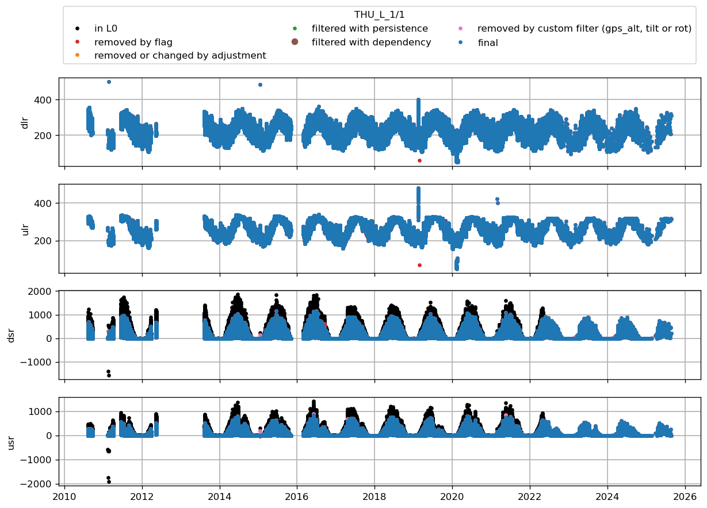

* [THU_L](#s1)
# <a id='s1' />THU_L
| t0                        | t1                        | variable                                        | what was done    | comment                                  |   URL_graphic |
|:--------------------------|:--------------------------|:------------------------------------------------|:-----------------|:-----------------------------------------|--------------:|
| 2012-05-12T00:00:00+00:00 | 2012-05-20T00:00:00+00:00 | z_stake                                         | flag             | flagged by bav                           |           nan |
| 2016-06-01T00:00:00+00:00 | 2016-07-23T00:00:00+00:00 | z_stake                                         | flag             | flagged by bav                           |           nan |
| nan                       | nan                       | z_boom_u                                        | max_filter 2.8   | maximum height of the boom on tripod AWS |           nan |
| nan                       | nan                       | t_i_1 t_i_2 t_i_3 t_i_4 t_i_5 t_i_6 t_i_7 t_i_8 | min_filter -30.0 | nan                                      |           nan |
 

 
