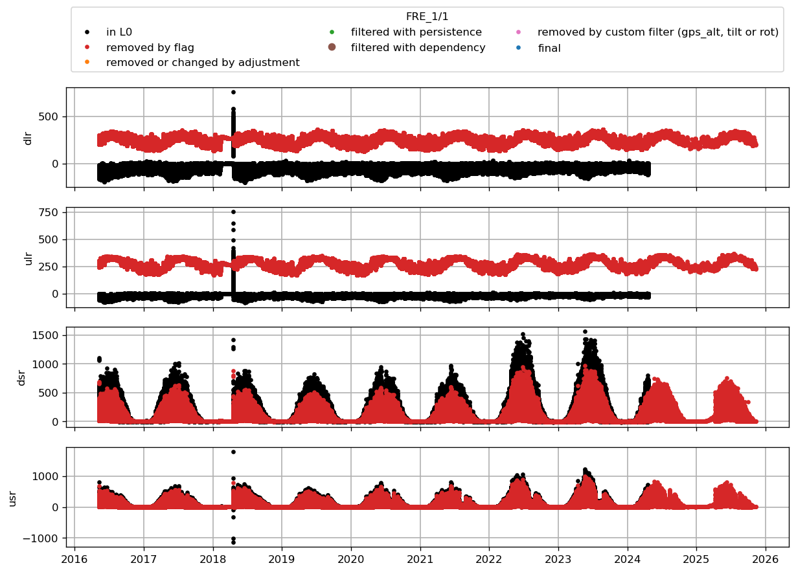

* [FRE](#s1)
# <a id='s1' />FRE
|   t0 |   t1 | variable   | what was done   | comment                                  |   URL_graphic |
|-----:|-----:|:-----------|:----------------|:-----------------------------------------|--------------:|
|  nan |  nan | z_boom_u   | max_filter 3.3  | maximum height of the boom on tripod AWS |           nan |
 

 
