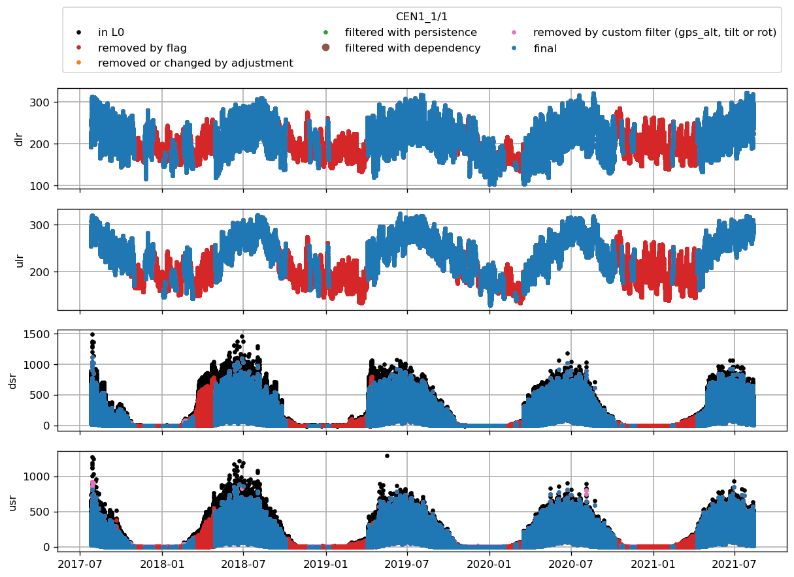
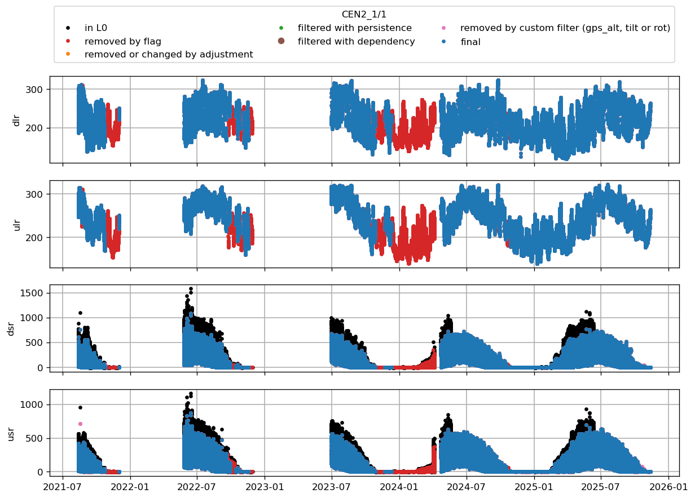
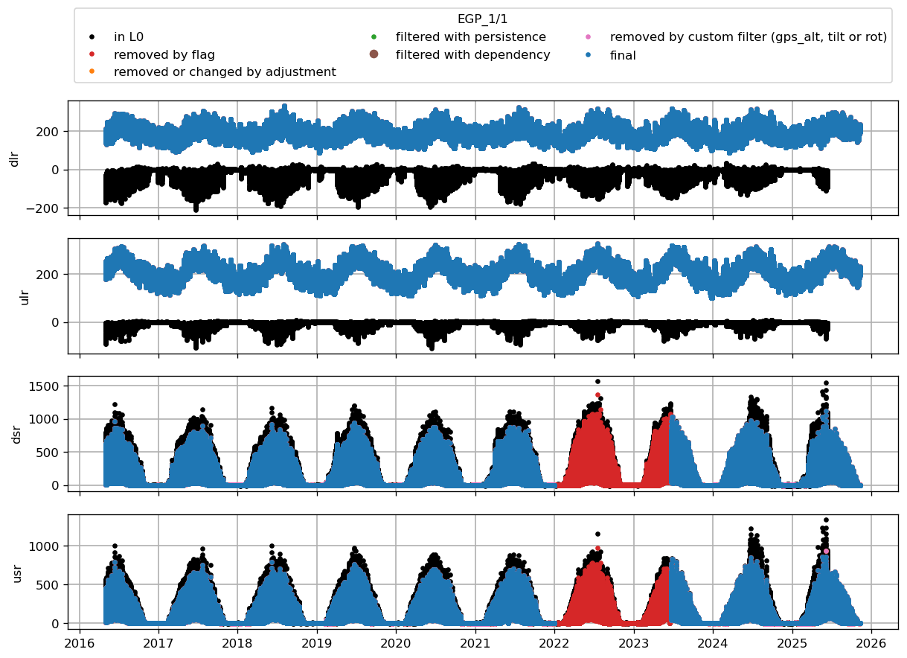

* [CEN1](#s1)
* [CEN2](#s2)
* [EGP](#s3)
z_surf_1 not in variables
z_surf_2 not in variables
# <a id='s1' />CEN1

 
z_surf_1 not in variables
z_surf_2 not in variables
# <a id='s2' />CEN2

 
dsr_cor not in variables
usr_cor not in variables
z_surf_1 not in variables
z_surf_2 not in variables
# <a id='s3' />EGP

 
