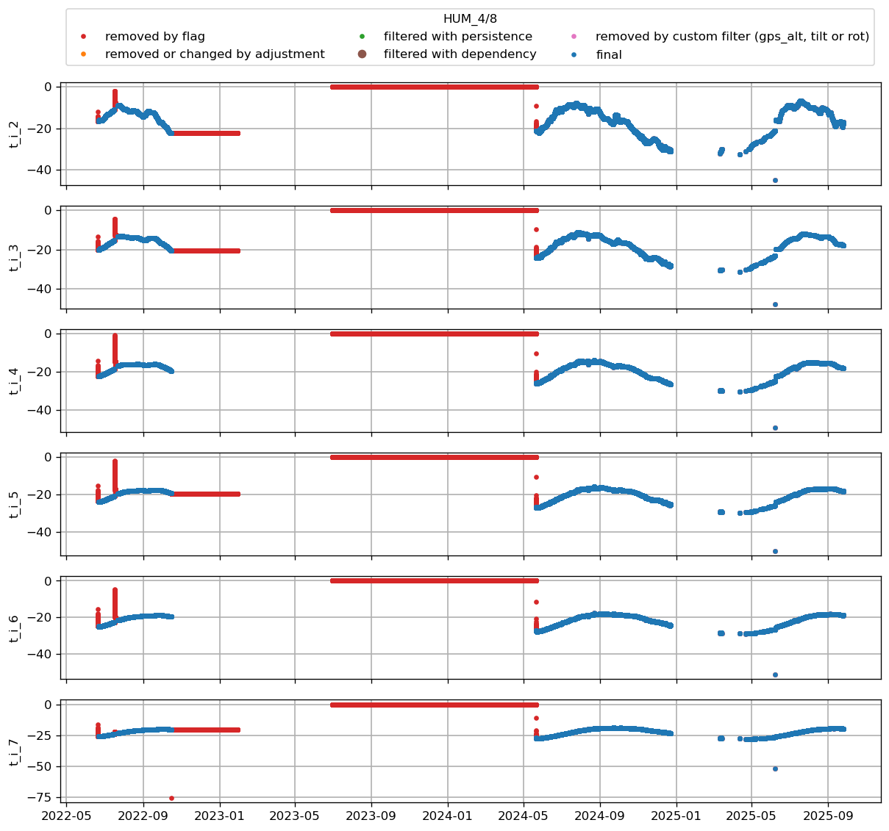
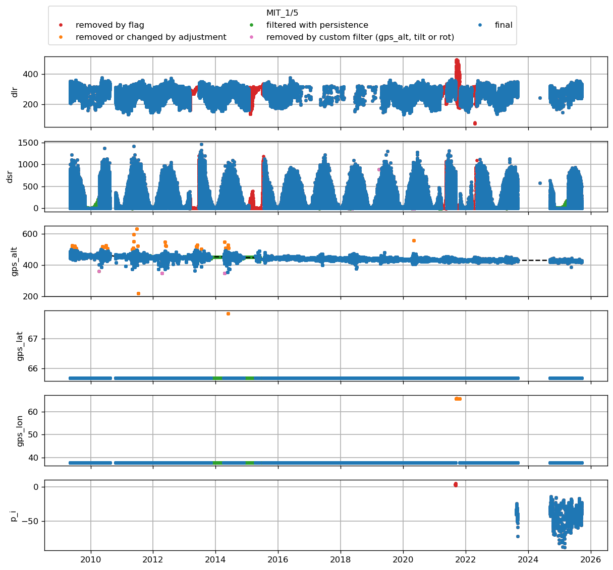
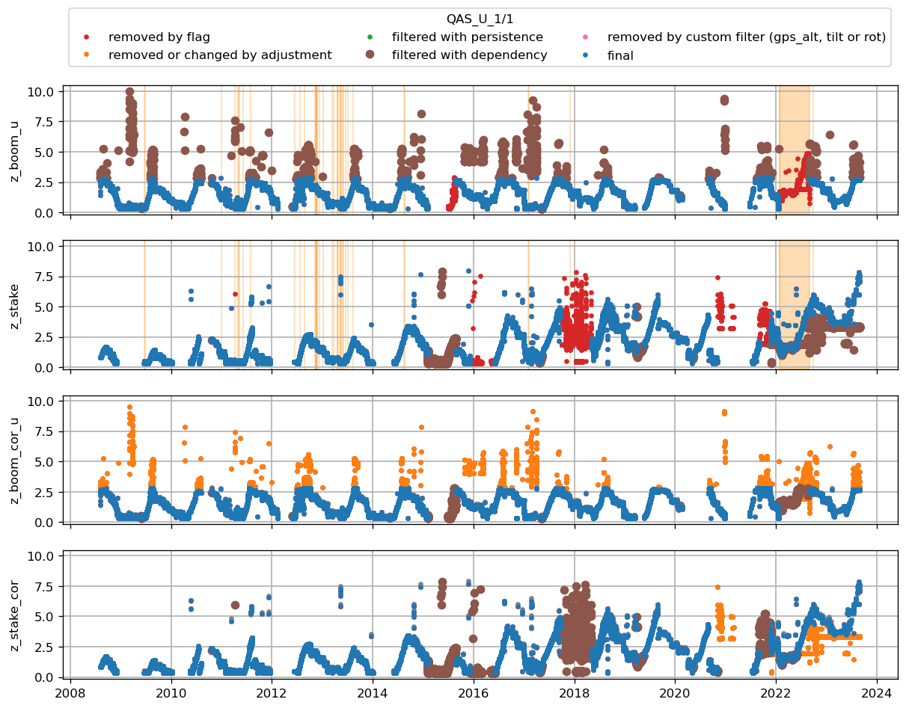
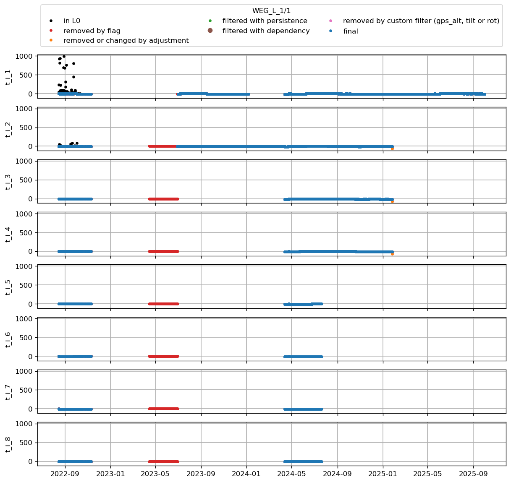
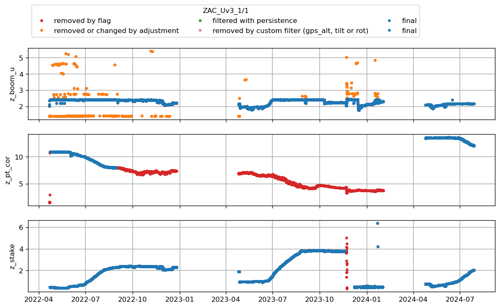

* [CEN1](#s1)
* [CEN2](#s2)
* [CP1](#s3)
* [DY2](#s4)
* [EGP](#s5)
* [FRE](#s6)
* [HUM](#s7)
* [JAR](#s8)
* [JAR_O](#s9)
* [KAN_B](#s10)
* [KAN_L](#s11)
* [KAN_Lv3](#s12)
* [KAN_M](#s13)
* [KAN_Tv3](#s14)
* [KAN_U](#s15)
* [KPC_L](#s16)
* [KPC_Lv3](#s17)
* [KPC_U](#s18)
* [KPC_Uv3](#s19)
* [LYN_L](#s20)
* [LYN_T](#s21)
* [MIT](#s22)
* [NAE](#s23)
* [NAU](#s24)
* [NEM](#s25)
* [NSE](#s26)
* [NUK_B](#s27)
* [NUK_K](#s28)
* [NUK_L](#s29)
* [NUK_N](#s30)
* [NUK_U](#s31)
* [NUK_Uv3](#s32)
* [QAS_A](#s33)
* [QAS_L](#s34)
* [QAS_Lv3](#s35)
* [QAS_M](#s36)
* [QAS_Mv3](#s37)
* [QAS_U](#s38)
* [QAS_Uv3](#s39)
* [Roof_GEUS](#s40)
* [SCO_L](#s41)
* [SCO_U](#s42)
* [SDL](#s43)
* [SDM](#s44)
* [SWC](#s45)
* [SWC_O](#s46)
* [TAS_A](#s47)
* [TAS_L](#s48)
* [TAS_U](#s49)
* [THU_L](#s50)
* [THU_L2](#s51)
* [THU_U](#s52)
* [THU_U2](#s53)
* [TUN](#s54)
* [UPE_L](#s55)
* [UPE_U](#s56)
* [UWN](#s57)
* [WEG_L](#s58)
* [ZAC_Lv3](#s59)
* [ZAC_Uv3](#s60)
z_surf_1 not in variables
z_surf_2 not in variables
# <a id='s1' />CEN1

 
z_surf_1 not in variables
z_surf_2 not in variables
# <a id='s2' />CEN2

 
 not in variables
z_pt not in variables
z_stake not in variables
z_surf_1 not in variables
z_surf_2 not in variables
# <a id='s3' />CP1

 
z_surf_1 not in variables
z_surf_2 not in variables
# <a id='s4' />DY2

 
dsr_cor not in variables
usr_cor not in variables
z_surf_1 not in variables
z_surf_2 not in variables
# <a id='s5' />EGP

 
z_surf_1 not in variables
z_surf_2 not in variables
# <a id='s6' />FRE

 
# <a id='s7' />HUM

 
z_surf_1 not in variables
z_surf_2 not in variables
# <a id='s8' />JAR

 
z_surf_1 not in variables
z_surf_2 not in variables
# <a id='s9' />JAR_O

 
# <a id='s10' />KAN_B

 
z_ice_surf not in variables
z_surf_2 not in variables
# <a id='s11' />KAN_L

 
z_surf_2 not in variables
# <a id='s12' />KAN_Lv3

 
z_ice_surf not in variables
z_surf_2 not in variables
# <a id='s13' />KAN_M

 
# <a id='s14' />KAN_Tv3

 
 not in variables
z_surf_1 not in variables
z_surf_2 not in variables
# <a id='s15' />KAN_U

 
z_ice_surf not in variables
z_surf_2 not in variables
# <a id='s16' />KPC_L

 
z_ice_surf not in variables
# <a id='s17' />KPC_Lv3

 
z_surf_1 not in variables
z_surf_2 not in variables
# <a id='s18' />KPC_U

 
z_surf_2 not in variables
# <a id='s19' />KPC_Uv3

 
# <a id='s20' />LYN_L

 
# <a id='s21' />LYN_T

 
z_ice_surf not in variables
z_surf_2 not in variables
# <a id='s22' />MIT

 
# <a id='s23' />NAE

 
z_surf_1 not in variables
z_surf_2 not in variables
# <a id='s24' />NAU

 
z_surf_1 not in variables
z_surf_2 not in variables
# <a id='s25' />NEM

 
z_surf_1 not in variables
z_surf_2 not in variables
# <a id='s26' />NSE

 
# <a id='s27' />NUK_B

 
z_ice_surf not in variables
z_surf_1 not in variables
z_surf_2 not in variables
# <a id='s28' />NUK_K

 
z_ice_surf not in variables
z_surf_2 not in variables
# <a id='s29' />NUK_L

 
z_ice_surf not in variables
z_surf_2 not in variables
# <a id='s30' />NUK_N

 
t_surf not in variables
z_ice_surf not in variables
z_surf_2 not in variables
# <a id='s31' />NUK_U

 
z_ice_surf not in variables
# <a id='s32' />NUK_Uv3

 
# <a id='s33' />QAS_A

 
z_ice_surf not in variables
z_surf_1 not in variables
z_surf_2 not in variables
# <a id='s34' />QAS_L

 
z_surf_2 not in variables
# <a id='s35' />QAS_Lv3

 
z_ice_surf not in variables
z_surf_2 not in variables
# <a id='s36' />QAS_M

 
z_surf_2 not in variables
# <a id='s37' />QAS_Mv3

 
z_ice_surf not in variables
z_surf_2 not in variables
# <a id='s38' />QAS_U

 
dsr_cor not in variables
usr_cor not in variables
z_surf_1 not in variables
z_surf_2 not in variables
# <a id='s39' />QAS_Uv3

 
# <a id='s40' />Roof_GEUS

 
z_ice_surf not in variables
z_surf_2 not in variables
# <a id='s41' />SCO_L

 
z_ice_surf not in variables
z_surf_2 not in variables
# <a id='s42' />SCO_U

 
z_surf_1 not in variables
z_surf_2 not in variables
# <a id='s43' />SDL

 
z_surf_1 not in variables
z_surf_2 not in variables
# <a id='s44' />SDM

 
# <a id='s45' />SWC

 
z_ice_surf not in variables
z_surf_2 not in variables
# <a id='s46' />SWC_O

 
z_ice_surf not in variables
z_surf_2 not in variables
# <a id='s47' />TAS_A

 
z_ice_surf not in variables
z_surf_2 not in variables
# <a id='s48' />TAS_L

 
z_ice_surf not in variables
z_surf_1 not in variables
z_surf_2 not in variables
# <a id='s49' />TAS_U

 
z_ice_surf not in variables
z_surf_2 not in variables
# <a id='s50' />THU_L

 
z_ice_surf not in variables
z_surf_1 not in variables
z_surf_2 not in variables
# <a id='s51' />THU_L2

 
z_ice_surf not in variables
z_surf_2 not in variables
# <a id='s52' />THU_U

 
z_surf_2 not in variables
# <a id='s53' />THU_U2

 
# <a id='s54' />TUN

 
z_ice_surf not in variables
z_surf_1 not in variables
z_surf_2 not in variables
# <a id='s55' />UPE_L

 
z_ice_surf not in variables
z_surf_2 not in variables
# <a id='s56' />UPE_U

 
# <a id='s57' />UWN

 
z_surf_2 not in variables
# <a id='s58' />WEG_L

 
z_ice_surf not in variables
z_surf_2 not in variables
# <a id='s59' />ZAC_Lv3

 
z_surf_2 not in variables
# <a id='s60' />ZAC_Uv3

 
