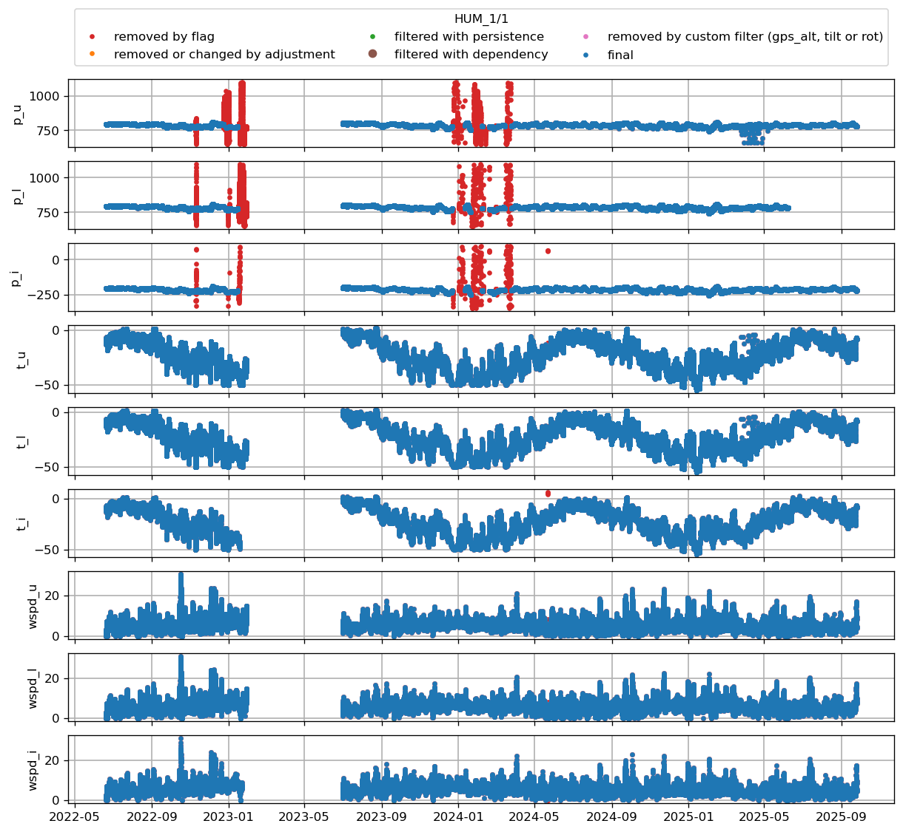
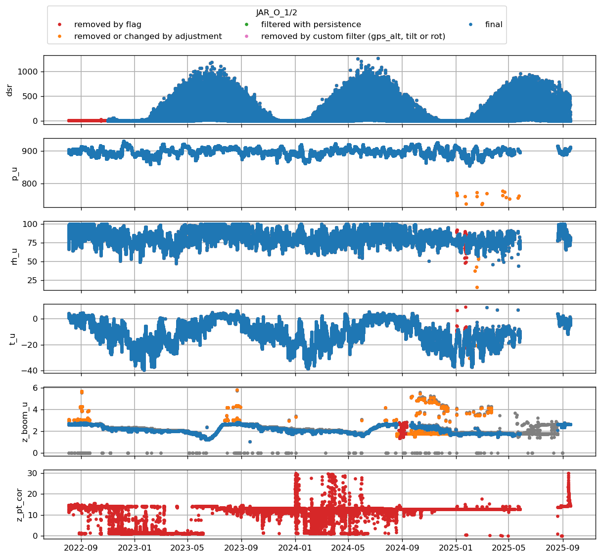
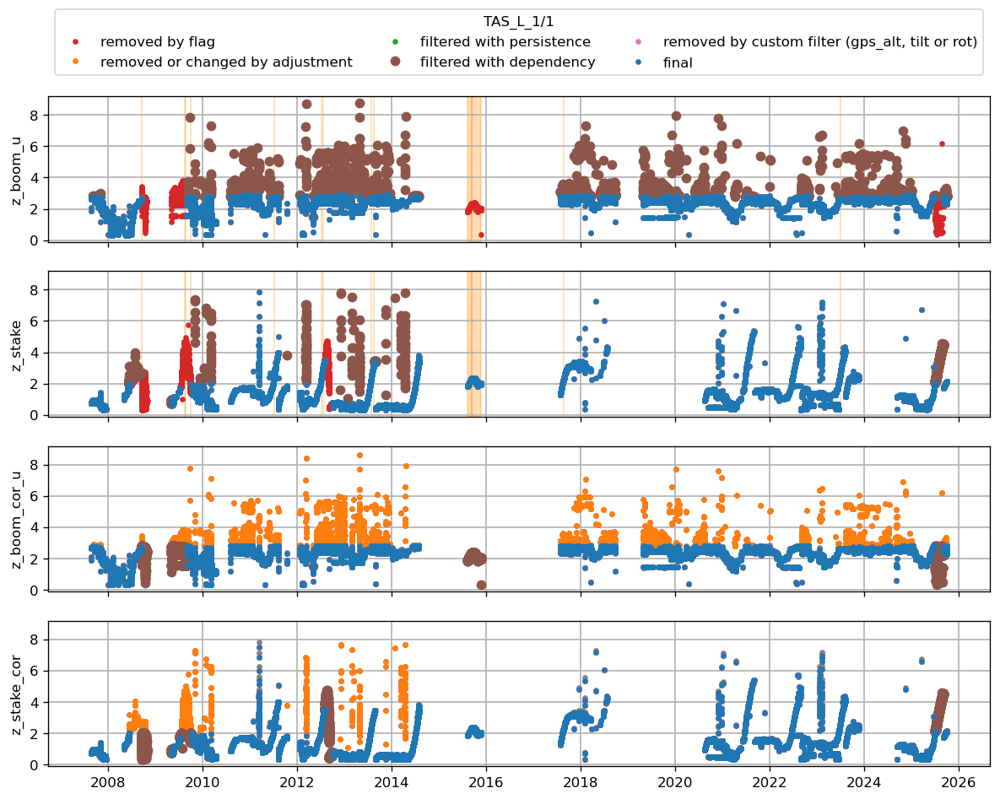

* [CEN1](#s1)
* [CEN2](#s2)
* [CP1](#s3)
* [EGP](#s4)
* [HUM](#s5)
* [JAR_O](#s6)
* [KAN_L](#s7)
* [KAN_M](#s8)
* [KAN_U](#s9)
* [KPC_L](#s10)
* [KPC_U](#s11)
* [KPC_Uv3](#s12)
* [LYN_T](#s13)
* [MIT](#s14)
* [NAU](#s15)
* [NEM](#s16)
* [NSE](#s17)
* [NUK_K](#s18)
* [NUK_L](#s19)
* [NUK_N](#s20)
* [NUK_U](#s21)
* [NUK_Uv3](#s22)
* [QAS_A](#s23)
* [QAS_L](#s24)
* [QAS_Lv3](#s25)
* [QAS_M](#s26)
* [QAS_U](#s27)
* [QAS_Uv3](#s28)
* [Roof_GEUS](#s29)
* [SCO_U](#s30)
* [SDL](#s31)
* [SDM](#s32)
* [SWC_O](#s33)
* [TAS_A](#s34)
* [TAS_L](#s35)
* [THU_L](#s36)
# <a id='s1' />CEN1
| t0                        | t1                        | variable                                        |   flag | comment                              |   URL_graphic |
|:--------------------------|:--------------------------|:------------------------------------------------|-------:|:-------------------------------------|--------------:|
| 2021-07-01T00:00:00+00:00 | nan                       | t_i_1 t_i_2 t_i_3 t_i_4 t_i_5 t_i_6 t_i_7 t_i_8 |    nan | thermistors removed after 2021 (bav) |           nan |
| nan                       | 2017-07-27T00:00:00+00:00 | t_i_1 t_i_2 t_i_3 t_i_4 t_i_5 t_i_6 t_i_7 t_i_8 |    nan | unrealistic values (bav)             |           nan |
 

 
# <a id='s2' />CEN2
|   t0 | t1                        | variable                                                                                                                                                                                                                                                                                                                                                                                                                                                                                                                                                                                 | flag      | comment                                                   | URL_graphic                                 |
|-----:|:--------------------------|:-----------------------------------------------------------------------------------------------------------------------------------------------------------------------------------------------------------------------------------------------------------------------------------------------------------------------------------------------------------------------------------------------------------------------------------------------------------------------------------------------------------------------------------------------------------------------------------------|:----------|:----------------------------------------------------------|:--------------------------------------------|
|  nan | 2021-08-12T20:00:00+00:00 | rec p_l p_u t_l rh_l wspd_l wdir_l t_u rh_u wspd_u wdir_u dsr usr dlr ulr t_rad z_boom_l z_boom_u t_i_1 t_i_2 t_i_3 t_i_4 t_i_5 t_i_6 t_i_7 t_i_8 t_i_9 t_i_10 t_i_11 tilt_y tilt_x rot precip_l precip_u gps_time gps_lat gps_lon gps_alt gps_geoid gps_geounit gps_q gps_numsat gps_hdop fan_dc_l fan_dc_u batt_v t_log rh_u_cor qh_u rh_l_cor qh_l wspd_x_u wspd_y_u wspd_x_l wspd_y_l dsr_cor usr_cor albedo cc t_surf dlhf_u dlhf_l dshf_u dshf_l precip_u_cor precip_u_rate precip_l_cor precip_l_rate msg_lat msg_lon p_i t_i rh_i wspd_i wdir_i msg_i rh_i_cor wspd_x_i wspd_y_i | NAN       | flagged by bav                                            | logger file contains two rows that are test |
|  nan | 2022-06-19T00:00:00+00:00 | t_i_1 t_i_2 t_i_3 t_i_4 t_i_5 t_i_6 t_i_7 t_i_8 t_i_9 t_i_10 t_i_11                                                                                                                                                                                                                                                                                                                                                                                                                                                                                                                      | CONFIRMED | thermistor string not drilled in in 2021 but done in 2022 | nan                                         |
 

 
# <a id='s3' />CP1
| t0                        | t1                        | variable                                                            | flag      | comment                                    | URL_graphic                                                                      |
|:--------------------------|:--------------------------|:--------------------------------------------------------------------|:----------|:-------------------------------------------|:---------------------------------------------------------------------------------|
| 2023-01-02T14:00:00+00:00 | 2023-01-05T00:00:00+00:00 | p_u p_i p_l                                                         | NAN       | flagged by bav                             | https://github.com/GEUS-Glaciology-and-Climate/PROMICE-AWS-data-issues/issues/20 |
| 2023-01-18T00:00:00+00:00 | 2023-01-22T19:00:00+00:00 | p_u                                                                 | NAN       | flagged by bav                             | https://github.com/GEUS-Glaciology-and-Climate/PROMICE-AWS-data-issues/issues/20 |
| 2023-01-19T19:00:00+00:00 | 2023-01-22T19:00:00+00:00 | p_l                                                                 | NAN       | flagged by bav                             | https://github.com/GEUS-Glaciology-and-Climate/PROMICE-AWS-data-issues/issues/20 |
| 2023-01-20T00:00:00+00:00 | 2023-01-22T19:00:00+00:00 | p_i                                                                 | NAN       | flagged by bav                             | https://github.com/GEUS-Glaciology-and-Climate/PROMICE-AWS-data-issues/issues/20 |
| 2022-12-03T00:00:00+00:00 | 2023-06-20T00:00:00+00:00 | t_i_1 t_i_2 t_i_3 t_i_4 t_i_5 t_i_6 t_i_7 t_i_8 t_i_9 t_i_10 t_i_11 | CONFIRMED | all thermistors give 0degC after that date | nan                                                                              |
| nan                       | 2021-06-17T18:00:00+00:00 | z_boom_u z_boom_l                                                   | CONFIRMED | unlikely value during installation         | nan                                                                              |
 

 
# <a id='s4' />EGP
| t0                        | t1                        | variable                                        |   flag | comment                                  |   URL_graphic |
|:--------------------------|:--------------------------|:------------------------------------------------|-------:|:-----------------------------------------|--------------:|
| 2016-05-05T00:00:00+00:00 | 2016-05-21T00:00:00+00:00 | t_i_1 t_i_2 t_i_3 t_i_4 t_i_5 t_i_6 t_i_7 t_i_8 |    nan | string only drilled in on 21st May (bav) |           nan |
| 2020-01-01T00:00:00+00:00 | nan                       | z_stake                                         |    nan | manually flagged by bav                  |           nan |
 

 
# <a id='s5' />HUM
| t0                        | t1                        | variable                                                            | flag      | comment                                        |   URL_graphic |
|:--------------------------|:--------------------------|:--------------------------------------------------------------------|:----------|:-----------------------------------------------|--------------:|
| 2022-10-15T19:00:00+00:00 | 2023-06-30T20:00:00+00:00 | t_i_1 t_i_2 t_i_3 t_i_4 t_i_5 t_i_6 t_i_7 t_i_8 t_i_9 t_i_10 t_i_11 | CONFIRMED | constant ice temperature after that date (bav) |           nan |
 

 
# <a id='s6' />JAR_O
| t0                        | t1                        | variable   | flag      | comment                    |   URL_graphic |
|:--------------------------|:--------------------------|:-----------|:----------|:---------------------------|--------------:|
| 2022-01-01T00:00:00+00:00 | 2023-07-07T00:00:00+00:00 | z_pt_cor   | CONFIRMED | very unlikely values (bav) |           nan |
 

 
# <a id='s7' />KAN_L
| t0                        | t1                        | variable   | flag    | comment                 |   URL_graphic |
|:--------------------------|:--------------------------|:-----------|:--------|:------------------------|--------------:|
| 2009-08-27T00:00:00+00:00 | 2010-06-01T00:00:00+00:00 | z_stake    | CHECKME | manually flagged by bav |           nan |
| 2011-11-01T00:00:00+00:00 | 2012-05-20T00:00:00+00:00 | z_stake    | CHECKME | manually flagged by bav |           nan |
| 2014-06-25T00:00:00+00:00 | 2014-08-15T00:00:00+00:00 | z_stake    | CHECKME | manually flagged by bav |           nan |
| 2015-10-20T00:00:00+00:00 | 2016-07-16T17:00:00+00:00 | z_stake    | CHECKME | manually flagged by bav |           nan |
| 2009-09-17T00:00:00+00:00 | 2009-10-07T00:00:00+00:00 | z_pt_cor   | CHECKME | manually flagged by bav |           nan |
| 2010-10-02T00:00:00+00:00 | 2010-10-12T00:00:00+00:00 | z_pt_cor   | CHECKME | manually flagged by bav |           nan |
| 2012-10-06T00:00:00+00:00 | 2012-10-26T00:00:00+00:00 | z_pt_cor   | CHECKME | manually flagged by bav |           nan |
| 2014-10-08T00:00:00+00:00 | 2014-11-16T00:00:00+00:00 | z_pt_cor   | CHECKME | manually flagged by bav |           nan |
| 2019-10-07T00:00:00+00:00 | 2019-10-27T00:00:00+00:00 | z_pt_cor   | CHECKME | manually flagged by bav |           nan |
| 2021-09-18T00:00:00+00:00 | 2022-06-01T00:00:00+00:00 | z_pt_cor   | CHECKME | manually flagged by bav |           nan |
| 2022-10-01T00:00:00+00:00 | 2022-11-01T00:00:00+00:00 | z_pt_cor   | CHECKME | manually flagged by bav |           nan |
 

 
# <a id='s8' />KAN_M
| t0                        | t1                        | variable                                        | flag      | comment                                                                                   |   URL_graphic |
|:--------------------------|:--------------------------|:------------------------------------------------|:----------|:------------------------------------------------------------------------------------------|--------------:|
| 2010-08-18T00:00:00+00:00 | 2011-04-21T00:00:00+00:00 | z_stake                                         | NAN       | manually flagged by bav                                                                   |           nan |
| 2013-10-28T21:00:00+00:00 | 2013-10-01T00:00:00+00:00 | z_stake                                         | CHECKME   | Manually flagged by bav                                                                   |           nan |
| 2011-11-13T21:00:00+00:00 | 2012-05-03T22:00:00+00:00 | z_stake                                         | CHECKME   | Manually flagged by bav                                                                   |           nan |
| 2014-09-14T00:00:00+00:00 | 2015-06-19T00:00:00+00:00 | z_stake                                         | NAN       | manually flagged by bav                                                                   |           nan |
| 2017-02-10T00:00:00+00:00 | 2017-02-16T00:00:00+00:00 | z_stake                                         | CHECKME   | Manually flagged by bav                                                                   |           nan |
| 2016-07-16T00:00:00+00:00 | 2018-06-01T00:00:00+00:00 | z_stake                                         | NAN       | manually flagged by bav                                                                   |           nan |
| 2014-12-06T20:00:00+00:00 | 2014-12-23T00:00:00+00:00 | z_boom_u                                        | CHECKME   | Manually flagged by bav                                                                   |           nan |
| 2018-06-05T00:00:00+00:00 | 2018-06-09T20:00:00+00:00 | z_boom_u                                        | CHECKME   | Only fragmented observations available while SR50 on stake shows clear accumulation (bav) |           nan |
| 2014-09-17T00:00:00+00:00 | 2015-07-19T00:00:00+00:00 | z_pt_cor                                        | NAN       | showing height decrease at strange month or height increase (bav)                         |           nan |
| nan                       | 2010-05-21T00:00:00+00:00 | t_i_1 t_i_2 t_i_3 t_i_4 t_i_5 t_i_6 t_i_7 t_i_8 | CONFIRMED | no thermistor installed until 2010 (bav)                                                  |           nan |
| 2018-08-29T00:00:00+00:00 | 2022-08-21T00:00:00+00:00 | t_i_1 t_i_2 t_i_3 t_i_4 t_i_5 t_i_6 t_i_7 t_i_8 | NAN       | manually flagged by bav                                                                   |           nan |
 

 
# <a id='s9' />KAN_U
| t0                        | t1                        | variable                |   flag | comment                 | URL_graphic                                                                      |
|:--------------------------|:--------------------------|:------------------------|-------:|:------------------------|:---------------------------------------------------------------------------------|
| 2021-12-20T00:00:00+00:00 | 2023-06-09T04:00:00+00:00 | gps_lon gps_lat gps_alt |    nan | manually flagged by bav | https://github.com/GEUS-Glaciology-and-Climate/PROMICE-AWS-data-issues/issues/50 |
| 2011-05-26T00:00:00+00:00 | 2012-05-03T00:00:00+00:00 | gps_lon gps_lat gps_alt |    nan | manually flagged by bav | https://github.com/GEUS-Glaciology-and-Climate/PROMICE-AWS-data-issues/issues/50 |
| 2015-10-27T00:00:00+00:00 | 2016-04-09T00:00:00+00:00 | gps_lon gps_lat gps_alt |    nan | manually flagged by bav | https://github.com/GEUS-Glaciology-and-Climate/PROMICE-AWS-data-issues/issues/50 |
 

 
# <a id='s10' />KPC_L
| t0                        | t1                        | variable   | flag    | comment                 |   URL_graphic |
|:--------------------------|:--------------------------|:-----------|:--------|:------------------------|--------------:|
| 2012-07-19T00:00:00+00:00 | 2012-07-30T00:00:00+00:00 | z_boom_u   | CHECKME | manually flagged by bav |           nan |
| 2012-07-19T00:00:00+00:00 | 2012-07-21T00:00:00+00:00 | z_pt_cor   | CHECKME | manually flagged by bav |           nan |
| 2019-08-25T12:00:00+00:00 | 2019-08-27T00:00:00+00:00 | z_pt_cor   | CHECKME | manually flagged by bav |           nan |
| 2019-09-07T00:00:00+00:00 | 2019-09-11T00:00:00+00:00 | z_pt_cor   | CHECKME | manually flagged by bav |           nan |
| 2019-09-15T00:00:00+00:00 | 2020-01-01T00:00:00+00:00 | z_pt_cor   | CHECKME | manually flagged by bav |           nan |
| 2020-04-01T00:00:00+00:00 | 2020-06-01T00:00:00+00:00 | z_pt_cor   | CHECKME | manually flagged by bav |           nan |
| 2021-04-01T00:00:00+00:00 | 2021-06-04T00:00:00+00:00 | z_pt_cor   | CHECKME | manually flagged by bav |           nan |
| 2022-04-01T00:00:00+00:00 | 2022-06-04T00:00:00+00:00 | z_pt_cor   | CHECKME | manually flagged by bav |           nan |
| 2009-08-20T00:00:00+00:00 | 2010-01-31T00:00:00+00:00 | z_stake    | CHECKME | manually flagged by bav |           nan |
| 2013-08-27T00:00:00+00:00 | 2016-06-28T00:00:00+00:00 | z_stake    | CHECKME | manually flagged by bav |           nan |
| 2014-07-20T00:00:00+00:00 | 2015-02-28T00:00:00+00:00 | z_stake    | CHECKME | manually flagged by bav |           nan |
| 2020-04-02T15:00:00+00:00 | nan                       | z_stake    | CHECKME | manually flagged by bav |           nan |
 

 
# <a id='s11' />KPC_U
| t0                        |   t1 | variable                                        | flag    | comment                 |   URL_graphic |
|:--------------------------|-----:|:------------------------------------------------|:--------|:------------------------|--------------:|
| 2006-07-10T00:00:00+00:00 |  nan | z_pt_cor                                        | CHECKME | manually flagged by bav |           nan |
| 2019-06-28T00:00:00+00:00 |  nan | t_i_1 t_i_2 t_i_3 t_i_4 t_i_5 t_i_6 t_i_7 t_i_8 | CHECKME | manually flagged by bav |           nan |
 

 
# <a id='s12' />KPC_Uv3
| t0                        | t1                        | variable   | flag    | comment                 |   URL_graphic |
|:--------------------------|:--------------------------|:-----------|:--------|:------------------------|--------------:|
| 2021-07-10T00:00:00+00:00 | 2023-06-10T00:00:00+00:00 | z_pt_cor   | CHECKME | manually flagged by bav |           nan |
 

 
# <a id='s13' />LYN_T
| t0                        | t1                        | variable                                                                       |   flag | comment              | URL_graphic                                                                      |
|:--------------------------|:--------------------------|:-------------------------------------------------------------------------------|-------:|:---------------------|:---------------------------------------------------------------------------------|
| 2023-05-27T00:00:00+00:00 | 2023-07-12T00:00:00+00:00 | rh_u t_u wspd_u wdir_u p_u rh_i t_i wspd_i wdir_i p_i dsr usr dlr ulr z_boom_u |    nan | station fallen (bav) | https://github.com/GEUS-Glaciology-and-Climate/PROMICE-AWS-data-issues/issues/49 |
 

 
# <a id='s14' />MIT
| t0                        | t1                        | variable                                                                       | flag    | comment                 | URL_graphic                                                                      |
|:--------------------------|:--------------------------|:-------------------------------------------------------------------------------|:--------|:------------------------|:---------------------------------------------------------------------------------|
| 2013-03-07T00:00:00+00:00 | 2013-06-21T00:00:00+00:00 | rh_u t_u wspd_u wdir_u p_u rh_i t_i wspd_i wdir_i p_i dsr usr dlr ulr z_boom_u | CHECKME | Manually flagged by bav | nan                                                                              |
| 2015-01-25T11:00:00+00:00 | 2015-07-21T00:00:00+00:00 | rh_u t_u wspd_u wdir_u p_u rh_i t_i wspd_i wdir_i p_i dsr usr dlr ulr z_boom_u | CHECKME | Manually flagged by bav | nan                                                                              |
| 2019-04-01T00:00:00+00:00 | 2019-07-31T00:00:00+00:00 | dlr                                                                            | CHECKME | Manually flagged by bav | nan                                                                              |
| 2008-06-01T00:00:00+00:00 | 2010-01-01T00:00:00+00:00 | z_boom_u                                                                       | CHECKME | Manually flagged by bav | nan                                                                              |
| 2010-12-14T00:00:00+00:00 | 2011-08-12T00:00:00+00:00 | z_stake                                                                        | CHECKME | Manually flagged by bav | nan                                                                              |
| 2012-02-03T00:00:00+00:00 | 2012-06-03T00:00:00+00:00 | z_stake                                                                        | CHECKME | Manually flagged by bav | nan                                                                              |
| 2013-01-01T00:00:00+00:00 | 2013-09-09T00:00:00+00:00 | z_stake                                                                        | CHECKME | Manually flagged by bav | nan                                                                              |
| 2014-09-20T00:00:00+00:00 | 2015-08-14T00:00:00+00:00 | z_stake                                                                        | CHECKME | Manually flagged by bav | nan                                                                              |
| 2015-09-15T00:00:00+00:00 | 2015-12-14T00:00:00+00:00 | z_stake                                                                        | CHECKME | Manually flagged by bav | nan                                                                              |
| 2016-06-15T00:00:00+00:00 | 2016-07-14T00:00:00+00:00 | z_stake                                                                        | CHECKME | Manually flagged by bav | nan                                                                              |
| 2008-06-01T00:00:00+00:00 | 2009-08-12T00:00:00+00:00 | z_pt_cor                                                                       | CHECKME | manually flagged by bav | nan                                                                              |
| 2015-12-31T00:00:00+00:00 | 2016-05-29T00:00:00+00:00 | z_pt_cor                                                                       | CHECKME | manually flagged by bav | nan                                                                              |
| 2016-01-02T00:00:00+00:00 | 2017-07-01T00:00:00+00:00 | z_pt_cor                                                                       | CHECKME | manually flagged by bav | nan                                                                              |
| 2017-10-01T00:00:00+00:00 | 2018-07-01T00:00:00+00:00 | z_pt_cor                                                                       | CHECKME | manually flagged by bav | nan                                                                              |
| 2018-10-01T00:00:00+00:00 | 2018-11-01T00:00:00+00:00 | z_pt_cor                                                                       | CHECKME | manually flagged by bav | nan                                                                              |
| 2019-01-02T00:00:00+00:00 | 2019-07-01T00:00:00+00:00 | z_pt_cor                                                                       | CHECKME | manually flagged by bav | nan                                                                              |
| 2019-09-10T00:00:00+00:00 | 2020-05-01T00:00:00+00:00 | z_pt_cor                                                                       | CHECKME | manually flagged by bav | nan                                                                              |
| 2020-09-10T00:00:00+00:00 | 2021-05-01T00:00:00+00:00 | z_pt_cor                                                                       | CHECKME | manually flagged by bav | nan                                                                              |
| 2021-09-01T00:00:00+00:00 | nan                       | wspd_i wspd_u                                                                  | NAN     | manually flagged by bav | https://github.com/GEUS-Glaciology-and-Climate/PROMICE-AWS-data-issues/issues/54 |
| 2023-08-01T00:00:00+00:00 | nan                       | t_i rh_i                                                                       | NAN     | manually flagged by bav | https://github.com/GEUS-Glaciology-and-Climate/PROMICE-AWS-data-issues/issues/54 |
 

 
# <a id='s15' />NAU
| t0                        | t1                        | variable    |   flag | comment        | URL_graphic                                                                      |
|:--------------------------|:--------------------------|:------------|-------:|:---------------|:---------------------------------------------------------------------------------|
| 2022-12-23T00:00:00+00:00 | 2022-12-28T00:00:00+00:00 | p_u p_i p_l |    nan | flagged by bav | https://github.com/GEUS-Glaciology-and-Climate/PROMICE-AWS-data-issues/issues/21 |
| 2022-12-30T20:00:00+00:00 | 2023-04-04T00:00:00+00:00 | p_u p_i p_l |    nan | flagged by bav | https://github.com/GEUS-Glaciology-and-Climate/PROMICE-AWS-data-issues/issues/21 |
| 2021-12-08T00:00:00+00:00 | 2021-12-21T00:00:00+00:00 | t_i_11      |    nan | flagged by bav | nan                                                                              |
 

 
# <a id='s16' />NEM
| t0                        | t1                        | variable             |   flag | comment        | URL_graphic                                                                      |
|:--------------------------|:--------------------------|:---------------------|-------:|:---------------|:---------------------------------------------------------------------------------|
| 2022-10-31T06:00:00+00:00 | 2022-11-26T03:00:00+00:00 | wspd_u wspd_l wspd_i |    nan | flagged by bav | https://github.com/GEUS-Glaciology-and-Climate/PROMICE-AWS-data-issues/issues/51 |
| 2023-04-29T06:00:00+00:00 | nan                       | wdir_l wdir_i        |    nan | flagged by bav | https://github.com/GEUS-Glaciology-and-Climate/PROMICE-AWS-data-issues/issues/51 |
 

 
# <a id='s17' />NSE
| t0                        | t1                        | variable   |   flag | comment        | URL_graphic                                                                      |
|:--------------------------|:--------------------------|:-----------|-------:|:---------------|:---------------------------------------------------------------------------------|
| 2022-03-26T06:00:00+00:00 | 2022-10-20T03:00:00+00:00 | p_u        |    nan | flagged by bav | https://github.com/GEUS-Glaciology-and-Climate/PROMICE-AWS-data-issues/issues/24 |
| 2023-01-03T06:00:00+00:00 | 2023-01-13T22:00:00+00:00 | p_u        |    nan | flagged by bav | https://github.com/GEUS-Glaciology-and-Climate/PROMICE-AWS-data-issues/issues/24 |
| 2023-01-18T01:00:00+00:00 | 2023-01-22T13:00:00+00:00 | p_u        |    nan | flagged by bav | https://github.com/GEUS-Glaciology-and-Climate/PROMICE-AWS-data-issues/issues/24 |
| 2022-03-26T06:00:00+00:00 | 2022-10-20T03:00:00+00:00 | rh_u       |    nan | flagged by bav | https://github.com/GEUS-Glaciology-and-Climate/PROMICE-AWS-data-issues/issues/24 |
 

 
# <a id='s18' />NUK_K
| t0                        | t1                        | variable        | flag    | comment                 |   URL_graphic |
|:--------------------------|:--------------------------|:----------------|:--------|:------------------------|--------------:|
| 2015-04-01T00:00:00+00:00 | 2015-06-20T00:00:00+00:00 | dsr usr dlr ulr | NAN     | Manually flagged by bav |           nan |
| 2015-10-17T00:00:00+00:00 | 2016-01-16T00:00:00+00:00 | wspd_u wdir_u   | NAN     | Manually flagged by bav |           nan |
| 2017-04-01T16:00:00+00:00 | 2017-05-10T00:00:00+00:00 | dsr usr dlr ulr | CHECKME | Manually flagged by bav |           nan |
| 2020-09-01T00:00:00+00:00 | 2021-07-01T00:00:00+00:00 | z_pt_cor        | CHECKME | manually flagged by bav |           nan |
 

 
# <a id='s19' />NUK_L
| t0                        | t1                        | variable                                                                       | flag                      | comment                                                                          | URL_graphic                                                                      |
|:--------------------------|:--------------------------|:-------------------------------------------------------------------------------|:--------------------------|:---------------------------------------------------------------------------------|:---------------------------------------------------------------------------------|
| 2010-07-25T00:00:00+00:00 | 2011-08-25T17:00:00+00:00 | rh_u t_u wspd_u wdir_u p_u rh_i t_i wspd_i wdir_i p_i dsr usr dlr ulr z_boom_u | NAN                       | station fallen (bav confirmed with field notes)                                  | https://github.com/GEUS-Glaciology-and-Climate/PROMICE-AWS-data-issues/issues/43 |
| 2013-01-23T10:00:00+00:00 | 2013-07-23T19:00:00+00:00 | rh_u t_u wspd_u wdir_u p_u rh_i t_i wspd_i wdir_i p_i dsr usr dlr ulr z_boom_u | NAN                       | station fallen (bav confirmed with field notes)                                  | https://github.com/GEUS-Glaciology-and-Climate/PROMICE-AWS-data-issues/issues/43 |
| 2021-09-01T00:00:00+00:00 | nan                       | rh_u rh_i                                                                      | suspiciously low rh (bav) | https://github.com/GEUS-Glaciology-and-Climate/PROMICE-AWS-data-issues/issues/53 | nan                                                                              |
| 2010-09-22T00:00:00+00:00 | 2010-10-18T00:00:00+00:00 | z_pt_cor                                                                       | CHECKME                   | manually flagged by bav                                                          | nan                                                                              |
| 2018-02-10T00:00:00+00:00 | 2018-07-16T00:00:00+00:00 | z_pt_cor                                                                       | CHECKME                   | manually flagged by bav                                                          | nan                                                                              |
| nan                       | 2011-08-27T00:00:00+00:00 | z_surf_1                                                                       | CHECKME                   | manually flagged by bav                                                          | nan                                                                              |
| 2013-01-24T00:00:00+00:00 | 2014-07-31T00:00:00+00:00 | z_boom_u                                                                       | CHECKME                   | manually flagged by bav                                                          | nan                                                                              |
| 2018-07-16T00:00:00+00:00 | 2019-12-31T00:00:00+00:00 | z_boom_u                                                                       | CHECKME                   | manually flagged by bav                                                          | nan                                                                              |
| 2010-07-24T00:00:00+00:00 | 2011-08-30T00:00:00+00:00 | z_boom_u                                                                       | CHECKME                   | manually flagged by bav                                                          | nan                                                                              |
| 2008-06-16T00:00:00+00:00 | 2008-07-31T00:00:00+00:00 | z_stake                                                                        | CHECKME                   | manually flagged by bav                                                          | nan                                                                              |
| 2010-07-19T00:00:00+00:00 | 2012-08-21T00:00:00+00:00 | z_stake                                                                        | CHECKME                   | manually flagged by bav                                                          | nan                                                                              |
| 2013-11-03T00:00:00+00:00 | 2014-07-25T00:00:00+00:00 | z_stake                                                                        | CHECKME                   | manually flagged by bav                                                          | nan                                                                              |
| 2015-06-15T00:00:00+00:00 | 2015-07-23T00:00:00+00:00 | z_stake                                                                        | CHECKME                   | manually flagged by bav                                                          | nan                                                                              |
| 2016-08-01T00:00:00+00:00 | 2017-04-26T00:00:00+00:00 | z_stake                                                                        | CHECKME                   | noisy and SR50 on station has better quality (bav)                               | nan                                                                              |
| 2017-11-24T00:00:00+00:00 | 2018-05-16T00:00:00+00:00 | z_stake                                                                        | CHECKME                   | manually flagged by bav                                                          | nan                                                                              |
| 2019-07-01T00:00:00+00:00 | 2019-09-18T00:00:00+00:00 | z_stake                                                                        | CHECKME                   | manually flagged by bav                                                          | nan                                                                              |
 

 
# <a id='s20' />NUK_N
| t0                        | t1                        | variable          | flag    | comment                 |   URL_graphic |
|:--------------------------|:--------------------------|:------------------|:--------|:------------------------|--------------:|
| nan                       | 2011-08-01T00:00:00+00:00 | z_stake           | CHECKME | manually flagged by bav |           nan |
| nan                       | 2011-04-01T00:00:00+00:00 | z_pt_cor          | CHECKME | manually flagged by bav |           nan |
| 2011-10-01T00:00:00+00:00 | 2011-12-01T00:00:00+00:00 | z_pt_cor          | CHECKME | manually flagged by bav |           nan |
| 2012-08-29T00:00:00+00:00 | 2013-07-21T15:00:00+00:00 | z_pt_cor          | CHECKME | manually flagged by bav |           nan |
| 2011-06-18T00:00:00+00:00 | 2012-08-31T00:00:00+00:00 | t_i_1 t_i_2 t_i_3 | CHECKME | manually flagged by bav |           nan |
| 2011-08-01T00:00:00+00:00 | 2012-08-31T00:00:00+00:00 | t_i_4 t_i_5       | CHECKME | manually flagged by bav |           nan |
| 2011-07-05T00:00:00+00:00 | 2012-08-31T00:00:00+00:00 | t_i_7             | CHECKME | manually flagged by bav |           nan |
 

 
# <a id='s21' />NUK_U
| t0                        | t1                        | variable                                        | flag    | comment                                                                  |   URL_graphic |
|:--------------------------|:--------------------------|:------------------------------------------------|:--------|:-------------------------------------------------------------------------|--------------:|
| 2010-06-22T00:00:00+00:00 | 2010-07-31T00:00:00+00:00 | z_pt_cor                                        | CHECKME | PT increasing height while sonice ranger indicate pursued ablation (bav) |           nan |
| 2011-10-02T00:00:00+00:00 | 2011-10-27T00:00:00+00:00 | z_pt_cor                                        | CHECKME | manually flagged by bav                                                  |           nan |
| 2014-02-09T00:00:00+00:00 | 2014-04-10T00:00:00+00:00 | z_pt_cor                                        | CHECKME | manually flagged by bav                                                  |           nan |
| 2016-09-21T00:00:00+00:00 | 2016-10-26T00:00:00+00:00 | z_pt_cor                                        | CHECKME | manually flagged by bav                                                  |           nan |
| 2011-05-01T00:00:00+00:00 | 2011-06-11T00:00:00+00:00 | z_boom_u                                        | CHECKME | manually flagged by bav                                                  |           nan |
| 2011-06-15T00:00:00+00:00 | 2011-08-24T00:00:00+00:00 | z_stake                                         | CHECKME | noisy while PT shows clear ablation (bav)                                |           nan |
| 2014-12-05T00:00:00+00:00 | 2015-04-06T00:00:00+00:00 | z_stake                                         | CHECKME | noisy while SR50 on station has good quality (bav)                       |           nan |
| 2020-11-03T00:00:00+00:00 | 2021-09-11T00:00:00+00:00 | z_stake                                         | CHECKME | noisy while SR50 on station has good quality (bav)                       |           nan |
| 2008-08-01T00:00:00+00:00 | 2009-01-01T00:00:00+00:00 | t_i_1 t_i_2 t_i_3 t_i_4 t_i_5 t_i_6 t_i_7 t_i_8 | NAN     | manually flagged (bav)                                                   |           nan |
| 2010-08-07T00:00:00+00:00 | 2011-05-08T00:00:00+00:00 | t_i_1 t_i_2 t_i_3 t_i_4 t_i_5 t_i_6 t_i_7 t_i_8 | NAN     | manually flagged (bav)                                                   |           nan |
| 2012-08-01T00:00:00+00:00 | 2013-08-01T00:00:00+00:00 | t_i_7                                           | NAN     | manually flagged (bav)                                                   |           nan |
 

 
# <a id='s22' />NUK_Uv3
| t0                        | t1                        | variable   | flag      | comment                                  |   URL_graphic |
|:--------------------------|:--------------------------|:-----------|:----------|:-----------------------------------------|--------------:|
| 2021-09-22T00:00:00+00:00 | 2021-11-01T00:00:00+00:00 | z_pt_cor   | CONFIRMED | unlikely peak (bav)                      |           nan |
| 2020-01-01T00:00:00+00:00 | 2023-01-01T00:00:00+00:00 | t_i_8      | CHECKME   | increasing constently through the summer |           nan |
 

 
# <a id='s23' />QAS_A
| t0                        | t1                        | variable                                                                       |   flag | comment                              | URL_graphic                                                                      |
|:--------------------------|:--------------------------|:-------------------------------------------------------------------------------|-------:|:-------------------------------------|:---------------------------------------------------------------------------------|
| 2015-01-26T00:00:00+00:00 | 2015-08-15T12:00:00+00:00 | rh_u t_u wspd_u wdir_u p_u rh_i t_i wspd_i wdir_i p_i dsr usr dlr ulr z_boom_u |    nan | station buried (visible from z_boom) | https://github.com/GEUS-Glaciology-and-Climate/PROMICE-AWS-data-issues/issues/42 |
 

 
# <a id='s24' />QAS_L
| t0                        | t1                        | variable                                        | flag    | comment                 |   URL_graphic |
|:--------------------------|:--------------------------|:------------------------------------------------|:--------|:------------------------|--------------:|
| 2013-06-09T00:00:00+00:00 | 2013-07-01T00:00:00+00:00 | z_pt_cor                                        | CHECKME | manually flagged by bav |           nan |
| 2019-05-20T00:00:00+00:00 | 2019-06-24T00:00:00+00:00 | z_pt_cor                                        | CHECKME | manually flagged by bav |           nan |
| 2021-05-12T00:00:00+00:00 | 2021-06-16T00:00:00+00:00 | z_pt_cor                                        | CHECKME | manually flagged by bav |           nan |
| 2018-08-24T00:00:00+00:00 | 2019-08-28T00:00:00+00:00 | t_i_1 t_i_2 t_i_3 t_i_4 t_i_5 t_i_6 t_i_7 t_i_8 | CHECKME | manually flagged by bav |           nan |
| 2017-10-27T00:00:00+00:00 | 2018-01-08T00:00:00+00:00 | z_stake                                         | CHECKME | manually flagged by bav |           nan |
| 2010-12-15T00:00:00+00:00 | 2011-08-11T00:00:00+00:00 | z_stake                                         | CHECKME | manually flagged by bav |           nan |
| 2007-11-06T00:00:00+00:00 | 2008-08-01T00:00:00+00:00 | z_stake                                         | CHECKME | manually flagged by bav |           nan |
| 2010-10-28T00:00:00+00:00 | 2011-10-01T00:00:00+00:00 | z_surf_1                                        | CHECKME | manually flagged by bav |           nan |
| 2022-09-01T00:00:00+00:00 | nan                       | t_i_8                                           | CHECKME | manually flagged (bav)  |           nan |
 

 
# <a id='s25' />QAS_Lv3
|   t0 |   t1 | variable                                        | flag      | comment                                       |   URL_graphic |
|-----:|-----:|:------------------------------------------------|:----------|:----------------------------------------------|--------------:|
|  nan |  nan | t_i_1 t_i_2 t_i_3 t_i_4 t_i_5 t_i_6 t_i_7 t_i_8 | CONFIRMED | positive ice temperature from begininng (bav) |           nan |
 

 
# <a id='s26' />QAS_M
| t0                        | t1                        | variable                                        | flag    | comment                                         |   URL_graphic |
|:--------------------------|:--------------------------|:------------------------------------------------|:--------|:------------------------------------------------|--------------:|
| 2017-07-15T00:00:00+00:00 | 2017-08-08T00:00:00+00:00 | z_pt_cor                                        | CHECKME | manually flagged by bav                         |           nan |
| 2017-11-11T00:00:00+00:00 | 2017-12-06T00:00:00+00:00 | z_pt_cor                                        | CHECKME | manually flagged by bav                         |           nan |
| 2018-08-30T00:00:00+00:00 | 2018-08-31T23:00:00+00:00 | z_pt_cor                                        | CHECKME | manually flagged by bav                         |           nan |
| 2017-12-15T00:00:00+00:00 | 2018-02-15T00:00:00+00:00 | z_stake                                         | CHECKME | manually flagged by bav                         |           nan |
| 2018-12-30T00:00:00+00:00 | 2019-01-10T00:00:00+00:00 | z_stake                                         | CHECKME | manually flagged by bav                         |           nan |
| 2019-08-29T00:00:00+00:00 | 2019-12-06T00:00:00+00:00 | z_stake                                         | CHECKME | manually flagged by bav                         |           nan |
| 2019-01-29T00:00:00+00:00 | 2019-02-15T00:00:00+00:00 | z_boom_u                                        | CHECKME | manually flagged by bav                         |           nan |
| 2017-05-18T00:00:00+00:00 | 2017-08-27T00:00:00+00:00 | t_i_1 t_i_2 t_i_3 t_i_4 t_i_5 t_i_6 t_i_7 t_i_8 | CHECKME | manually flagged by bav                         |           nan |
| 2017-10-01T00:00:00+00:00 | 2018-09-18T00:00:00+00:00 | t_i_7                                           | CHECKME | erroneous positive temperatures in winter (bav) |           nan |
 

 
# <a id='s27' />QAS_U
| t0                        | t1                        | variable                                                                       |   flag | comment                                         | URL_graphic                                                                      |
|:--------------------------|:--------------------------|:-------------------------------------------------------------------------------|-------:|:------------------------------------------------|:---------------------------------------------------------------------------------|
| 2008-10-15T00:00:00+00:00 | 2009-02-18T00:00:00+00:00 | z_pt_cor                                                                       |    nan | increasing noisy values manually flagged by bav | nan                                                                              |
| 2010-10-19T00:00:00+00:00 | 2010-10-22T00:00:00+00:00 | z_pt_cor                                                                       |    nan | noisy values manually flagged by bav            | nan                                                                              |
| 2016-08-10T00:00:00+00:00 | 2017-05-20T00:00:00+00:00 | z_pt_cor                                                                       |    nan | noisy values manually flagged by bav            | nan                                                                              |
| 2020-08-29T12:00:00+00:00 | 2021-10-01T00:00:00+00:00 | z_pt_cor                                                                       |    nan | noisy values manually flagged by bav            | nan                                                                              |
| 2020-11-03T06:00:00+00:00 | 2021-04-01T00:00:00+00:00 | z_stake                                                                        |    nan | noisy values manually flagged by bav            | nan                                                                              |
| 2015-02-04T00:00:00+00:00 | 2015-08-23T12:00:00+00:00 | rh_u t_u wspd_u wdir_u p_u rh_i t_i wspd_i wdir_i p_i dsr usr dlr ulr z_boom_u |    nan | station fallen (bav confirmed with field notes) | https://github.com/GEUS-Glaciology-and-Climate/PROMICE-AWS-data-issues/issues/44 |
 

 
# <a id='s28' />QAS_Uv3
| t0                        | t1                        | variable                                        | flag      | comment                                        |   URL_graphic |
|:--------------------------|:--------------------------|:------------------------------------------------|:----------|:-----------------------------------------------|--------------:|
| 2020-01-01T00:00:00+00:00 | 2023-05-01T00:00:00+00:00 | z_pt_cor                                        | CHECKME   | manually flagged by bav                        |           nan |
| 2022-12-01T07:00:00+00:00 | nan                       | t_i_1 t_i_2 t_i_3 t_i_4 t_i_5 t_i_6 t_i_7 t_i_8 | CONFIRMED | constant ice temperature after that date (bav) |           nan |
 

 
# <a id='s29' />Roof_GEUS
| t0                        | t1                        | variable      |   flag | comment        | URL_graphic                                                                      |
|:--------------------------|:--------------------------|:--------------|-------:|:---------------|:---------------------------------------------------------------------------------|
| 2022-11-09T12:00:00+00:00 | 2022-11-10T07:00:00+00:00 | wdir_l wspd_l |    nan | flagged by bav | https://github.com/GEUS-Glaciology-and-Climate/PROMICE-AWS-data-issues/issues/13 |
 

 
# <a id='s30' />SCO_U
| t0                        | t1                        | variable   | flag    | comment                 |   URL_graphic |
|:--------------------------|:--------------------------|:-----------|:--------|:------------------------|--------------:|
| 2009-10-27T00:00:00+00:00 | 2009-11-26T00:00:00+00:00 | z_pt_cor   | CHECKME | manually flagged by bav |           nan |
| 2011-09-07T00:00:00+00:00 | 2011-09-27T00:00:00+00:00 | z_pt_cor   | CHECKME | manually flagged by bav |           nan |
| 2020-10-24T00:00:00+00:00 | 2021-04-17T00:00:00+00:00 | z_pt_cor   | CHECKME | manually flagged by bav |           nan |
| 2021-09-03T00:00:00+00:00 | 2022-06-05T00:00:00+00:00 | z_pt_cor   | CHECKME | manually flagged by bav |           nan |
| 2008-06-07T00:00:00+00:00 | 2008-09-11T00:00:00+00:00 | z_surf_1   | CHECKME | manually flagged by bav |           nan |
| 2011-08-25T00:00:00+00:00 | 2012-08-29T00:00:00+00:00 | z_stake    | CHECKME | manually flagged by bav |           nan |
| 2014-06-29T00:00:00+00:00 | 2014-10-29T00:00:00+00:00 | z_stake    | CHECKME | manually flagged by bav |           nan |
| 2014-06-29T00:00:00+00:00 | 2014-10-29T00:00:00+00:00 | z_stake    | CHECKME | manually flagged by bav |           nan |
 

 
# <a id='s31' />SDL
| t0                        |   t1 | variable   |   flag | comment          | URL_graphic                                                                      |
|:--------------------------|-----:|:-----------|-------:|:-----------------|:---------------------------------------------------------------------------------|
| 2023-06-24T10:00:00+00:00 |  nan | p_l rh_l   |    nan | flagged by rabni | https://github.com/GEUS-Glaciology-and-Climate/PROMICE-AWS-data-issues/issues/52 |
 

 
# <a id='s32' />SDM
| t0                        | t1                        | variable                                              |   flag | comment                      | URL_graphic                                                                      |
|:--------------------------|:--------------------------|:------------------------------------------------------|-------:|:-----------------------------|:---------------------------------------------------------------------------------|
| 2023-02-27T00:00:00+00:00 | 2023-06-11T16:00:00+00:00 | rh_l t_l wspd_l wdir_l p_l rh_i t_i wspd_i wdir_i p_i |    nan | lower level buired (bav)     | https://github.com/GEUS-Glaciology-and-Climate/PROMICE-AWS-data-issues/issues/48 |
| 2022-03-14T06:00:00+00:00 | 2022-06-22T07:00:00+00:00 | rh_u t_u p_u                                          |    nan | upper luft not working (bav) | https://github.com/GEUS-Glaciology-and-Climate/PROMICE-AWS-data-issues/issues/48 |
| 2022-10-14T06:00:00+00:00 | 2023-06-11T16:00:00+00:00 | rh_u t_u p_u                                          |    nan | upper luft not working (bav) | https://github.com/GEUS-Glaciology-and-Climate/PROMICE-AWS-data-issues/issues/48 |
 

 
# <a id='s33' />SWC_O
| t0                        | t1                        | variable                                        |   flag | comment                 |   URL_graphic |
|:--------------------------|:--------------------------|:------------------------------------------------|-------:|:------------------------|--------------:|
| nan                       | 2022-08-05T00:00:00+00:00 | t_i_1 t_i_2 t_i_3 t_i_4 t_i_5 t_i_6 t_i_7 t_i_8 |    nan | manually flagged by bav |           nan |
| 2022-12-03T00:00:00+00:00 | nan                       | t_i_1 t_i_2 t_i_3 t_i_4 t_i_5 t_i_6 t_i_7 t_i_8 |    nan | manually flagged by bav |           nan |
 

 
# <a id='s34' />TAS_A
| t0                        | t1                        | variable                                                                       | flag      | comment                 | URL_graphic                                                                      |
|:--------------------------|:--------------------------|:-------------------------------------------------------------------------------|:----------|:------------------------|:---------------------------------------------------------------------------------|
| 2017-12-20T00:00:00+00:00 | 2018-09-01T00:00:00+00:00 | rh_u t_u wspd_u wdir_u p_u rh_i t_i wspd_i wdir_i p_i dsr usr dlr ulr z_boom_u | NAN       | station fallen (bav)    | https://github.com/GEUS-Glaciology-and-Climate/PROMICE-AWS-data-issues/issues/30 |
| 2022-03-04T00:00:00+00:00 | 2022-09-03T00:00:00+00:00 | t_u t_i rh_u rh_i p_u p_i dsr usr dlr ulr wspd_u wspd_i wdir_u wdir_i z_boom_u | CONFIRMED | flagged by bav          | https://github.com/GEUS-Glaciology-and-Climate/PROMICE-AWS-data-issues/issues/30 |
| 2014-01-01T00:00:00+00:00 | 2014-05-07T00:00:00+00:00 | z_stake                                                                        | CHECKME   | manually flagged by bav | nan                                                                              |
| 2016-08-10T00:00:00+00:00 | 2016-08-14T00:00:00+00:00 | z_stake                                                                        | CHECKME   | manually flagged by bav | nan                                                                              |
| 2018-04-10T00:00:00+00:00 | 2018-06-05T00:00:00+00:00 | z_stake                                                                        | CHECKME   | manually flagged by bav | nan                                                                              |
| 2018-12-14T00:00:00+00:00 | 2019-02-11T00:00:00+00:00 | z_stake                                                                        | CHECKME   | manually flagged by bav | nan                                                                              |
| 2017-08-13T00:00:00+00:00 | 2018-10-02T15:00:00+00:00 | z_boom_u                                                                       | CHECKME   | manually flagged by bav | nan                                                                              |
| 2022-01-23T00:00:00+00:00 | 2022-04-02T15:00:00+00:00 | z_boom_u                                                                       | CHECKME   | manually flagged by bav | nan                                                                              |
| 2017-10-07T00:00:00+00:00 | 2017-11-26T00:00:00+00:00 | z_pt_cor                                                                       | CHECKME   | manually flagged by bav | nan                                                                              |
| 2017-11-24T00:00:00+00:00 | 2018-10-14T00:00:00+00:00 | z_pt_cor                                                                       | CHECKME   | manually flagged by bav | nan                                                                              |
| 2021-09-17T00:00:00+00:00 | 2022-02-01T00:00:00+00:00 | z_pt_cor                                                                       | CONFIRMED | flagged by bav          | nan                                                                              |
| 2022-09-01T00:00:00+00:00 | 2023-05-01T00:00:00+00:00 | z_pt_cor                                                                       | CONFIRMED | flagged by bav          | nan                                                                              |
| 2018-06-02T00:00:00+00:00 | 2018-09-08T00:00:00+00:00 | t_i_1 t_i_2 t_i_3 t_i_4 t_i_5 t_i_6 t_i_7 t_i_8                                | CHECKME   | manually flagged by bav | nan                                                                              |
| 2020-07-02T00:00:00+00:00 | 2022-09-03T00:00:00+00:00 | t_i_1 t_i_2 t_i_3 t_i_4 t_i_5 t_i_6 t_i_7 t_i_8                                | CHECKME   | manually flagged by bav | nan                                                                              |
 

 
# <a id='s35' />TAS_L
| t0                        | t1                        | variable                                                                       |   flag | comment                 | URL_graphic                                                                      |
|:--------------------------|:--------------------------|:-------------------------------------------------------------------------------|-------:|:------------------------|:---------------------------------------------------------------------------------|
| 2007-01-30T00:00:00+00:00 | 2012-03-20T00:00:00+00:00 | z_pt_cor                                                                       |    nan | manually flagged by bav | nan                                                                              |
| 2012-01-30T00:00:00+00:00 | 2012-03-10T00:00:00+00:00 | z_pt_cor                                                                       |    nan | manually flagged by bav | nan                                                                              |
| 2012-09-05T00:00:00+00:00 | 2013-05-08T00:00:00+00:00 | z_pt_cor                                                                       |    nan | manually flagged by bav | nan                                                                              |
| 2013-09-15T00:00:00+00:00 | 2014-08-06T00:00:00+00:00 | z_pt_cor                                                                       |    nan | manually flagged by bav | nan                                                                              |
| 2016-10-31T00:00:00+00:00 | 2017-07-28T00:00:00+00:00 | z_pt_cor                                                                       |    nan | manually flagged by bav | nan                                                                              |
| 2015-10-15T00:00:00+00:00 | 2016-06-15T00:00:00+00:00 | z_pt_cor                                                                       |    nan | manually flagged by bav | nan                                                                              |
| 2016-05-01T00:00:00+00:00 | 2016-08-14T00:00:00+00:00 | z_pt_cor                                                                       |    nan | manually flagged by bav | nan                                                                              |
| 2008-09-15T00:00:00+00:00 | 2008-12-01T00:00:00+00:00 | z_stake                                                                        |    nan | manually flagged by bav | nan                                                                              |
| 2009-07-11T00:00:00+00:00 | 2009-10-10T00:00:00+00:00 | z_stake                                                                        |    nan | manually flagged by bav | nan                                                                              |
| 2012-08-01T00:00:00+00:00 | 2012-10-03T00:00:00+00:00 | z_stake                                                                        |    nan | manually flagged by bav | nan                                                                              |
| 2009-05-01T00:00:00+00:00 | 2009-09-01T00:00:00+00:00 | z_boom_u                                                                       |    nan | manually flagged by bav | nan                                                                              |
| 2008-09-17T10:00:00+00:00 | 2009-05-06T23:00:00+00:00 | t_u t_i rh_u rh_i p_u p_i dsr usr dlr ulr wspd_u wspd_i wdir_u wdir_i z_boom_u |    nan | flagged by bav          | https://github.com/GEUS-Glaciology-and-Climate/PROMICE-AWS-data-issues/issues/40 |
| 2018-12-14T00:00:00+00:00 | 2019-04-30T14:00:00+00:00 | t_u t_i rh_u rh_i p_u p_i dsr usr dlr ulr wspd_u wspd_i wdir_u wdir_i z_boom_u |    nan | flagged by bav          | https://github.com/GEUS-Glaciology-and-Climate/PROMICE-AWS-data-issues/issues/40 |
 

 
# <a id='s36' />THU_L
| t0                        | t1                        | variable   | flag    | comment        |   URL_graphic |
|:--------------------------|:--------------------------|:-----------|:--------|:---------------|--------------:|
| 2012-05-12T00:00:00+00:00 | 2012-05-20T00:00:00+00:00 | z_stake    | CHECKME | flagged by bav |           nan |
| 2016-06-01T00:00:00+00:00 | 2016-07-23T00:00:00+00:00 | z_stake    | CHECKME | flagged by bav |           nan |
 

 
