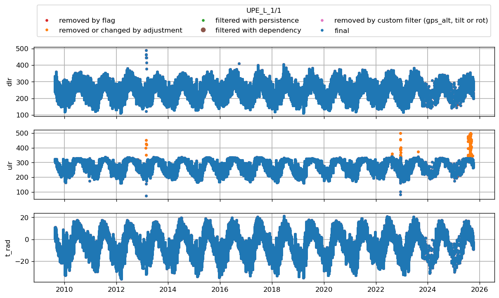

* [UPE_L](#s1)
* [UPE_L](#s2)
* [UPE_L](#s3)
* [UPE_L](#s4)
* [UPE_L](#s5)
* [UPE_L](#s6)
# <a id='s1' />UPE_L

 
# <a id='s2' />UPE_L

 
# <a id='s3' />UPE_L

 
# <a id='s4' />UPE_L
# <a id='s5' />UPE_L

 
# <a id='s6' />UPE_L

 
