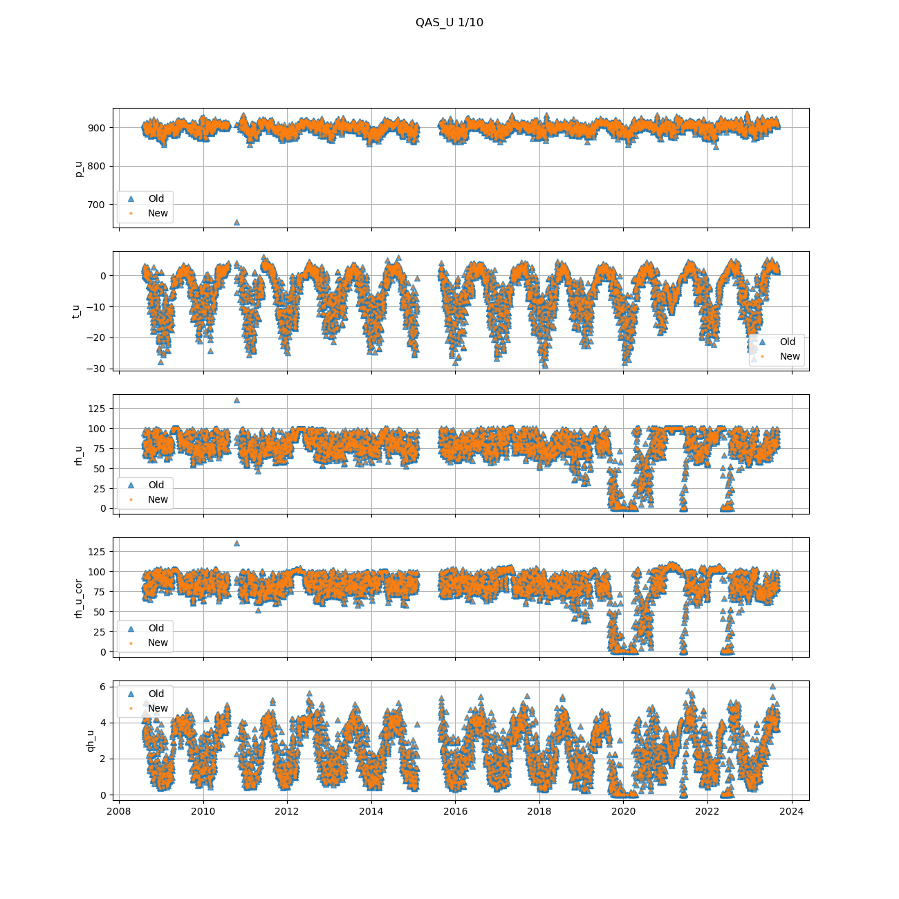
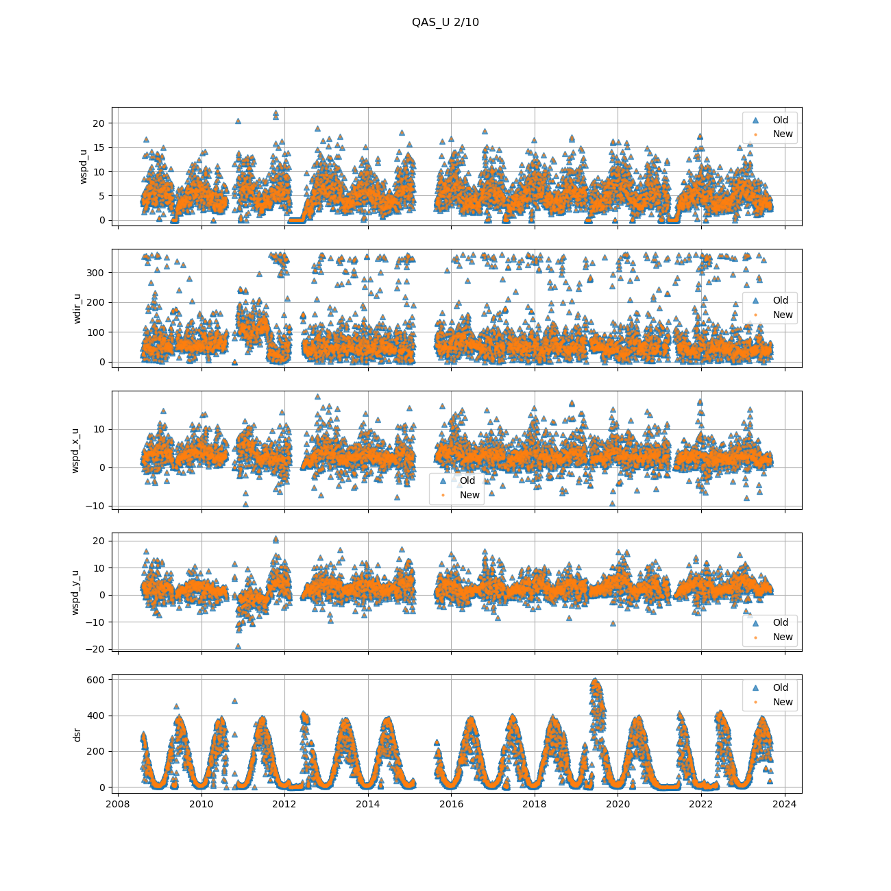
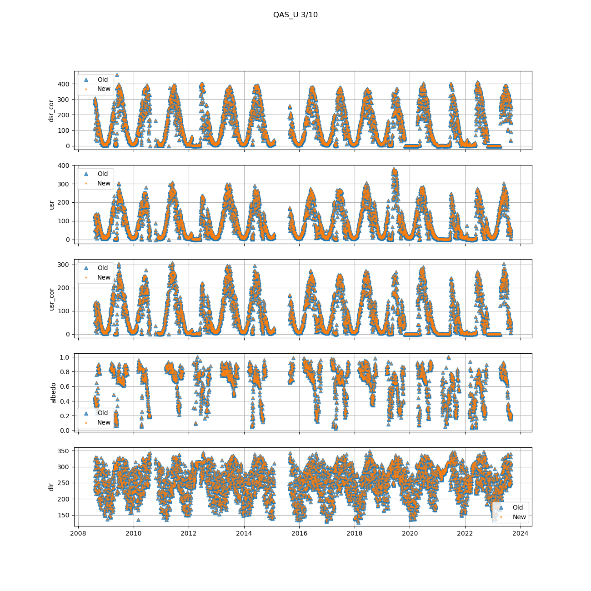
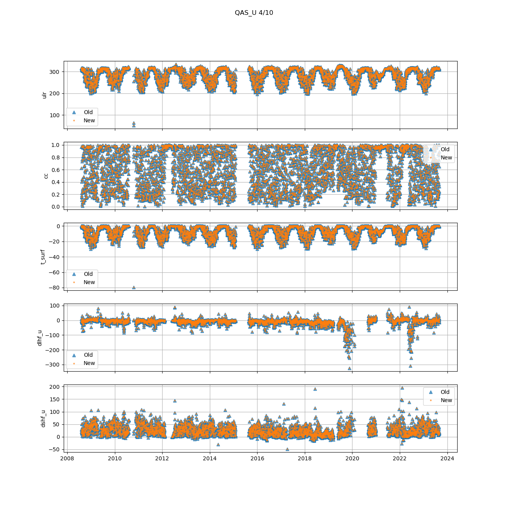
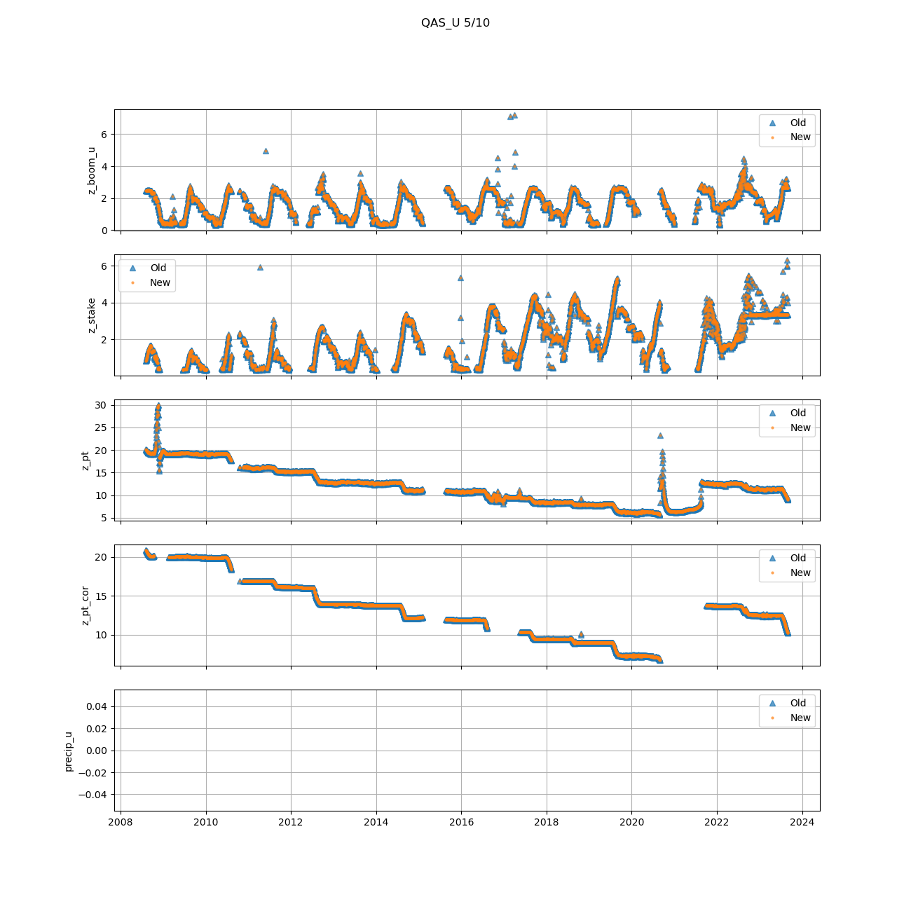
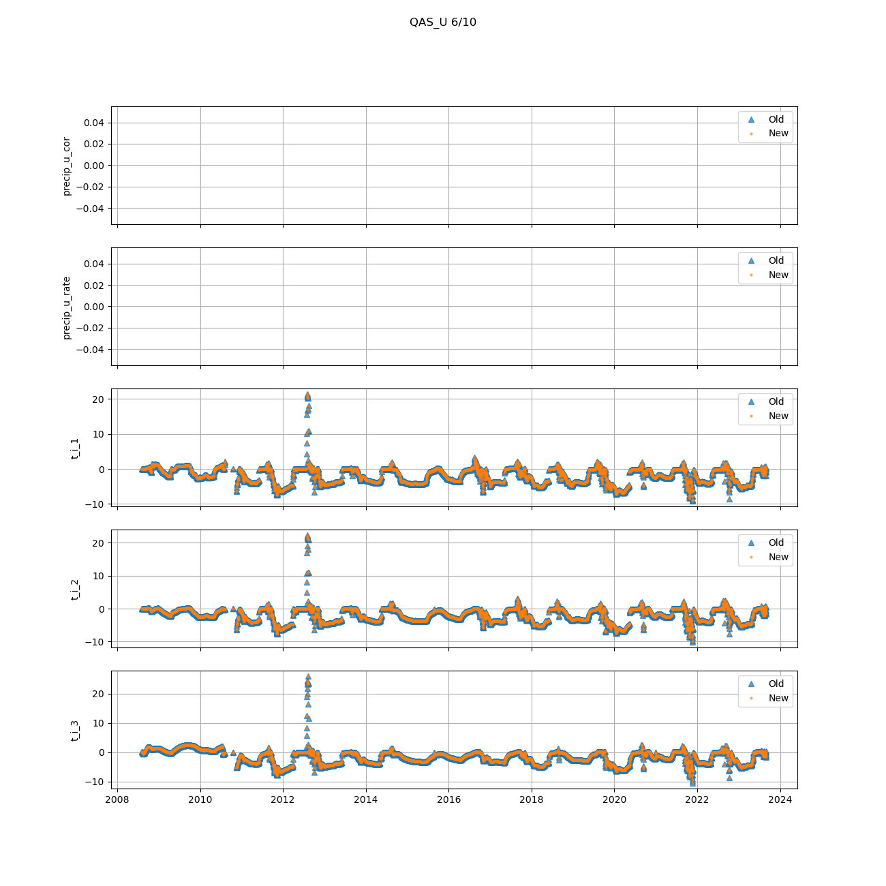
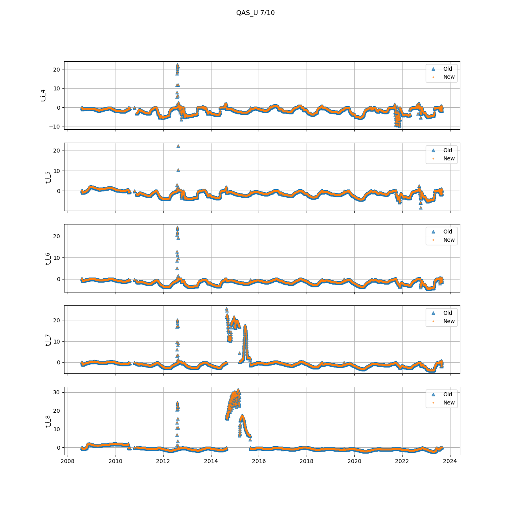
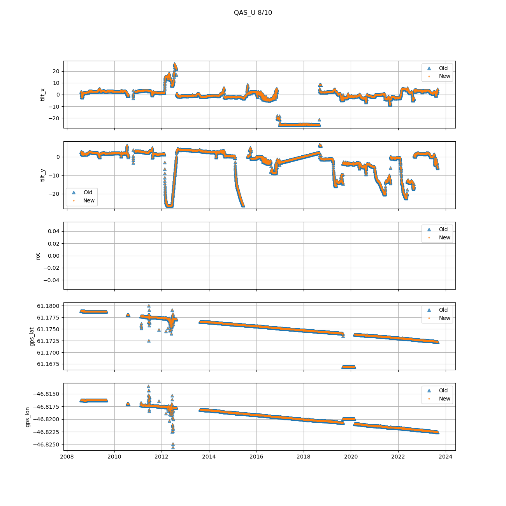
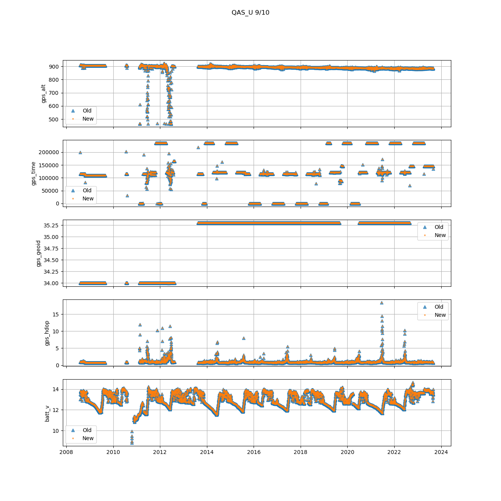
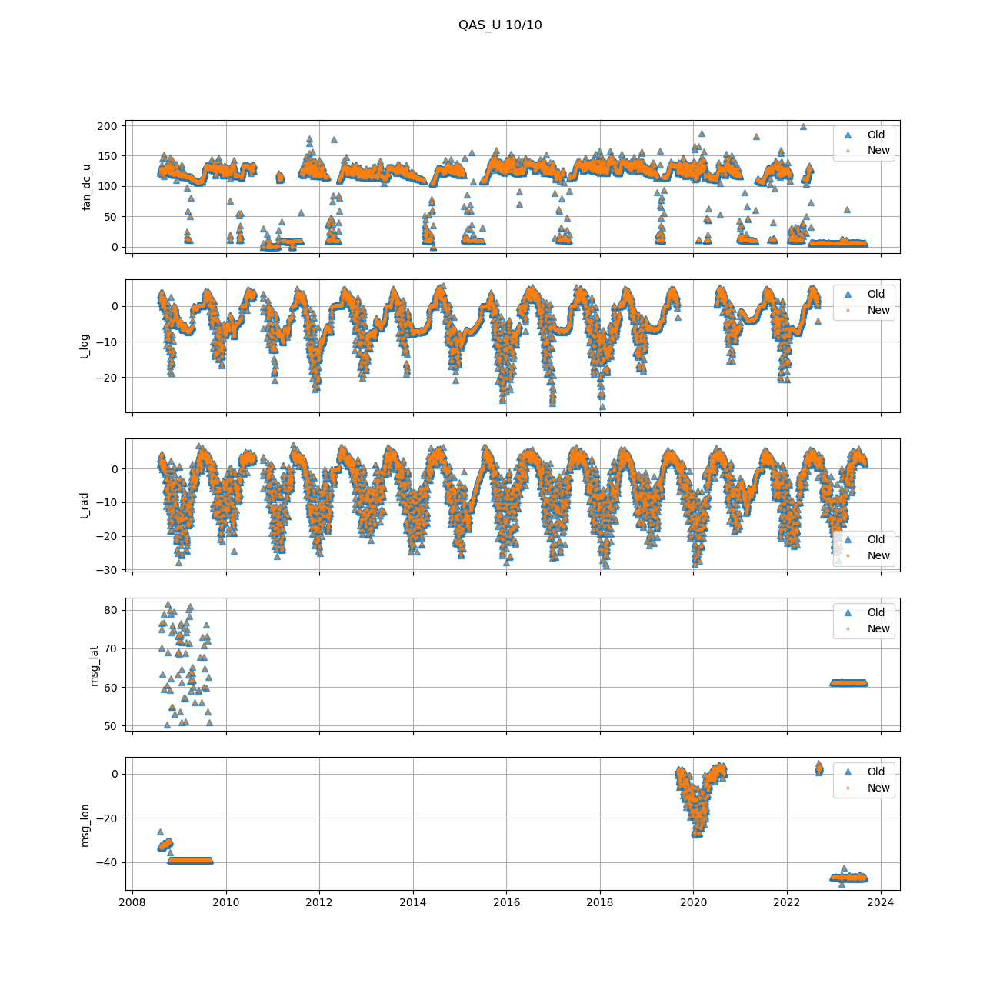

# Comparison of data v11 (new) to v10 (old).
~version name is as defined in AWS_changelog.txt~
## QAS_U
Variables in new file:
p_u, t_u, rh_u, rh_u_cor, qh_u, wspd_u, wdir_u, wspd_x_u, wspd_y_u, dsr, dsr_cor, usr, usr_cor, albedo, dlr, ulr, cc, t_surf, dlhf_u, dshf_u, z_boom_u, z_stake, z_pt, z_pt_cor, precip_u, precip_u_cor, precip_u_rate, t_i_1, t_i_2, t_i_3, t_i_4, t_i_5, t_i_6, t_i_7, t_i_8, tilt_x, tilt_y, rot, gps_lat, gps_lon, gps_alt, gps_time, gps_geoid, gps_hdop, batt_v, fan_dc_u, t_log, t_rad, msg_lat, msg_lon

New variables not in old files:

Old variables removed from new files:

 

 
