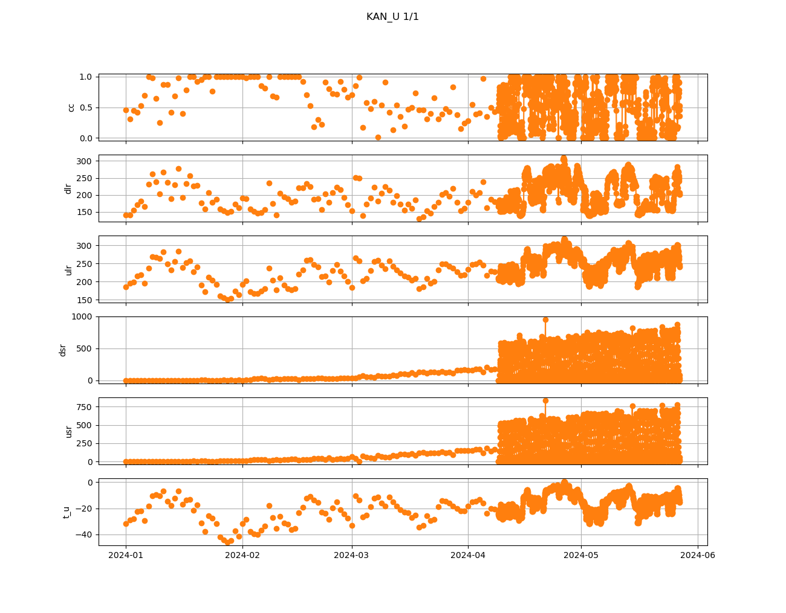

## CEN1
no data forgps_numsat
only two values for gps_q: [nan  1.]
no data forbatt_v_ini
 
## CEN2
no data forgps_numsat
no data forgps_q
no data forbatt_v_ini
 
## CP1
no data forgps_numsat
no data forgps_q
no data forbatt_v_ini
 
## DY2
no data forgps_numsat
no data forgps_q
no data forbatt_v_ini
 
## EGP
no data forgps_numsat
only two values for gps_q: [nan  1.]
no data forbatt_v_ini
 
## FRE
no data forgps_numsat
no data forgps_q
no data forbatt_v_ini
 
## HUM
no data forgps_numsat
no data forgps_q
no data forbatt_v_ini
 
## JAR
no data forgps_numsat
no data forgps_q
no data forbatt_v_ini
 
## JAR_O
no data forgps_numsat
no data forgps_q
no data forbatt_v_ini
 
## KAN_B
no data forgps_numsat
no data forgps_q
no data forbatt_v_ini
 
## KAN_L
no data forgps_numsat
only two values for gps_q: [ 1. nan]
no data forbatt_v_ini
 
## KAN_M
no data forgps_numsat
only two values for gps_q: [ 1. nan]
no data forbatt_v_ini
 
## KAN_U
no data forgps_numsat
no data forbatt_v_ini

 
## KPC_L
no data forgps_numsat
only two values for gps_q: [ 1. nan]
no data forbatt_v_ini
 
## KPC_Lv3
no data forgps_numsat
no data forgps_q
no data forbatt_v_ini
 
## KPC_U
no data forgps_numsat
only two values for gps_q: [ 1. nan]
no data forbatt_v_ini
 
## KPC_Uv3
no data forgps_numsat
no data forgps_q
no data forbatt_v_ini
 
## LYN_L
no data forgps_numsat
no data forgps_q
no data forbatt_v_ini
 
## LYN_T
no data forgps_numsat
no data forgps_q
no data forbatt_v_ini
 
## MIT
no data forgps_numsat
only two values for gps_q: [ 1. nan]
no data forbatt_v_ini
 
## NAE
no data forgps_numsat
no data forgps_q
no data forbatt_v_ini
 
## NAU
no data forgps_numsat
no data forgps_q
no data forbatt_v_ini
 
## NEM
no data forgps_numsat
no data forgps_q
no data forbatt_v_ini
 
## NSE
no data forgps_numsat
no data forgps_q
no data forbatt_v_ini
 
## NUK_K
no data forgps_numsat
only two values for gps_q: [ 1. nan]
no data forbatt_v_ini
 
## NUK_L
no data forgps_numsat
only two values for gps_q: [nan  1.]
no data forbatt_v_ini
 
## NUK_N
no data forgps_numsat
only two values for gps_q: [nan  1.]
no data forbatt_v_ini
 
## NUK_U
no data forgps_numsat
only two values for gps_q: [nan  1.]
no data forbatt_v_ini
 
## NUK_Uv3
no data forgps_numsat
no data forgps_q
no data forbatt_v_ini
 
## QAS_A
no data forgps_numsat
only two values for gps_q: [nan  1.]
no data forbatt_v_ini
 
## QAS_L
no data forgps_numsat
only two values for gps_q: [nan  1.]
no data forbatt_v_ini
 
## QAS_Lv3
no data forgps_numsat
no data forgps_q
no data forbatt_v_ini
 
## QAS_M
no data forgps_numsat
only two values for gps_q: [nan  1.]
no data forbatt_v_ini
 
## QAS_U
no data forgps_numsat
only two values for gps_q: [ 1. nan]
no data forbatt_v_ini
 
## QAS_Uv3
no data forgps_numsat
no data forgps_q
no data forbatt_v_ini
 
## Roof_GEUS
no data forgps_numsat
no data forgps_q
no data forbatt_v_ini
 
## Roof_PROMICE
no data forgps_numsat
no data forgps_q
no data forbatt_v_ini
 
## SCO_L
no data forgps_numsat
only two values for gps_q: [ 1. nan]
no data forbatt_v_ini
 
## SCO_U
no data forgps_numsat
only two values for gps_q: [ 1. nan]
no data forbatt_v_ini
 
## SDL
no data forgps_numsat
no data forgps_q
no data forbatt_v_ini
 
## SDM
no data forgps_numsat
no data forgps_q
no data forbatt_v_ini
 
## SWC
no data forgps_numsat
no data forgps_q
no data forbatt_v_ini
 
## SWC_O
no data forgps_numsat
no data forgps_q
no data forbatt_v_ini
 
## TAS_A
no data forgps_numsat
only two values for gps_q: [nan  1.]
no data forbatt_v_ini
 
## TAS_L
no data forgps_numsat
only two values for gps_q: [nan  1.]
no data forbatt_v_ini
 
## TAS_U
no data forgps_numsat
only two values for gps_q: [nan  1.]
no data forbatt_v_ini
 
## THU_L
no data forgps_numsat
only two values for gps_q: [ 1. nan]
no data forbatt_v_ini
 
## THU_L2
no data forgps_numsat
no data forgps_q
no data forbatt_v_ini
 
## THU_U
no data forgps_numsat
only two values for gps_q: [nan  1.]
no data forbatt_v_ini
 
## THU_U2
no data forgps_numsat
only two values for gps_q: [nan  1.]
no data forbatt_v_ini
 
## TUN
no data forgps_numsat
no data forgps_q
no data forbatt_v_ini
 
## UPE_L
no data forgps_numsat
only two values for gps_q: [ 1. nan]
no data forbatt_v_ini
 
## UPE_U
no data forgps_numsat
only two values for gps_q: [ 1. nan]
no data forbatt_v_ini
 
## UWN
no data forgps_numsat
no data forgps_q
no data forbatt_v_ini
 
## WEG_B
no data forgps_numsat
no data forgps_q
no data forbatt_v_ini
 
## WEG_L
no data forgps_numsat
no data forgps_q
no data forbatt_v_ini
 
## ZAK_A
no data forgps_numsat
no data forgps_q
no data forbatt_v_ini
 
## ZAK_L
only one value for gps_q: 1.0
no data forbatt_v_ini

 
## ZAK_Lv3
no data forgps_numsat
no data forgps_q
no data forbatt_v_ini
 
## ZAK_U
no data forgps_numsat
no data forgps_q
no data forbatt_v_ini
 
## ZAK_Uv3
no data forgps_numsat
no data forgps_q
no data forbatt_v_ini
 
