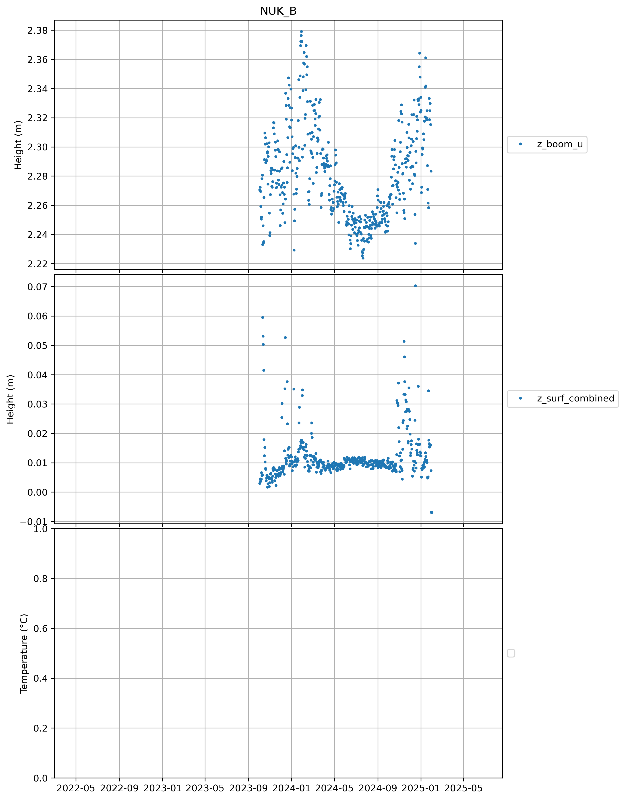
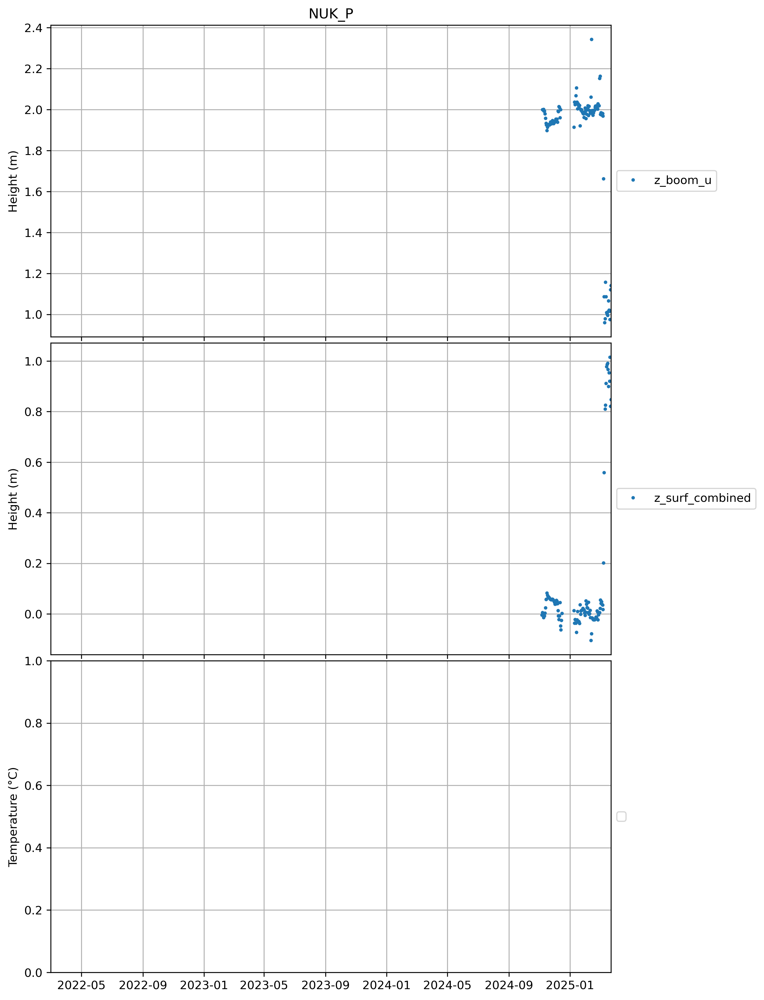

## CEN
## CP1
## DY2
## EGP
## FRE
## HUM
## JAR
## KAN_B

 
## KAN_L
## KAN_M
## KAN_T
## KAN_U
## KPC_L
## KPC_U
## LYN_L
## LYN_T
## MIT
## NAE
## NAU
## NEM
## NSE
## NUK_B

 
## NUK_K
## NUK_L
## NUK_N
## NUK_P

 
## NUK_U
## ORO

 
## QAS_A
## QAS_L
## QAS_M
## QAS_U
## RED_L
## SCO_L
## SCO_U
## SDL
## SDM
## SER_B

 
## SWC
## TAS_A
## TAS_L
## TAS_U
## THU_L2
## THU_L
## THU_U
## TUN
## UPE_L
## UPE_U
## UWN
## WEG_B

 
## WEG_L
## ZAC_A
## ZAC_L
## ZAC_U
