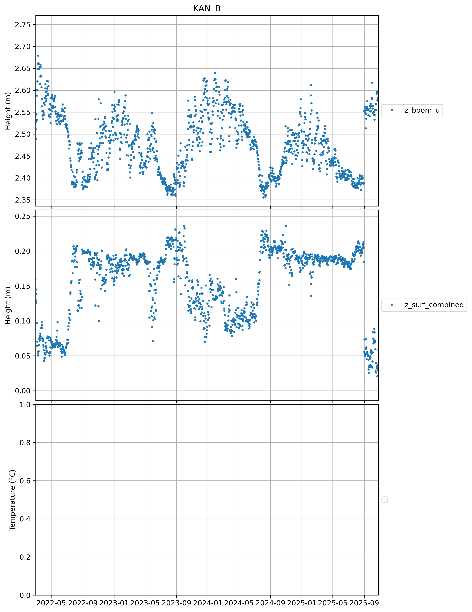
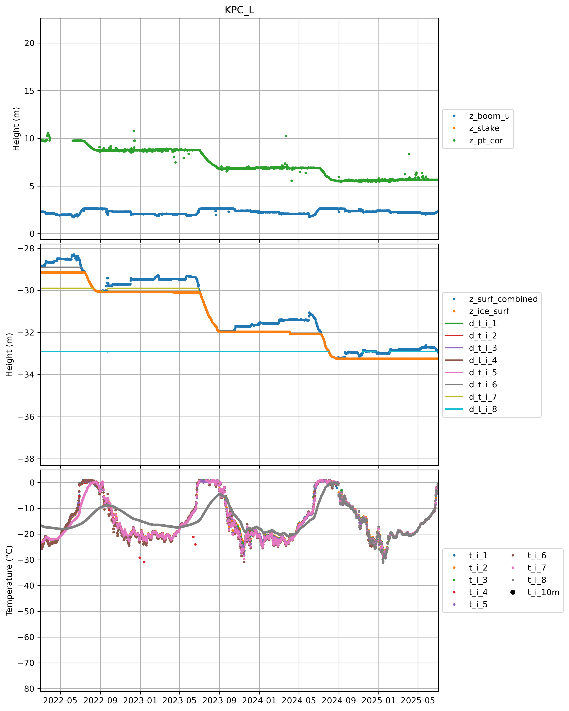
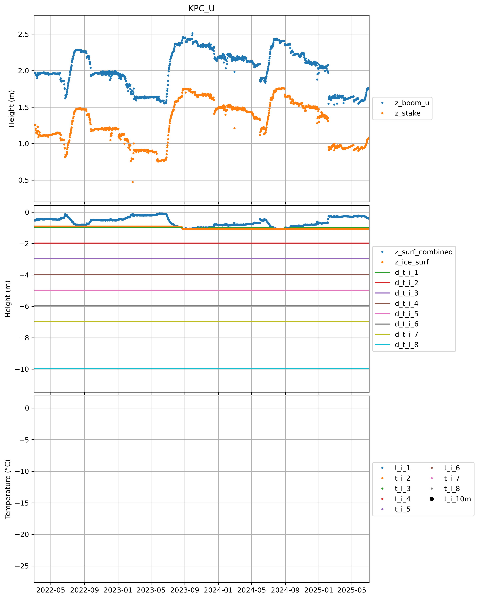
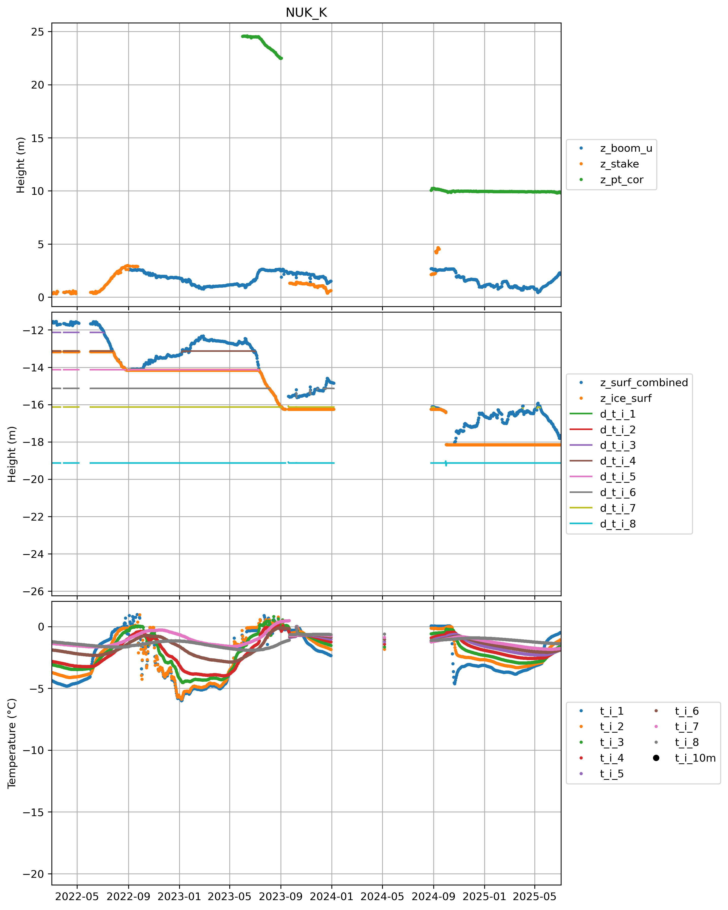

## CEN

 
## CP1

 
## DY2

 
## EGP

 
## FRE

 
## HUM

 
## JAR

 
## KAN_B

 
## KAN_L

 
## KAN_M

 
## KAN_T

 
## KAN_U

 
## KPC_L

 
## KPC_U

 
## LYN_L

 
## LYN_T

 
## MIT

 
## NAE

 
## NAU

 
## NEM

 
## NSE

 
## NUK_B

 
## NUK_K

 
## NUK_L

 
## NUK_N
