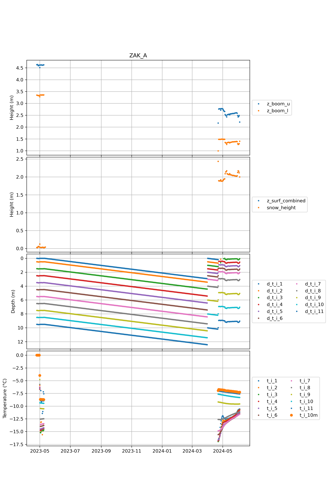
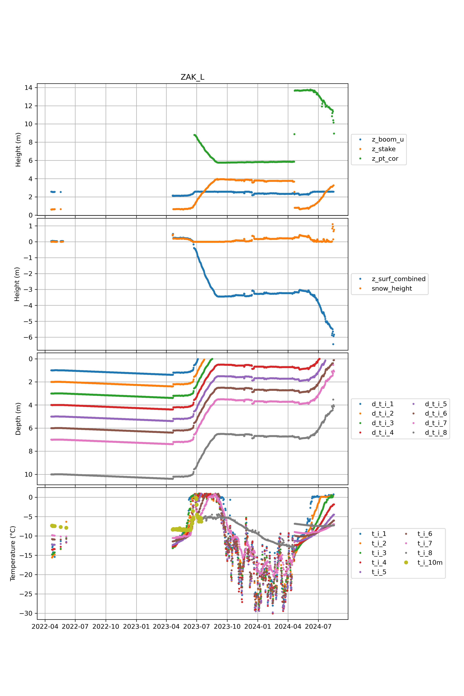
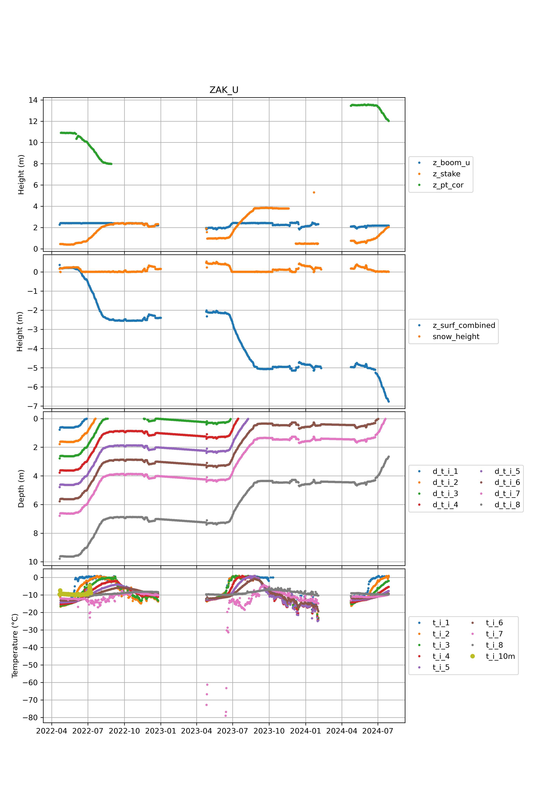

  * [CEN](#s0-1)
  * [CP1](#s0-2)
  * [DY2](#s0-3)
  * [EGP](#s0-4)
  * [FRE](#s0-5)
  * [HUM](#s0-6)
  * [JAR](#s0-7)
  * [KAN_B](#s0-8)
  * [KAN_L](#s0-9)
  * [KAN_M](#s0-10)
  * [KAN_T](#s0-11)
  * [KAN_U](#s0-12)
  * [KPC_L](#s0-13)
  * [KPC_U](#s0-14)
  * [LYN_L](#s0-15)
  * [LYN_T](#s0-16)
  * [MIT](#s0-17)
  * [NAE](#s0-18)
  * [NAU](#s0-19)
  * [NEM](#s0-20)
  * [NSE](#s0-21)
  * [NUK_B](#s0-22)
  * [NUK_K](#s0-23)
  * [NUK_L](#s0-24)
  * [NUK_N](#s0-25)
  * [NUK_U](#s0-26)
  * [QAS_A](#s0-27)
  * [QAS_L](#s0-28)
  * [QAS_M](#s0-29)
  * [QAS_U](#s0-30)
  * [SCO_L](#s0-31)
  * [SCO_U](#s0-32)
  * [SDL](#s0-33)
  * [SDM](#s0-34)
  * [SER_B](#s0-35)
  * [SWC](#s0-36)
  * [TAS_A](#s0-37)
  * [TAS_L](#s0-38)
  * [TAS_U](#s0-39)
  * [THU_L](#s0-40)
  * [THU_U](#s0-41)
  * [TUN](#s0-42)
  * [UPE_L](#s0-43)
  * [UPE_U](#s0-44)
  * [UWN](#s0-45)
  * [WEG_B](#s0-46)
  * [WEG_L](#s0-47)
  * [ZAK_A](#s0-48)
  * [ZAK_L](#s0-49)
  * [ZAK_U](#s0-50)
## <a id='s0-1' />CEN

 
## <a id='s0-2' />CP1

 
## <a id='s0-3' />DY2

 
## <a id='s0-4' />EGP

 
## <a id='s0-5' />FRE

 
## <a id='s0-6' />HUM

 
## <a id='s0-7' />JAR

 
## <a id='s0-8' />KAN_B

 
## <a id='s0-9' />KAN_L

 
## <a id='s0-10' />KAN_M

 
## <a id='s0-11' />KAN_T

 
## <a id='s0-12' />KAN_U

 
## <a id='s0-13' />KPC_L

 
## <a id='s0-14' />KPC_U

 
## <a id='s0-15' />LYN_L

 
## <a id='s0-16' />LYN_T

 
## <a id='s0-17' />MIT

 
## <a id='s0-18' />NAE

 
## <a id='s0-19' />NAU

 
## <a id='s0-20' />NEM

 
## <a id='s0-21' />NSE

 
## <a id='s0-22' />NUK_B

 
## <a id='s0-23' />NUK_K

 
## <a id='s0-24' />NUK_L

 
## <a id='s0-25' />NUK_N

 
## <a id='s0-26' />NUK_U

 
## <a id='s0-27' />QAS_A

 
## <a id='s0-28' />QAS_L

 
## <a id='s0-29' />QAS_M

 
## <a id='s0-30' />QAS_U

 
## <a id='s0-31' />SCO_L

 
## <a id='s0-32' />SCO_U

 
## <a id='s0-33' />SDL

 
## <a id='s0-34' />SDM

 
## <a id='s0-35' />SER_B

 
## <a id='s0-36' />SWC

 
## <a id='s0-37' />TAS_A

 
## <a id='s0-38' />TAS_L

 
## <a id='s0-39' />TAS_U

 
## <a id='s0-40' />THU_L

 
## <a id='s0-41' />THU_U

 
## <a id='s0-42' />TUN

 
## <a id='s0-43' />UPE_L

 
## <a id='s0-44' />UPE_U

 
## <a id='s0-45' />UWN

 
## <a id='s0-46' />WEG_B

 
## <a id='s0-47' />WEG_L

 
## <a id='s0-48' />ZAK_A

 
## <a id='s0-49' />ZAK_L

 
## <a id='s0-50' />ZAK_U

 
