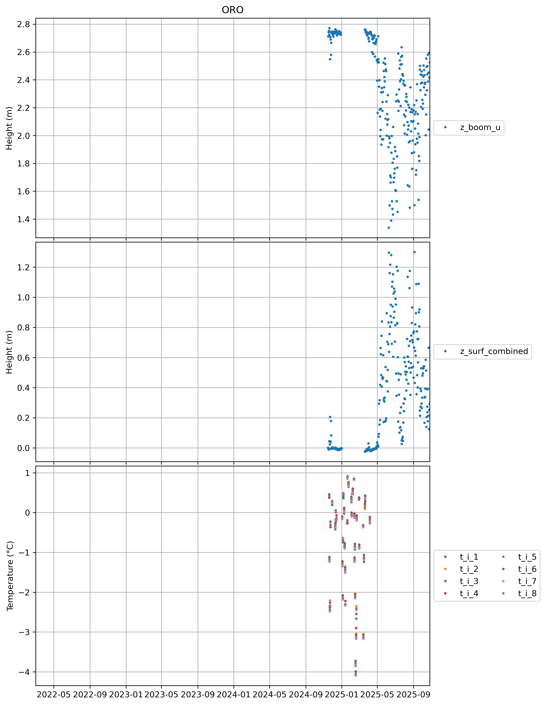
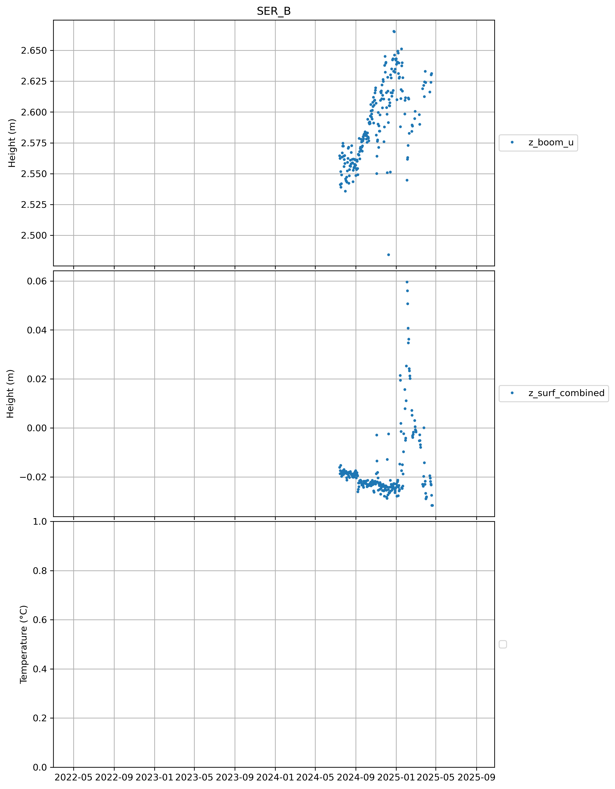

  * [CEN](#s0-1)
  * [CP1](#s0-2)
  * [DY2](#s0-3)
  * [EGP](#s0-4)
  * [FRE](#s0-5)
  * [HUM](#s0-6)
  * [JAR](#s0-7)
  * [KAN_B](#s0-8)
  * [KAN_L](#s0-9)
  * [KAN_M](#s0-10)
  * [KAN_T](#s0-11)
  * [KAN_U](#s0-12)
  * [KPC_L](#s0-13)
  * [KPC_U](#s0-14)
  * [LYN_L](#s0-15)
  * [LYN_T](#s0-16)
  * [MIT](#s0-17)
  * [NAE](#s0-18)
  * [NAU](#s0-19)
  * [NEM](#s0-20)
  * [NSE](#s0-21)
  * [NUK_B](#s0-22)
  * [NUK_K](#s0-23)
  * [NUK_L](#s0-24)
  * [NUK_N](#s0-25)
  * [NUK_P](#s0-26)
  * [NUK_U](#s0-27)
  * [ORO](#s0-28)
  * [QAS_A](#s0-29)
  * [QAS_L](#s0-30)
  * [QAS_M](#s0-31)
  * [QAS_U](#s0-32)
  * [RED_L](#s0-33)
  * [SCO_L](#s0-34)
  * [SCO_U](#s0-35)
  * [SDL](#s0-36)
  * [SDM](#s0-37)
  * [SER_B](#s0-38)
  * [SWC](#s0-39)
  * [TAS_A](#s0-40)
  * [TAS_L](#s0-41)
  * [TAS_U](#s0-42)
  * [THU_L2](#s0-43)
  * [THU_L](#s0-44)
  * [THU_U](#s0-45)
  * [TUN](#s0-46)
  * [UPE_L](#s0-47)
  * [UPE_U](#s0-48)
  * [UWN](#s0-49)
  * [WEG_B](#s0-50)
  * [WEG_L](#s0-51)
  * [ZAC_A](#s0-52)
  * [ZAC_L](#s0-53)
  * [ZAC_U](#s0-54)
## <a id='s0-1' />CEN
## <a id='s0-2' />CP1
## <a id='s0-3' />DY2
## <a id='s0-4' />EGP
## <a id='s0-5' />FRE
## <a id='s0-6' />HUM
## <a id='s0-7' />JAR
## <a id='s0-8' />KAN_B

 
## <a id='s0-9' />KAN_L
## <a id='s0-10' />KAN_M
## <a id='s0-11' />KAN_T
## <a id='s0-12' />KAN_U
## <a id='s0-13' />KPC_L
## <a id='s0-14' />KPC_U
## <a id='s0-15' />LYN_L
## <a id='s0-16' />LYN_T
## <a id='s0-17' />MIT
## <a id='s0-18' />NAE
## <a id='s0-19' />NAU
## <a id='s0-20' />NEM
## <a id='s0-21' />NSE
## <a id='s0-22' />NUK_B

 
## <a id='s0-23' />NUK_K
## <a id='s0-24' />NUK_L
## <a id='s0-25' />NUK_N
## <a id='s0-26' />NUK_P

 
## <a id='s0-27' />NUK_U
## <a id='s0-28' />ORO

 
## <a id='s0-29' />QAS_A
## <a id='s0-30' />QAS_L
## <a id='s0-31' />QAS_M
## <a id='s0-32' />QAS_U
## <a id='s0-33' />RED_L
## <a id='s0-34' />SCO_L
## <a id='s0-35' />SCO_U
## <a id='s0-36' />SDL
## <a id='s0-37' />SDM
## <a id='s0-38' />SER_B

 
## <a id='s0-39' />SWC
## <a id='s0-40' />TAS_A
## <a id='s0-41' />TAS_L
## <a id='s0-42' />TAS_U
## <a id='s0-43' />THU_L2
## <a id='s0-44' />THU_L
## <a id='s0-45' />THU_U
## <a id='s0-46' />TUN
## <a id='s0-47' />UPE_L
## <a id='s0-48' />UPE_U
## <a id='s0-49' />UWN
## <a id='s0-50' />WEG_B

 
## <a id='s0-51' />WEG_L
## <a id='s0-52' />ZAC_A
## <a id='s0-53' />ZAC_L
## <a id='s0-54' />ZAC_U
