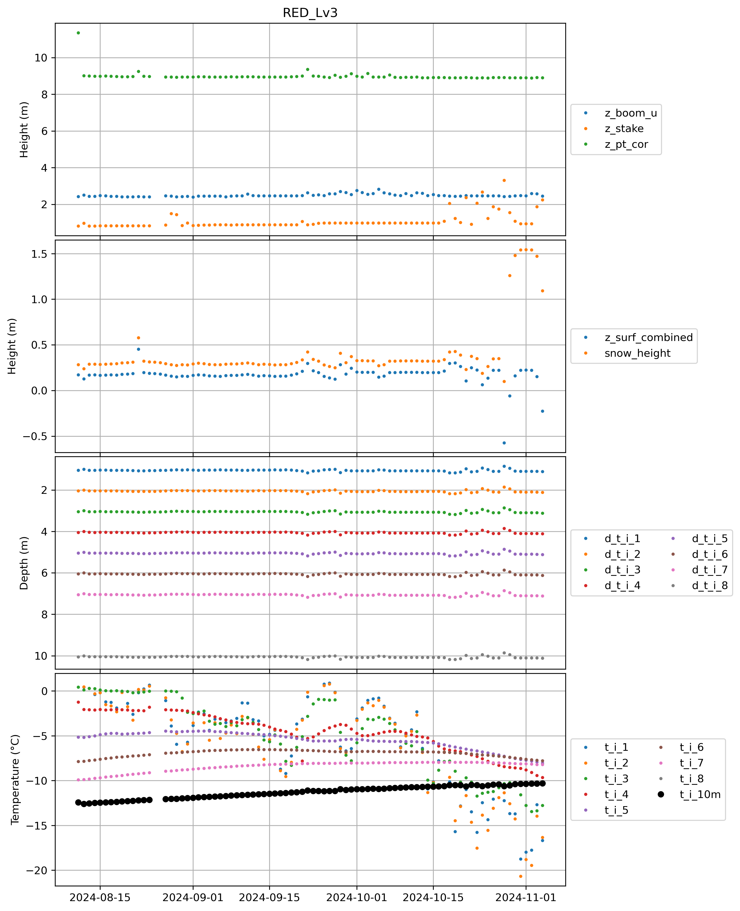
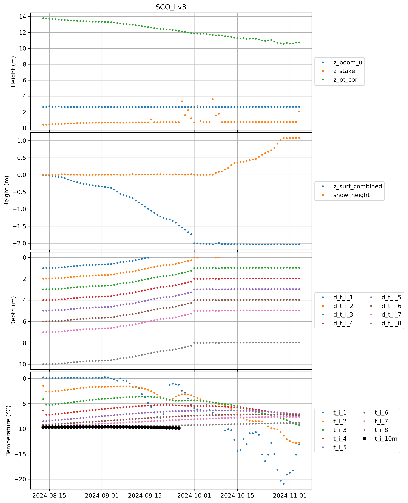
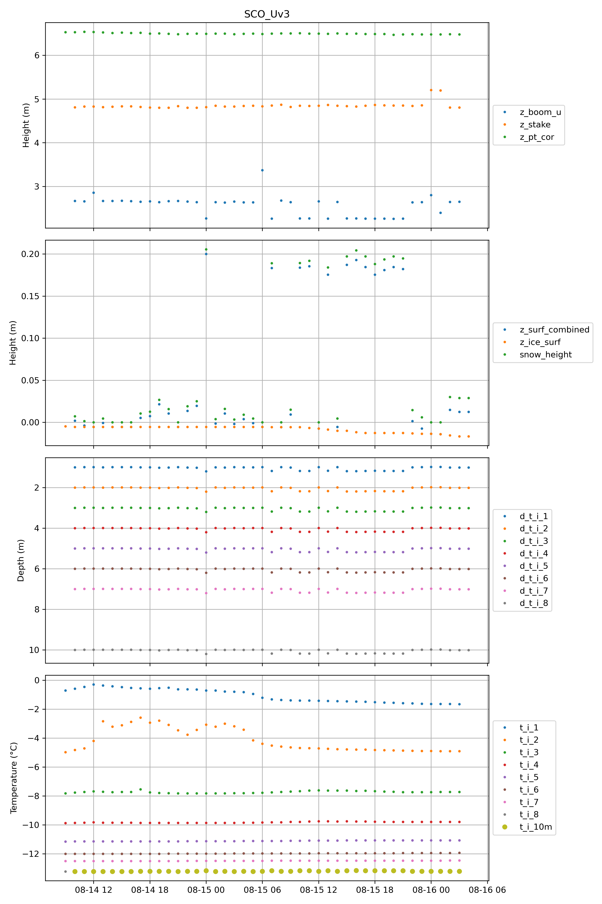
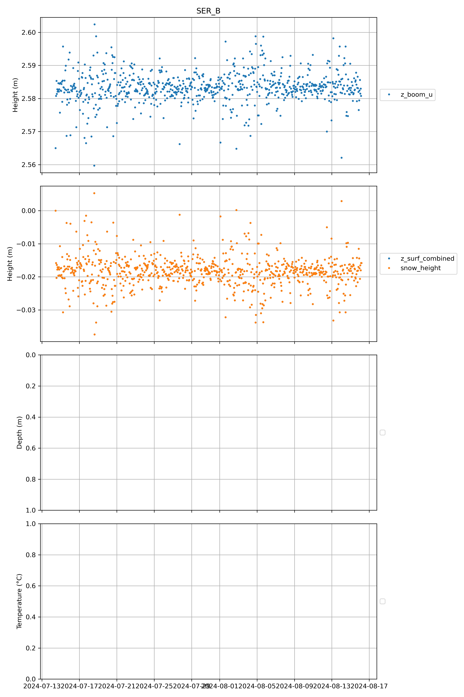
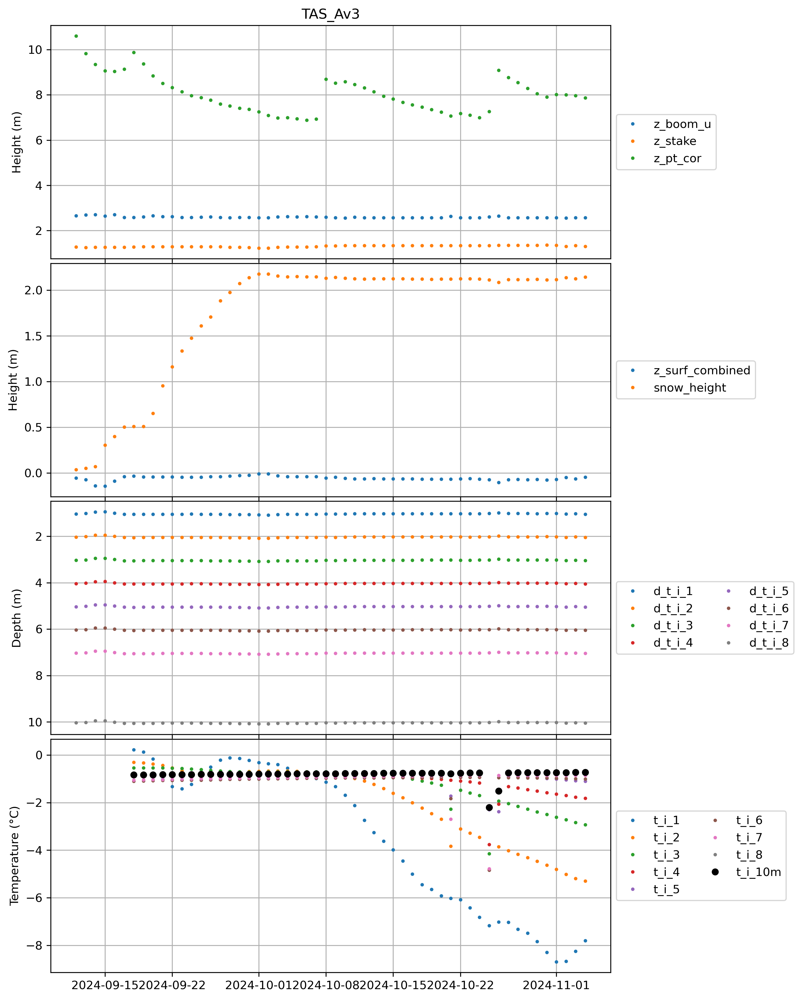
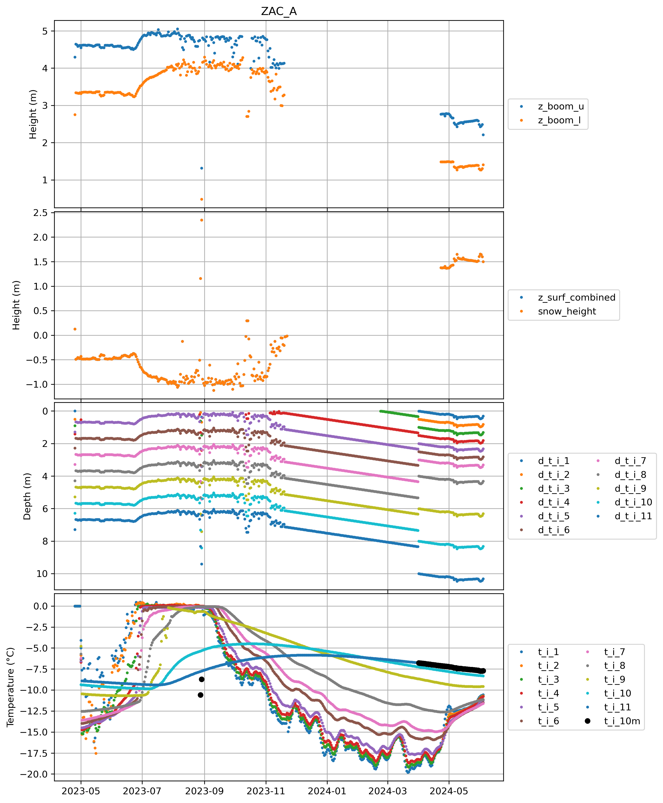
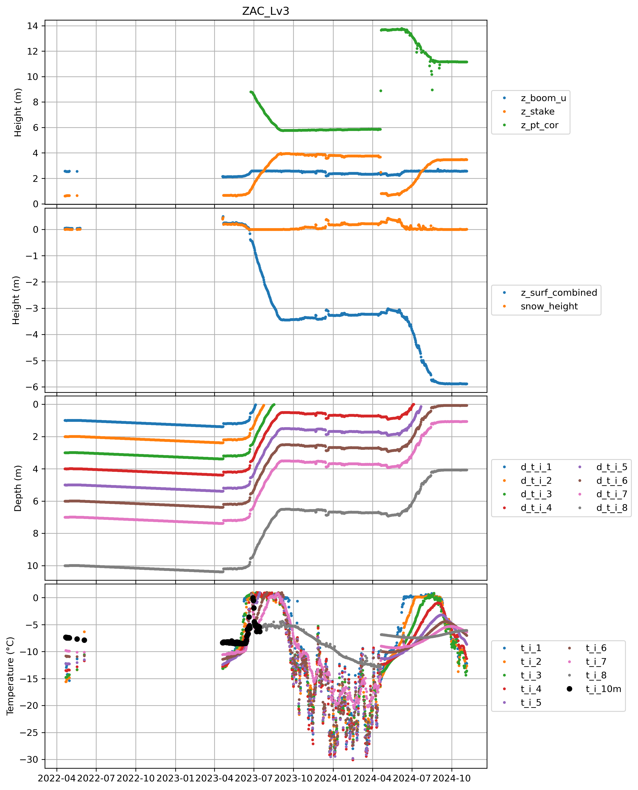
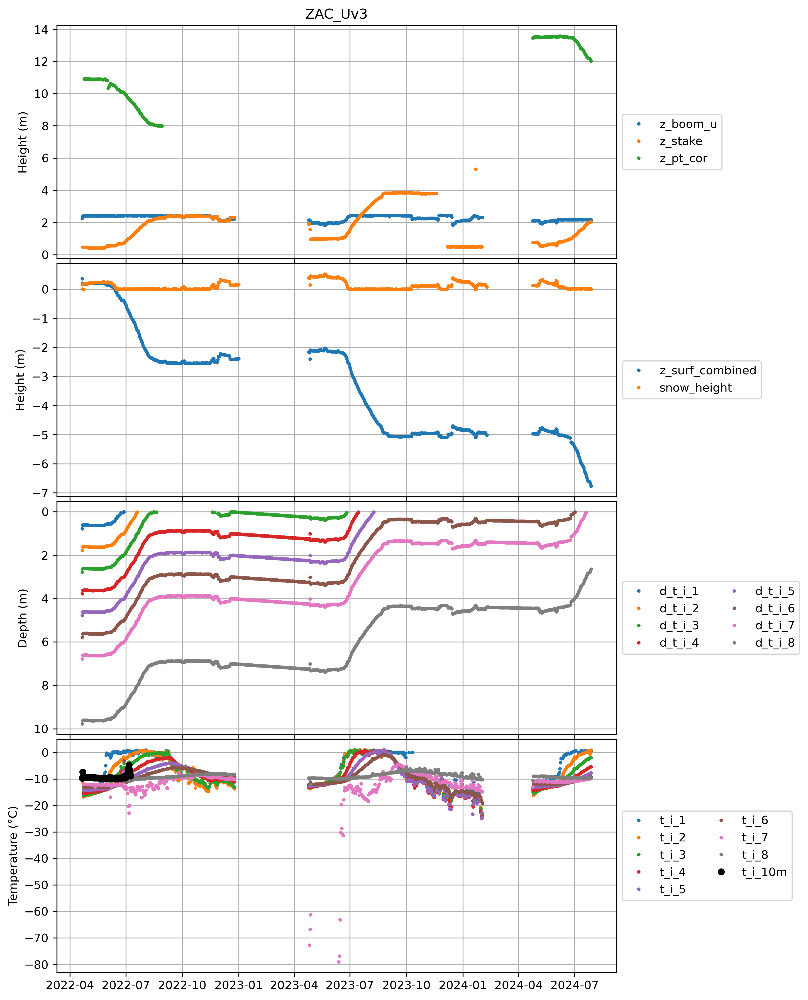

## CEN1

 
## CEN2

 
## CP1

 
## DY2

 
## EGP

 
## FRE

 
## HUM

 
## JAR

 
## JAR_O

 
## KAN_B

 
## KAN_L

 
## KAN_Lv3

 
## KAN_M

 
## KAN_Tv3

 
## KAN_U

 
## KPC_L

 
## KPC_Lv3

 
## KPC_U

 
## KPC_Uv3

 
## LYN_L

 
## LYN_T

 
## MIT

 
## NAE

 
## NAU

 
## NEM

 
## NSE

 
## NUK_B

 
## NUK_K

 
## NUK_L

 
## NUK_N

 
## NUK_U

 
## NUK_Uv3

 
## QAS_A

 
## QAS_L

 
## QAS_Lv3

 
## QAS_M

 
## QAS_Mv3

 
## QAS_U

 
## QAS_Uv3

 
## RED_Lv3

 
## SCO_L

 
## SCO_Lv3

 
## SCO_U

 
## SCO_Uv3

 
## SDL

 
## SDM

 
## SER_B

 
## SWC

 
## SWC_O

 
## TAS_A

 
## TAS_Av3

 
## TAS_L

 
## TAS_U

 
## THU_L

 
## THU_L2

 
## THU_U

 
## THU_U2

 
## THU_U2v3

 
## TUN

 
## UPE_L

 
## UPE_U

 
## UWN

 
## WEG_B

 
## WEG_L

 
## ZAC_A

 
## ZAC_Lv3

 
## ZAC_Uv3

 
